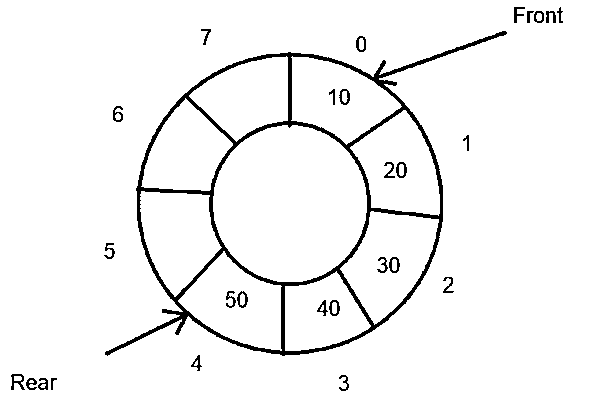

# 链接列表面试问题

> 原文：<https://www.educba.com/linked-list-interview-questions/>

## 链表面试的定义

链表是仅次于数组的最常用的数据结构，它本质上是线性的。因此，很明显，当你面试与数据操作相关的职位，甚至任何其他与技术相关的职位时，你会遇到许多与链表相关的问题。在本文中，我们将了解一些在面试中最常被问到的与链表相关的问题。

### 问题和答案

让我们讨论问题，回答关于链表的面试问题。

<small>网页开发、编程语言、软件测试&其他</small>

#### 1.什么是链表？

**答案:**

链表是一种数据结构，本质上是线性的，并且不将数据存储在顺序的存储器位置中。链表由一个或多个节点组成，也称为链接。

#### 2.讲述链表的图形化表示。

**答案:**

每个链接由两部分组成，一部分是数据部分，保存需要存储在链表中的元素的值，而第二部分是下一部分，存储它指向的下一个链接或节点的地址。起始节点或链路被称为头部。最后一个节点的下一部分指向空值，因为没有其他节点可以指向，这标志着链表的结束，如下图所示。

如上所示，每个节点都包含数据字段和引用字段。一个链表可以包含任意数量的节点，这取决于我们需要存储的数据和可用的内存容量。

#### 3.有多少种链表类型？

**答案:**

有以下几种类型的链表:

单链表
多链表
双链表
循环链表

#### 4.描述单链表。

**答案:**

这个问题的回答可以参考第一次和第二次结合的答案。

#### 5.描述双向链表。

**答案:**

在双重链接中，多个链接或节点相互连接，每个节点包含三个字段，即 prev、data 和 next，分别包含指向前一个节点的指针、元素的数据和指向下一个元素的指针。双向链表的图形表示如下所示

#### 6.描述循环链表。

**答案:**

循环队列是一种有助于以线性方式存储数据的数据结构，它类似于普通的简单队列，但其功能是将最后一个元素连接到第一个元素。这有助于在队列中插入新元素，即使当队列已满时，只要队列的第一个位置是空的。
下图显示了循环队列的工作方式以及数据在其中的存储方式。

#### 7.在链表的实现中使用了什么类型的内存分配？

**答案:**

链表中使用了动态内存分配。

#### 8.遍历链表是什么意思？

**答案:**

处理链表中的每个单独的元素被称为遍历。

#### 9.指定线性数组和线性链表之间存在的差异。

**答案:**

| **线性阵列** | **链表** |
| 难以插入和删除 | 执行插入和删除不需要移动节点。 |
| 由于需要预先指定固定大小，因此浪费了空间。 | 由于动态内存分配，不会浪费内存。 |
| 利用数组中存储的不同元素需要相同的时间。 | 利用数组中存储的不同元素需要不同的时间。 |
| 元素是连续存储的。 | 因此，元素可能不会被存储。 |
| 完成了对所需节点的直接访问。 | 为了到达特定节点，需要遍历所有先前的节点。 |

#### 10.链表数据结构有哪些应用？

**答案:**

堆栈、队列、跳过展开的链表、二叉树、哈希表等。是链表的一些应用。

#### 11.使用链表数据结构有什么好处？

**答案:**

不需要指定固定大小，因为内存是在运行时根据要求动态分配的。

#### 12.使用链表的缺点是什么？

**答案:**

需要对数据进行顺序访问，这导致无法使用二分搜索法，这就是我们无法在链表中执行随机访问的原因。

存储指针地址需要更多内存。

访问元素的时间复杂度为 O(n ),由于递归导致性能下降。

由于链表数据的分散放置，导致局部性差。

#### 13.在执行链表的插入操作时，我们从哪里获取空闲节点？

**答案:**

效用列表

#### 14.命名最后一个节点指向空指针的标题列表。

**答案:**

接地标题列表。

#### 15.java 编程语言中用哪个包来实现链表？

**答案:**

Java.util 包。

#### 16.在 java 中，哪些接口实现了链表？

**答案:**

以下接口在 java 中实现了链表——

可迭代
列表
队列
可克隆
队列
可串行化
集合

#### 17.说说用 java 编程语言借助 stack 添加两个链表的过程。

**答案:**

结果链表可以用值来填充，使得第一链表中的第一元素的求和将与第二链表的第一元素完成，并且结果值将被插入到结果链表的第一元素中。对于链表的其他元素也将执行相同的过程。如果两个列表的长度不同，那么在如前所述对前面的元素求和结束时，较长列表的剩余元素将被直接复制到结果列表中。

### 结论

为了准备面试，你应该了解链表及其工作的所有基础知识。同样的，你有必要仔细阅读上面提到的所有问题和答案，弄清楚链表数据结构的结构、工作和实现。

### 推荐文章

这是一个链表面试问题的指南。这里我们讨论链表数据结构的结构、工作和实现的问题和答案。您也可以看看以下文章，了解更多信息–

1.  [手机测试面试问题](https://www.educba.com/mobile-testing-interview-questions/)
2.  [反应本土面试问题](https://www.educba.com/react-native-interview-questions/)
3.  [SQL 加入面试问题](https://www.educba.com/sql-joins-interview-questions/)
4.  [人工测试面试问题](https://www.educba.com/manual-testing-interview-question/)

