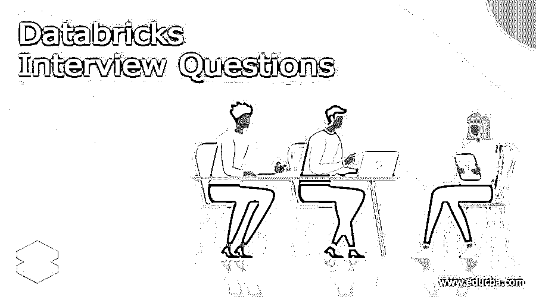

# Databricks 面试问题

> 原文：<https://www.educba.com/databricks-interview-questions/>

## 数据块的定义

Databricks 是一个集成的数据分析工具，由创建 Apache Spark 的同一个团队开发；该平台满足了数据科学家、数据分析师、数据工程师部署机器学习技术的要求，以获得对大数据的更深入的见解，从而提高生产力和底线；它成功地克服了当地仓库在管理来自各地的大量非结构化格式数据方面的无能为力；该平台还解决了旧数据湖解决方案的性能/可靠性问题；三大云巨头亚马逊仓库服务(AWS)、微软 Azure 和谷歌云平台(GCP)已经在其云产品中采用了 Databrick。

### 数据砖简介

这个平台的创始人是许多其他开源大数据平台的所有者，如 ML Flow、Delta Lake、Koalas 和 Spark。这个产品是由一个院士团队从加州大学的 AMPLab 项目中衍生出来的，构建在 Scala 之上。该产品的主要目标是为数据饥渴的应用程序提供一个可靠的数据湖。

<small>网页开发、编程语言、软件测试&其他</small>

除了其创始人的初始资金外，它还在 2019 年获得了微软的一大笔资金。

协作工作区、托管基础架构、Spark 和 Delta 是其核心组件。

### Databricks 面试问题和答案

#### 1.Databricks 的简写(在一句话里)是什么？

一个基于云的大数据平台，用于管理数据湖，通过机器学习技术处理数据，并从中获得深刻见解。

#### 2.谁从数据砖中受益最大？

Databricks 为数据科学家、数据分析师和数据工程师提供服务，帮助他们从大数据中获得最大的洞察力。

#### 3.数据块的组成部分是什么？

开发人员能够安全地实时协作编码的工作空间。
·托管集群，提升查询速度。
？Spark 引擎管理内存中的数据处理
？Delta 克服传统数据湖文件格式的缺点
？ML Flow 克服生产中的挑战？ML 生命周期不断增长
？SQL Analytics 开发查询以从数据湖中提取数据并在仪表板中发布。

#### 4.Databricks 支持哪些语言？

r、Python、Scala、标准 SQL 和 Java。它还支持几种语言 API，如 SparkR 或 SparkylR、PySpark、Spark SQL、Spark.api.java。

#### 5.数据仓库和数据湖有什么区别？

数据仓库主要包含业务分析所需的经过处理的结构化数据，并在内部使用本地技能进行管理。它的结构不可能这么容易改变。

数据湖包含包括原始数据和旧数据在内的所有数据，包括非结构化数据在内的所有类型的数据，它可以轻松扩展，并且数据模型可以快速更改。它由第三方工具维护，最好是在云中，并且在处理数据时使用并行处理。

#### 6.Databricks 没有内部部署选项吗？它仅在云中可用吗？

是的。Apache Spark 是 Databricks 的基础版本，以内部解决方案的形式提供，内部工程师可以在本地维护应用程序和数据。Databricks 是一个云原生应用程序，用户在访问本地服务器上的数据时将面临网络问题。数据不一致和工作流效率低下是与 Databricks 的本地选项相权衡的其他因素。

#### 7.云服务主要有哪些类型？

1.基础设施即服务(IaaS)

这是云计算之旅中合乎逻辑的第一步。计算机硬件、网络是从云供应商处租用的，整个应用程序环境(包括应用程序的开发/托管)必须由最终用户管理。

2.软件即服务(SaaS)

基础架构和应用程序环境由云供应商提供，消费者只需管理应用程序设置和用户身份验证。

3.平台即服务(PaaS)

基础设施和软件开发平台由云供应商提供，消费者必须配置应用程序设置、开发应用程序并将其托管在云中。

4.无服务器计算

这是 PaaS 的临时版本。应用程序增长时的服务器可伸缩性由云供应商处理，用户不必担心。

#### 8.微软是 Databricks 的所有者吗？

不，Databricks 仍然是基于 Apache Spark 的开源产品。微软在 2019 年投资了 2.5 亿美元。微软将 Databricks 的部分服务整合到其云产品 Azure 中，并于 2017 年发布了 Azure Databricks。亚马逊云 AWS 和谷歌云 GCP 也有类似的合作。

#### 9.Databricks 和 Azure Databricks 有什么区别？

Databricks 统一了 Apache Spark 的数据分析处理能力和 ML 驱动的数据科学/工程技术，管理从摄取状态到消费状态的整个数据生命周期。

Azure Databricks 结合了 Azure 的一些功能和 Databricks 的分析功能，为最终用户提供了两个世界的最佳选择。它使用 Azure 自己的数据提取工具 Data Factory 从各种来源中挑选数据，并在转换和加载中结合人工智能驱动的数据块分析功能。它还使用 MS active directory 集成功能来获得认证，并使用其他 Azure 和 MS 的通用功能来提高生产率。

#### 10.Databricks 提供的云服务是什么类别？是 SaaS 还是 PaaS 还是 IaaS？

Databricks 提供的服务属于软件即服务(SaaS)类别，目的是利用 Spark 和集群的强大功能来管理存储。用户只需更改应用程序配置并开始部署它们。

#### 11.Azure Databricks 提供的云服务是什么类别？是 SaaS 还是 PaaS 还是 IaaS？

Azure Databricks 提供的服务属于平台即服务(PaaS)类别。它提供了一个应用程序开发平台，具有从 Azure 和 Databricks 构建的功能。用户必须设计和开发数据生命周期，并使用 Azure Databricks 提供的服务开发应用程序。

#### 12.比较 Azure 数据块和 AWS 数据块

Azure Databricks 是 Azure 功能和 Databricks 功能的良好集成产品。这不仅仅是在 Azure 平台中托管数据块。活动目录认证和许多 Azure 功能的集成等 MS 功能使 Azure Databricks 成为一款优秀的产品。AWS Databricks 仅仅是在 AWS 云上托管 Databricks。

### 结论 Databricks 面试问题

智能手机和高带宽互联网可用性的出现为构建新一代应用程序铺平了道路，默认情况下，它们托管在云中。Databricks 将帮助和加速这种发展到一个更快的水平。

### 推荐文章

这是 Databricks 面试问题指南。在这里，我们讨论定义、简介、数据、面试问题和答案。您也可以看看以下文章，了解更多信息–

1.  [MPLS 面试问题](https://www.educba.com/mpls-interview-questions/)
2.  [二叉树面试问题](https://www.educba.com/binary-tree-interview-questions/)
3.  [情景面试问题](https://www.educba.com/scenario-interview-questions/)
4.  [反应本土面试问题](https://www.educba.com/react-native-interview-questions/)

