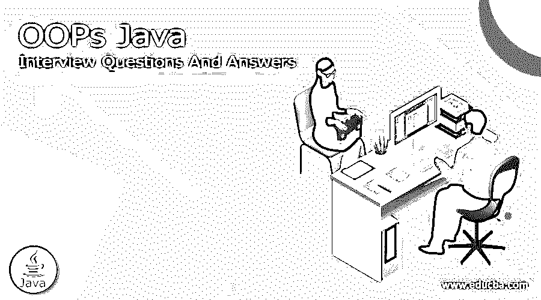

# 哎呀 Java 面试问答

> 原文：<https://www.educba.com/oops-java-interview-questions-and-answers/>

## OOPs Java 面试问答介绍

Oops，俗称面向对象编程技术，是围绕对象概念的编程范例。在像 Java 这样的面向对象语言中，一切都是包含数据、字段和属性的对象，我们以过程的形式对它们进行编码，也称为方法。它还包括基于类的参数，这些参数为实例及其类型的决定因素提供了意义。哎呀，它围绕着抽象、多态、继承、封装、对象、类和接口的基本概念。在本帖中，我们整理了一个最常见和最重要的 OOPs Java 面试问题和答案的列表。

现在，如果你要找与 OOPs Java 相关的工作，你需要准备 2022 OOPs Java 面试问题。根据不同的职位描述，每个面试确实是不同的，但是，为了通过面试，你需要对 OOPs Java 有一个很好的清晰的了解。在这里，我们准备了重要的 OOPs Java 面试问答，帮助你在面试中获得成功。

<small>网页开发、编程语言、软件测试&其他</small>

以下是面试中经常被问到的 8 个重要的 2022 OOPs Java 面试问题和答案。这些问题分为以下几个部分:

### 哎呀 Java 面试基本问题

这一部分包括基本的面试问题和答案。

#### 1.有哪些不同的 OOPs 概念？

**答案:**

不同的 OOPs 概念如下:

1.  多态性
2.  抽象
3.  遗产
4.  聚合
5.  包装
6.  联合
7.  作文

#### 2.什么是多态性？我们能在 java 中重写一个静态方法和一个私有方法吗？

**答案:**

这是面试中最常见的 OOPs Java 面试问题。在运行阶段识别一个函数的能力被称为多态性。在大多数面向对象的编程语言中，如 C++和 Java，有两种类型的多态性，编译时多态性(重载)和运行时多态性(覆盖)。

方法重载:一个方法拥有相同的方法名但不同的参数数量或类型的能力称为方法重载。

方法重写:当子类的类方法包含与父类相同的名称和方法签名时，就会发生这种情况。当您覆盖方法时，JVM 会在程序运行时而不是编译时识别要调用的正确方法。

不，在 Java 中重写静态方法是不可能的，因为对象没有绑定它。另一方面，静态方法依赖于类，在编译时使用引用变量类型进行解析。在子类中声明相同的方法会导致方法隐藏。

不，在 java 中重写私有方法是不可能的。因为私有方法在声明它们的类中是可访问和可见的，所以它们不能在子类中被重写。但是，它们可以在内部类中被覆盖，因为它们可以在这里被访问。

让我们转到下一个 OOPs Java 面试问题。

#### 3.Java 8 有哪些重要的特性？

**答案:**

Java 8 中引入的一些重要特性是:

*   可迭代接口中的 forEach()方法
*   Lambda 表达式和函数接口
*   接口中的静态和默认方法
*   Java 时间 API
*   集合上批量数据操作的流 API
*   并发 API 改进
*   集合 API 改进
*   Java IO 改进
*   核心 API 改进

#### 4.状态模式和策略模式的区别是什么？策略模式解决了什么问题？

**答案:**

状态模式和策略模式共享相同的结构或类图；然而，他们的意图完全不同。状态模式根据状态执行特定的任务，而策略则在不改变代码的情况下切换算法。例如，collections.sort()方法对对象列表进行排序。因为所有的对象使用不同的比较策略，所以可以在各种对象之间进行比较，而不需要改变排序方法。

### 哎呀 Java 面试高级问题

现在让我们来看看高级面试问题。

#### 1.SOLID 面向对象方法的 5 个设计原则是什么？

**答案:**

在鲍勃叔叔写的《干净的代码》一书中，SOLID 中的每个字符代表一个设计原则:

单一责任原则

O-开放封闭设计原则

L-利斯科夫替代原理

I–界面分离原则

D-依赖倒置原理

让我们转到下一个 OOPs Java 面试问题。

#### 2.装饰设计模式基于哪个 OOP 概念？

**答案:**

装饰器模式利用了组合的 OOP 特性来提供新的特性，而不需要修改原始类。组件与装饰器相关联。

#### **3。OOP 中的关联、依赖、组合、聚合有什么区别？**

**答案:**

在关联的情况下，一个类具有另一个类类型的成员变量或属性，但是在依赖的情况下，一个方法包含在该类类型的参数或其他类类型的局部变量中。

关联有两种形式，聚合和组合。聚合是一种松散的关联形式，在这种形式中，相关对象独立存在，而在组合的情况下，对象不能独立存在。

#### 4.什么是 ThreadLocal？我们更喜欢同步块还是同步方法？

**答案:**

一个对象的所有线程共享变量，所以变量不是线程安全的。

### 推荐文章

这是 OOPs Java 面试问答指南。这里我们讨论一下面试中经常被问到的 top OOPs java 面试问题。你也可以看看下面的文章来了解更多

1.  [顶级网络服务面试问题](https://www.educba.com/web-services-interview-questions/)
2.  [HTML5 面试问题](https://www.educba.com/html5-interview-questions/)
3.  [Java 测试面试问题惊人指南](https://www.educba.com/java-testing-interview-questions/)
4.  [Java 并发面试问题](https://www.educba.com/java-concurrency-interview-questions/)

