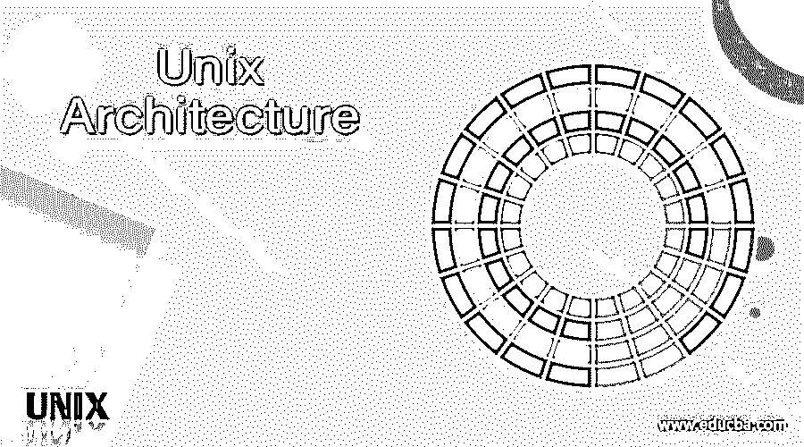

# Unix 架构

> 原文：<https://www.educba.com/unix-architecture/>

## Unix 体系结构介绍

Unix 的体系结构分为内核、硬件、外壳、文件和目录，其中内核管理与硬件、应用程序和命令相关的连接。第二层是硬件，第三层称为外壳，是用户、用户执行的命令和 Unix 中已经预定义的命令之间的桥梁，最后一层是文件和目录，它们通常被称为 Unix 程序，可以被视为 Unix 中的命令。

### Unix 定义

UNIX 也可以称为操作系统，在工作站和服务器上都有应用。这对互联网的发展和计算机系统的重新配置是很重要的。Unix 是由 Ken Thompson、Dennis Ritchie 和其他在美国电话电报公司实验室工作的人开发的。这主要是为了帮助程序员而不是非程序员开发软件而开发的。但是，现在因为简单，大家都在用。这是为多人同时访问和多任务分时配置而设计的。

<small>网页开发、编程语言、软件测试&其他</small>

### Unix 工作

UNIX 操作系统被分为不同的子环境，下面让我们了解一下

1.  第一步是用于数据存储的纯文本。
2.  这由[层次文件系统](https://www.educba.com/hierarchical-database-model/)组成。
3.  考虑将设备和进程间通信视为一个文件。
4.  第四部分是大量软件工具的使用，换句话说，这些工具可以归类为通过解释器使用管道连接的小程序。

### Unix 应用程序编程接口

许多操作系统都有一个简单的视图，根据应用程序的用途来显示它们的行为。写在操作系统中的应用程序从磁盘、终端、打印机或磁带上读取数据，并在另一端进行所需的处理。所需的输出在磁盘、终端、打印机或磁带上产生。一般来说，操作系统内置了实现良好的工具来支持这类应用程序。

随着应用需求的增加，对网络访问、进程间通信、多任务处理等更复杂功能的需求也在增加。这些特征没有被记录，并且不容易理解。最重要的是这些只能从汇编语言中调用。用这些特性编写的程序很难处理和维护。

Unix 操作系统是用 [C](https://www.educba.com/what-is-c/) 语言编写的,“输入-处理-输出”应用程序无需编写[汇编语言](https://www.educba.com/what-is-assembly-language/)就能轻松运行。

### Unix 架构

UNIX 的体系结构基本上分为四个主要层

1.  核心
2.  五金器具
3.  壳
4.  文件和目录

第一层内核处理所有的硬件连接，所有的应用程序和命令都与之相关联。硬件是第二层。第三层称为 shell，充当用户、用户命令和预定义的 UNIX 命令之间的桥梁。最后但并非最不重要的文件和目录可以归纳为 UNIX 命令，在大多数情况下是 UNIX 程序。最后一层是用户。这意味着用户可以从外壳本身看到整个操作系统

请让我们详细了解其中的每一项:

#### 1.核心

在这四层中，内核是最强大的一层。内核主要包含实用程序和主控制程序。内核程序有能力启动或停止一个程序，甚至处理文件系统。当两个资源试图同时访问同一资源的设备时，它还会建议选择哪个程序。由于内核对操作系统有特殊的访问权限，这导致了用户空间和内核空间之间的空间划分。

内核结构的设计应该支持主要的 UNIX 需求。分为两类，列举如下

1.  流程管理。
2.  文件管理。

*   **流程管理**

CPU、内存和服务中的资源分配是进程管理下要处理的几件事情。

*   **文件管理**

文件管理负责管理进程所需的文件中的所有数据，同时与设备通信并调节数据传输。

**内核完成的主要操作有**

1.  内核确保用户给定程序的运行按时完成。
2.  在内存分配中起作用。
3.  管理内存和磁盘之间的交换。
4.  在外设之间传输数据。
5.  内核也向进程请求服务。

这就是内核被称为 UNIX 系统心脏的原因。内核本身可以定义为一个小程序，它包含足够的数据结构来传递参数，从调用中接收结果，并在调用过程中处理它们。

#### 2.五金器具

硬件可以定义为通过人眼可以看到和触摸到的系统组件，如键盘、显示器等。硬件还包括扬声器、时钟、操作系统架构中的设备。

#### 3.壳

外壳可以很容易地定义为软件程序，它充当内核和用户之间的通信桥梁。当用户给出命令时，外壳读取命令，理解它们，然后发送执行程序的请求。然后，当程序被执行时，它再次发送在屏幕上向用户显示程序的请求。外壳也可以被称为命令解释器。如上所述，shell 调用内核时，最多有 100 个构建调用。

【shell 要求内核执行的各种任务有

1.  文件打开。
2.  文件写入。
3.  执行程序。
4.  获取有关该计划的详细信息。
5.  过程的终止。
6.  获取时间和日期信息。

#### 4.Unix 文件和目录

这包括用户编写的程序和 shell 程序以及 UNIX 库

**目录**

Unix 中的目录有名称、路径、文件和文件夹。文件和文件夹的规则是相同的。它们存储在上下分层的树形结构中。目录的主要工作流程如下。

*   显示主目录。
*   将文件复制到其他目录。
*   重命名目录。
*   删除目录。

**文件**

这些文件包含数据、文本和程序指令。文件的主要工作流程是

*   存储用户信息，如绘制的图像或编写的内容。
*   大多位于一个目录下。
*   它不允许/存储其他文件的数据。

### 结论

在这里，我们讨论了 Unix 系统最重要的主题，也学习了操作系统的基础知识。内核使 Unix 成为比 Windows 操作系统更安全的操作系统。除了 windows 操作系统对用户的易操作性之外，Unix 是比 windows 更受欢迎的操作系统，它的用户每天都在大量增加。从初创公司到跨国公司，许多软件公司都在使用 Unix 操作系统。

### 推荐文章

这是 Unix 架构的指南。这里我们分别讨论了 Unix 的工作原理、应用程序和体系结构。您也可以浏览我们推荐的其他文章，了解更多信息——

1.  [什么是 Unix Shell？](https://www.educba.com/what-is-unix-shell/)
2.  [什么是 Unix？](https://www.educba.com/what-is-unix/)
3.  [Unix 命令](https://www.educba.com/unix-commands/)
4.  [Unix 操作员](https://www.educba.com/unix-operators/)

