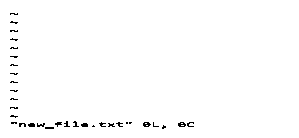
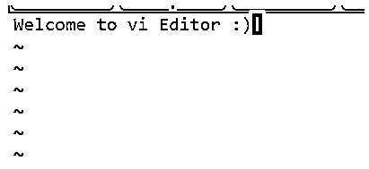

# Unix 中的 VI 命令

> 原文：<https://www.educba.com/vi-command-in-unix/>

## Unix 中 VI 命令简介

在 Unix Shell 脚本中，VI editor 是使用最多且非常有用的文本编辑器之一。它是安装在 Unix 操作系统中的默认编辑器。vi 编辑器的最大用途是创建一个新文件，编辑一个现有的文件，或者只是读取一个文件。在本主题中，我们将学习 Unix 中的 VI 命令。

几个原因使得 VI 编辑器大多使用了 editor

<small>网页开发、编程语言、软件测试&其他</small>

*   这个编辑器默认存在于所有 Linux 或 Unix 操作系统中。
*   vi 编辑器的最大用途是创建一个新文件，编辑一个现有的文件，或者只是读取一个文件。
*   该编辑器界面友好，使用起来非常灵活。因此，用户更喜欢根据自己的需要使用这个编辑器。

**语法**:

下面是 vi 命令的语法:

`vi filename`

### vi 命令在 Unix 中是如何工作的？

随着版本的升级，还有一个高级版本的 vi 编辑器，这就是 VIM(Vi 改进版)。

几个原因使得 VI 编辑器大多使用了 editor

*   这个编辑器默认存在于所有 Linux 或 Unix 操作系统中。
*   vi 编辑器的最大用途是创建一个新文件，编辑一个现有的文件，或者只是读取一个文件。
*   该编辑器界面友好，使用起来非常灵活。因此，用户更喜欢根据自己的需要使用这个编辑器。

### vi 编辑器中的操作模式

*   **命令模式**:默认情况下，vi 一启动，命令模式就开启。此命令模式帮助用户复制、粘贴、删除或移动文本。在其他模式下，我们应该按[Esc]键进入命令模式。
*   **插入模式**:每当我们试图打开 vi 编辑器时，它会默认进入命令模式。要在文件中写入内容，我们必须进入插入模式。按“I”进入插入模式。如果我们想回到命令模式，按[Esc]键。
*   **最后一行模式或转义模式**:当 vi 编辑器处于命令模式时，按[Esc]和冒号[:]进入转义模式。这种模式帮助用户保存文件，将数据存储在文件中，等等。

**VI 命令的语法:**

*   vi 命令的一般语法是:

`vi filename`

*   要读取现有文件，语法如下:

`vi -R filename`

*   要打开现有文件，语法是:

`view filename`

### 创建文件并将内容写入文件的步骤

下面是下面提到的步骤

#### 第一步

**创建新文件:**

要创建新文件，可以使用以下语法:

**语法:**

`vi filename.txt`

**命令:**

`vi new_file.txt`

**命令模式:**

下面的截图是在 vi 编辑器处于命令模式时拍摄的。

#### 第二步

**进入插入模式:**

要从命令模式切换到插入模式，请按键盘上的“I”。在编辑器的底部，你可以看到‘INSERT’的写法如下所示:

#### 第三步

**写内容:**

一旦编辑器处于插入模式，您就可以开始在文件中写入内容。

#### 第四步

**保存文件并退出编辑器:**

要保存文件并退出，可以按[Esc]键和':wq '。

**语法:**

`[Esc] + :wq`

#### 第五步

**检查数据是否创建成功:**

要查看文件中的内容，可以在 Unix 中使用 cat 命令。

**语法:**

`cat filename.txt`

**命令:**

`cat new_file.txt`

### Vi 编辑命令

以下是 vi 编辑器中用于编辑数据或修改内容的编辑命令:

.I–进入插入模式

*   a–在光标后书写
*   a–将数据写入行尾
*   ESC–关闭插入模式并进入命令模式
*   u–撤消更改
*   u–撤消该行中的所有更改
*   o–开始新的一行
*   删除一整行
*   3dd–连续删除 3 行。
*   d–删除光标旁边一行的数据
*   删除文件中的一个单词
*   4dw–删除文件中的 4 个单词
*   CW–将一个单词转换成另一个单词
*   x–删除光标开头的字符
*   r–替换文件中的字符
*   r–覆盖文件中存在的字符
*   s–替换一个字符
*   ~–更改单个字符的大小写

### 在 vi 编辑器中保存和关闭文件的过程

*   Shift + zz:保存文件并退出
*   ESC+:w–保存文件，但不退出。
*   ESC+:q–退出文件而不保存
*   ESC+:wq–保存文件并从中退出。

### 结论–Unix 中的 VI 命令

在 Unix Shell 脚本中，VI editor 是使用最多且非常有用的文本编辑器之一。它是安装在 Unix 操作系统中的默认编辑器。vi 编辑器的最大用途是创建一个新文件，编辑一个现有的文件，或者只是读取一个文件。这个编辑器默认存在于所有 Linux 或 Unix 操作系统中。vi 编辑器的最大用途是创建一个新文件，编辑一个现有的文件，或者只是读取一个文件。该编辑器界面友好，使用起来非常灵活。因此，用户更喜欢根据自己的需要使用这个编辑器。

### 推荐文章

这是 Unix 中 VI 命令的指南。这里我们讨论 vi 命令在 Unix 中是如何工作的，以及创建文件和在文件中写入内容的步骤。您也可以看看以下文章，了解更多信息–

1.  [Unix 中的数组](https://www.educba.com/array-in-unix/)
2.  [Crontab in Unix](https://www.educba.com/crontab-in-unix/)
3.  [Unix 中的 VI 编辑器](https://www.educba.com/vi-editor-in-unix/)
4.  [安装 UNIX](https://www.educba.com/install-unix/)

