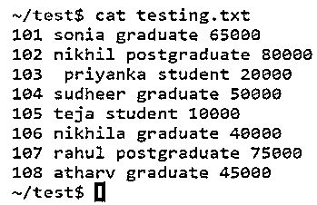
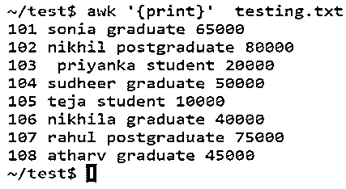
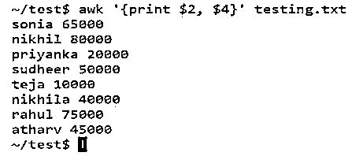
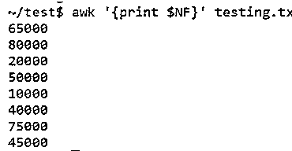
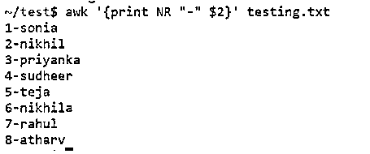

# Unix 中的 AWK 命令

> 原文：<https://www.educba.com/awk-command-in-unix/>

## Unix 中的 AWK 命令简介

Unix Shell 脚本中的 AWK 命令用于改变数据格式和生成报告。我们可以使用数字函数、逻辑运算符、变量和字符串函数来处理数据，而无需编译。AWK 命令通常用于处理数据和扫描文件中的图案。它尝试扫描一个或多个文件，以检查它是否包含与所需的指定模式相匹配的模式，并最终对其执行所需的操作。AWK 指挥部是由三个人的首字母命名的——Aho、Weinberger 和 Kernighan。他们来自美国电话电报公司·贝尔实验室，也在 Unix Shell 脚本中贡献了许多其他命令行提示。

AWK 命令用于执行以下操作:

<small>网页开发、编程语言、软件测试&其他</small>

*   定义变量。
*   使用数字函数或逻辑/算术运算符、变量或字符串。
*   应用循环或控制流操作。
*   生成报告。

**AWK 命令的基本语法:**

`awk [options] [program] [file]`

### 我们能从 AWK 指挥部做些什么？

以下是我们可以在 Unix 中使用 AWK 命令执行的操作列表:

*   AWK 命令最初尝试逐行扫描文件。
*   将每个输入文件划分为与模式匹配的字段。
*   然后，它尝试将输入文件与指定的模式进行比较。
*   最后，对匹配的行执行操作。

AWK 命令对于转换数据文件，然后从它们生成报告非常有用。它还用于对它们执行算术或逻辑运算，以找出匹配的模式。

AWK 命令用于执行以下操作:

*   定义变量。
*   使用数字函数或逻辑/算术运算符、变量或字符串。
*   应用循环或控制流操作。
*   生成报告。

**AWK 语法:**

`awk [options] [selection action] [input_file]`

### 如何在 Unix 中使用 AWK 命令的例子

让我们假设有一个名为“testing.txt”的文件，文件中的内容如下:

**代码:**

`cat testing.txt`

**输出:**

#### 示例 1–选项“打印”。

为了打印文件中的所有内容，awk 帮助打印文件中的所有行内容。在下面的例子中，我们没有使用任何模式，所以操作适用于文件行。默认情况下，不带任何模式参数的操作将打印文件中的所有数据/行。因此，我们可以看到下面文件中的所有行都被打印出来了。

**语法:**

`awk '{print}' file_name.txt`

**代码:**

`awk '{print}' testing.txt`

**输出:**

#### 示例 2–模式匹配。

要打印文件中的指定模式，我们可以使用下面的语法。它将列出在给定的输入参数中匹配的模式，并将在输出中列出数据。

**语法:**

`awk '/pattern/ {print}' file_name.txt`

**代码:**

`awk '/student/ {print}' testing.txt`

**输出:**

#### 示例# 3–将行拆分为字段。

默认情况下，我们也可以使用空白作为分隔符来拆分记录。例如，如果我们在一行中有 4 个单词，它将分别存储为$1、$2、$3 和$4，而$0 将打印完整的一行。

**语法:**

`awk '{print $n, $m}' file_name.txt`

**代码:**

`awk '{print $2, $4}' testing.txt`

**输出:**

### 变量 Unix 中内置的 AWK 命令

*   **NF:** 带有 NF 变量的 AWK 命令用于统计输入参数中传递的字段数。
*   **RS:** 带 RS 的 AWK 命令用于存储当前输入参数中的记录分隔符。默认情况下，如果没有提到指定的变量，新的一行被认为是记录分隔符。
*   **NR:** AWK 命令及其变量 NR 有助于统计输入记录的数量。通常，行被认为是记录。
*   使用 FS 命令时，我们需要指定字段分隔符。默认情况下，如果没有提到特定的分隔符，空白被视为分隔符。它用于根据输入行划分字段。
*   **ORS:** 带有 OFS 变量的 AWK 命令用于存储 AWK 命令打印输出行时所分隔的输出记录分隔符。新行字符被视为默认的记录分隔符。
*   **OFS:** 当 AWK 打印输出时，带有 OFS 变量的 AWK 命令用于存储输出字段分隔符。空格字符被视为默认的字段分隔符。

### AWK 命令中的变量示例

下面是提到的例子:

#### 示例# 1–可变 NF。

当我们想要打印文件中记录的最后一行时，我们可以使用带有变量 NF 的 awk 命令。

**语法:**

`awk '{print $NF}' file_name.txt`

**代码:**

`awk '{print $NF}' testing.txt`

**输出:**

#### 示例 2–可变 NR。

带有变量 NR 的 AWK 命令有助于计算输入记录的数量。通常，行被认为是记录。

**语法:**

`awk '{print $NR <file separator> $n}' file-name.txt`

**代码:**

`awk '{print NR "-" $2}' testing.txt`

**输出:**

#### 示例 3–可变 OFS。

当 AWK 打印输出时，带有 OFS 变量的 AWK 命令用于存储输出字段分隔符。空格字符被视为默认的字段分隔符。

**语法:**

`awk 'OFS=”field_separator” {print $n, $m, $o}`

**代码:**

`date | awk 'OFS="/" {print $2, $3, $6}'
date | awk 'OFS="-" {print $2, $3, $6}'`

**输出:**

#### 例 4–可变端。

为了计算输入文件中的行数，我们可以在 awk 命令中使用 END 变量，如下所示。

**语法:**

`awk 'END {print NR}' file_name.txt`

**代码:**

`awk 'END {print NR}' testing.txt`

**输出:**
T3】

#### 例 5–变量开始。

这个 BEGIN 变量用于在执行任何记录之前设置操作。我们还可以在处理记录之前打印我们想要打印的任何数据，如下所示。

**语法:**

`awk 'BEGIN { print “print your data”} ' file-name.txt`

**代码:**

`awk 'BEGIN {print "Starting of the line"}; {print $2}; ' testing.txt`

**输出:**

### 结论

Unix Shell 脚本中的 AWK 命令用于高级文本处理。它通常用于模式匹配和作为报告工具。通过使用 awk，我们可以定义一组要在输入文件上执行的操作。作为参数传递的输入数据分为字段和记录。

### 推荐文章

这是 Unix 中 AWK 命令的指南。这里我们讨论引言；我们能从 AWK 指挥部做些什么？示例和变量 Unix 中内置的 AWK 命令。您也可以看看以下文章，了解更多信息–

1.  [安装 UNIX](https://www.educba.com/install-unix/)
2.  [Unix 中的排序命令](https://www.educba.com/sort-command-in-unix/)
3.  [Unix 中的数组](https://www.educba.com/array-in-unix/)
4.  [什么是 Unix？](https://www.educba.com/what-is-unix/)

