# Unix 中的函数

> 原文：<https://www.educba.com/functions-in-unix/>

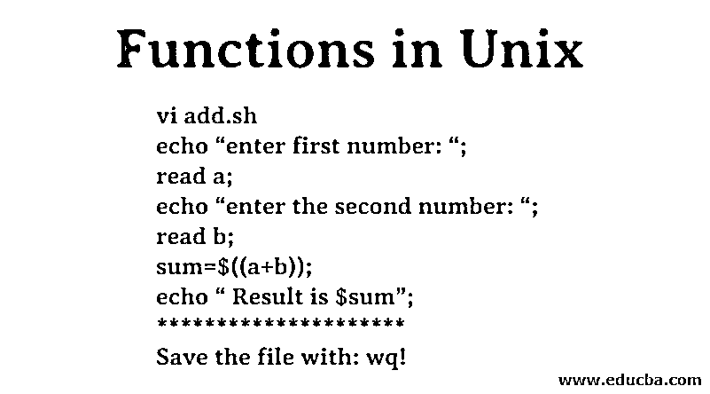

## Unix 中的函数介绍

这些例程包含一组指令，这些指令在整个程序代码中充当一个独立的单元，旨在服务于某个特定的目的，便于执行复杂的任务，并且在语法上写在缩进块中。这也有助于优化程序性能，并允许程序员构建从最简单到最复杂的任务都可以执行的功能，这些任务在 Unix 中称为函数。这一概念基于使用它们所要达到的目的的性质假设了复杂性。

### Unix 中函数的语法

函数的创建遵循如下的基本语法代码。函数的示例。

<small>网页开发、编程语言、软件测试&其他</small>

**代码**

`First()
{
echo “ First Program for defining functions ”;
echo “  Yayyy! “;
}`

这里，我们在第一个函数中编写了两条 echo 语句。为了调用函数，我们可以通过函数名来调用。

**输出**

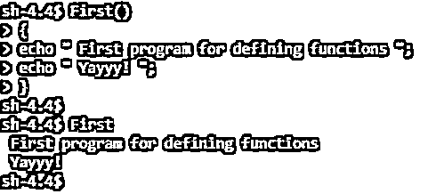

### 向 Unix 中的函数传递参数

我们已经成功地创建了一个简单的函数，调用它并执行我们需要的命令。现在，如果我需要通过用户输入的值将两个数字相加呢？所以，在这里我们会看到如何写一个带参数的函数。基本语法是一样的。参数化函数的示例

**代码**

`Second()
{
echo “Enter your name: “;
read name;
echo “Hi $name , have a good day”;
}`

**输出**

它会提示我们输入一个名字，并祝愿他们

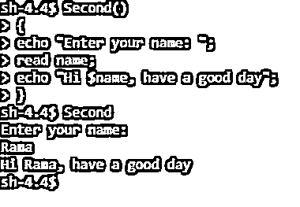

同样，我们甚至可以创建一个脚本文件。让我们在 shell 脚本中编写一个加法函数，看看它是如何工作的。

**代码**

`vi add.sh
echo “enter first number: “;
read a;
echo “enter the second number: “;
read b;
sum=$((a+b));
echo “ Result is $sum”;
*********************
Save the file with**:** wq!`

**输出**

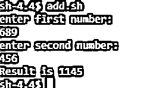

**Note:** Sometimes while executing the sh script we may get the error as:

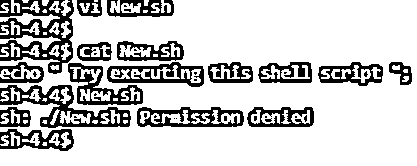

这里唯一要做事情是通过[更新文件权限](https://www.educba.com/unix-file-permissions/)。

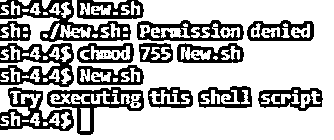

我们甚至可以使用以下命令来执行 sh 文件。/add.sh

同样，我们甚至可以通过提供命令行参数来执行一个函数。那么，让我们看看如何通过三个数的相加来实现这一点。

**代码**

`<Addition()
{
number1=$1;
number2=$2;
number3=$3;
sum=$((number1+number2+number3));
echo “Sum is $sum”;
}`

现在，我们可以将数字作为命令行参数传递，然后获得所需的输出。

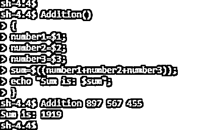

如果我们不向函数传递任何参数会怎样？

如果我们只给出两个论点。

否则，我们能传递字符串吗？

我们甚至可以让代码在传递无效参数时回显错误。下面，让我们看看如果没有传递命令行参数，我们如何要求用户输入参数。

**代码**

`Add()
{
number1=$1;
number2=$2;
if [ $# -ne 2 ]; then
echo “ Enter two numbers to add “;
fi
sum=$((number1+number2));
echo “ Sum is : $sum “;
}`

**输出**

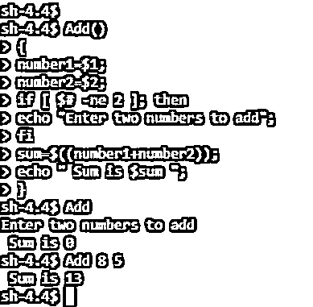

如果我们不向函数传递任何参数，它会给出我们的 echo，我们要求给出两个命令行编号，然后给出 sum 的输出。这样做是因为我们没有告诉函数在遇到错误时停止。在第二种情况下，我们可以看到输出正确地给出了 sum，没有任何中间回声。我们甚至可以使用 return 命令返回这些 Unix 函数的值。return 语句中的值存储在$？

**输出**

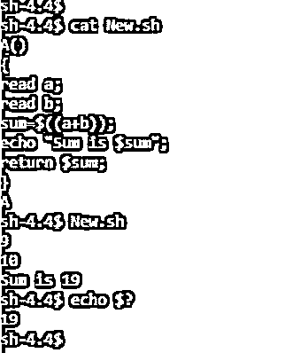

作为一个练习，你能不能试着写一个函数，如果我们不传递参数，它就会爆发？

### Unix 中的嵌套函数

通过命名，我们可以知道嵌套函数就是在函数内部定义一个函数。让我们看看我们现在能做些什么。为了更容易理解，我们将它写在一个 shell 脚本中。

**代码**

`vi Nested_Function.sh
***** Code Inside the sh Function*******
#!/bin/sh
First()
{
echo “ Inside First Function “;
echo “ Calling the second function below “;
echo “**********”;
Second
echo “**********”;
echo “ After calling Second function “;
}
Second()
{
echo “ Inside Second Function”;
echo “ Done “;
}
First
************************
Save the file with**: wq!**`

**输出**

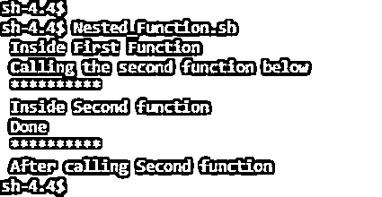

在上面的例子中，我们只是在第一个函数中调用了第二个函数。现在让我们只在第一个函数中写一个函数。

**代码**

`vi Nest_Func1.sh
***** Code Inside the sh Function*******
First_One()
{
echo “ Inside the function First_One”;
echo “ Below is the inner function “;
Second_One()
{
echo “ ********** “;
echo “ Inside Inner function”;
echo “ Completed Second Function”;
echo “ ********** “;
}
echo “Done with second example too”;
}
First_One
Second_one
************************
Save the file with**: wq!**`

现在，你期望什么输出？你认为第一个和第二个函数的细节都会显示出来吗？

**输出**

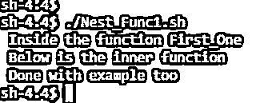

我们可以清楚地看到，函数并没有调用它内部的内部函数。那么，这里的问题是什么？

在我们的脚本中，我们只调用了第一个函数。现在试着调用第二个函数。正如所观察到的，这里我们不能单独调用函数。在上面的代码中，我们突出显示了添加的代码。

**输出**

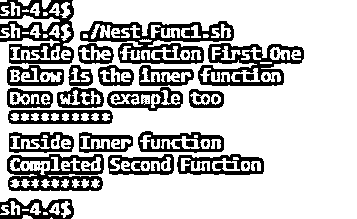

请注意，我们在执行第二个函数之后编写的 echo 出现在它自己之前。现在，如果我们尝试先调用第二个函数，然后调用第一个函数？

**输出**

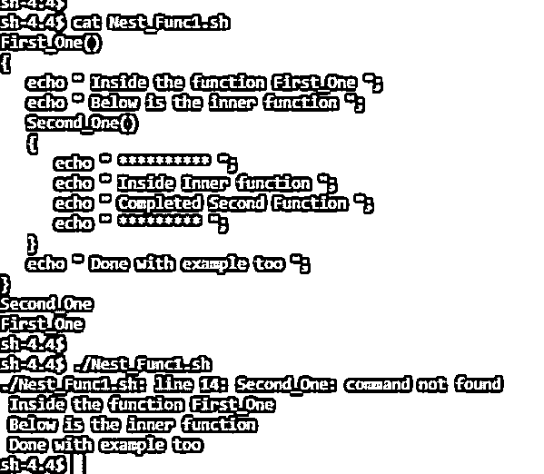

我们可以清楚地理解，直到主函数/第一个函数被调用，内部函数才被调用。作为练习，你能尝试使用嵌套函数将两个数字相加吗？(一个用于输入用户值，其他用于添加数字)

### 结论

这就是我们如何在 Unix 中定义函数。我发现 Unix 的一个主要优点是输出中的错误很容易理解，并有助于相应地纠正我们的代码。尝试执行这些函数，并使用返回命令。祝您在 Unix 中学习愉快。

### 推荐文章

这是 Unix 中函数的指南。在这里，我们讨论 Unix 中函数的介绍和不同类型的函数以及语法和详细的解释。您也可以浏览我们推荐的其他文章，了解更多信息——

1.  [Unix 架构](https://www.educba.com/unix-architecture/)
2.  [Unix 命令](https://www.educba.com/unix-commands/)
3.  [Unix 的使用](https://www.educba.com/uses-of-unix/)
4.  [UNIX 面试问题](https://www.educba.com/unix-interview-questions/)

