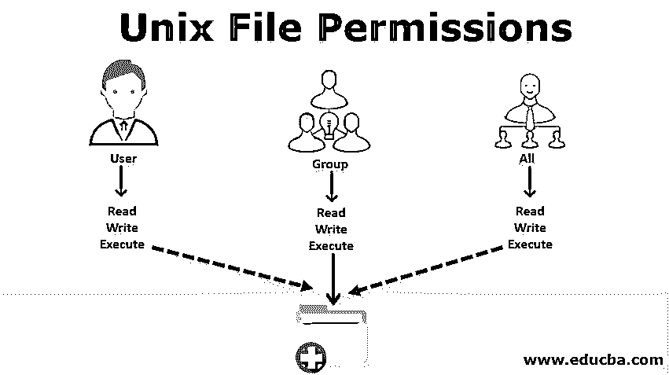

# Unix 文件权限

> 原文：<https://www.educba.com/unix-file-permissions/>

## Unix 文件权限介绍

用 UNIX 设计的安全系统。考虑到 UNIX 的多用户操作系统特性，它允许多个用户同时访问系统。使系统易受外部威胁，这些威胁可能会对系统造成损害并导致误导性信息，损坏数据被称为 UNIX 文件权限。这是一个非常重要且极其关键的概念，它可以适当地向各种用户授予访问权限，这样用户就不会滥用权限，从而为系统用户提供安全性，这些用户对系统的访问权限是受管制的。

### Unix 文件权限

Unix 中的每个文件可以有 3 种类型的所有者。

<small>网页开发、编程语言、软件测试&其他</small>

它们可能如下:

*   **用户:**用户是创建文件的默认人员。这是文件的真正所有者，对所创建的文件拥有完全的权利和权限。
*   **组:**一个组可以包含多个用户。包含在组中的用户对该组可以访问的所有文件具有相似的权限。例如，如果一个项目需要一组特定的人来访问，您可以将所有这些用户添加到一个组中，然后给他们类似的权限。这只能读取或读写权限。当要给予类似的访问时，它节省了分别给予每个用户访问的时间。
*   **其他:**这些是需要访问文件的用户，尽管他们既不是所有者也不是任何组的成员。这可以是需要访问某些特定工作的任何其他人。因此，在这种情况下，权限扮演着重要的角色。

### 许可

一个文件可以有三种权限。根据所有者的类型，以下三种权限可以授予所有三种类型的所有者。

*   **Read:** 通过分配这种权限，您将授予用户打开和阅读文件内容的权限。您可以看到它的所有内容，但没有权限对其进行任何更改。
*   **写:**写权限允许用户修改文件的内容。通过应用它，用户可以读取、修改、添加、删除和重命名存储在目录中的文件。假设用户必须对文件进行写访问。用户可以修改文件。如果愿意，他们还可以删除或重命名任何文件。
*   **执行:**windows 上的可执行文件可以很容易地用它的。exe 文件。但是对于 Unix 来说，一个程序只有在拥有执行权限后才能运行。如果您的用户 id 没有提供适当的执行权限，您将不会执行它。您仍然可以修改或读取文件的内容。

### 更改权限

要更改文件或目录的权限，您可以使用 Chmod 命令。有两种方法可以更改权限。它是符号模式和绝对模式。

#### 带有示例的符号模式中的 Chmod

如果您是初学者，这是更改文件权限最简单的方法。通过这种方式，您可以添加、删除或指定权限，您可以根据需要进行设置。

*   **'+':** 将指定的权限添加到指定的文件或目录中。
*   **'-':** 这将删除文件或目录的指定权限。
*   **'=':** 设置指定的权限。
*   **'r":** 这表示读取。
*   **‘w’:**这表示写入。
*   **‘x’:**这表示执行。
*   **'-':** 没有权限。

**让我们举个例子:**

*   -rw-rw-r—as830b 主页

这里第一个“-”表示我们正在选择一个文件。

如果像- drwxr 那样在开头添加一个 d，那么它表示一个目录被赋予了所述的权限。

*   -rw-rw-r—as830b 主页

第一部分-rw 建议所有者 as830b 可以读取文件、编辑文件，但是用户不必执行访问，因为访问被设置为'-'。

第二部分 rw-意味着用户 as830b 只能读、写或修改文件。

第三部分 r---意味着用户只能读取文件。

#### 带有示例的绝对模式下的 Chmod

当你使用这种模式时，你必须使用三位数的八进制数。这意味着这对应于以下内容:

*   **0:** 拒绝许可—
*   **1:** 执行–x
*   **2:** 写-w-
*   **3:** 执行并写入-wx
*   **4:** 读作 r –-
*   **5:** 读取并执行 r-x
*   **6:** 读写 rw-
*   **7:** 读写并执行 rwx

当命令以 chmod 764 file.txt 的形式给出时，这意味着所有者可以读取、写入和执行。用户组可以读写，而其他人只能读取文件。同样，如果命令更改为 chmod 777 file.txt，这意味着用户可以读取、写入和执行。用户组中的人也可以这样做。除此之外，世界还将能够进行修改、编辑和执行。

所有者也可以象征性地表示为:

*   **U:** 用户/所有者
*   **G:** 组
*   **O:** 其他
*   **答:**全部

这可以作为 chmod o=rwx file.txt 使用，这意味着其他正在被设置为读、写和执行。将 execute 添加到要执行的用户组可以使用:chmod g+x file.txt 进行设置。

### 结论

Unix 是一个多用户系统，因此需要从安全的角度设置文件的权限和所有权。它有三个定义的用户组和三种类型的权限，可以根据需要设置。这可以适用于需要指定权限的任何组或用户。命令“chmod”允许设置和更改用户和组的权限。这有助于确保只有授权的人才能看到内容。因此，Unix 确保了安全性得到维护，并且多个用户可以同时访问数据。

### 推荐文章

这是 Unix 文件权限的指南。这里我们讨论 Unix 文件的权限和更改权限，并给出例子。您也可以浏览我们推荐的其他文章，了解更多信息——

1.  [Unix 中的函数](https://www.educba.com/functions-in-unix/)
2.  [Unix 的使用](https://www.educba.com/uses-of-unix/)
3.  [Unix 架构](https://www.educba.com/unix-architecture/)
4.  [UNIX 面试问题](https://www.educba.com/unix-interview-questions/)

