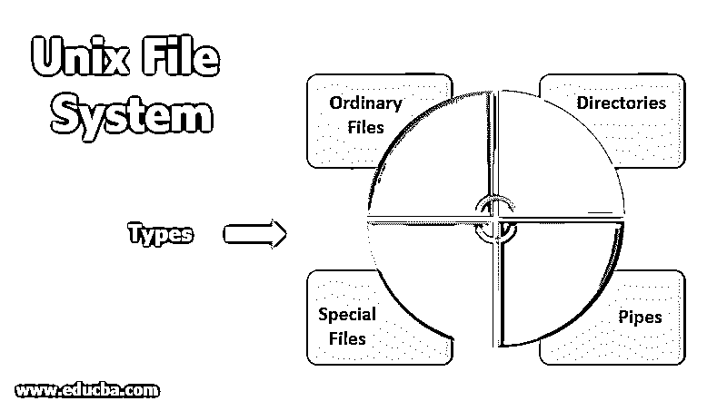

# Unix 文件系统

> 原文：<https://www.educba.com/unix-file-system/>

## Unix 文件系统简介

Unix 文件系统可以定义为一个组织和存储大量数据的框架，这些数据可以很容易地进行处理。它涉及像 file 这样的元素，file 是可以逻辑查看的相关数据的集合，以字节流的形式出现，其属性包含与相关文件相关的信息。文件系统由两个主要部分组成，即文件和目录。整个系统遵循一个层次结构，其中目录充当包含多个文件的特殊文件，整个层次结构中的最高级别目录被称为根，用“/”象征性地表示。这个目录下可以有很多子目录。

Unix 文件系统通常在文件系统中包含以下目录。

<small>网页开发、编程语言、软件测试&其他</small>

*   **bin:** 是二进制文件的简称。该目录存储常用的可执行命令。
*   **mnt:** 这包含关于已安装设备的信息。
*   **root:** 这是根用户的主目录。
*   这是存放临时文件的地方。因为它们是临时的，所以会定期从文件系统中删除。
*   usr: 它包含一组可执行的命令
*   home: 它有一个目录和文件的集合。
*   **proc:** 它包含与系统进程相关的文件。

### 什么是 Unix？

Unix 是一种操作系统，已经应用于多任务、多用户的计算机操作系统。它源自 AT & T UNIX 操作系统，于 20 世纪 70 年代在贝尔实验室研究中心开发。它最初是用汇编语言编程的[，后来又用 c 重新编程。它很稳定，还提供了一个图形用户界面，有助于提供一个易于使用的环境。Unix 为用户提供了不同的程序开发工具、电子通信设备以及许多开发工具。有了这些，它还提供了](https://www.educba.com/what-is-assembly-language/)[多个 UNIX shell](https://www.educba.com/what-is-unix-shell/)，其中一个解释你的命令，这些命令被传递给操作系统。它还有一个内核，作为外壳和硬件之间的中介。内核相对较小且高效。Unix 还提供了一个独立的文件系统，可以在其中执行许多功能。让我们看一下文件系统。

### Unix 文件系统的类型

Unix 文件系统由不同类型的文件组成。让我们看看这些。

#### 1.普通文件

这些文件用于存储用户的信息。它可以是一些文本或任何存储的图像。它通常位于一个目录下，不包含任何其他文件。

#### 2.目录

目录有助于组织现有的文件。目录可以包含普通文件、特殊文件甚至其他目录。所有这些目录都是根目录的后代。

#### 3.特殊文件

特殊文件用于表示物理设备，如打印机、磁带驱动器或终端。Unix 认为任何设备都是一个文件。甚至终端也被认为是一个文件。它被认为是标准的输入文件，从那里读取输入。这个终端也是命令输出的标准输出文件。

#### 4.管道

为了链接命令，Unix 提供了管道。管道是一个临时文件。这也保存来自一个命令的数据，该数据被保存直到被另一个命令读取。一个命令的输出作为输入提供给下一个命令。

### 文件描述符和索引节点

文件内容和文件中的信息之间有明确的区分。除了设备和特殊文件之外，所有文件都由字符序列组成。文件系统中处理文件所需的信息[包含在称为 inode 的数据结构](https://www.educba.com/data-structure-interview-questions/)中。inode 用于标识文件。必须提供一些属性来处理内核和文件系统功能。仅举几个例子，这些属性是文件类型、设备 id、文件所有者的用户 id、访问权限和文件模式等。

### Unix 文件系统中的附加文件属性

文件可以有如下附加属性。

*   **权限模式:**告诉所有者分配给文件的权限。
*   **所有者:**这是文件的所有者。
*   **组:**指定与该文件相关的组。
*   **文件名**:与文件关联的名称。
*   **修改日期:**上次修改文件的日期。
*   **Size** :指定文件的大小，以字节为单位。
*   **链接数量:**与特定文件相关的文件。

### Unix 文件系统中的文件和目录命令

UNIX 提供了许多命令来帮助处理文件。下面列出了其中的一些命令。

**1。** **ls:** 它列出了特定目录下的所有文件。

下面有一些变化。

*   **ls dir:** 显示目录中的内容。
*   ls a: 显示包括隐藏文件在内的所有文件。
*   ls -al: 它给出了文件所有内容的详细列表。

**2。** **少:**显示较少的行数而不是完整的文件。

**3。Head:** 显示文件的前几行或者 n 行。

**4。Tail:** 显示文件的最后几行或者 n 行。

**5。** **Cat:** 显示整个文件的内容，不显示文件的[分页。](https://www.educba.com/css-pagination/)

**6。** **cp:** 它将一个文件的内容复制到另一个文件中。如果没有提到，它会覆盖文件的内容。

**7。** **mv:** 将指定的文件移动到指定的目的地。

**8。** **rm:** 移除或删除指定的文件。

### 结论

Unix 是一种以有组织的方式处理文件的操作系统。有了所有的命令和功能，管理文件变得非常容易。它还有权限限制对文件的访问。只有经过授权的人才能访问这些文件并执行不同的操作。它也有不同种类的文件分离，这使得它更容易使用。因此，Unix 的文件系统被认为是最用户友好的文件系统之一。

### 推荐文章

这是 Unix 文件系统的指南。这里我们讨论它的文件属性以及文件描述符和 Inode。您也可以浏览我们推荐的其他文章，了解更多信息——

1.  [Unix 架构](https://www.educba.com/unix-architecture/)
2.  [Unix 的使用](https://www.educba.com/uses-of-unix/)
3.  [Unix 中的函数](https://www.educba.com/functions-in-unix/)
4.  [Unix 操作员](https://www.educba.com/unix-operators/)

