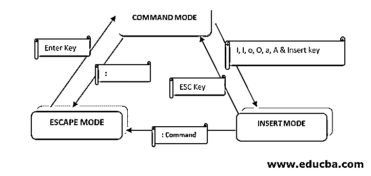
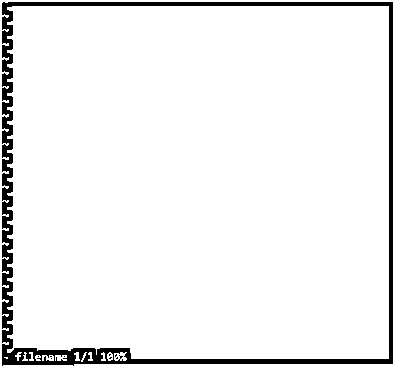
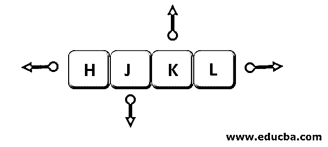

# Unix 中的 VI 编辑器

> 原文：<https://www.educba.com/vi-editor-in-unix/>

## Unix 中 VI 编辑器的介绍

VI 编辑器是一种在 UNIX 操作系统中可用的文本编辑器，它基本上是 UNIX 操作系统附带的默认编辑器，用于创建新文件或编辑现有文件，并提供丰富的用户友好特性，这些特性在几乎所有的 UNIX 分发系统中都可用。该工具中包含的功能打开了编辑文件的无限可能性的大门，使该工具在所有编辑器中具有独特的地位，包括 UNIX 中的 pico、nano、vile，在 UNIX 操作系统中称为 VI 编辑器。

### Unix 下 VI 编辑器的模式

为了轻松使用 VI 编辑器，我们需要了解 VI 编辑器的不同操作模式。

<small>网页开发、编程语言、软件测试&其他</small>

它们分为三个主要部分:

1.  命令模式
2.  插入模式
3.  逃脱模式

#### 1.命令模式

**命令模式**是 VI 编辑器的第一个屏幕。它区分大小写。在此模式下键入的任何字符都被视为命令。这些字符在窗口上是不可见的。在这种模式下，我们可以剪切、复制、粘贴或删除一段文本，甚至在文件中移动

**【ESC】**用于从另一种模式(插入模式)进入命令模式

#### 2.插入模式

通过按键盘上的“I”或“Insert”键，我们可以轻松地从命令模式切换到插入模式。在此模式下键入的字符被视为输入，并将文本添加到文件中

按下 **ESC** 将带你离开**插入模式- >命令模式**

#### 3.逃脱模式

按 **[:]** 进入退出模式。该模式用于保存&命令执行的文件

**图**:蓝色方框代表 VI 编辑器上的各种模式

绿色方框代表从一种模式切换到另一种模式的按键/命令

### Unix 中 VI 编辑器的语法

VI Editor 具有各种特性，可以在 Linux 环境中轻松编辑。突出显示这些命令及其语法的基本目的只是为了让自己熟悉各种功能的可用性。我们不需要记住所有的命令。有关命令和选项的详细信息，您可以参考主页。

现在让我们继续:

#### 1.打开/创建文件

这将创建一个名为“文件名”的文件，或者打开名为“文件名”的文件(如果已经存在)。

**输出**:

**Note**: all the line starts with a tilde (~) sign which represents the unused lines

#### 2.只读模式

要以只读模式打开文件，请使用:

**

** 

**输出:**在文件的底部你会看到‘只读’

**

** 

#### 3.从文件中移出

| **:q** | 退出文件 |
| **:问！** | 退出文件而不保存更改 |
| **:w** | 保存编辑器的内容 |
| **:wq** | 保存更改并退出编辑器( ***** 合并命令:q & : w) |
| **ZZ** | 在命令模式下，这类似于 wq |

#### 4.重命名文件

**:w new filename—**这会将您当前正在处理的文件重命名为“新文件名”。在**逃逸模式**中使用了一个命令。

#### 5.在文件内移动

要在文件中移动而不实际编辑文件的内容，我们必须处于命令模式，并准备好下面的命令。

| 英语字母表中第八个字母 | 将光标向左移动一个字符位置 |
| 英语字母表中第十二个字母 | 将光标向右移动一个字符位置 |
| 英语字母表中第十一个字母 | 将光标向上移动一行 |
| 英语字母表中第十个字母 | 将光标向下移动一行 |

****** 箭头可以帮助您记住该键的功能。没有其他意义。

编辑器内移动的键盘按键。

**Note:** Number at the beginning is equal to the number of times you want the action to occur

**示例:** 2j 将光标从当前光标位置向下移动两行

#### 6.插入或添加文本

下面是用于将编辑器置于插入模式的命令。

一旦按下 **ESC** ，编辑器将返回到**命令模式**。

| **我** | 在光标前插入文本 |
| **我** | 在当前行的开头插入 |
| **答** | 光标后追加 |
| **答** | 追加到当前行的末尾 |
| **o** | 打开&将文本放在当前行下面的新行中 |
| **O** | 打开&将文本放在当前行上方的新行中 |

#### 7.搜索文本

类似于 windows 编辑器中的查找和替换命令，我们也可以在 VI 编辑器中使用某些搜索和替换命令。

| **/字符串** | 向前搜索提到的“字符串” |
| **？字符串** | 反向搜索提到的“字符串” |
| **n** | 移动到搜索字符串的下一个可用位置 |
| **N** | 向相反方向移动到搜索字符串的下一个可用位置 |

#### 8.确定行号

在编辑文件时，拥有行号有时非常有用。这些命令在按下[:]键后的退出模式下使用

| **:。=** | 当前行的行号 |
| **:=** | 给出总行数 |
| **^g** | 在屏幕底部给出行号以及文件中的总行数 |

**9。剪切&粘贴文字**

这些命令允许您复制和粘贴文本

| **yy** | 将当前行复制(猛拉，剪切)到缓冲区 |
| **Nyy 或 yNy** | 将“N”行与当前行一起复制到缓冲区中 |
| **p** | 将缓冲区中的行粘贴/放置到当前行之后的文本中 |

### 结论

由于 VI 编辑器在所有 Linux 环境中都可用，所以学习 VI 编辑器非常有用。它可以帮助我们创建和编辑脚本。我们必须熟悉这些命令以及使用这些命令的特定模式。这并不是 VI 编辑器中可用选项的结束，随着挑战的到来，请继续探索。

### 推荐文章

这是 Unix 中 VI 编辑器的指南。这里我们讨论了 Unix 中 VI 编辑器的基本概念、模式和语法。您也可以浏览我们推荐的其他文章，了解更多信息——

1.  [Unix 的使用](https://www.educba.com/uses-of-unix/)
2.  [Unix 中的函数](https://www.educba.com/functions-in-unix/)
3.  [Unix 中的数组](https://www.educba.com/array-in-unix/)
4.  [Crontab in Unix](https://www.educba.com/crontab-in-unix/)

