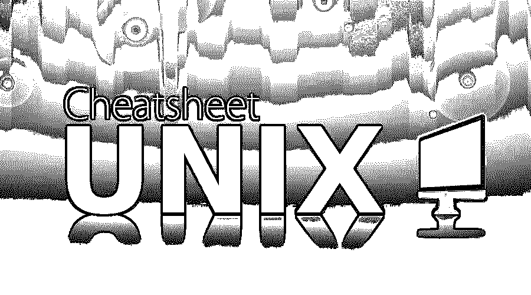

# UNIX 备忘单

> 原文：<https://www.educba.com/cheat-sheet-for-unix/>

## UNIX 备忘单简介

UNIX 是一组多用户和多系列操作系统，最初源自美国电话电报公司 UNIX。它的研究开发最初开始于 20 世纪 70 年代的美国电话电报公司贝尔实验室研究中心。它是由贝尔实验室的丹尼斯·里奇、肯·汤普森、布赖恩·柯尼根、乔·奥萨纳和道格拉斯·麦克洛伊开发的。它最初于 1971 年发行。它是在自由和开源的许可下使用的，一些特性是在专有许可下使用的。默认用户界面是图形用户界面(GUI)和命令行界面(CLI)。它完全是用汇编语言和 C 语言编写的。它被授予了图灵奖。

在这篇 UNIX 备忘单文章中，我们将讨论什么是 UNIX 以及不同的 UNIX 命令。

<small>网页开发、编程语言、软件测试&其他</small>

### UNIX 命令和内容的备忘单

UNIX 命令通常可以区分或分组为不同类别的强大命令，例如文件命令、进程管理命令、压缩、网络相关、文件权限、搜索和 SSH 相关。以下是 UNIX 命令的备忘单列表，这些命令在 UNIX 操作系统中执行不同类型的功能和操作，如下所示:

| **UNIX 命令** | **描述** |
| **文件输入/输出** |
| 限位开关（Limit Switch） | 列出目录。 |
| 显示当前工作目录 | 显示当前目录。 |
| mkdir 文件夹 | 创建一个名为*文件夹*的新目录 |
| cp f1 f2 | 将文件 f1 复制到文件 f2 |
| mv f1 f2 | 如果存在名为 f2 的文件，则将文件 f1 移动到文件 f2 |
| rm f1 | 删除名为 f1 的文件 |
| RM–r 文件 | 强行删除文件 |
| RM–r 方向 | 删除名为 *dir* 的目录 |
| RM–RF 方向 | 强制删除名为 dir 的目录 |
| RM–f f1 | 强制删除名为 f1 的文件 |
| 触摸文件 | 创建或更新文件 |
| 更多文件 | 打印文件内容作为输出 |
| 头文件 | 打印文件前 10 行的内容作为输出 |
| 尾文件 | 打印文件最后 10 行的内容作为输出 |
| **过程命令** |
| 著名图象处理软件 | 显示操作系统中所有当前活动的进程 |
| 杀死 pid | 用提到的进程 id 作为 pid 终止进程 |
| 细粒 | 将最近运行的作业置于前台 |
| 锥齿轮 | 列出所有当前后台运行的进程或作业 |
| 顶端 | 显示所有正在运行的进程。 |
| **网络** |
| ifconfig | 列出所有网络相关的详细信息，如所有分配的 IP 地址 [IPv4 和 IPv6](https://www.educba.com/ipv4-vs-ipv6/) ，网络接口等。, |
| netstat | 列出本地系统中所有正在进行的连接，以及正在监听的端口和正在等待请求的服务的详细信息。 |
| 网络管理命令行工具 | 查询 DNS 查找并找到相关的详细信息。 |
| 主机名 | 了解映射的主机名和 IP 地址的详细信息。 |
| **搜索** |
| 发现 | 在指定的目录中搜索文件。 |
| 可做文件内的字符串查找 | 在所有匹配给定模式的文件中搜索选定的行。 |
| grep <pattern></pattern> | 在给定的行中搜索模式。 |
| grep–rn<pattern>T1】</pattern> | 在包含行号的给定目录中递归搜索模式。 |
| grep-t0-t1 | 递归搜索给定目录中的模式。 |
| 命令&#124; grep<pattern></pattern> | 在命令的给定输出中搜索模式。 |
| 定位文件 | 使用由 updated 命令构建的基于索引的数据库系统来查找文件的所有实例。 |
| 查找文件 | 查找文件在真实系统文件目录中出现的所有位置。 |

### 使用 Unix 命令备忘单的免费提示和技巧

1.  UNIX 操作系统有一个内核，它是系统的核心部分，协调整个功能以执行不同的操作。
2.  它有一个 Shell，通过解释用户在终端中提供的 UNIX 命令来处理实用程序请求。
3.  备忘单 UNIX 中的所有数据都组织在一个文件系统中。
4.  login 命令用于在执行任何操作之前以有效用户的身份登录到 UNIX 系统，而 logout 命令用于以用户的身份从系统中注销。
5.  Shell 脚本是 cheat sheet UNIX 上的一种编程方式，用于由 UNIX 操作系统中的内核执行 shell 脚本(一系列命令)。
6.  UNIX 中的文件系统安全性基于用户的访问权限，如 R、W 或 X，这些权限称为 R-读权限、W-写权限、X-执行权限。
7.  在 UNIX 系统中，用户的访问权限有不同的命令。

UNIX 命令的备忘单如下:

| 【UNIX 命令备忘单 | **描述** |
| chmod | 要修改或更改文件模式 |
| chmod u | 要将文件模式更改为用户模式 |
| chmod o | 要将文件模式更改为其他模式 |
| chmod r | 要将文件模式更改为读取 |
| chmod a | 将文件模式更改为全部 |
| chmod g | 将文件模式更改为组 |
| chmod x | 通过访问目录来更改要执行的文件模式 |
| chmod w | 将文件模式更改为写入和删除 |
| chmod– | 更改文件模式以删除权限 |
| chmod + | 要更改文件模式以添加权限 |

8.  不同大文件的压缩可以使用不同的文件，如 gzip、zcat、tar、gunzip 等。压缩和解压缩不同的 tar 文件，创建 zip 格式的归档文件等。,

### 结论

UNIX 操作系统主要用于大多数服务器托管系统，以提供高度可伸缩和高度可用的系统。UNIX 系统的主要特征和优点是多任务和多用户能力，以执行多任务操作，从而节省完成长时间处理操作的时间和资源。使用 cheat sheet UNIX 的另一个主要好处是它的安全性和在给定时间内产生有效和高效结果的操作速度。

UNIX 有不同版本的操作系统，如 Linux、BSD 等。以提供不同的定制功能。UNIX 具有更大的灵活性，可以安装在不同的机器上，而且它是免费使用和开源的，这大大降低了日常维护成本，并对其操作系统设计、安全性和访问功能非常有利。

### 推荐文章

这是一个 UNIX 备忘单指南，我们在这里讨论了 UNIX 备忘单的内容和命令以及免费的提示和技巧，您也可以看看下面的文章来了解更多信息

1.  [备忘单 SQL](https://www.educba.com/cheat-sheet-sql/)
2.  [Linux vs Ubuntu](https://www.educba.com/linux-vs-ubuntu/)
3.  [Linux 应用程序](https://www.educba.com/linux-apps/)
4.  [备忘单 JavaScript](https://www.educba.com/cheat-sheet-javascript/)

