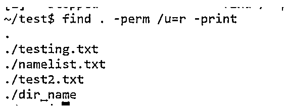
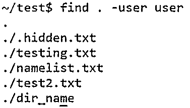
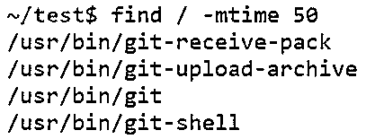
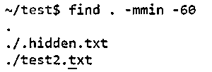
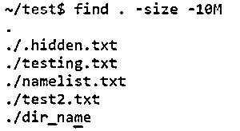
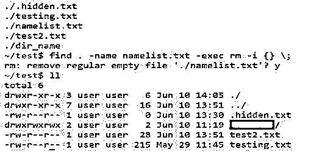

# 在 Unix 中查找命令

> 原文：<https://www.educba.com/find-command-in-unix/>

## Unix 中的 Find 命令简介

Unix Shell 脚本中的 Find 命令是一个命令行实用程序，用于维护文件层次结构系统。find 命令用于找出系统中的文件和目录，并对文件执行以下操作。此命令帮助支持搜索文件、名称、文件夹、修改日期、文件权限、文件所有者。

Find 命令是最常用和最有用的命令，用于根据为与作为输入传递的参数相匹配的文件指定的要求来搜索和定位文件列表和目录。它也用在许多情况下，这可以帮助找到文件的用户名，权限，组，日期，文件类型和许多可用的可能性。

<small>网页开发、编程语言、软件测试&其他</small>

### 从查找命令中我们可以做什么？

以下是在 Unix 中使用 Find 命令的选项:

表格结构显示了选项及其功能:

| **-inum N** | 用于搜索带有索引节点号的文件。 |
| **-链接 N** | 用于搜索带有链接的文件。 |
| **-名称演示** | 搜索名为“demo”的文件。 |
| **-较新的文件** | 根据创建或修改日期检查文件。 |
| **-烫发八度** | 检查文件的权限是否为八进制。 |
| **-打印** | 用于打印输入标准中给出的文件名。 |
| **-清空** | 搜索空文件或目录。 |
| **-用户名** | 它用于搜索用户 ID 所拥有的文件。 |
| **！出口** | 如果“expr”为真，则返回 false。 |
| **\(表达式\)** | 此选项用于将条件与 or 或 AND 一起分组。如果“expr”值为 true，则返回 true。 |

**语法:**

Unix Shell 脚本中的 Find 命令语法如下所示:

`find [from where to start the search] [what to find] [options] [what to find]`

### **Unix 中 Find 命令的例子**

让我们考虑在测试目录下有几个文件。

下面是当前目录下列出的文件名列表。

**代码:**

`ll`

**输出:**

#### 示例# 1–使用名称选项在当前目录中查找文件。

我们可以使用选项“名称”在当前目录中搜索文件，如下所示。

**语法:**

`find . -name filename.txt`

**代码:**

`ll
-name namelist.txt`

**输出:**

#### 示例# 2–使用主目录中的名称选项查找文件。

我们可以使用选项“name”在主目录中搜索文件，如下所示。

**语法:**

`find /home -name filename.txt`

**代码:**

`find /home -name namelist.txt`

**输出:**

#### 示例 3–查找文件时忽略大小写。

我们可以通过使用-iname 忽略大小写来搜索系统中的文件。

**语法:**

`find . -iname filename.txt`

**代码:**

`find . -iname Namelist.txt`

**输出:**

#### 示例# 4–使用名称选项查找目录。

我们可以使用/目录中的选项“name”来查找目录。

**语法:**

`find / -type d -name directory_name`

**代码:**

`find / -type d -name dir_name`

**输出:**

#### 示例 5–选项-烫发。

我们可以找到权限为 777 的文件，并打印出来。

**语法:**

`find . -type d -perm 0777 -print`

**代码:**

`find .  -type d -prem 0777 -print`

**输出:**

#### 示例# 6–选项！烫发。

我们可以找到没有 777 权限的文件并打印出来。

**语法:**

`find . -type f ! -perm 0777 -print`

**代码:**

`find .  -type f ! -prem 0777 -print`

**输出:**

#### 示例# 7–查找只读文件。

我们可以在当前目录中找到具有只读选项的文件，如下所示。

**语法:**

`find . -perm /u=r -print`

**代码:**

`find .  -prem /u=r -print`

**输出:**

#### 例 8–选项-空。

我们还可以找到系统中所有的空文件，以及你想要的文件夹。

**语法:**

`find . -type f -empty -print`

**代码:**

`find .  -type f -empty -print`

**输出:**

#### 示例 9–选项-空。

我们还可以找到系统中所有的空目录，以及你想要的文件夹。

**语法:**

`find . -type d -empty -print`

**代码:**

`find .  -type d -empty -print`

**输出:**

#### 示例# 10–查找隐藏文件。

我们也可以通过下面的语法在 Unix 中使用 find 命令找到隐藏的文件或目录。

**语法:**

`find . -type f -name “.*”`

**代码:**

`find .  -type f -name ".*"`

**输出:**

#### 示例# 11–基于用户查找文件。

我们可以在当前目录或主目录下根据用户所属的用户来查找用户，如下所示。

**语法:**

`find . -user user_name`

**代码:**

`find . -user user`

**输出:**

#### 示例# 12–查找在过去 50 天内修改过的文件。

查找在过去 50 天内修改过的文件可以在下面显示。

**语法:**

`find / -mtime 50`

**代码:**

`find / -mtime 50`

**输出:**

#### 示例# 13–查找过去 50 天内访问过的文件。

查找在过去 50 天内被访问过的文件可以在下面显示。

**语法:**

`find / -atime 50`

**代码:**

`find / -atime 50`

**输出:**

#### 示例# 14–查找过去 15 分钟内更改过的文件。

我们可以找到在过去 15 分钟内更改过的文件，如下面的语法所示。

**语法:**

`find . /cmin 15`

**代码:**

`find . -cmin -15`

**输出:**

#### 示例# 15–查找最近 1 小时内修改过的文件。

我们可以找到在过去 15 分钟内修改过的文件，如下面的语法所示。

**语法:**

`find / -mmin -60`

**代码:**

`find . -mmin -60`

**输出:**

#### 例 16–选项尺寸。

我们可以根据下面给出的语法将选项-size 用于各种标准，如小于大小或大于大小。在这种情况下，我们将检查大小小于 10MB 的文件。

**语法:**

`find . -size -size`

**代码:**

`find . -size -10M`

**输出:**

#### 示例# 17–查找并删除一个文件。

我们可以使用 Unix 中的 find 命令来查找和删除文件。当我们输入下面的语法时，它会要求你确认我们是否要删除文件；键入“Y”或“Y”进行确认。

**语法:**

`find . -name filename -exec rm -i {} \;`

**代码:**

`find . -name namelist.txt -exec rm -i {} \;`

**输出:**

### 推荐文章

这是一个在 Unix 中查找命令的指南。这里我们讨论引言；我们可以从 find 命令中做什么？和示例。您也可以看看以下文章，了解更多信息–

1.  [对于 Unix 中的循环](https://www.educba.com/for-loop-in-unix/)
2.  [Unix 中的数组](https://www.educba.com/array-in-unix/)
3.  [Unix 架构](https://www.educba.com/unix-architecture/)
4.  [Unix 的使用](https://www.educba.com/uses-of-unix/)

