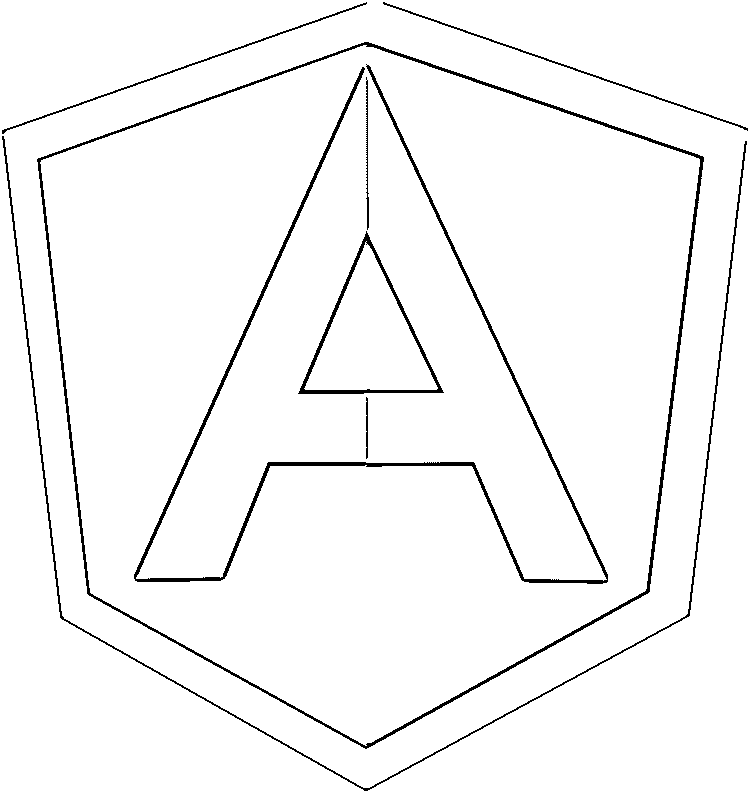

# Web 开发框架

> 原文：<https://www.educba.com/web-development-frameworks/>

## JavaScript Web 开发框架

在过去的几年里，Web 开发工具在 web 开发中变得非常流行。事实证明，它们是加速 web 应用程序开发的一个很好的方法。Web 开发，尤其是前端开发，最近有了很大的进步。总体来说，这对用户和技术来说都是好事，但这也意味着，作为一名 web 开发人员，你将面临不断增加技能和学习更多 web 开发的压力。web 开发中有数百种可用的 web 开发工具，您可能已经尝试过其中的一些。但是掌握它们需要认真投入时间和精力。显然，这意味着你不能掌握所有的 web 开发框架。你需要仔细选择你想投资哪一个，这可能是一个挑战。免费学习新的 web 开发的想法一点也不吸引人，尤其是如果你最终开发了一个你必须维护的应用程序。

换句话说，您需要谨慎选择您的 web 开发工具。但是为什么一开始就要为 web 开发费心呢？为什么不使用传统的服务器端应用程序呢？答案是因为 web 开发工具提供了更好的用户体验，而用户体验是任何 web 应用的核心。

<small>网页开发、编程语言、软件测试&其他</small>

例如，如果用户点击一个按钮，传统的服务器端 web 应用程序必须重新加载整个页面，这可能需要时间。然而，JavaScript web 开发框架只加载用户与之交互的页面部分。这意味着用户界面更快、响应性更强，并创造出与原生移动应用程序一样敏锐快捷的用户体验。

在 web 开发框架中，您可以使用传统的服务器端应用程序和一些 jQuery 获得类似的结果，但是这可能会很快走下坡路。用 jQuery 进行代码管理是一个很大的挑战，除非你正在处理一些简单的应用程序，因为它几乎总是会导致代码杂乱无章。另一方面，现代 JavaScript web 开发通过使用定义良好的应用程序架构解决了代码管理的挑战。他们经常使用模型-视图-控制器(MVC)设计模式，这是 jQuery 所缺乏的。这些 web 开发框架是定义良好的架构，可以简化开发。选择一个 web 开发框架，你会直接得到响应迅速的用户界面和结构良好的、可维护的代码。

### 学习 JavaScript Web 开发框架

以下是四大 JavaScript web 开发框架及其优势:

#### 1.毅力

自 2010 年发布以来，Backbone.js 是最古老的 web 开发框架之一，尽管它已经过时了，但仍然值得认真考虑。首先，它非常轻便，只有 6.3 KB。这是当它被压缩和缩小用于生产时，并且只有一个依赖项。web 开发框架是高度通用的，并以极简 MVC 设计为特色，这是当今大多数流行网站的动力，包括 Pinterest、Hulu 和 Twitter。

使用 Backbone 可以做很多事情，它不像其他 web 开发那样有很多限制。例如，除了包含在下划线. js 中的基本引擎之外，它没有模板引擎。这给了你为你的项目选择任何你想要的东西的选项。

Backbone 的轻量级特性在用于速度是重中之重的简单项目时确实大放异彩，比如 Pinterest 和 Twitter 的单页应用程序，或者构成传统 web 应用程序一部分的小部件。

但它的轻便也可能是它最大的缺陷。主干是如此的简单，以至于你需要很高的 JavaScript 技能来使用它。这使得它更适合高级 JavaScript 开发人员。使用这个 web 开发工具，输出高度依赖于您的经验和技能水平。你可以混合搭配很多插件和库来构建一个主干应用，这对有经验的开发者来说是一个巨大的福音，但对新手来说却是一个挑战。

此外，一些开发人员抱怨需要编写大量样板代码来启动 web 开发工具并为项目运行。更有经验的开发人员说他们不会写那么多代码，这再次表明 Backbone 更适合有经验的人。关于 Backbone 的另一个重要问题是缺少服务器端的渲染，这是你会在很多其他 web 开发工具中看到的，尤其是那些使用 MVC 设计的工具。

缺少服务器端渲染确实会影响 web 应用程序的性能，也会影响 SEO。不能解析 JavaScript 的搜索引擎不能接收来自不支持服务器端渲染的网站的内容。当然，这个问题有解决方法，但是如果您选择主干网，您需要记住这一点。

#### 2 .安圭拉

在 web 开发的早期，我们谈到了主干网，它是最古老的 web 开发框架之一。好吧，AngularJS 比 Backbone 早一年由 Brat Tech 在 2009 年发布。但它只是在谷歌的支持下才真正起飞，这就是为什么它被视为比实际情况更年轻的网络开发框架。Angular 于 2012 年开始获得关注，并在过去几年中迅速走红。

这种受欢迎程度的激增导致了一个强大的贡献者社区，但有些人说 Angular 没有达到宣传的效果。Angular 是为生产而压缩的，大小为 36 KB，它不符合 MVC 设计模式，这就是为什么它经常被称为“模型-视图-无论什么”的 web 开发技术。它的大小大约是主干网的三倍，因为它有更多的内置功能。使用这种网络开发的一些最受欢迎的网站是 MSNBC、VEVO 和天气频道。

Angular 最著名的特性之一是双向数据绑定。现在，数据绑定意味着数据被绑定到视图中的 HTML 元素，该元素也可以更新和显示数据。在 AngularJS 中，视图和模型都可以更新数据，这就是为什么它被称为“双向”数据绑定。有了这个特性，创建动态视图只需要较少的代码。

指令是 Angular 的另一个流行特性。它们允许开发人员将特殊行为附加到 DOM 的某些部分，扩展 HTML。例如,' ng-repeat '指令使开发人员能够重复一个元素，这对于打印一组项目或执行其他操作非常有用。除了 Angular 附带的指令之外，您甚至可以创建自己的指令，这为创建 UI 行为增加了更多的灵活性。

Angular 还附带了一个叫做依赖注入的特性，它允许开发者轻松地将服务包含到他们的模块中。例如，如果您想在编写函数时使用一个位置，您需要做的就是将它作为函数参数包含进来。Angular 将确保该服务的一个实例对该函数可用。这对于将模拟数据注入到组件中特别有用，使得 Angular 高度可测试。

谷歌作为赞助商的存在也是一个巨大的优势和关键的考虑因素。这就是为什么如此多的公司和开发商选择 Angular。但是让它如此受欢迎的双向数据绑定也可能是它最大的担忧之一。它往往会影响应用程序的性能，并使调试变得更加复杂。

Angular 在更复杂、更大的应用程序中使用时也会很慢，这削弱了使用 web 开发的巨大理由。但是熟练的 web 开发框架在很大程度上解决了这个问题。还有 Angular 2.0，它现在处于测试阶段，是对以前 web 开发框架的重大改变，具有零向后兼容性。如果你打算选择 Angular，你也可以选择 2.0，但这是一个风险，因为它仍处于测试阶段。此外，Angular 缺乏服务器端渲染。

#### 3.余烬

与 Angular 或 Backbone 相比，Ember 是真正年轻的 web 开发之一，由 Ruby on Rails 和 jQuery 核心团队成员 Yehuda Katz 于 2011 年首次发布。这一点至关重要，因为 Ember 给人的感觉通常与 Rails 非常相似。它是由一个忠诚的开发者社区建立起来的，背后没有公司赞助。到目前为止，web 开发框架还不错。

Ember 经过压缩，大小为 95 KB，是 web 开发技术列表中最大的 web 开发之一。手柄和 jQuery 是该包中包含的必要依赖项。这种额外的重量会带来额外的功能吗？是的，确实如此。Nest、Vine、高通和 NBC 新闻使用 Ember 作为他们的网站。

有了 Ember，传统超越配置。当你使用这种 web 开发时，有一种“Ember 方式”来做事情，这些工具提供了构建 web 应用程序所需的几乎所有东西，包括模板库和其他为开发人员节省大量时间并帮助他们专注于更大的项目问题的东西。

Ember 的一个有趣的部分是 Ember CLI，这是一个命令行工具，虽然不是必需的，但是非常有用。它处理人们使用 Gulp 或 Grunt 的大多数事情，例如缩小 JS 和 CSS 或编译 Sass。如果你还没有一个合适的构建系统，Ember CLI 对你的入门非常有帮助。

对于一些开发商来说，缺少企业赞助商也是一个巨大的优势。这些 web 开发工具背后的团队致力于开源运动。如果企业赞助是你身边的事，这可能是一个很好的选择。

做事情的“Ember 方式”在某种程度上使开发变得容易，但是它也限制了你的能力。Ember 方式类似于 Angular，但它肯定与最古老的 web 开发技术(如 Backbone 等)有很大的不同，它给了你更多的自由来混合和匹配事物。此外，会生成大量代码，因此您可能很难弄清楚到底发生了什么。当你有一个如此大的内置功能的 web 开发时，学习曲线会非常陡峭。Ember 还具有双向数据绑定的所有优点和缺点，尽管它使用了不同的实现。它也缺乏服务器端渲染，但 Ember 团队已经表示，它将脱离双向绑定，支持服务器端渲染。

#### 4.反应

React 是 web 开发技术中较年轻的 web 开发，在 web 开发技术中只有三年历史，2013 年由脸书首次发布。这个 web 开发在方法上与这个 web 开发技术列表中的其他 web 开发有很大的不同，这就是为什么你需要仔细考虑投资这些 web 开发技术。

根据脸书的说法，这里的其他三个 web 开发工具都有客户端 MVC 设计，而 React 更侧重于视图部分。对于模式的其余部分，Flux 应用程序架构最适合 web 开发技术中的大型应用程序。实际上，React 的简单形式应该可以满足大多数应用程序的需求。

在 web 开发中，react 大小为 120 KB，经过压缩，并针对生产进行了缩小。尽管它是这个 web 开发工具列表中最重要的，但是它没有任何必需的依赖项。当然，脸书使用 React，Instagram、网飞和 BBC 也是如此。

尽管 web 开发规模很大，React 是这个 web 开发工具列表中最快的 web 开发，这与合成事件和虚拟 DOM 的实现有很大关系。它也很容易学习，这是每个开发人员都欣赏的。Ember 和 Angular 拥有大量特定领域的语言，这是他们学习曲线陡峭的主要原因。然而，React 没有，只要你懂 JavaScript，学习起来就容易多了。

如果您熟悉 CommonJS 模块，那么您将非常适合 React，因为它采用了基于组件的方法。每个组件都是 UI 的一部分，就像页面标题或表单元素一样，可以混合和匹配，并实现最大的代码可重用性。

React 的一个巨大优势是，一旦你学会了它，你就可以用它来编写 web 和 iOS 应用程序。考虑到目前移动应用的重要性，这可能是一个主要的好处。此外，React 已经支持服务器端渲染，所以不需要像上面的 [web 开发技术](https://www.educba.com/career-in-web-development/)那样采用变通方法。但是这个框架的一个有争议的方面是 UI 组件的使用和模板的缺失。这实质上意味着 HTML 在 JavaScript 中。

### Web 开发技术总结

就目前而言，React 似乎是这里最强的 web 开发，但事实是，每一种都有其优点和缺点，由您决定您想要学习哪一种。JavaScript 已经成为 web 开发的基本要素，这种 web 开发对于您实现飞跃并掌握多种 web 开发技术以跟上时代的步伐至关重要。

### 推荐文章

这是 web 开发工具的指南& Web 开发框架在 Web 开发中的好处。你也可以通过这个链接找到一些外部的好处。

1.  [网页开发面试问题](https://www.educba.com/web-development-interview-questions/)
2.  [网络开发工具](https://www.educba.com/top-10-web-development-tools/)
3.  [数据科学 vs Web 开发](https://www.educba.com/data-science-vs-web-development/)
4.  用于 Web 开发的 Python 和 Django

