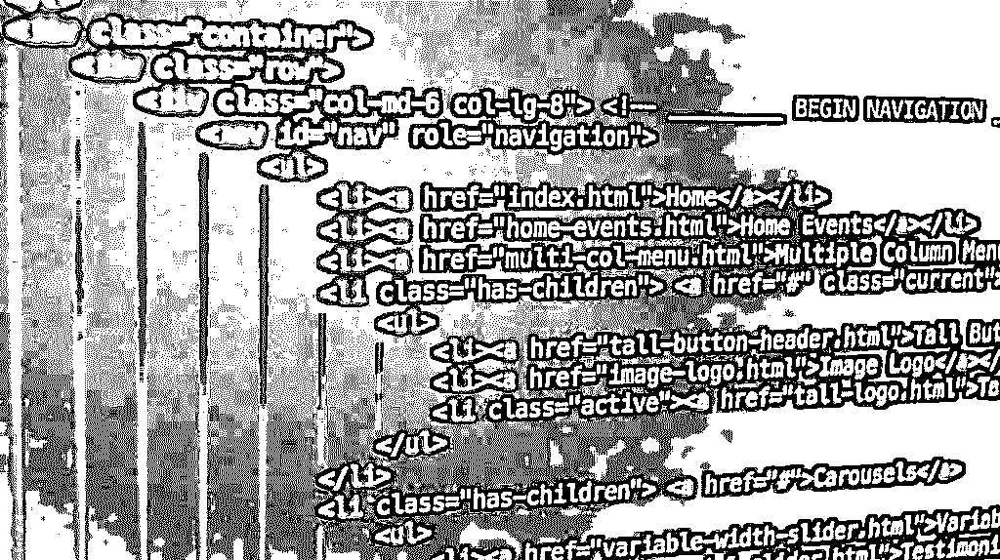

# 网页设计软件

> 原文：<https://www.educba.com/top-10-web-design-software/>

 

## 面向初学者的网页设计软件介绍

在这个时代，建立一个网站是相当容易的。你可以选择一个网站设计服务，比如 WordPress、Weebly 或其他网站，注册，选择你的模板，然后在一天之内建立并运行你的网站。这还不算连续几个小时坐着写代码。

<address> </address>

<address>Image source: pixabay.com</address>

以下是你能找到的最好的，排名不分先后:

<small>网页开发、编程语言、软件测试&其他</small>

### 面向初学者的网页设计软件

以下是一些适合初学者的网页设计软件。

1.  WebEasy 专业版

这款由美国 Avanquest 软件公司为初学者开发的最好的[网页设计](https://www.educba.com/web-design-trends/ "10 Web Design Trends for 2016")软件，据其创建者称，是一个完整的网页设计工作室。虽然它没有提供证明这个标签的正确性所需的所有特性和功能，但是它已经相当全面了。你可以在一个包里买到很多工具，而且价格非常合理。

WebEasy Professional 也是，顾名思义，简单。当然这里面涉及到一个学习曲线，但并不像现在市面上大多数其他专业的网页设计初学者软件那么难掌握。

更重要的是，你可以发展或提高你的编码技能，尤其是 Javascript 和 HTML。当你想脱离这类新手网页设计软件的范畴，去编写自己的网站时，这些都可以提供帮助。

你必须从一系列的模板中选择，但是有很多可供选择，你也可以得到更多的定制选项。事实上，您可能会使用该套件的许多拖放功能。

使用 WebEasy 还可以让您创建和托管播客、视频等。这意味着你和公众之间有更多的交流渠道。

WebEasy 还通过将主要的社交媒体网站直接整合到您自己的网站中来处理社交媒体营销。被覆盖的网站包括脸书、Picasa、Flickr、Twitter，甚至谷歌地图。

2.  #### 衬线 WebPlus X8

这个来自 Serif 的网页设计软件初学者工具也是新手中的热门选择。像 WebEasy 一样，WebPlus X8 易于使用，但也让你有机会增加或完善你的网页设计技能。你可以选择从头开始，自己编写网站代码，也可以选择一个模板并开始使用。

即使没有 HTML 的知识也很容易使用。你所需要做的就是将元素拖放到你想要的地方。

照片实验室工具也可用于编辑图像，因此您不必担心使用其他服务提供商或网站设计软件来编辑照片。该工具有一个简洁的功能，可以向您显示编辑后的图像预览，并与原始图像进行实时比较。

设置布局和添加导航元素也非常简单，因为您可以直接将图像、文本和 flash 元素拖放到页面上。您可以从一系列基本预设图形和形状中进行选择，也可以使用 Button Studio 选项制作自己的图形和形状。

WebPlus X8 还附带了许多电子商务和搜索引擎优化工具，以及六个月的免费虚拟主机服务。

3.  #### 衬线 WebPlus X8

由 MAGIX 开发，价格比 WebEasy 低一点，这款专为初学者设计的网页设计软件更侧重于网站设计过程中的额外工作。

它有一个很棒的照片编辑工具和可定制的图形，但它不像其他网页设计软件初学者程序那样简单易用。事实上，这种特殊的网页设计软件套件更适合像中级和高级网站设计师。

这里的商店有很多很棒的功能，但是初学者可能会发现要找到所有的功能有点困难。不像列表中的其他网页设计工具，它也没有清晰的设置向导。

尽管如此，Xara 并没有看起来那么糟糕。您拥有拖放功能，可以快速轻松地从主设计界面添加元素。可供选择的模板非常好，您也可以使用基于颜色的搜索来浏览它们。

图像和图形是完全可定制的。你可以制作自己的矢量图形，或者使用网页设计软件的照片编辑工具添加和编辑你的照片。

您甚至可以将一系列小部件添加到网站上，高级版允许定制动画图像和文本。

4.  #### Website X5 Evolution 11 【T1]

[WebSite X5](https://www.websitex5.com/en/ "WebSite X5")Evolution by Incomedia 是一款网页设计软件解决方案，让你在没有任何编码知识的情况下制作一个基本的网站。整个包都是可下载的，设置简单明了。

您可以选择将原始代码拖放到设计模板上。该模板的工作方式类似于网格，允许您将对象放置在适当的位置，并移向编辑屏幕以预览页面的外观。您可以放置空白空间来添加图像、视频、文本、按钮和其他非文本元素。

你可以从许多可以定制的模板中进行选择，但这些模板不如你在其他竞争对手的网页设计工具中找到的好，而且结构也相当有限。

[搜索引擎优化](https://www.educba.com/search-engine-optimization-seo-basics/ "Search Engine Optimization Basics")选项也很有限，只有一个网站地图构建选项和优化搜索引擎可见性的最佳实践代码。

电子商务优化也是如此。如果你想开一个网上商店，你可能会发现自己缺乏很多选择这个特殊的工具。

你确实有这个功能，但它最有可能吸引小型 web 开发企业和那些计划从在线预订或预约中获取收入的人。

5.  #### Network Object Fusion 2015 【T1]

来自 [NetObjects](http://netobjects.com/ "NetObjects") 的 Fusion 2015 对初学者和高级用户都有很大的吸引力。初学者可以不费吹灰之力地创建自己风格的网站，从绘制网站到页面编辑。

像大多数其他网页设计软件初学者工具一样，Fusion 2015 的工作方式几乎相同。你安装程序，选择一个模板，并开始定制它，以得到正确的。

编码不是使用该技能的必备技能，但懂代码的人还是可以编辑代码的。然而，与其他选项相比，编辑过程可能会受到限制，而且相当棘手。

这个网页设计软件中可供初学者使用的预置模板应该足够满足很多口味，但绝对不是这个榜单上最好的。当然，您可以选择定制模板，使其独一无二。

Fusion 还有一个名为 CloudBurst 的应用程序，可以让你从银行选择网站模板、照片和图像，其中许多是付费的。你也有一系列的模板来为移动设备制作响应性网站。

Fusion 也没有比之前版本更好的搜索引擎功能。一个很大的变化是增加了描述性网址，使网站更容易被搜索引擎看到。

Fusion 中值得注意的一个特性是它的 NetObjects 安全技术，它是一个很好的备份特性。网站文件会以模板形式自动备份到外部或网络驱动器，这样您就不会丢失您设计的作品。

但是，请记住，Fusion 不附带主机、电子邮件地址或网址选项。你需要找到一个服务器，让你自己的网站发布。

总的来说，Fusion 缺乏其他网页设计软件初学者包中的用户友好性，但却是为小型企业或家庭制作简单网站的好选择。

6.  #### Adobe Dreamweaver CC

Adobe 的 Dreamweaver 一直是并且仍然是网站设计的强大工具。CC 版本提供了完整的 HTML 5 功能和移动设备友好的网站，鉴于移动互联网使用的增长，这是一个受欢迎的选择。

Dreamweaver 主要将自己定位为专业人士的工具，但是，对于初学者来说，使用起来可能有点困难。

Dreamweaver 是为设计者开发的，因此编码和样式表是关键的焦点。与上面讨论的工具不同，这里不涉及简单的拖放功能。

然而，有一些模板是可用的，jQuery Mobile 模板对于从头开始创建一个移动设备友好的网站特别有用。

CC 版本还带有一个实时视图模式，当你创建网站时，它可以让你在不同的移动设备上近似地看到你的网站。虽然不是 100%准确，但这种模式在帮助您可视化所做的更改方面非常有用。

总的来说，如果你对网页设计一无所知，Dreamweaver 并不是一个可供初学者选择的网页设计软件。对于不能区分代码行的完全初学者来说，这是令人困惑的，也不是那么有用。

然而，对于那些有相关知识的人来说，这款面向初学者的网页设计软件提供了流畅、令人满意和全面的网页设计体验。

7.  #### Expressway Express

由 Softpress Systems 设计的, [Freeway Express](https://www.softpress.com/ "Freeway Express") 是一个非常棒的初学者工具，其设计和界面简单而有吸引力，物有所值。它也只适用于 Mac 系统。

尽管是苹果独有的，但 Freeway Express 适用于各个层次的网页设计。您可以使用可用的布局工具创建一个完全原创的站点，然后拖放文本、图像和其他内容。然后，您可以编辑内容，只需单击“发布”选项，即可自动添加代码并准备发布。

你可以从网页设计软件初学者包内的几个模板中进行选择调整和编辑，或者你也可以自己从头开始。如果你选择后者，如果你已经对网站的布局有了一个大致的概念，那就更好了。

现在，Freeway Express 不像列表中的其他网页设计软件初学者工具那样加载功能。它简单而直观，并且提供了创建自动化幻灯片和图片库的选项。你也可以上传谷歌地图，添加脸书和 Twitter 按钮，或者整合亚马逊分支机构或谷歌广告。

该网站提供搜索引擎优化功能，但完全没有电子商务功能。

8.  #### RapidWeaver 6

RapidWeaver 是一款直观、时尚的网页设计软件解决方案，可以让您快速建立自己的网站。但是它也有一些警告。首先，它缺少列表中许多其他网站设计软件中为初学者提供的功能。其次，它可以比舒适量高一点。

抛开缺点不谈，毫无疑问 Rapidweaver 是一款制作精良的网页设计软件初学者工具。它看起来和界面都很复杂。它不只是所有的外观和没有功能。

Rapidweaver 确实可以让您快速创建站点结构，并从各种页面类型中进行选择，如联系表单、照片库和博客。

Rapidweaver 的主题范围有时会让人觉得过时，尽管有一些很棒的现代主题支持响应式设计，这是当今网站的当务之急。

这些主题还为多种屏幕尺寸和设备提供了独特的版本。然而，响应式解决方案也有不好的一面:你不能像定制其他主题那样定制网站布局和主题。

9.  #### Visual Website Designer of Coffee Cup

这个特殊的网页设计工具的名字泄露了它的简单性。对于一个初学者来说，在没有任何经验的情况下，下载并安装网页设计软件，从零开始建立一个网站是很容易的。然而，它似乎大多仅限于基本用户，缺乏额外的功能。

这个工具完全是所见即所得的，你不需要以任何方式修改或编辑代码。从十个主题中选择一个开始这个过程，然后继续前进。您也可以在线付费下载更多主题。

选择主题后，您可以简单地移动元素或添加更多元素。

Coffeecup 没有计划或预览模式，这使得在没有网站地图程序的情况下导航有点困难。凭借基本的搜索引擎优化和零电子商务能力，这几乎只是一个基本的网站设计工具，但它非常值得的价格。

10.  #### Macaw

Macaw 是一款专为网页设计师设计的网页设计工具，它可以让你无需编码就能创建出有针对性的网页设计。使用起来感觉很熟悉，很直观，也很容易掌握。在几个小时内，您会发现自己正在创建自己的响应式模板。

该工具还带有布局调整选项，并实时预览这些选项，以查看实际的变化情况。

### 结论

不过要小心；你最终得到的是一个缺乏个性的网站。这在大多数情况下不是大问题。您甚至可以通过更改可用的设置来赋予网站模板您自己的风格。

但最终还是可以鉴别出你的网站是使用了快捷简单的网站模板，还是从头开始搭建的。

如果这是一个原创性很重要的案例，那么你需要把手弄脏并开始构建代码。但是不要担心，因为当你拥有合适的工具时，即使是编码和构建你自己的个性化网站也变得更加容易。

### 推荐文章

这是给初学者的网页设计软件指南。这里我们分别讨论了对初学者最有用的 10 个网页设计软件的基本概念。您也可以看看以下文章，了解更多信息–

1.  [网页设计工具](https://www.educba.com/web-designing-tools/)
2.  [UX 设计师 vs 产品设计师](https://www.educba.com/indesign-invoice-template/)
3.  [有效网页设计师作品集的特点](https://www.educba.com/10-features-of-effective-web-designer-portfolio/)
4.  [软件维护类型](https://www.educba.com/software-maintenance-types/)

