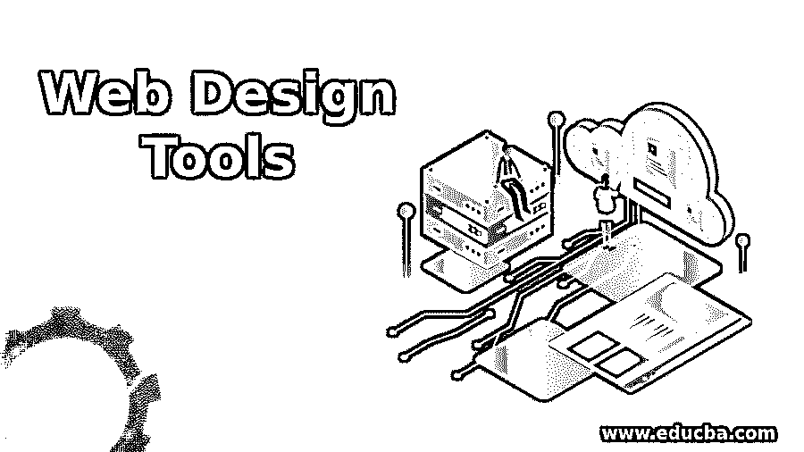

# 网页设计工具

> 原文：<https://www.educba.com/web-design-tools/>

## 网页设计工具介绍

每一个网页设计工具都有比看上去更重要的东西。你一定花了几个小时在网上浏览不同的网站，了解网页设计工具的一些明显趋势。

网络，恰如其名的万维网，已经逐渐成为一个丰富多彩、引人注目的虚拟世界。创造力正在展开它的翅膀，网页设计工具变得越来越好，越来越独特。

<small>网页开发、编程语言、软件测试&其他</small>

web 的快速响应和 W3C 规范的进步已经开启了数字 web 设计工具的新时代。几年前，内容是网站的主宰。

但是，今天，创造性的网页设计工具已经占据了同样重要的位置，并且是获得和保持收视率的重要因素。

因此，对于那些从未想过网页设计工具会如此强大的人来说，这比以往任何时候都有可能。让我给你带来 20 个最酷的网页设计工具，你一定要看看。

这些将是令人兴奋的检查，可能会给你的下一个项目或任务带来另一个超级棒的想法。所以只要向下滚动，享受吧！

### 创意网页设计工具的来源

你也可以添加到你的网站上的创意网页设计工具的最佳来源列表。

#### 1.快速响应

响应式网页设计工具已经成为这个时代的新规范。随着越来越多的网站开始响应，这已经形成了一种新的趋势，响应式网站已经成为一种新的网页设计风格，特别是 WordPress。

响应式，顾名思义，链接到创建一个网站的概念，以帮助[根据浏览器或屏幕的分辨率改变布局](https://www.educba.com/website-design-layout/ "How to Design a Website Layout")。

根据分辨率，它可以适应笔记本电脑、平板电脑，甚至移动手机。如果你想要确切的术语，那么它允许一个先进的 1292 像素宽，4 列布局自动适应 1025 像素宽屏上的 2 列。

#### 2.滚动变得更长了

随着屏幕变小，滚动时间变长。这被视为一种新的趋势，大多数网站都认识到较长卷轴的价值。

滚动时间更长的一个主要原因是网络反应更快。随着越来越多的人使用手机浏览，长滚动网站变得越来越重要，因为它在移动流量大的情况下很少更新内容。

虽然长时间滚动通常出现在网站的主页上，但设计师们现在也在“关于我们”和“服务”页面上尝试这种方式。

这种一页的概念给了网站更多的创作自由、更好的故事、更好的交互和简单的导航，创造了奇迹。

#### 3.网格图案布局网页设计工具

当你有一个巨大的内容库放在你的网站上时，以网格的形式排列它，网格模式不需要完全对称。

你只需要对你的内容进行优先排序，然后形成不同大小的块来展示它。它创造了奇迹！如果你是一个社交媒体爱好者，你对网格网页设计工具的第一次主流接触可能是在 Pinterest 上，或者现在甚至是在 T2 脸书网站上，这些网站有分散的时间表更新，让你对网格网页设计工具有所了解。

尽管 Twitter 或 T2 Tumblr 上的社交新闻订阅一直是精简的，但这不是任何旧网站都可以强制推行的。网格布局总是将所有内容压缩成易读的格式，易于理解并改善用户体验。

#### 4.丰富的动画

动画是最好的方式来讲述一个网站的一切，而不必写关于它的任何东西。这是向客户讲述一个故事并增强其互动体验的最佳方式。

加载动画、运动动画、背景图像/视频等技术被运用得最为生动。“Coursera”infinity 符号是一个非常有趣的加载动画，而许多在线购物网站上的运动动画一定会吸引你的眼球。

动画主要分为两种类型——大规模动画(主要的交互工具)和小规模动画(包括微调器、悬停工具和加载栏)。

#### 5.微观互动

微互动会一直存在，因为它有能力增加任何网站的 UX。用户的情感投入和他/她在网站上花费的时间取决于网站的交互性和用户友好性。

这有助于为你的访客创造一个难忘的经历。你在网站上点击的所有按钮都是微交互。从点击所有链接到在脸书上发布更新并喜欢上一个，一切都涉及用户与网站的分钟互动，一次互动导致下一次互动。

#### 6.住宅区背景

网站的背景是其最吸引人的特色之一。随着大量 3D 电影的上映，大型图像背景的时代已经一去不复返了。

设计师必须学会如何混合三维图形的复杂性，并形成丰富的动态背景。在未来几年，可以期待一个完全互动的高清质量的视频背景。

尽管这些网页设计应用看起来很简单，但它在吸引用户注意力方面非常有效。这个网页设计应用程序主要致力于给你的网站一种复古的感觉。使用一整张图片作为醒目的背景，只需选择单色！

#### 7.简单设计网页设计工具

设计有一个经验法则，当一个网页设计程序没有显示任何非必要的元素时，它就是完美的。随着我们对 UX 和用户界面的改进，你会看到更多基于这种模式设计的网站。

设计师们已经将这一想法付诸实践，因为网站通过移除所有不想要和不需要的元素来寻求简化网页设计应用的方法。这可以通过移除大的背景图像或大的背景标题来迎接访问者。

这种设计的网站远离大量图片和色彩丰富的网站。它会给眼睛带来舒缓的效果，肯定会吸引你的注意力。

#### 8.高质量的摄影

如今，高质量的定制专业摄影已经取代了新网站的库存图片。这种设计网站的新趋势赋予了网站独特性和新鲜感。

在网站的标题上使用定制的图片很好地展示了这一趋势。如果你的预算有限，那么使用专业图片和库存图片的组合也可以使你的网站看起来与其他类似的网站不同。

#### 9.一个设计变得平淡无奇

没有提到使用平面 UI 元素的趋势，关于网页设计应用趋势的讨论是不完整的。但是，如果你分析一下这种趋势，你可能会发现这些平面网页设计应用正在融入到材料设计中。

正如谷歌公布的，材料设计是一个平面网页设计过程，使用非常微妙的梯度，软动画和分层来保留物理世界的感觉，同时仍然实现平面设计的所有好处。

CSS3 允许设计者用自然的方框阴影、文本阴影或圆角来生成更扁平的按钮。这种平面的 UI 模式已经超越并变成了表单输入，甚至是导航菜单。

#### 10.UX 网页设计工具的个性化

使用 cookies 显示相关内容以使访问者重访网站是一个古老的概念。但是，这种通常被认为是垃圾邮件的做法，通过更高级的设计和更好的实践，使访问者重新访问你的网站，获得了非常好的回报。

网飞和 Youtube 用这个来记住最近观看的项目。它可以用在一个编辑网站上，创建一个“最近阅读”的侧边栏小部件。

这可以让您快速访问您最近阅读或评论的文章。通过使用这种技术的插件，WordPress 社区在未来几天将会发生一场革命。

#### 11.滑出/飞出菜单

智能手机和电视的使用与日俱增，因此，确保用户在所有可用频道上使用网站时获得无缝体验变得非常重要。

久而久之说，一个响应性网站的想法将会继续发展和繁荣。随着这一进展，你可以看到一个像菜单一样为所有浏览器设计的应用程序。

在弹出菜单中，你可以在页面的左侧或右侧找到一个垂直菜单，它看起来更像是从 web 应用程序或较小的视窗中继承来的弹出菜单。

#### 12.主菜单被隐藏

随着网络的响应，隐藏主菜单的技术也开始被沿用。设计师隐藏了主菜单，只有当访问者点击适当的按钮并准备前进时，主菜单才变得可见。

在过去的几年里，这种技术被广泛应用于移动应用或网络应用，但是现在你可以更频繁地遇到这种网页设计过程。

#### 13.SVG 万岁

SVG 成为 2014 年的讨论话题。这个特殊的工具使您的资产看起来清晰，并确保它适应屏幕大小。此外，SVG 元素可以制作成动画，使您的网站栩栩如生。

#### 14.向内滚动和向外点击

在这个智能设备的时代，滚动对用户来说并不新鲜。事实上，滚动比点击更受欢迎。这有助于用户在第一页上获得网站内容的要点。主页需要更长的时间来确保动态交互。

#### 15.卡片布局

我们很多人都遇到过用矩形框描述各种功能的网站，大多像 Windows 8.1 的开始屏幕。每张卡片描述一个概念，用户只需点击一张卡片。

在当今这个高度科技化的世界，你的整个目标客户群很有可能都在网上。相信我，没有比超级创意网站更能吸引人眼球的了。

一个优秀的网站不仅要有好的内容，还要有吸引人的界面。随着我们习惯和欲望的改变，技术也在改变，因此也改变了网页设计过程。

在现代网络世界中，一个反应灵敏的网页设计过程是一个必须具备的特征。如今的网站变得高度对话化，媒体内容丰富。

我希望你尝试这些网页设计过程，让你的网站看起来很棒！🙂

### 推荐文章

这是一个关于网页设计工具的指南，这些工具不仅仅是看上去那么简单。你一定在网上花了很多时间来学习网页设计工具和想法。以下是与网页设计工具相关的外部链接。

1.  [网页设计职业](https://www.educba.com/career-in-web-designing/)
2.  [网页设计面试问题](https://www.educba.com/web-design-interview-questions/)
3.  [网页设计与开发](https://www.educba.com/web-design-and-development/)
4.  [用 HTML 设计网页](https://www.educba.com/design-web-page-in-html/)

