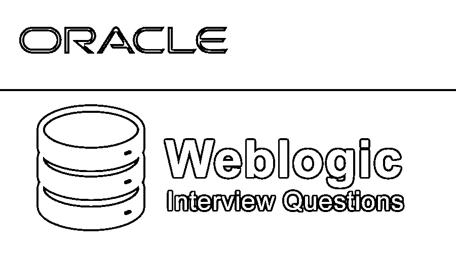

# Weblogic 面试问题

> 原文：<https://www.educba.com/weblogic-interview-questions/>

## Weblogic 面试问答介绍

Weblogic 是由 Oracle 公司开发的符合 Java EE 规范的应用服务器，因此被称为 Oracle Weblogic Server。Oracle Weblogic Server 最初由 BEA systems 开发，后来被 Oracle 收购，并由 Oracle 维护。它被授予专有许可证。它纯粹是用 Java 编程语言编写的。其最近的稳定版于 2017 年 8 月发布。Oracle Weblogic server 属于 Oracle 融合中间件产品的融合中间件包。它支持不同的数据库服务器，如 Oracle、MS SQL Server、IBM DB2 Server、MySQL、PostgreSQL 等。Oracle Weblogic Server 支持作为应用程序服务器一部分的不同组件，如 JDBC 池配置、JNDI 配置、JMS 消息传递标准等。

现在，如果你正在寻找一份与 Weblogic 相关的工作，那么你需要准备 2022 年的 Weblogic 面试问题。的确，每个面试都因不同的职位而不同。在这里，我们准备了重要的 Weblogic 面试问答，帮助你在面试中获得成功。

<small>网页开发、编程语言、软件测试&其他</small>

在这篇 2022 年的 Weblogic 面试问题文章中，我们将介绍 10 个最重要和最常用的 Weblogic 面试问题。这些面试问题分为以下两部分:

### 第 1 部分 Weblogic 面试问题(基础)

这第一部分包括基本的面试问题和答案。

#### Q1。什么是 Weblogic Server，并解释其架构？

**答**:
Weblogic Server 是一种符合 Oracle 公司开发的 Java EE 标准的应用服务器。它具有不同的特性和功能，支持 Java 企业应用程序以及一些基础设施应用程序的部署和维护。它提供了具有丰富特性的客户端选项，如具有 RMI 的 Java 客户端、SOAP 客户端或任何 SOAP web 服务平台、具有灵活选项的 web 服务、电子商务中的企业可伸缩性、安全性和许多其他消息服务。它的架构中有不同的软件组件层。它是多层体系结构，包含客户层、中间层和后端层。客户端层可以是任何基于 web 的浏览器、移动设备或任何其他 Java 或 GUI 客户端。中间层是 Weblogic server，后端层包含不同的应用程序或数据库。

#### Q2。Weblogic Server 有哪些不同的应用层？

**回答**:
Weblogic Server 有表示层、业务层、服务层等不同的应用层。Weblogic Server 中不同类型的应用层如下

1.  **表示层:**表示层包含服务器容器或任何 web 应用程序容器，它们将使用 Servlet、JSP 或 HTML 格式等技术呈现网页内容。
2.  **业务层**:这个业务层包含容器，这些容器将保存业务逻辑以及任何会话 bean 或实体 bean。这可能还包含一个名为实体 Java Beans 的 EJB，它是 Java EE 规范的一部分。
3.  **服务层:**该服务层包含服务及其实现，它将提供作为端点的业务逻辑功能和消息服务，如 JMS、JNDI、JDBC 或任何其他协议，如 HTTP RMI 或 SSL。

#### Q3。什么是 Weblogic 集群中的多播？

**回答**:
Weblogic 集群中的组播过程定义为处理不同 IP 套接字之间的消息通信过程。它建立了对等通信。

#### Q4。Weblogic Server 中的集群是什么？

**回答** :
这是面试中常见的 Weblogic 面试问题。集群是建立多个服务器实例的过程，以使它们协同工作，从而为应用程序用户数量较多的大型复杂应用程序提高效率并产生更大的可伸缩性。

#### Q5。Weblogic Server 中使用了哪些不同的网络协议？

**回答**:
Weblogic Server 中用于通信的不同网络协议如下:

1.  SOAP 是一种简单的对象访问协议，它是一种在 web 服务中使用的消息格式，作为 web 服务标准的协议进行访问。
2.  **HTTP**–超文本传输协议用于网络通信标准。
3.  HTTP–这是一种 HTTP 的安全形式，在安全套接字层上的网络浏览器中使用。
4.  **IIOP**–互联网 ORB 间协议，用于 CORBA 客户端建立与 Weblogic Server 的连接。
5.  这是一种安全形式的 IIOP 协议。
6.  RMI–它被称为远程方法调用，用于在分布式环境中应用程序的情况下建立连接。
7.  **T3**–这是一个 Weblogic 协议，用于通过多个网络连接在 Java 应用程序之间建立连接。
8.  **T3S**–它是一种安全形式的 Weblogic 协议。

### 第 2 部分 Weblogic 面试问题(高级)

现在让我们来看看高级面试的问题和答案。

#### Q6。Weblogic Server 中的域是什么？

**回答**:
Weblogic Server 中的域被定义为来自 Weblogic Server 的一组资源，其中包含不同的实例或服务器类型，如管理服务器，所有的资源都通过使用该组以域的名义进行管理。所有受管服务器都可以放入或分组到一个域中进行管理。一个域可以处理单个或多个服务器安装。

#### Q7。Weblogic Server 中的托管服务器是什么？

**答**:
Weblogic Server 中的托管服务器定义为 Weblogic Server 的一个实例，用于管理开发者部署的 web 应用。这些应用程序可以是任何类型的，例如 Web 应用程序、Web 服务、EJB 应用程序或 JMS 应用程序。每台托管服务器都有自己的配置。所有 Java 组件都可以部署到这个托管服务器中。

#### Q8。Weblogic server 有哪些不同的安装模式？

**回答**:
Weblogic Server 的不同安装模式有静默、图形化和控制台模式。静默模式基于配置文件，而不是安装过程中的手动干预。图形模式是一种在安装过程中与用户进行交互的 GUI 模式，而控制台模式是一种类似于基于命令的交互模式。

#### Q9。Weblogic server 中的 JVM 调优是什么？

**回答** :
这是 Weblogic 面试中问得最多的问题。JVM 调整是通过配置或更改服务器中的一些参数(如堆大小、垃圾收集等)来增强 Weblogic server 中 JVM 执行引擎性能的过程。

#### Q10。Weblogic server 中的节点管理器是什么？

**答** :
节点管理器是一个独立于 Weblogic server 运行的独立进程，用于除行政管理任务之外的被管任务指定任务的操作。

### 推荐文章

这是 Weblogic 面试问题和答案列表的指南，以便候选人可以轻松解决这些面试问题。在本帖中，我们研究了常见的 Weblogic 面试问题，这些问题在面试中经常被问到。您也可以阅读以下文章，了解更多信息——

1.  [PLSQL 面试问题](https://www.educba.com/plsql-interview-questions/)
2.  [Python 面试问题](https://www.educba.com/python-interview-questions/)
3.  [PowerShell 面试问题](https://www.educba.com/powershell-interview-questions/)
4.  [WebLogic vs JBoss](https://www.educba.com/weblogic-vs-jboss/)

