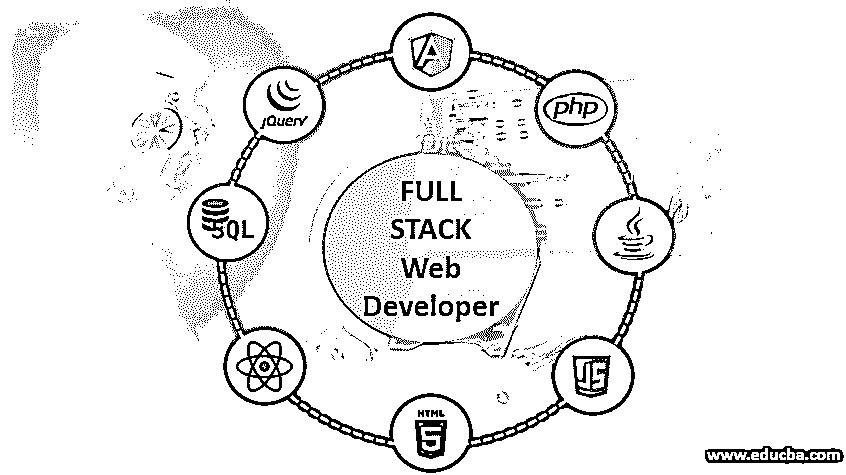

# 全栈 Web 开发人员

> 原文：<https://www.educba.com/full-stack-web-developer/>

## 什么是全栈 Web 开发者？

全栈式 web 开发人员是开发专家，既做应用程序的前端开发，也做后端开发。他们可以同时开发服务器和客户端软件。全栈式 web 开发人员必须了解三层模型的所有层。

### 三层模型的层次

三层模型包括以下内容:

<small>网页开发、编程语言、软件测试&其他</small>

#### 1.表示层

它包括处理用户界面的前端开发。例如，编写一个包含 HTML、CSS、JavaScript、Angular、jQuery、Vue 等技能的网络浏览器。

#### 2.业务逻辑层

它包括处理数据验证的后端开发。比如编程一个服务器，涉及到 Python、Java、Ruby、ASP、Node、PHP 等技能。

#### 3.数据库层

它由数据存储部分组成。例如，对一个数据库进行编程，该数据库涉及 SQLite、SQL、 [MySQL 等工具和 MongoDB、CouchDB 等 NoSQL 数据库](https://www.educba.com/mysql-vs-nosql/)。

全栈 web 开发人员不需要对所有这些技术有深入的了解。但是开发人员应该能够正确理解服务器和客户端上发生的事情，并且应该能够理解应用程序开发的整个过程。开发者应该对开发中涉及的技术有浓厚的兴趣。

### 前端 Web 开发

*   一个全栈的 web 开发者应该在前端技术方面有适当的经验。
*   必要的前端技术包括 JavaScript、CSS3、HTML5。
*   JavaScript 等脚本语言的知识有助于操纵浏览器中的信息，使其更加有效和吸引人。
*   理想的前端技术包括一些第三方库，如 React JS、Angular、LESS、jQuery 等。
*   前端涉及网站的用户界面。它包括在您个人电脑的浏览器或移动设备的浏览器中呈现网站信息。
*   一个[前端 web 开发者](https://www.educba.com/what-is-front-end-developer/)的目标应该是为用户提供一个信息交互平台。
*   创意前端开发人员还使用 Adobe Illustrator 和 Adobe Photoshop 等网页设计应用程序，通过主题布局和图形使网页更具吸引力。
*   一个前端 web 开发者还应该具备用户界面设计、用户体验设计等附加技能，以更好的方式进行收集和展示。

### 后端 Web 开发

*   后端 web 开发涉及各种过程，如创建、更新和重新收集数据。
*   后端开发技术涉及 Ruby、Python、PHP 等脚本语言。
*   这些语言帮助后端开发人员创建业务逻辑和算法，进一步帮助操作从前端开发收集的数据。
*   [后端开发者](https://www.educba.com/what-is-back-end-developer/)编写代码，从前端用户那里收集数据，然后存储在一些类似数据库的存储设施中。
*   数据库基本上有两种类型。它们是关系数据库，包括 SQL、MySQL、PostgreSQL 等。以及非关系数据库，[包括 NoSQL 数据库](https://www.educba.com/what-is-nosql-database/)如 MongoDB、CouchDB 等。
*   开发人员使用结构化查询语言(通常称为 SQL)与数据库进行交互，这有助于开发人员有效地管理数据库。
*   服务器管理是后端开发的主要组成部分之一。
*   服务器管理包括托管数据库、提供网站服务等。
*   目前，市场上有许多云服务提供商[像亚马逊网络服务或 AWS、谷歌云平台或 GCP、微软 Azure 等。，有助于更有效地管理服务器，降低成本。](https://www.educba.com/cloud-computing-service-providers/)
*   一个网站的可扩展性可以由适当的服务器管理来决定。而速度较慢的应用程序也能有效地排除故障。

### 成为全栈 Web 开发人员的技能

要成为一名优秀的全栈 web 开发人员，开发人员需要有相当丰富的行业经验。对于一名优秀的全栈 web 开发人员来说，前端、后端技术和数据库管理方面的全面知识和经验非常重要。一个全栈的 web 开发人员应该能够容易地访问和交流关于网站的表现和有效的数据操作的细节。

根据不同的类别，下面提到了成为全栈 web 开发人员的技能:

#### 1.前端开发技术

前端开发技术包括 CSS，HTML，Bootstrap，JavaScript，W3。CSS、ES5、JSON、HTML DOM、XML、Angular、jQuery、React、Express.js、Backbone.js、Ember.js、Redux、GraphQL、Storybook、Grunt、Meteor.js、Gulp 等。

#### 2.后端开发技术

后端开发技术包括 ASP，PHP，C++，Java，C#，Python，Node.js，Go，Ruby，REST，关系数据库像 SQL，MySQL 等。非关系数据库如 MongoDB、CouchDB 等。、萨斯、Firebase.com、Less、PaaS，其中包括 Heroku 和 Azure、Parse.com、Redis、Memcached、Varnish 等。仅仅拥有上述技能的知识并不能让你成为一名优秀的全栈 web 开发人员。要成为一名优秀的全栈 web 开发者，需要不断学习[新技术](https://www.educba.com/new-technologies-of-computer/)不断学习。您必须在前端和后端技术方面有适当的经验。

### 全栈 Web Developer 的优势

*   一个全栈的 web 开发者应该在前端和后端技术上都有精深的知识，让开发者根据需求的变化在服务器和客户端之间轻松切换。
*   他们不会损害项目的质量。
*   他们将不断更新最新的技术，这有助于他们了解最新技术的所有方面。
*   他们还可以处理编码和 UI 设计。
*   他们对组织分配给他们的项目承担全部责任。
*   他们非常经济高效，因为他们了解前端和后端技术。这进一步有助于大大降低项目成本。
*   他们按时、快速地交付项目，并提供理想、有效的结果。
*   他们可以更轻松地维护和更新应用程序，因为它们是用最新技术更新的。
*   他们能够掌握项目开发的完整技术。
*   他们可以快速制作原型。
*   所有团队成员都可以向全栈开发人员寻求帮助。
*   团队沟通时间可以大大减少。

### 结论

全栈 web 开发人员比普通的应用程序开发人员更有优势，因为他们对各种技术有着全面而广泛的了解。由于这个原因，全栈开发人员比普通应用程序开发人员更受组织青睐，因为他们可以同时处理服务器端和客户端开发。

### 推荐文章

这是一个全栈 Web 开发人员指南。这里我们讨论三层模型的不同层及其技巧和优点。您也可以浏览我们推荐的其他文章，了解更多信息——

1.  [Web 开发人员 vs Web 测试人员](https://www.educba.com/web-developer-vs-web-tester/)
2.  [Android 开发者 vs Web 开发者](https://www.educba.com/android-developer-vs-web-developer/)
3.  [什么是 SQL Developer？](https://www.educba.com/what-is-sql-developer/)
4.  [网络技术面试问题](https://www.educba.com/web-technology-interview-questions/)

