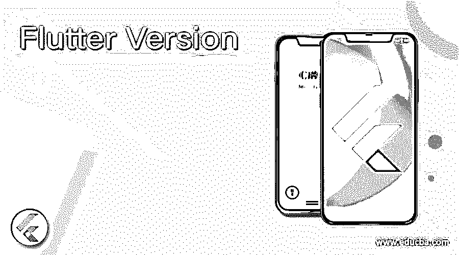

# 颤动版本

> 原文：<https://www.educba.com/flutter-version/>

## 颤振版本的定义

Flutter 是一个基于 UI 的应用程序，用于从单个代码库创建干净、漂亮、本地编译的应用程序。Flutter 开发的应用程序可以是移动(iOS 和 Android)应用程序、web 应用程序和基于桌面的应用程序。它是免费和开源的，被许多组织广泛使用。Dart 是一种用于创建 Flutter 应用程序的语言。Flutter 的第一个也是最重要的版本被命名为“Sky ”,它只适用于 Android 应用程序。它于 2018 年 12 月 4 日发布，随着时间的推移不断发展，在如此短的时间内发布了许多新版本。

### 颤动版本

在 2018 年 12 月首次发布之前，它于 2015 年在 Dart submit 上亮相，目的是能够每秒渲染 120 帧。因为它的第一个版本只能在 Android 设备上运行。它是用 C、C++和 Dart 语言编写的。Flutter 的第一个正式版本于 2018 年 12 月 4 日发布。在两年多的时间里，开发人员发布了许多版本，解决了以前版本的主要缺陷，并包含了一些新功能，简化了最终用户的使用。让我们了解各种版本以及每个版本中的重要变化/新功能:

<small>网页开发、编程语言、软件测试&其他</small>

#### 1.颤动 1.0

Flatter 的第一个稳定版本在测试版发布 9 个月后，于 2018 年 12 月 4 日在 Flutter Live 活动上发布。Flutter 第一版的一些特性是:

*   谷歌地图和 WebView 功能在此版本中可用。
*   现阶段的 Flutter 只能在移动设备上运行。
*   Dart 2.1 在 Flatter 1.0 发布之前就已经出现了，Flatter 1.0 对提高整体速度和可用性有很大帮助。
*   对于 web 来说，蜂鸟是在 Flutter 1.0 中引入的

#### 2.颤动 1.12

颤振 1.12 于 2019 年 12 月在颤振互动活动中发布。这是迄今为止最稳定的版本之一，来自 100 多个贡献者的 1900 多个拉请求被合并。以下是此版本中包含的一些重要且有趣的内容:

*   以前版本中发现的一些严重问题得到了修复。
*   测试版提供了网络支持。
*   修复了一些与破坏 API 相关的更改。
*   MacOS 支持在 dev 频道中提供。
*   工具体验得到了增强，使最终用户使用起来更容易、更具交互性。
*   Flutter 的 UI 中增加了新的小部件。
*   改进的 SDK 支持现有的 Android 和 iOS 应用程序。
*   引入了新的过程来帮助检测软件中的突破性变化。
*   新的 API 被用来调整图像缓存的大小。
*   默认情况下，为新的 Android 项目启用 AndroidX。
*   停止使用不推荐使用的功能。
*   Android 应用程序的图像流得到了改进。

#### 3.颤振 1.17

Flutter 1.17 是最具挑战性的 2020 年的第一个稳定版本。它于 2020 年 5 月 6 日发布，Dart 版本为 2.8。Flutter 的整个基础设施已经为新的发布过程进行了重组。在这个版本中修复了很多错误，从贡献者收到的 PRs 中关闭了近 800 个错误。此版本中添加了许多有趣的功能，下面提到了其中一些:

*   添加了新的网络跟踪工具功能。
*   对 metal API 的支持增强了 iOS 设备的整体性能。
*   此版本的主要改进集中在内存方面。
*   对于用户来说，应用程序的导航速度提高了 27%-30%。
*   由于主要的错误修复，整个应用程序的大小也减小了。
*   在这个版本中，整个应用程序的性能得到了改善，比如图像的滚动和重新加载。
*   在此版本中添加了名为 NavigationRail 的小部件，它提供了一个响应性应用程序导航模型。
*   易访问性是这个版本的主要关注点，包括文本字段、滚动或其他输入部件。

#### 4.颤动 1.20

继 1.17 版本之后，flutter 1.20 版本发布，为用户提供了惊艳的体验。来自世界各地的 250 多个贡献者的 3000 多个 PRs 被合并到这个版本中。下面给出了此版本中的一些重要增强功能和主要错误修复:

*   各种 UI 改进，如自动填充特性、新的鼠标光标支持、支持平移和缩放的小部件分层等都在这个版本中完成。
*   添加了针对 Visual Studio 代码的 Flutter 扩展的新更新，如果我们移动文件，这些更新将自动更新导入语句。
*   通过删除消耗内存和阻碍应用程序整体性能的不必要项目，应用程序的性能得到了提高。
*   鼠标支持在此版本中得到了改进，鼠标点击测试系统进行了重构，以提供多种优势，如更好、更准确的测试，从而提供比以前更高的性能。
*   在这个版本中，Android 和 iOS 应用程序都添加了自动填充功能。

#### 5.颤动 1.22

最新发布的支持 iOS 14 和 Android 11 的 Flutter 采用了相同的关键原则。这是在 1.20 版本发布 2 个月后推出的最短版本。在如此短的时间内，150 多个贡献者合并了 1900 多个 PRs。下面列出了此版本的一些主要变化和新引入的功能:

*   这次发布的主要焦点是 Flutter 可以很好地与 iOS14 和 Android 11 兼容，其中包括通过广泛测试套件的最新 SDK。
*   在这个版本中，对于 iOS 14，增加了对新 Xcode12、AppClip 功能等的支持。
*   在这个版本中，对于 Android 11，主要关注点是提供更流畅的动画和对新显示剪切的支持。
*   iOS 14 的字体渲染问题和应用程序崩溃在此版本中得到修复。
*   此版本提供了应用程序本地化和国际化的核心功能。
*   Android 中最重要但也是最具挑战性的应用程序“状态恢复”特性之一在此版本中推出。
*   当输入和显示频率不匹配时，平滑滚动的性能得到了改善。
*   在 1.22 版中，除了 Flutter，还包括了新版本的 Dart (2.10)，这是一个命令行界面(CLI)工具，非常有用。
*   在 IntelliJ 内部直接从 Dart DevTool 托管 Inspector 选项卡的能力已启用(在 IntelliJ 和 Dart DevTool 中保留 Inspector 的两个副本之前)。

### 结论

上面的描述清楚地解释了 Flutter 的完整版本历史，以及它如何在如此短的时间内获得公众的广泛支持。Flutter 被组织广泛使用，因为它有助于快速开发应用程序，借助可定制的小部件，通过快速发布功能和关注最终用户体验来创建具有表现力和灵活性的 UI 的原生应用程序。

### 推荐文章

这是一个指南颤振版本。这里我们详细讨论颤振版本及其版本的定义。您也可以浏览我们推荐的其他文章，了解更多信息——

1.  [颤振应用](https://www.educba.com/flutter-applications/)
2.  [反应自然 vs 颤动](https://www.educba.com/react-native-vs-flutter/)
3.  [什么是颤振？](https://www.educba.com/what-is-flutter/)
4.  [反应原生 vs 迅捷](https://www.educba.com/react-native-vs-swift/)

