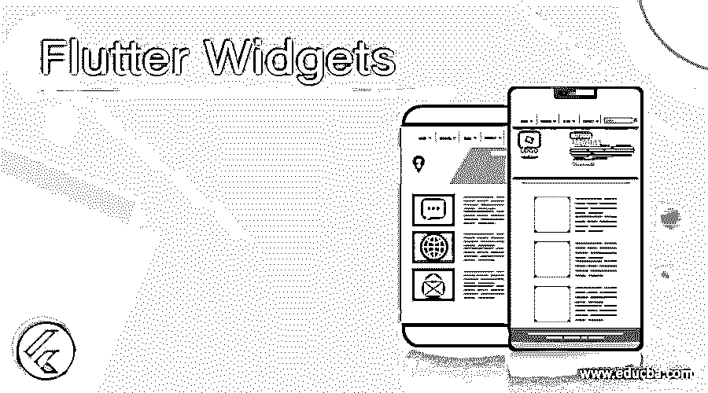

# 颤振部件

> 原文：<https://www.educba.com/flutter-widgets/>

## 颤振部件的定义

在 Flutter 中，小部件是使用现代框架构建的。使用小部件背后的基本思想是程序员可以很容易地从它们创建 UI。小部件描述了在给定的状态和配置下，应用程序的 UI 是什么样子。在 Flutter 中，使用了 runApp()函数，该函数将小部件作为小部件树中的根。小部件易于使用和理解，特别是对于新手来说，所以创建应用程序的 UI 对他们来说变得很简单。Flutter 为用户提供了一个小部件列表，用于特定的目的，如容器、文本、堆栈、脚手架、行、列、应用栏、徽标、图标等。

### Flutter 小部件列表

虽然有很多小工具。下面给出了一些重要但基本的 Flutter 小部件:

<small>网页开发、编程语言、软件测试&其他</small>

#### 1.容器

容器小部件首先添加填充来包围子部件。它基本上有助于创建一个矩形的视觉元素。然后，任何约束(如高度和宽度)都会应用到填充的子对象。可以使用 BoxDecoration 将背景、阴影、边框等应用到容器中。边距、填充和其他约束可以应用于影响其大小的容器。

下面给出了容器的构造函数的语法:

`AlignmentGeometry ali,
EdgeInsetsGeometry pad,
Color clr,
Decoration dec,
Decoration foreDec,
double width,
double ht,
BoxConstraints cons,
EdgeInsetsGeometry margin,
Matrix4 transform,
Widget child,
Clip clipBehavior: Clip.none});`

以下是容器小部件的属性:

*   边缘
*   颜色
*   儿童
*   高度和宽度
*   限制
*   填料
*   对齐
*   装饰
*   改变

#### 2.圆柱

这个小部件有助于创建灵活的布局。顾名思义，列用于以垂直格式显示子元素。它是在 Flutter 中创建 UI 时使用的最重要的小部件之一。

下面给出了在 Flutter 中使用 Column 小部件的语法:

`Column(
{Key key,
MainAxisAlignment mainAxisAlignment: MainAxisAlignment.start,
MainAxisSize mainAxisSize: MainAxisSize.max,
CrossAxisAlignment crossAxisAlignment: CrossAxisAlignment.center,
TextDirection td,
VerticalDirection verticalDirection: VerticalDirection.down,
TextBaseline textbase,
List<Widget> children: const <Widget>[]}
)`

以下是 Flutter 中 Column 小部件的属性:

*   垂直方向
*   文本直接反应
*   文本基线
*   儿童
*   剪辑行为
*   方向
*   mainAxisSize
*   交叉轴对齐
*   mainAxisAlignment

#### 3.排

像列一样，行部件也是一个非常灵活的部件，基本上用于以水平格式显示子部件。一般来说，row 小部件不会滚动，因为在 Row 的情况下，拥有比可用空间更多的子部件被认为是错误的。如果行是水平的，而横轴是垂直的，则可以使用 mainAxisAlignment 和 crossAxisAlignment 作为主轴来轻松对齐行中的内容。

下面给出的是 Row 小部件的构造函数的基本语法。

`Row(
{Key key,
MainAxisAlignment mainAxisAlignment: MainAxisAlignment.start,
MainAxisSize mainAxisSize: MainAxisSize.max,
CrossAxisAlignment crossAxisAlignment: CrossAxisAlignment.center,
TextDirection td,
VerticalDirection verticalDirection: VerticalDirection.down,
TextBaseline textBaseline: TextBaseline.alphabetic,
List<Widget> children: const <Widget>[]}
)`

下面是 Flutter 中 Row 小部件的各种属性。在 Flutter 中，行和列的属性保持不变:

*   垂直方向
*   文本直接反应
*   文本基线
*   儿童
*   剪辑行为
*   方向
*   mainAxisSize
*   交叉轴对齐
*   mainAxisAlignment

#### 4.文本

顾名思义，Flutter 中的文本小部件用于显示单行字符串。程序员可以通过将字符串分成多行来显示，也可以根据布局约束在一行中显示。如果程序员没有指定任何文本样式，默认情况下，将选择最接近的 DefaultTextStyle。

下面给出的是 Flutter 中文本构造器的基本语法:

`const Text(String data,{
Key key,
TextStyle sty,
StrutStyle strutSty,
TextAlign txtAlign,
TextDirection td,
TextOverflow over,
bool softWrap,
double textScaleFactor,
int maxLines,
String semanticsLabel,
TextWidthBasis textWidthBasis,
TextHeightBehavior txtHght
}
)`

以下是 Flutter 中文本小部件的属性:

*   键
*   现场
*   maxLines
*   数据
*   泛滥
*   maxLines
*   软件
*   文字型态
*   风格
*   文本扫描
*   文本宽度基础
*   textScaleFactor

#### 5\. Flutter Logo

flutter 的 logo 也是 widget 的形式。它尊重图标主题。基本上，Flutter Logo 的基类是 Object 类。

下面给出的是 Flutter 徽标构造函数的语法:

`FlutterLogo({
Key key,
double size,
Color textColor: const Color(0xFF757556),
FlutterLogoStyle style: FlutterLogoStyle.markOnly,
Duration duration: const Duration(milliseconds: 890),
Curve curve: Curves.fastOutSlowIn
})`

以下是程序员经常使用的 Flutter 徽标的属性:

*   键
*   大小
*   风格
*   期间
*   曲线
*   哈希码
*   textColor
*   运行时间

#### 6.图像

顾名思义，这个小部件用于指定 Flutter 应用程序中的图像。可以使用不同的构造函数以不同的方式指定图像。图像格式。jpg，。在 Flutter 中支持 jpeg，png，bmp，wbmp，webP 等。Flutter 中的图像是用 paintImage 绘制的，它指定了各个字段的含义。

下面给出了在 Flutter 中使用的基本图像构造器的语法:

`Image({
Key key, @required ImageProvider<Object> image,
ImageFrameBuilder frameBuild,
ImageLoadingBuilder loadingBuild,
ImageErrorWidgetBuilder errorBuild,
String semanticLabel,
bool excludeFromSemantics: false,
double wi,
double ht,
Color clr,
BlendMode colorBlend,
BoxFit fit,
AlignmentGeometry alignment: Alignment.center,
ImageRepeat repeat: ImageRepeat.noRepeat,
Rect centerSlice,
bool matchTextDirection: false, bool gaplessPlayback: false,
bool isAntiAlias: false,
FilterQuality filterQuality: FilterQuality.low
})`

以下是 Flutter 中图像小部件的属性:

*   颜色
*   错误生成器
*   对齐
*   过滤质量
*   中心切片
*   合适的
*   框架生成器
*   高度
*   图像
*   键
*   装载建筑
*   重复
*   matchTextDirection
*   宽度

#### 7.占位符

这个小部件是应用程序开发阶段最有用的小部件之一。它会画一个方框来表示其他小部件应该放在哪里。在 Flutter 中，默认情况下，占位符的大小适合其容器。如果占位符在无限空间中，它将根据 fallbackWidth 和 fallbackHeight 调整自身大小。

下面给出的是 Flutter 中占位符构造函数的语法:

`Placeholder({
Key key,
Color color: const Color(0x0000ff),
double strokeWidth: 7.0,
double fallbackWidth: 600.0,
double fallbackHeight: 800.0
})`

以下是 Flutter 中占位符小部件的属性:

*   颜色
*   键
*   运行时间类型
*   fallbackHeight
*   落后
*   冲程宽度

#### 8.AppBar

Flutter 中的 AppBar 显示工具栏小部件，如 leading、title 和 actions。它包含像 TabBar 和 FlexibleSpaceBar 这样的小部件。基于环境，AppBar 插入它的内容以避免 UI 入侵。

下面给出的是颤振中 AppBar 构造函数的基本语法:

`AppBar({
Key key,
Widget leading,
bool automaticallyImplyLeading: true,
Widget title,
List<Widget> actions,
Widget flexibleSpace,
PreferredSizeWidget bottom,
double elevation,
Color shadowColor,
ShapeBorder shape,
Color backgroundColor,
Brightness brightness,
IconThemeData iconTheme,
IconThemeData actionsIconTheme,
TextTheme textTheme,
bool primary: true,
bool centerTitle,
bool excludeHeaderSemantics: false,
double titleSpacing: NavigationToolbar.kMiddleSpacing,
double toolbarOpacity: 1.0,
double bottomOpacity: 1.0,
double toolbarHeight,
double leadingWidth
})`

以下是 AppBar 小部件的一些属性:

*   聪明
*   底部
*   背景颜色
*   行动主题
*   底部不透明度
*   海拔
*   中心标题
*   哈希码
*   键
*   主要的
*   形状
*   文本主题

### 结论

上面的描述清楚地解释了 Flutter 中各种常用的小部件。由于 Flutter 目前的趋势是构建 UI，但在用 Flutter 创建任何应用程序之前，程序员需要深入了解这些小部件和构造器、方法及其属性。

### 推荐文章

这是一个颤振部件的指南。这里我们讨论 Flutter 小部件的定义、语法、列表和属性。您也可以浏览我们推荐的其他文章，了解更多信息——

1.  [颤振应用](https://www.educba.com/flutter-applications/)
2.  [什么是颤振？](https://www.educba.com/what-is-flutter/)
3.  [反应自然 vs 颤动](https://www.educba.com/react-native-vs-flutter/)
4.  [什么是 Xamarin？](https://www.educba.com/what-is-xamarin/)

