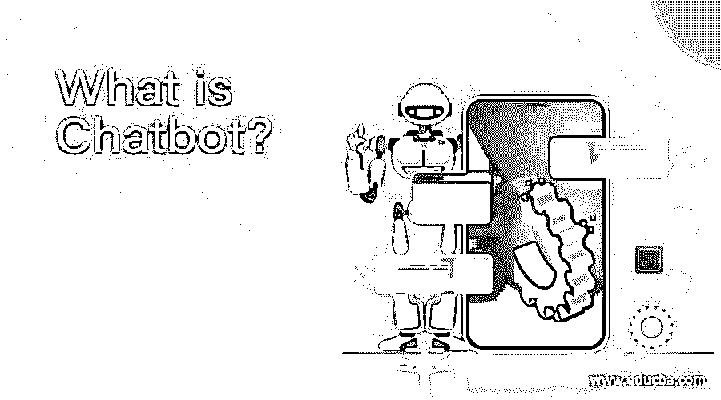

# 什么是聊天机器人？

> 原文：<https://www.educba.com/what-is-chatbot/>

## 什么是聊天机器人？

聊天机器人是一种人工智能(AI)软件，它利用消息应用程序、博客、电影应用程序和电话来模拟与人的对话(或聊天)。它是一个程序组件，旨在实现特定过程的自动化。特别是，聊天机器人主要是一个对话用户界面，它可以通过 API 链接到各种数据源，以便它可以提供按需信息或资源，如天气预测、状态警报或订单以及新闻泄漏。

### 为什么聊天机器人很重要？

聊天机器人系统简化了人们的服务体验，提高了用户参与度。此外，它们为企业提供了新的方法，通过降低传统的客户服务成本来增强客户体验和组织生产力流程。聊天机器人解决方案应该能够成功地执行任务才能成功。人工协助在其中发挥了重要作用:无论网络类型如何，聊天机器人设备的设置、创建和优化都需要人工交互。

<small>网页开发、编程语言、软件测试&其他</small>

### 聊天机器人可以使用吗？

创建聊天机器人有许多方法和工具。一些聊天机器人系统比其他系统更适合，这取决于你喜欢的情况。包括自然语言处理、机器学习和语义意识在内的多种人工智能的结合可能是实现预期结果的最佳选择。聊天机器人环境、消息和自由形式的对话都是最强的渠道。聊天机器人通过一个驱动的对话带用户通过各种选择和问题到达某个目标。自由形式的对话通过鼓励用户发送信息而不限制聊天机器人的选项，使用户在交谈中拥有更大的权力。

### 聊天机器人是如何工作的？

聊天机器人评估并定义用户要求提取适当身体的原因，这是聊天机器人最重要的工作。审查结束后，将向消费者提供所需的答案。聊天机器人使用三种分组方法。
1。NLU: NLU 是聊天机器人的人类理解能力。它将文本翻译成有组织的数据，供计算机解读。NLP:自然语言处理机器人旨在将用户输入转换为结构化数据。文字或演讲
3。模式匹配。:机器人使用模式匹配对文本进行分组，并生成客户响应。AIML 是人工智能标记语言(AIML)的典型标准化模式。在类似的模式下，机器人会得到正确的答案。机器人对所有与它们相关的趋势做出反应。
自然语言处理

### 聊天机器人的使用？

数字化将人类转变为“第一个移动”社区。随着消息应用变得越来越受欢迎，聊天机器人在由连接性驱动的这一转变中发挥着重要作用。智能聊天机器人也是智能手机应用程序的界面，改变了组织和消费者的沟通方式。聊天机器人允许公司与消费者直接互动，而不需要人类成员付出任何代价。例如，客户的许多问题或投诉都很正常，很容易回答。这就是为什么企业会开发常见问题解答和故障排除手册。聊天机器人为书面常见问题解答或指南提供个人解决方案，也可能向现场用户提出客户问题，即使问题对聊天机器人来说太难解决。聊天机器人越来越受欢迎，为公司节省了时间和资源，为消费者带来了额外的舒适。

### 聊天机器人的类型

聊天机器人处理数据，以预定义的规则和基于人工智能的聊天机器人快速回答所有形式的用户问题。有两种聊天机器人。

**1。对话聊天机器人**

聊天机器人也被称为机器人助手或数字助手。你比专注于规则的聊天机器人更社会化和定制化。聊天机器人与用户交谈，就像人类在现实生活中互动和联系一样。聊天机器人技术的对话交流能力允许它提供客户想要的东西。

**2。基于规则的聊天机器人**

在通信过程中，基于规则的聊天机器人会遵循预定义的路线。在聊天的每一步，用户必须为下一步的讨论选择明确的选项。

### 聊天机器人的坏处？

聊天机器人这个词包含了一些误解。虽然聊天机器人和机器人有时可以互换使用，但机器人仅仅是一个自动化软件，可以出于合法或恶意的原因使用。bot 的负面性归因于黑客过去使用自动化系统来渗透、使用和篡夺数字环境。机器人和聊天机器人之间不应该有误解。一般来说，聊天机器人没有被用于黑客攻击的经历。聊天机器人是一种对话工具，可以有效地完成日常任务。人们喜欢他们，他们允许他们有效地完成这些任务，这样他们就可以把精力集中在涉及人类技能的事情上，这些技能是计算机无法在高水平上复制的，具有分析性和吸引力。

### 结论

在本文中，我们已经了解了什么是聊天机器人，以及它的特性、工作方式和类型。我希望这篇文章对你有所帮助。

### 推荐文章

这是一个什么是聊天机器人的指南？.这里我们讨论一下为什么聊天机器人很重要？聊天机器人是如何工作的？，聊天机器人的类型和聊天机器人的使用？.您也可以浏览我们推荐的其他文章，了解更多信息——

1.  [人工智能软件](https://www.educba.com/artificial-intelligence-software/)
2.  [人工智能如何工作？](https://www.educba.com/how-artificial-intelligence-works/)
3.  [人工智能的好处](https://www.educba.com/benefits-of-artificial-intelligence/)
4.  [人工智能的种类](https://www.educba.com/types-of-artificial-intelligence/)

