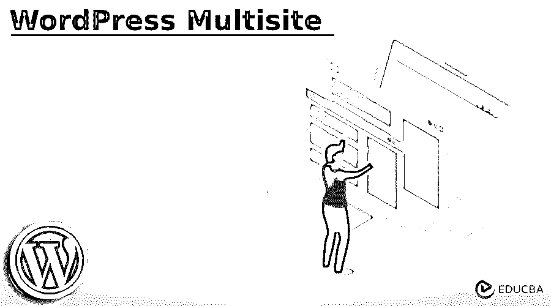

# WordPress 多站点

> 原文：<https://www.educba.com/wordpress-multisite/>




## WordPress Multisite 简介

WordPress Multisite 被定义为 WordPress 的一个功能，允许用户通过服务器上的相同 WordPress 安装来开发和操作多个网站的系统。这以前被认为是 WPMU (WordPress 多用户)。虽然我们可以说 wordpress multisite 特性并不是一个新的特性，而是自从 wordpress 3.0 版本发布以来 WordPress 平台上的一个改进特性。WordPress Multisite 可以为各种目的带来好处，比如只需点击一下就可以更新整个网站，为开发一个在多个网络上可用的网站向订户收费。

### 关键要点

*   WordPress Multisite 有能力在一个仪表板和一个运行许多子站点的父域下处理许多共享一个网络资源的网站。
*   在这个单一的网络上，用户可以为每个网站分配一个单独的管理员。但是当网络瘫痪时，所有这些网站都会受到影响。
*   这个功能也有一些缺点:假设任何人攻击了一个网站，那么整个网络都可能受到威胁。同样，在多站点网络中，当一个网站的流量水平立即上升，可能会影响到其他网站时，管理服务器资源将是一个问题。
*   一次下载，插件和主题可以在所有的网络网站上安装和激活。然而，一些插件可能不支持 wordpress multisite 特性和工具，也不支持虚拟主机提供商。

### 如何创建一个 WordPress 多站点网络？

一个多站点网络可以说是一组共享一个 WordPress 安装以及核心文件、主题和插件的站点。

<small>网页开发、编程语言、软件测试&其他</small>

下面是创建 WordPress 多站点网络的步骤，如下所示:

1.**准备要求:**确保你已经安装了 wordpress 的有效永久链接，如 http://domain.com/test-page，但不像这个 http://domain.com/?p=5021;，插件也应该被停用；备份你的 wordpress 安装，并需要访问它的 FTP。

2.**通过 wp-config 文件**允许多站点。

3.**安装 WordPress 网络**。

4.写几行代码给。htaccess 和 wp-config 文件。

5.**引入新的网络管理菜单和设置**。

6.**在网络上创建一个新网站**。

7.**在多站点网络上设置插件和主题**。

### WordPress 多站点配置

连接到 FTP 面板后，您需要:

1.打开 wordpress 主目录下可用的 wp-config.php 文件，然后上面那行:/*就这样，停止编辑！博客快乐。*/，添加代码。

**代码:**

```
Define (‘WP_ALLOW_MULTISITE’, true);
```

现在，保存文件。

2.转到网站的管理面板，再次刷新页面，你会在工具条的工具下看到一个网络设置选项。这里，您需要选择哪个网络来处理子域或子目录。接下来，输入网络详细信息，然后单击安装按钮。

3.将一些代码添加到 wp-config 文件中，就在最初添加的代码下面。

**代码:**

```
define('MULTISITE', true);
define('SUBDOMAIN_INSTALL', true);
define('DOMAIN_CURRENT_SITE', 'My_Website');
define('PATH_CURRENT_SITE', '/');
define('SITE_ID_CURRENT_SITE', 1);
define('BLOG_ID_CURRENT_SITE', 1);
```

另外，在 htaccess 文件中添加一些代码片段，替换其他 wordpress 规则，如下所示:

**代码:**

```
RewriteEngine On
RewriteBase /
RewriteRule ^index\.php$ - [L]
# add a trailing slash to /wp-admin
RewriteRule ^([_0-9a-zA-Z-]+/)?wp-admin$ $1wp-admin/ [R=301,L]
RewriteCond %{REQUEST_FILENAME} -f [OR]
RewriteCond %{REQUEST_FILENAME} -d
RewriteRule ^ - [L]
RewriteRule ^([_0-9a-zA-Z-]+/)?(wp-(content|admin|includes).*) $2 [L]
RewriteRule ^([_0-9a-zA-Z-]+/)?(.*\.php)$ $2 [L]
RewriteRule . index.php [L]
```

现在，保存这两个文件。

4.访问仪表板，你会发现新的选项，即网络管理，其中有设置，仪表板，网站，插件，用户和主题的选项。

5.转到站点选项，为网络创建一个新网站。

6.你可以进一步安装和激活任何插件或主题。

### 如何修复 WordPress 多站点错误？

让我们来看看在多站点网络中发现的一些错误或问题的解决方案:

**1。登录错误:**如果在多站点网络中使用子目录而不是子域，则可能存在此错误。要修复它，只需在定义的行中用“false”替换第二个参数(“SUBDOMAIN_INSTALL”，true)；在 wp-config 文件中找到。

**2。搜索未确认用户:**基本上，由于邮件配置设置不佳，无法搜索到已注册但未收到任何激活邮件的用户。为此，您需要使用 SMTP 协议在具有正确域认证的收件箱中发送邮件。

### 使用插件

*   您可以在网站仪表板的网络管理区域查看多站点网络插件。您需要点击每个插件下方的“网络激活”选项，将插件安装到网络上。应该注意的是，如果“插件菜单”已经在网站管理员的网络设置选项中激活，那么管理员将无权安装或删除插件。然而，他们可以激活或停用已经存在的插件。
*   您可以找到许多授权多站点网络适当操作的插件，包括 WPForms、Pro 站点、域映射、Yoast SEO、WP Mail SMTP、Seed Pro 和用户切换。

### WordPress 多站点存储媒体

*   与标准的 WordPress 网站相比，媒体在 WordPress Multisite 中的存储方式不同。它不会在 wp-uploads 文件夹中创建任何额外的文件夹，而是将每个上传的媒体存储在多站点激活时创建的名为 Sites 的新文件夹中。这些站点将接收网络中所有站点的上传。
*   使用 WordPress multisite 选项，用户无法获得不同的媒体来上传 WordPress 安装中网站可用的目录，这意味着每个网站将拥有自己不同的图像文件夹以及上传的其他文件，因此用户无法从网络中提供的任何其他网站访问一个网站的图像。
*   在 WordPress Multisite 中，最好的解决方案是多站点共享媒体插件，用于同步/不同步媒体，如视频、音乐、图像、文档等。这将有助于在网络中共享媒体。

### 特征

下面是提到的特征:

*   使用一个 WordPress 安装仪表板，初学者可以建立网站和博客网络创建子域。
*   WordPress Multisite 使用户能够作为超级管理员管理整个网络。它也有助于安装和配置任何新的插件或主题，进一步提供给其他网站。
*   甚至内容也由超级管理员和网站管理员控制。
*   这个 WordPress 特性可以被大学的学生、每个系、教员、论坛和博客成员使用；拥有分行网络的银行和金融机构；具有许多内容部分的数字出版物；同样，拥有部门网络的政府办公室；有许多商店的商店；连锁酒店，像 Wix 这样的网站开发公司；电子商务公司等。

### 常见问题解答

下面是提到的常见问题:

#### Q1。我们可以使用一个 ID 作为超级管理员登录整个网络网站吗？

**回答:**当然，SuperAdmin 有权使用相同的凭证登录网络网站。

#### Q2。有没有可能通过 WordPress 多站点网络提供对用户登录和角色的访问？

**回答:**是的，您可以与其他网站管理员共享此权限，以管理他们自己的权限。

#### Q3。用户可以开发一个主题，然后在任何特定的网站上实现它吗？

**回答:**是的，开发任何主题并在网络网站上以管理员身份登录使用都是可能的。

### 结论

众所周知，WordPress Multisite 是一个标准功能，用于在主机服务器的一个仪表板下运行不同的网站。然而，multisite 既有优点也有缺点，但是如果能够管理和解决问题，那么就可以真正减少工作量，并对网站网络进行无压力的监控。

### 推荐文章

这是 WordPress Multisite 的指南。在这里我们讨论介绍，以及如何创建一个 wordpress 多站点网络。功能和常见问题。您也可以看看以下文章，了解更多信息–

1.  [WordPress CMS](https://www.educba.com/wordpress-cms/)
2.  WordPress WooCommerce
3.  [WordPress 登录](https://www.educba.com/wordpress-login/)
4.  [WordPress 主机](https://www.educba.com/wordpress-hosting/)


