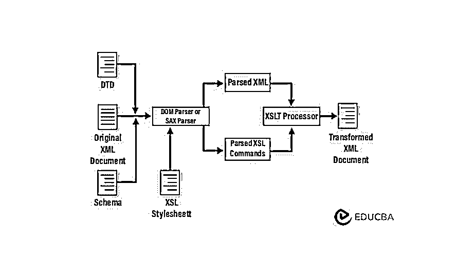
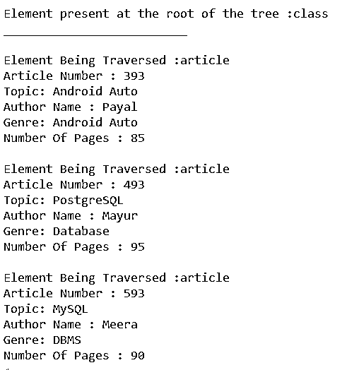

# 用 java 解析 xml

> 原文：<https://www.educba.com/xml-parsing-with-java/>


## Java XML 解析简介

XML 代表扩展标记语言，其被创建用于通过遵循定义的规则集来编码文档，该规则集使得内容具有可读格式，而 XML 解析器被用于通过遍历整个 XML 文件来修改或访问 XML 文件中的数据。在 java 中，XML 解析器是一个独立的组件，用于遍历 XML 文档。

### 用 java 解析 xml 是什么？

XML 解析器负责通过扫描整个 XML 文件来检查和验证 XML 文档的格式，并提供访问或修改其中数据的功能。XML 开发过程中最重要的部分是 XML 解析。在 java 中，XML 解析器是 XML 的一个独立组件，帮助解析 DTD 独立文件、XML 文档甚至 XML 模式。用户可以进一步处理这个解析后的 XML 文档。下图说明了用 Java 解析 XML 文档的过程

<small>网页开发、编程语言、软件测试&其他</small>




https://docs.oracle.com/cd/B25016_08/doc/dl/web/B14033_01/adxdk002.gif

我们可以在上图中看到，提供给解析器的输入包括主 XML 文档，其他可选的内容包括模式文件和 DTD。解析器生成的任何输出都将被进一步传递给 DOM 或 SAX 解析器，无论您可能将哪个解析器用作输入。DOM 解析器或 SAX 解析器还接收用于设计和美化数据的 XSL 样式表文件。此外，被解析的 XSL 的命令连同被解析的 XML 一起被转发给 XSLT 处理器，XSLT 处理器最终产生转换后的 XML 文档作为其输出。

### 在 java 中使用 xml 解析的步骤

当解析 XML 文档时，我们需要遵循下列步骤

*   所有与 XML 相关的包应该在一开始就导入。
*   应该创建 DocumentBuilder 的新实例。
*   从可用的流或文件中，您应该创建一个文档
*   应该提取根元素。
*   应该检查属性和子元素。

### Java XML 解析器–DOM

文档对象模型(DOM)是一个基于树的应用程序编程接口，它在内存中为传递给它的相应 XML 文档创建一个树结构或表示。DOM 附带了一些方法和类，可用于处理树并在应用程序中导航。

DOM 接口是 XML 树最有用的组件，可用于结构操作。这些操作包括删除或添加旧的或新的属性和元素、元素重新排序、重命名现有元素等等。

当我们需要随机访问应用程序内部的元素时，最好使用 DOM API。DOM 也可以在 XSL 转换任务中使用，或者在调用 XPath 时使用。简而言之，我们可以说，每当需要使用 tree 中的迭代，并且需要扫描或访问整个文档时，我们就可以使用 DOM API。也可以在 DOM 中定制树构建过程。为了减小 XML 文档中管道的大小，我们可以更多地使用属性，而不是 DOM API 中的元素

### 用 java 创建 DocumentBuilder- xml 解析

为了创建 document builder 的实例，我们需要 document builder 工厂类的对象，该对象可以通过使用下面的代码片段来创建

```
DocumentBuilderFactory instanceOfFactory =
DocumentBuilderFactory.newInstance();
DocumentBuilder instanceOFBuilder = instanceOfFactory.newDocumentBuilder();
```

### 演示示例——用 java 解析 xml

现在让我们考虑一个例子，它将帮助我们理解上面在“使用 java 进行 xml 解析的步骤”一节中提到的所有步骤的实现，这将使我们更清楚地理解用于 XML 文档解析的 Dom parser。我们将有两个文件，其中一个是主 XML 文档，它将作为解析的输入文件，另一个是 java 文件，它将解析文件并通过访问 XML 文件形成的树的所有节点来生成输出。

需要解析的文件将是如下所示的 XML 文件

**xml 文件—**

```
<?xml version = "1.0"?>
<class>

<topic>Android Auto</topic>
<nameOfAuthor>Payal</nameOfAuthor>
<genre>Android Auto</genre>
<numberOfPages>85</numberOfPages>


<topic>PostgreSQL</topic>
<nameOfAuthor>Mayur</nameOfAuthor>
<genre>Database</genre>
<numberOfPages>95</numberOfPages>


<topic>MySQL</topic>
<nameOfAuthor>Meera</nameOfAuthor>
<genre>DBMS</genre>
<numberOfPages>90</numberOfPages>

</class>
```

现在，我们需要用 java 编写一个类，该类可以编写业务逻辑并尝试使用 DOM 解析器解析 XML 文件，该解析器的名称是 EducbaDomParserExample，文件的内容如下所示

**教育工作者示例. java**

```
package com.educba.xml;
import java.io.File;
import javax.xml.parsers.DocumentBuilderFactory;
import javax.xml.parsers.DocumentBuilder;
import org.w3c.dom.Document;
import org.w3c.dom.NodeList;
import org.w3c.dom.Node;
import org.w3c.dom.Element;
public class EducbaDomParserExample {
public static void main(String[] args) {
try {
File xmlFileToParse = new File("educbaXML.txt");
DocumentBuilderFactory instanceOfDocBuilderFactory = DocumentBuilderFactory.newInstance();
DocumentBuilder educbaDocBuilderObj = instanceOfDocBuilderFactory.newDocumentBuilder();
Document sampleDocument = educbaDocBuilderObj.parse(xmlFileToParse);
sampleDocument.getDocumentElement().normalize();
System.out.println("Element present at the root of the tree :" + sampleDocument.getDocumentElement().getNodeName());
NodeList nodeListInstance = sampleDocument.getElementsByTagName("article");
System.out.println("__________________________");
for (int temporaryVar = 0; temporaryVar < nodeListInstance.getLength(); temporaryVar++) {
Node singleNode = nodeListInstance.item(temporaryVar);
System.out.println("\nElement Being Traversed :" + singleNode.getNodeName());
if (singleNode.getNodeType() == Node.ELEMENT_NODE) {
Element particulerElement = (Element) singleNode;
System.out.println("Article Number : "
+ particulerElement.getAttribute("articleNo"));
System.out.println("Topic: "
+ particulerElement
.getElementsByTagName("topic")
.item(0)
.getTextContent());
System.out.println("Author Name : "
+ particulerElement
.getElementsByTagName("nameOfAuthor")
.item(0)
.getTextContent());
System.out.println("Genre: "
+ particulerElement
.getElementsByTagName("genre")
.item(0)
.getTextContent());
System.out.println("Number Of Pages : "
+ particulerElement
.getElementsByTagName("numberOfPages")
.item(0)
.getTextContent());
}
}
} catch (Exception sampleException) {
sampleException.printStackTrace();
}
}
}
```

执行上述 java 文件的输出将产生下图所示的结果–


### 结论

XML 文件或文档是一种可扩展标记语言文件，将在 java 应用程序中使用各种类型的解析器(如 DOM 解析器、SAX 解析器等)进行解析。在本文中，我们看到了如何将 XML 文件转换成树状结构，显示内存中所有层次结构，以及如何在 java 程序中访问或修改每个单独的元素或属性。

### 推荐文章

这是一个用 java 解析 xml 的指南。这里我们讨论如何将 XML 文件转换成树状结构，显示内存中的所有层次结构。您也可以看看以下文章，了解更多信息–

1.  [XML 浏览器](https://www.educba.com/xml-viewer/)
2.  [XML 特殊字符](https://www.educba.com/xml-special-characters/)
3.  [Rust XML](https://www.educba.com/rust-xml/)
4.  [甲骨文 XML](https://www.educba.com/oracle-xml/)


