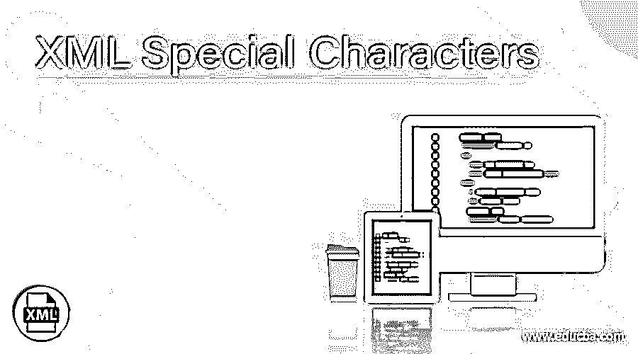
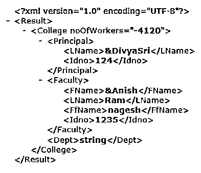
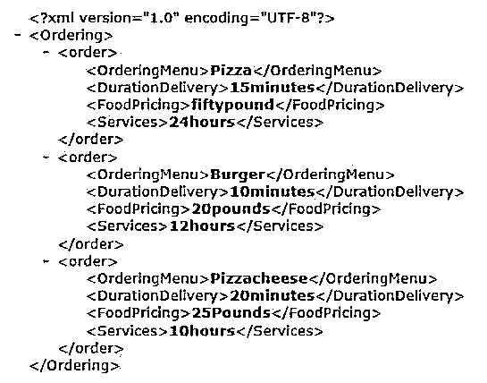

# XML 特殊字符

> 原文：<https://www.educba.com/xml-special-characters/>

## XML 特殊字符的定义

特殊字符，在 XML 中也称为非拉丁字符，在 XML 文件中通过替换实体用数字字符引用来赋值。这些字符使用实体格式以转义格式出现。特殊字符被转换成转义的等价字符，如&lt 和&gt。很少有开发人员发现使用 XML 特殊字符很困难；比方说，当用&符号在文档中嵌入一些文本时，解析器不能处理文档。因此，在 CDATA 节下，特殊字符编码应该使用 XmlFormat()，而该函数处理特殊字符以实现有效的更改。

**语法**

<small>网页开发、编程语言、软件测试&其他</small>

没有要声明的特定语法。它可以在属性或元素中赋值，如下所示:

`<?xml version="1.0" encoding="UTF-8"?>
<Report xmlns:xsi="http://www.w3.org/2001/XMLSchema-instance”>
<Latinchar>͍ </ Latinchar >
</Report>`

### XML 特殊字符及示例

在处理 XML 文档时，某些字符被视为特殊字符，这些字符被用作标记语法，应该进行近似转义。这些字符不能作为尝试直接插入到 XML 文件中，因此需要有一个字符引用或数字引用来跨工作平台保存。

| &lt | 左括号 |
| > | 右括号 |
| &amp | &符号 |
| &quot | 双引号 |
| &apos | 单引号 |

例如，包含 XML 的文件有

`<?xml version="1.0" encoding="UTF-8" standalone="yes"?>
<item_list>
Product size &gt; applied
</item_list>`

现在，处理上述样本的结果如下

`Element: <item_list>
Char: Product size > applied
End element: </item_list>`

当 XML 文件很大，包括特殊字符时，我们可以使用 CDATA 部分来处理它。XML 的另一部分是 Xpath，它在路径语言中使用特殊字符。

| . | 这里应该在节点中指定当前上下文。 |
| * | 该字符被命名为通配符，用于选择所有元素。 |
| @ | 专门选择一个属性。 |
| () | 在 Xpath 表达式中，这指定了一个分组。 |
| : | 这是一个名称空间分隔符 |

这些可以以各种方式使用，学习如何在各种应用程序和 XML 中将它们转换成数字格式是一个很好的开始。

在下一节中，让我们看看如何在 XML 结构语言中使用特殊实体。让我们从这里开始。

#### 示例 1–使用 Cdata

**res.xml**

`<?xml version="1.0" encoding="UTF-8" standalone="yes"?>
<html >
<head>
<title> Special Characters in Math Expressions functions. </title>
</head>
<body>
<h1><b> This example Shows how to use Special characters in a expression or paragraph using XML </b></h1>

<! [CDATA[
Lets take an expression of a formula " if Q(a,c) is a c < Q && a > A or c > a "
]]>

</body>
</html>`

**输出:**

#### 示例 2–使用 apos 和&lt

让我们讨论一下 XML 文档中的字符数据，这里' & '和" < "不应该用在标记中，但是 apos 和引号可以不经过编码直接出现。例如，像这样的代码

`<?XML version="1.0”?>
<password > “ ‘ > </password>`

上面的示例代码是有效的；因此，XML 解析器将结果解析并验证为

**输出:**

#### 示例 3–使用完整的特殊字符

`<?xml version="1.0" encoding="UTF-8"?>
<bookstore>
<book ISBN="586954">
<title>&quot;Java Advanced &quot;</title>
<author>Emey mark</author>
<category>Programming & Analysis</category>
<edition>1</edition>
<price> &lt;29.99 &gt;</price>
</book>
<book ISBN="56858">
<title>&quot;More for Python &quot;</title>
<author>&amp;Hebrew manni</author>
<category>Programming</category>
<price>15.99</price>
</book>
<book ISBN="66547">
<title>&quot;The Complete Guide to Animals &quot;</title>
<author>joe emacul</author>
<author>sheeba david</author>
<author>Jacob ethen</author>
<category>Wild</category>
<category>Teresstial</category>
<language>French</language>
<edition>5</edition>
<price>31.99</price>
</book>
</bookstore>`

**解说**

在上面的代码中，XML 元素被赋予了特殊的字符标签。

**输出:**

#### 示例# 4–使用&符号

`<?xml version="1.0" encoding="UTF-8"?>
<password > & </password>
<Login> &@</Login>`

**输出:**

#### 示例# 5–使用“与”符号和数字

`<?xml version="1.0" encoding="utf-8"?>
<Result>
<College noOfWorkers="-4120">
<Principal>
<LName>&amp;DivyaSri</LName>
<Idno>124</Idno>
</Principal>
<Faculty>
<FName>&Anish</FName>
<LName>Ram</LName>
<FfName>nagesh</FfName>
<Idno>1235</Idno>
</Faculty>
<Dept>string</Dept>
</College>
</Result>`

**解释**

在上面的代码中，Fname 元素是用特殊字符声明的，它们的存在反映在输出中，如下所示:

**输出:**

#### 示例# 6——在 CDATA 结构中使用>

`<?xml version="1.0" encoding="UTF-8"?>
<return_val>]]&gt;</return_val>`

**输出:**

#### 示例 7–在 xml 中使用通配符

**字. xsl**

`<?xml version = "1.0" encoding = "UTF-8"?>
<xsl:stylesheet version = "1.0"
xmlns:xsl = "http://www.w3.org/1999/XSL/Transform">
<xsl:template match = "/">
<html>
<body>
<h2> 
Restaurant-Online 
</h2>
<xsl:apply-templates select = "Ordering/*" />
</body>
</html>
</xsl:template>
<xsl:template match = "Ordering/*">
<xsl:apply-templates select = "@login" />
<xsl:apply-templates select = "Ordering Menu" />
<xsl:apply-templates select = "Food Pricing" />
<xsl:apply-templates select = "Services" />
<xsl:apply-templates select = "Duration delivery" />
 
</xsl:template>
<xsl:template match = "@login">

<xsl:value-of select = "." />

 
</xsl:template>
<xsl:template match = "Ordering Menu">
Lang:
<xsl:value-of select = "." />

 
</xsl:template>
<xsl:template match = "Food Pricing">
Tutor:
<xsl:value-of select = "." />

 
</xsl:template>
<xsl:template match = "Service">
Experience:
<xsl:value-of select = "." />

 
</xsl:template>
<xsl:template match = "Duration delivery">
Duration:
<xsl:value-of select = "." />

 
</xsl:template>
</xsl:stylesheet>`

**字. xml**

`<?xml version="1.0" encoding="UTF-8"?>
<Ordering>
<order>
<OrderingMenu>Pizza</OrderingMenu>
<DurationDelivery>15minutes</DurationDelivery>
<FoodPricing>fiftypound</FoodPricing>
<Services>24hours</Services>
</order>
<order>
<OrderingMenu>Burger</OrderingMenu>
<DurationDelivery>10minutes</DurationDelivery>
<FoodPricing>20pounds</FoodPricing>
<Services>12hours</Services>
</order>
<order>
<OrderingMenu>Pizzacheese</OrderingMenu>
<DurationDelivery>20minutes</DurationDelivery>
<FoodPricing>25Pounds</FoodPricing>
<Services>10hours</Services>
</order>
</Ordering>`

**解释**

在上面的代码中，根节点是由通配符(*)选择的，其中选择了子元素和属性。

**输出:**

**解释**

在上面的通配符示例中，我们使用了带有 XSL 的 XML 文档，并且选择了特定的值和属性。

### 结论

本文演示了如何在各种情况下在 XML 中使用这些特殊字符。对于 Xpath，表达式产生的结果是节点集的形式。总体概念是在 XML 文件中使用特殊字符时；在客户端方面应该小心，因为我们需要逃离一个角色。此外，我们已经通过这些特殊字符的例子进行了详细的描述。

### 推荐文章

这是 XML 特殊字符的指南。在这里，我们将讨论如何使用 XML 特殊字符以及示例和输出。您也可以看看以下文章，了解更多信息–

1.  [XML HttpRequest](https://www.educba.com/xml-httprequest/)
2.  [XML 元素](https://www.educba.com/xml-element/)
3.  [XML 模式](https://www.educba.com/xml-schema/)
4.  [XML 属性](https://www.educba.com/xml-attributes/)

