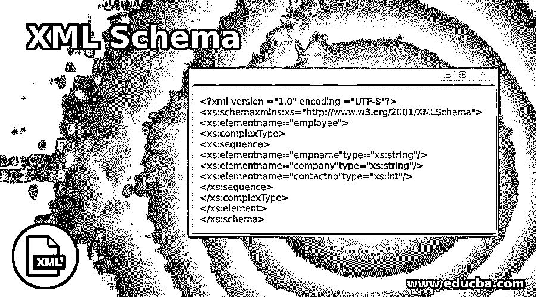
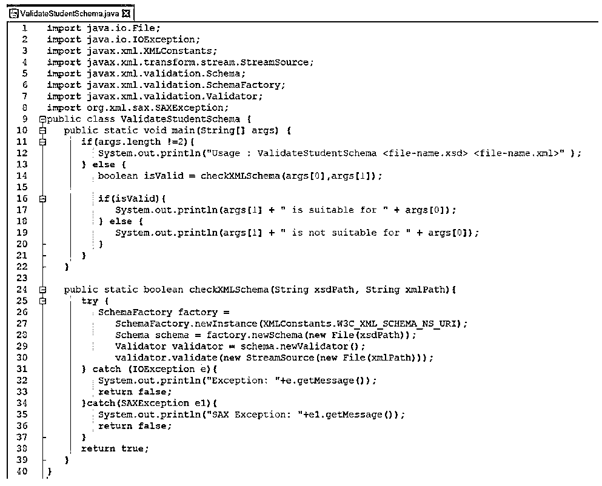

# XML 模式

> 原文：<https://www.educba.com/xml-schema/>

## XML 模式简介

XML 模式被定义为用于指定 XML 数据和文档的结构或约束的语言，类似于用于描述数据库数据的数据库模式。它也类似于 DTD，但是对 XML 结构提供了更多的控制。最流行的模式语言是 XML 模式定义(XSD)，用于支持名称空间&定义数据类型、属性和元素。

**语法:**

<small>网页开发、编程语言、软件测试&其他</small>

它使用 XML 语法，这意味着如果你了解 XML，就不需要学习另一种语言。因此，我们可以使用 XML 编辑器来编辑模式文件，使用解析器来解析文件。使用 XML DOM 我们可以操作模式&使用 XSLT 我们可以转换模式。因为它是用 XML 编写，所以可以方便快捷地扩展以供将来使用。基本上，它使用 XML 文档可以采用的合法格式。

`<?xml version ="1.0" encoding ="UTF-8"?>
<xs:schemaxmlns:xs="http://www.w3.org/2001/XMLSchema">
<xs:elementname="employee">
<xs:complexType>
<xs:sequence>
<xs:elementname="empname"type="xs:string"/>
<xs:elementname="company"type="xs:string"/>
<xs:elementname="contactno"type="xs:int"/>
</xs:sequence>
</xs:complexType>
</xs:element>
</xs:schema>`

### XML 模式是如何工作的？

XML 模式以下列方式工作:

*   如果 XML 文档中没有模式或 DTD(即文档类型定义),则 XML 文档数据将推断出新的 XML 模式。
*   XML 文档有一个关联的 DTD，那么可以通过转换外部 DTD 和内部子集来创建相关的 XML 模式。
*   XML 文档有一个 XDR，即 XML 数据简化模式，它是内联的，然后相关的，可以通过转换 XDR 模式来创建。

### XML 架构数据类型

下面给出了两种数据类型:

*   简单类型
*   复杂类型

#### 1.简单类型

它允许我们拥有基于文本的值，这些值不仅可以显示在元素/属性中，还可以限制我们保持它为空。在这方面，它看起来不同于 dtd。数字被限制在一个特定的属性内。在 XSD 下，我们总共有十九(19)个原始数据类型，即 anyURI、base64Binary、boolean、date、dateTime、decimal、double、duration、float、hexBinary、gDay、gMonth、gMonthDay、gYear、gYearMonth、NOTATION、QName、string 和 Time。

使用上述原语，可以通过以下三种方式构建新的数据类型:

*   允许值集将减少，即限制。
*   允许值的顺序，即列表。
*   允许选择不同类型的值，即联合。

在规范中，总共提到了 25 种派生类型，其余的派生类型可以在用户创建的模式中提到。数据类型的约束方式包括最小和最大值规范、正则表达式、字符串长度约束和十进制数字约束。定义 1.1 增加了任意约束规范，也称为 XSD 断言。

#### 2.复杂类型

它允许我们拥有一个元素的允许内容，这意味着它拥有多个元素、属性和文本子元素。它还包含额外的子类型&允许我们留空。除此之外，复杂类型定义还包含属性集的使用和内容模型。

下面给出了内容模型的类型:

*   没有文本的内容模型称为纯元素内容。
*   包含文本&没有子元素的内容模型称为简单内容。
*   没有文本和子元素的内容模型称为空内容。
*   包含文本和子元素的内容模型称为混合内容。

### XML 模式的示例

下面是提到的例子:

首先，让我们创建一个模式文件。我们将把文件保存为 student.xsd。

**代码:**

`<?xml version ="1.0" encoding ="UTF-8"?>
<xs:schemaxmlns:xs="http://www.w3.org/2001/XMLSchema"targetNamespace="http://www.educba.com"elementFormDefault="qualified">
<xs:elementname="student">
<xs:complexType>
<xs:sequence>
<xs:elementname="stdname"type="xs:string"/>
<xs:elementname="school"type="xs:string"/>
<xs:elementname="phone"type="xs:int"/>
</xs:sequence>
</xs:complexType>
</xs:element>
</xs:schema>`

稍后我们将尝试使用 xml 模式或 XSD 文件查看 XML 文件，我们将把它保存为 student.xml

**代码:**

`<?xml version ="1.0" encoding ="UTF-8"?>
<studentxmlns:xsi="http://www.w3.org/2001/XMLSchema-instance"xsi:schemaLocation="http://www.educba.com student.xsd">
<stdname>Abhi</stdname>
<school>Holycross</school>
<phone>1234567890</phone>
</student>`

最后，我们使用以下基于 java 的验证器来验证 student。针对 student.XSD 的 XML 文件

*   使用任何文本编辑器，如 Notepad++创建一个基于 java 的验证程序，将其保存为 java。
*   导入所有必需的名称空间，包括 xml.validation.schema。
*   然后创建一个类 ValidateStudentSchema。
*   下一步是创建一个名为 checkXMLSchema 的布尔方法。
*   将两个字符串参数传递给 checkXMLSchema 方法，即 xsdPath&xmlPath。
*   在方法内部创建一个 SchemaFactory 类的对象，它是一个架构编译器。
*   这个模式编译器将用于读取模式的外部表示&基于此，我们将根据 xsd 验证 xml 文件。
*   不要忘记使用 try catch 块在出错时捕捉异常。
*   在关闭方法之前，返回 true。
*   最后在 ValidateStudentSchema 类的 ma in 函数中调用 checkXMLSchema 方法。

***

*** 

完成上述代码后，下一步是在控制台中编译模式文件。

打开命令提示符&访问存储 ValidateStudentSchema.java 文件的路径。

**d:\ EduCBA【javacValidateStudentSchema.java T2】T1】**

然后通过传递两个参数(即 students.xsd 和 students.xml)编写 ValidateStudentSchema

**d:\ EduCBA>Java ValidateStudentSchema students . xsd students . XML**

**输出:**

students.xsd 适用于 student.xml

### 结论

从上面的细节我们可以得出结论，XML Schema 规定了 XML 文档的格式和内容。然而，它主要用作独立于平台的描述型语言。同样在这种模式中，为了根据类型描述交换数据，我们使用 XML 文档。因此，要构建您自己的基于 XML 模式的系统，我们应该首先考虑 2 个规则来描述类型系统，这是主要目标，稍后我们可以考虑它用于文档布局等目的，其次在应用程序开发中，我们应该为文档编写模式。换句话说，不会使用没有附加模式的文档。

### 推荐文章

这是 XML 模式指南。这里我们分别讨论 XML Schema 的介绍，它是如何工作的，数据类型和例子。您也可以看看以下文章，了解更多信息–

1.  [XML 中的字符串](https://www.educba.com/string-in-xml/)
2.  [XML 版本](https://www.educba.com/xml-versions/)
3.  [XML 特性](https://www.educba.com/xml-features/)
4.  [XML DTD](https://www.educba.com/xml-dtd/)

