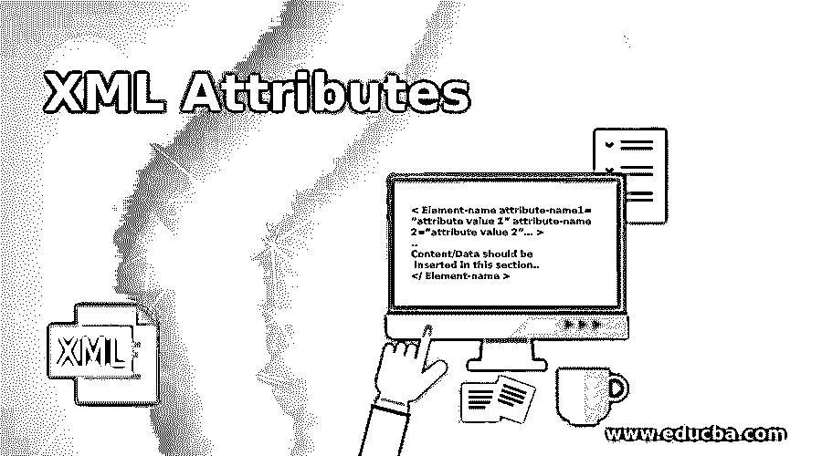

# XML 属性

> 原文：<https://www.educba.com/xml-attributes/>

## XML 属性简介

属性可以被描述为任何对象的属性。它定义了任何语言中的任何对象派生其行为的方式。我们可以根据业务需求来描述或设置这些属性，并且可以将它们应用到 XML 脚本中来修改语言行为。XML 标签附带了一种工具，可以为作品提供属性语法。

在定义任何元素时，我们使用属性来精确定义。使用属性，我们可以为应用程序注入多种功能，丰富其外观和用途。它是对基本要素的增值。

<small>网页开发、编程语言、软件测试&其他</small>

**语法:**

XML 属性有其规范定义。我们需要遵循语法规则来定义 XML 中的任何对象。定义属性的语法描述如下:

`< Element-name attribute-name1=”attribute value 1” attribute-name2=”attribute value 2”… >
..
Content/Data should be inserted in this section..
</ Element-name >`

**举例:**

让我们举一个现实生活中的例子来解释语法。

`<employee job_type=”full time”>`

或者

`<employee job_type=’on contract’>`

属性名称后面应该跟有等号(=)以及分配给它的值。属性的值应该在分号下捕获。

### 属性在 XML 中是如何工作的？

属性应该按照上一节描述的方式在元素标签下定义。这些属性用特殊值标记元素。然后，该值用于将这些元素的特征与没有分配属性的正常元素区分开来。我们可以在 XML 中定义任意数量的属性。我们只需要在元素标签中包含这些属性并加以利用。我们可以按属性类型对属性进行分类:

*   **字符串类型:**它以一个字符串作为输入。Cdata 是一种字符串类型。
*   **标记化类型:**在这种类型的属性中，应用 XML 语法来提取规范化值。它们是 Id、Idref、Entity、Nmtokens、Entities、Nmtokens、Idref。
*   **枚举类型:**这里我们必须从预定义的允许属性值列表中为属性选择一个值。这些是 NotationType，Enumeration。

### XML 属性的特征

下面列出了属性的一些特征:

*   这些属性是唯一的。这意味着属性 1 不等于属性 2。
*   一个元素可以有许多属性。
*   一个属性可以同时分配给不同的元素。
*   属性的范围仅限于它所分配到的元素。那么相同的属性如果被其他元素使用，那么它的作用域将被限制到另一个元素。根据所分配的属性值，这两个元素可以表现为不同的方式。
*   一个元素可以用不同的属性声明多次，以防我们不希望多个元素有不同的名称。我们希望只保留一个具有不同特征的元素。在这种情况下，属性的使用对于要保存的数据和结构化文档来说变得至关重要，因为它增加了更多的区别信息。
*   属性名不应在同一个元素标记或空元素标记中出现两次或更多次。
*   一个属性不能同时保存多个值。例如:< element attribute=”value 1 value 2 value 3…”>不是正确的赋值方式。
*   在 DTD(文档类型定义)下使用属性之前，应该已经声明了属性。通常，在 XML 文档的开始。
*   应正确使用“<>”。所有的开始括号""否则语法规则将被撤销。
*   当这些元素被声明为单独的标签时，我们也可以将相同的属性分配给相同的元素。标签是指包含在这些括号“<element>”下的元素。通过查看下一节中描述的示例，可以更好地理解这种情况。</element>

### XML 属性的示例

下面是演示 XML 语言中属性用法的示例代码片段。

**代码:**

`<?xml version = "1.0" encoding = "UTF-8"?>
<!DOCTYPE painting [
<!ELEMENT painting (Chart_paper)*>
<!ELEMENT Chart_paper (#PCDATA)>
<!ATTLIST Chart_paper category CDATA #REQUIRED>
]>
<Painting>
<Chart_paper category = "Hard paper" />
< Chart_paper category = "Scrap paper">
< Chart_paper category = "Tissue paper">
</plants>
</Painting>`

**解释:**在上面的代码中，我们将一个名为“category”的属性分配给了一个名为“Chart_paper”的元素。在这个例子中，一个名为“Chart_paper”的元素被分配给同一个属性“category ”,但属性值不同。在这里，Chart_paper 被分成上面描述的三个类别。这些属性在 XML 文档的开头 DOCTYPE 标签下定义。如果我们要在文档中进一步使用这些属性，这个声明是很重要的。

### 优点和缺点

下面列出了将属性与元素一起使用的一些优点:

*   我们可以限制不必要的元素标签的使用。相反，我们可以有一个具有相同属性的元素。比如在这个地方:

`<Employee>
<Gender> Female</Gender>
<Name>Meghna</Name>
<DOB>25-03-1994</DOB>
</Employee>
We can use:
<Employee gender="female">
<Name>Meghna</Name>
<DOB>25-03-1994</DOB>
</Employee>`

*   通过避免使用各种元素来简化数据共享。虽然在前面的两个代码片段中数据传输的方式没有区别。这只是数据排列的方案。
*   我们可以精确地定义数据，从而提高数据定义的清晰度。
*   因为我们不能给同一个属性分配多个值，所以这是一个缺点，我们需要用同一个属性再次声明同一个元素来存储多个值。

### 结论

属性可以被认为是“元数据”(元数据是关于数据的数据)。它简化了 XML 中任何标签传递输出的方式。我们可以将多个属性分配给一个 XML 标签。我们可以使用 XML 属性来参数化标签的功能。

### 推荐文章

这是 XML 属性的指南。在这里，我们还讨论了简介和属性在 xml 中的工作方式以及优缺点。您也可以看看以下文章，了解更多信息–

1.  [XML DTD](https://www.educba.com/xml-dtd/)
2.  [XML 中的字符串](https://www.educba.com/string-in-xml/)
3.  [XML 解析器](https://www.educba.com/xml-parsers/)
4.  [XML 版本](https://www.educba.com/xml-versions/)