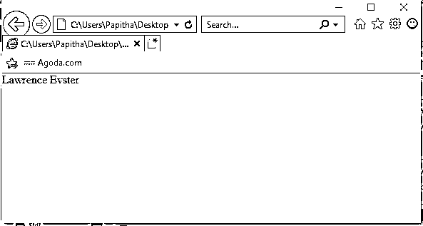
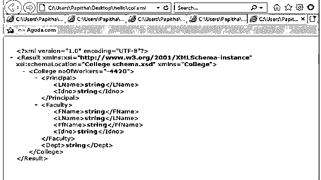
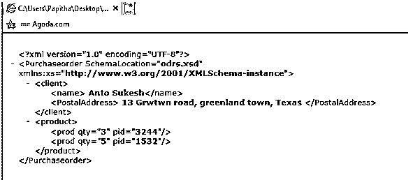
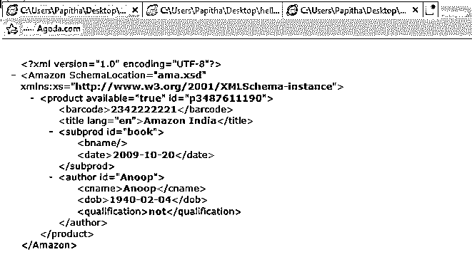
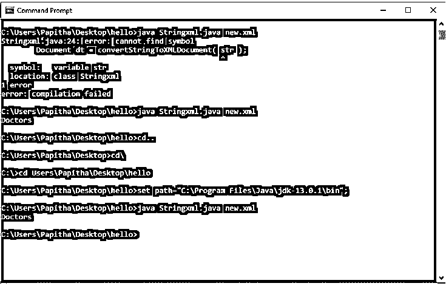

# XML 中的字符串

> 原文：<https://www.educba.com/string-in-xml/>

## XML 中字符串的定义

XML 模式以某种方式定义了 XML 文档包含的内容，因此，XSD 定义了字符串，它可以被定义为包含字符串的值，也具有由 XML 给出的 Unicode 字符，并使用 xs: string 类型表示，而这种类型具有空白字符，并由处理器作为数据类型来维护，还可以选择字符、换行符，例如，在显示期间保留多个制表符和空格，名称空间为[http://www.w3.org/2001/XMLschema](https://www.w3.org/2001/XMLschema)以及限定符 xs，以标识模式元素及其字符串类型。

### 如何在 XML 中定义字符串？

字符串可以定义如下:

<small>网页开发、编程语言、软件测试&其他</small>

`<xs : Element name =”name” type = “xs:string”/>`

这里，元素名 xml 标记中给出的名称

### 如何在 XML 中初始化字符串？

字符串在元素名称中用“string”类型初始化。例如:

如果 XSD 是:

`<xs : element name =”Office_Location” type = “xs:string”/>`

那么示例 Xml 是

`<Office_Location>
34, St.George Street
</Office_Location>`

它返回元素名称中的字符串，如果它是一个整数，那么它返回一个值。如果类型没有任何内容，那么它可以被声明为字符串，而不是任何数据类型。此外，当使用<xs:>定义时，必须使用固定值和默认值查找有效数据值。</xs:>

**使用固定:**

固定值表示只能使用 XSD 文档中的指定值。

`<xs : element name =”Child_name” type = “xs:string”
Fixed=” starts with A”/>`

**使用默认值:**

`<xs : element name =”Office_Location” type = “xs:string”/>
Default=” Unknown”:/>`

### XML 中的字符串函数及示例

使用了三种类型的函数资源，它们是:

**1。< xs: token > :** 这种类型有一个带有 nill 空格的标记，它是从值小于这个值的规范化字符串中派生出来的。

`<xs:sequence>
<xs:element name="Tokenname" type="xs:token"
maxOccurs="unbounded"/>
</xs:sequence>`

**2。< xs:normalizedString > :** 这种类型的字符串有一个空格，它被一个空格替换，并从 xs:string 类型派生。它们被认为是预定义的数据类型。

`<xs:sequence>
<xs:element name="NorString" type="xs:normalizedString"
maxOccurs="unbounded"/>
</xs:sequence>`

**3。< xs: id > :** 当字符串在模式中使用 id 属性作为唯一标识符时，就会用到这个属性。

`<xs:simpleType name="Ident" id="ID">
<xs:restriction base="xs:NCName"/>
</xs:simpleType>`

其他类型是一个实体。不常用的语言、名称、NMtokens、语言、IDREF。以下是模式文件的示例，其中声明了相应的字符串，以解释 XML 文件中使用的元素的数据类型。让我们从一个简单的例子开始。

#### 示例#1

请参见，我在同一个文件夹中创建了两个文件 string.xml 和 string.xsd，在创建 xsd 文件后，用。xsd 文件。现在执行 xml 文件。

**string.xml**

`<?xml version="1.0" encoding="UTF-8"?>
<contact
xmlns:xs="http://www.w3.org/2001/XMLSchema-instance" SchemaLocation="string.xsd">
Lawrence Evster
</contact>`

**string.xsd**

`<?xml version="1.0" encoding="UTF-8"?>
<xs:schema xmlns:xs="http://www.w3.org/2001/XMLSchema">
<xs:element name="contact" type="xs:string"/>
</xs:schema>`

**输出:**

#### 实施例 2

现在让我们来看看完整的 XSD，它带有一个伴随 XML 文件的字符串。在字符串中，我们添加了基数属性 min 和 max。

**College Schema.xsd**

`<?xml version="1.0" encoding="UTF-8"?><xs:schema
xmlns:xs="http://www.w3.org/2001/XMLSchema"
targetNamespace="College" elementFormDefault="qualified"
attributeFormDefault="unqualified">
<xs:element name="Faculty" type="FacultyType"/>
<xs:element name="Result">
<xs:complexType>
<xs:sequence>
<xs:element ref="College" maxOccurs="unbounded"/>
</xs:sequence>
</xs:complexType>
</xs:element>
<xs:element name="College">
<xs:complexType>
<xs:sequence>
<xs:choice maxOccurs="unbounded">
<xs:element name="Faculty" type="FacultyType"/>
<xs:element name="Principal" type="FacultyType"/>
</xs:choice>
<xs:element name="Dept" type="xs:string" maxOccurs="unbounded"/>
</xs:sequence>
<xs:attribute name="noOfWorkers" type="xs:int"/>
</xs:complexType>
</xs:element>
<xs:complexType name="FacultyType">
<xs:sequence>
<xs:element name="FName" type="xs:string" minOccurs="0"/>
<xs:element name="LName" type="xs:string" minOccurs="0"/>
<xs:element name="FfName" type="xs:string" minOccurs="0"/>
<xs:element name="Idno" type="xs:string"/>
<xs:element name="YearsOfExperience" type="xs:int" minOccurs="0"/>
</xs:sequence>
</xs:complexType>
</xs:schema>`

**co.xml**

`<?xml version="1.0" encoding="utf-8"?>
<Result xsi:schemaLocation="College schema.xsd" xmlns:xsi="http://www.w3.org/2001/XMLSchema-instance">
<College noOfWorkers="4420">
<Principal>
<LName>string</LName>
<Idno>string</Idno>
</Principal>
<Faculty>
<FName>string</FName>
<LName>string</LName>
<FfName>string</FfName>
<Idno>string</Idno>
</Faculty>
<Dept>string</Dept>
</College>
</Result>
Result:`

**输出:**

#### 实施例 3

**odrs.xsd**

`<?xml version="1.0" encoding="utf-8"?>
<xs:schema attributeFormDefault="unqualified" elementFormDefault="qualified" xmlns:xs="http://www.w3.org/2001/XMLSchema">
<xs:element name="Purchaseorder">
<xs:complexType>
<xs:sequence>
<xs:element name="client">
<xs:complexType>
<xs:sequence>
<xs:element name="name" type="xs:string" />
<xs:element name="PostalAddress" type="xs:string" />
</xs:sequence>
</xs:complexType>
</xs:element>
<xs:element name="product">
<xs:complexType>
<xs:sequence>
<xs:element maxOccurs="unbounded" name="prod">
<xs:complexType>
<xs:attribute name="pid" type="xs:unsignedShort" use="required" />
<xs:attribute name="qty" type="xs:unsignedByte" use="required" />
</xs:complexType>
</xs:element>
</xs:sequence>
</xs:complexType>
</xs:element>
</xs:sequence>
</xs:complexType>
</xs:element>
</xs:schema>`

**odr.xml**

`<?xml version="1.0" encoding="UTF-8"?>
<Purchaseorder xmlns:xs="http://www.w3.org/2001/XMLSchema-instance"
SchemaLocation="odrs.xsd">
<client>
<name> Anto Sukesh</name>
<PostalAddress>
13 Grwtwn road,
greenland town,
Texas
</PostalAddress>
</client>
<product>
<prod pid="3244" qty="3" />
<prod pid="1532" qty="5" />
</product>
</Purchaseorder>
Result:`

**输出:**

#### 示例# 4–使用令牌类型

**但是. xml**

`<?xml version="1.0" encoding="UTF-8"?>
<Amazon xmlns:xs="http://www.w3.org/2001/XMLSchema-instance"
SchemaLocation="ama.xsd">
<product id="p3487611190" available="true">
<barcode>2342222221</barcode>
<title lang="en">Amazon India</title>
<subprod id="book">
<bname></bname>
<date>2009-10-20</date>
</subprod>
<author id="Anoop">
<cname>Anoop</cname>
<dob>1940-02-04</dob>
<qualification>not</qualification>
</author>
</product>
</Amazon>`

**ama.xsd**

`<?xml version="1.0"?>
<xs:schema xmlns:xs="http://www.w3.org/2001/XMLSchema">
<xs:element name="bname" type="xs:token"/>
<xs:element name="qualification" type="xs:token"/>
<xs:element name="dob" type="xs:date"/>
<xs:element name="barcode" type="xs:NMTOKEN"/>
<xs:attribute name="id" type="xs:ID"/>
<xs:attribute name="available" type="xs:boolean"/>
<xs:attribute name="lang" type="xs:language"/>
<xs:element name="title">
<xs:complexType>
<xs:simpleContent>
<xs:extension base="xs:token">
<xs:attribute ref="lang"/>
</xs:extension>
</xs:simpleContent>
</xs:complexType>
</xs:element>
<xs:element name="Amazon">
<xs:complexType>
<xs:sequence>
<xs:element ref="product" maxOccurs="unbounded"/>
</xs:sequence>
</xs:complexType>
</xs:element>
<xs:element name="subprod">
<xs:complexType>
<xs:sequence>
<xs:element ref="bname"/>
<xs:element ref="dob"/>
</xs:sequence>
<xs:attribute ref="id"/>
</xs:complexType>
</xs:element>
<xs:element name="book">
<xs:complexType>
<xs:sequence>
<xs:element ref="barcode"/>
<xs:element ref="title"/>
<xs:element ref="author" minOccurs="0" maxOccurs="unbounded"/>
<xs:element ref="author" minOccurs="0"
maxOccurs="unbounded"/>
</xs:sequence>
<xs:attribute ref="id"/>
<xs:attribute ref="available"/>
</xs:complexType>
</xs:element>
<xs:element name="author">
<xs:complexType>
<xs:sequence>
<xs:element ref="cname"/>
<xs:element ref="dob"/>
<xs:element ref="qualification"/>
</xs:sequence>
<xs:attribute ref="id"/>
</xs:complexType>
</xs:element>
</xs:schema>`

**输出:**

#### 实施例 5

让我们看看如何使用 java 中的类和方法来验证 xml 字符串。XML 文件如下所示:

**new.xml**

`<Doctors>
<Doctor id="211">
<dname>Evangeline Mark</dname>
<Specialization>Paediatrician</Specialization>
</Doctor>
<Doctor id="321">
<dname>Anoop JAgadhish</dname>
<Specialization>Physician</Specialization>
</Doctor>
</Doctors>`

**Stringxml.java**

`import java.io.StringReader;
import javax.xml.parsers.DocumentBuilder;
import javax.xml.parsers.DocumentBuilderFactory;
import org.w3c.dom.Document;
import org.xml.sax.InputSource;
public class Stringxml
{
public static void main(String[] args)
{
final String Str = " <Doctors>" +
"   <Doctor id=\"211\">" +
"        <dname>Evangeline Mark</dname>" +
"       <Specialization>Paediatrician</Specialization>" +
"   </Doctor>" +
"   <Doctor id=\"321\">" +
"        <dname>Anoop JAgadhish</dname>" +
"       <Specialization>Physician</Specialization>" +
"   </Doctor>" +
"</Doctors>";
Document dt = convertStringToXMLDocument( Str );
System.out.println(dt.getFirstChild().getNodeName());
}
private static Document convertStringToXMLDocument(String xstr)
{
DocumentBuilderFactory factory = DocumentBuilderFactory.newInstance();
DocumentBuilder builder = null;
try
{
builder = factory.newDocumentBuilder();
Document dc = builder.parse(new InputSource(new StringReader(xstr)));
return dc;
}
catch (Exception ee)
{
ee.printStackTrace();
}
return null;
}
}`

**输出:**

### 结论

因此，我们已经看到了如何在 XML Schema 的帮助下使用字符串，因为它们继承了定义数据的数据库。在这里，我们解释了字符串的基础知识以及它们在 XML 中的作用，这在分层数据结构中非常有用，同时还用实时例子说明了如何从模式文件中提取字符串。它们提供了用字符串描述元素类型的能力，比如从大写/小写或任何其他范围开始的字符串。

### 推荐文章

这是 XML 中字符串的指南。这里我们也讨论一下入门和如何初始化 string？以及带有示例的 xml 字符串函数。您也可以看看以下文章，了解更多信息–

1.  [带 CSS 的 XML](https://www.educba.com/xml-with-css/)
2.  [XML 版本](https://www.educba.com/xml-versions/)
3.  [XML 特性](https://www.educba.com/xml-features/)
4.  [XML 命令](https://www.educba.com/xml-commands/)