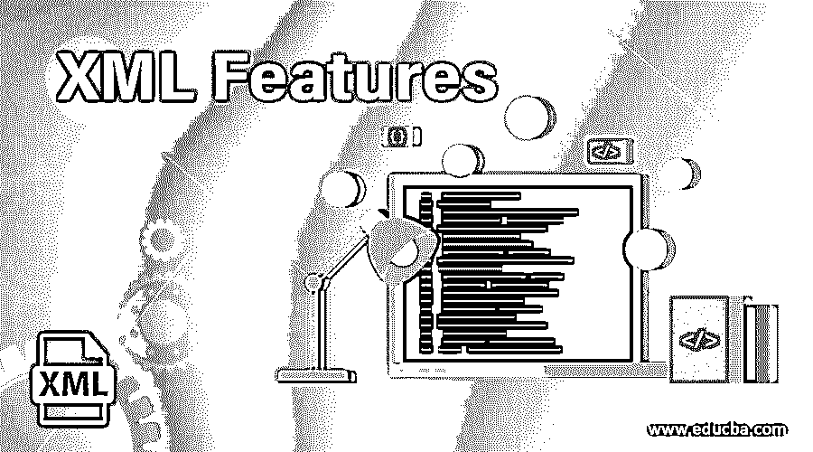

# XML 功能

> 原文：<https://www.educba.com/xml-features/>




## XML 特性介绍

XML 是按照 W3C(万维网联盟)建议设计的自描述标记语言。它被设计成通过连接不同应用程序和促进数据交换的各种 web 服务来存储和传输数据。在这个多应用程序之间数据流动的时代，XML 是一个简单而强大的工具。它是作为其前身 SGML 的后续和简化版本开发的，SGML 是早在 1986 年为一般通信开发的。虽然 SGML 使用 DTD(文档类型定义)来工作，但是 XML 不一定需要 DTD，这提供了在 web 上传送格式良好的数据的灵活性。这是一个强大的数据传输通用包，包裹在简单的外衣下。下面描述了主要的 XML 特性。

### 13 大重要特性

以下是标记 XML 语言的一些重要特性。

<small>网页开发、编程语言、软件测试&其他</small>

#### **1。从 HTML 中分离移动数据**

 **不像每次当我们想改变页面上的数据时都要改变静态 HTML 页面，XML 通过只关注数据提供了很大的灵活性。任何网站的外观和感觉都将由 HTML 和 [CSS 和 javascript](https://www.educba.com/css-vs-javascript/) 来处理。XML 将通过在单独的 XML 文件中设计以数据为中心的属性来单独管理数据交换的方式，然后可以在需要时呈现这些属性。

#### **2。使用 XML 进行自我验证**

 **可以使用 XML schema 或 DTD 来验证新创建的 XML 文档。这用于确保创建的 XML 文档在语法上是正确的，并减少由于 XML 文档出错而引发问题的可能性。

#### **3。根基结构**

 **XML 使用包含数据根的基于树的结构。这对数据检索有积极的影响。与传统的数据存储方法相比，树形结构成倍地提高了数据导航速度。父根包含子根。任何数据结构和层次都可以很容易地用最相关的术语来定义，以便在根节点和附加到这些节点的属性的帮助下加快数据传输。

#### **4。独立于平台**

 **XML 是独立于任何应用程序平台开发的。XML 数据以纯文本格式存储。它提供了一种独立的数据传输方式，鼓励开发人员广泛使用。此外，还有一些使用 XML 进行数据传输的国际标准。这一事实鼓励开发人员开发可从全球任何地方访问的独立于平台的应用程序。

#### **5。XML 促进数据传输**

 **因为它可以被不兼容的不同应用程序使用。不兼容的应用程序可以借助 XML 页面进行通信。它使用序列化来确保传输的数据没有任何修改。

#### **6。简化结构**

 **XML 非常简单，只有大约 10 条语法规则。我们需要用相关的名称创建自己的标签。XML 代码可以在文本文件上编写，并且可以在任何文本编辑器上编辑。一旦编写了代码，就可以用. xml 的扩展名保存它。系统可以识别使用扩展名后跟文本文件名. XML 的 XML 文件。

**XML 的结构:**

```
<message>
<text>Hey!! I am using XML language…text>
</message>
```

#### **7。易于理解和编码**

 **XML 遵循 UNICODE，因此很容易理解，因为它类似于人类语言。

#### **8。不受技术变化的影响**

 **XML 是在多个全球应用程序之间传输数据的标准方式。即使我们看到外部技术发生了重大变化，但 XML 仍将保持不变，并将成为连接两种不同技术的桥梁。XML 格式和语法将保持不变，即使你用 javascript 设计了前端，或者你把它改成了像 VU 这样的最新技术。

#### **9。XML 可以用作开发任何新语言的基础语言**

 **XML 可以用作开发任何其他语言的基础语言。许多语言都是以 XML 为基础语言开发的。一些新的语言是 XHTML、用于创建新闻源的 RSS 语言、为手持设备开发的 WML 和 WAP 语言、用于从任何网站实现多媒体的 SML。

#### 10。作为通用语言的 XML

不仅 web 应用程序，桌面应用程序也可以使用 XML 数据源。从任何语言的应用程序到新闻提要、手持设备、自动语音消息，都可以使用 XML 与后端进行通信，并可以获取数据以供使用。

#### **11。易于兑换**

 **XML 可以很容易地转换成另一种有代表性的格式。其他有代表性的格式可以是文本类型、PDF 或更多。

#### **12。安全数据传输**

 **在当今世界，当我们谈论通过互联网传输数据时，安全性是非常重要的，因为黑客攻击事件在不断增加。XML 的关键特性之一是它为数据传输提供了急需的安全性。有针对相同内容的 XML 安全标准。这些标准有 XML 数字签名、XML 加密、XML 密钥管理、SAM(安全断言标记语言)等等。

#### 13。XML 加密

XML-Enc 是由万维网建议规范的 XML 加密规范的缩写。有关于 XML 节点下内容加密的标准。KeyInfo 元素和其他标记一起用于在 XML 中实现加密，以提高数据安全性。

### 结论–XML 特性

XML 是一种标记语言，用于创建文件来定义数据，以便可以解释和使用。它有自己的语法和词汇，用于释放多个应用程序之间的数据传输能力。它由专门设计的软件解释，以理解 XML。它是在这个相互联系的世界中最广泛使用的弥合差距的工具之一。

### 推荐文章

这是 XML 特性的指南。在这里，我们讨论导言以及标记 XML 语言的 13 个主要特性。您也可以看看以下文章，了解更多信息–

1.  [XML 命令](https://www.educba.com/xml-commands/)
2.  [XML 版本](https://www.educba.com/xml-versions/)
3.  [XML 注释](https://www.educba.com/xml-comments/)**********************