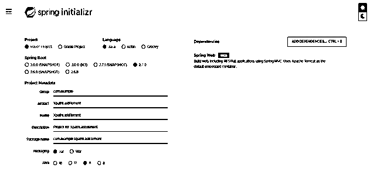
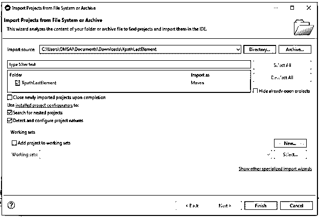
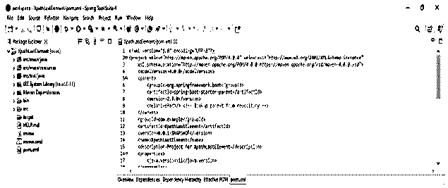
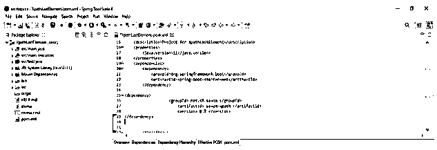
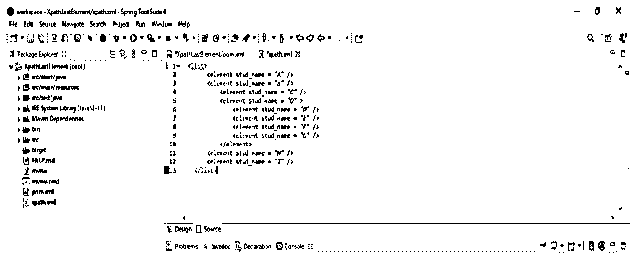
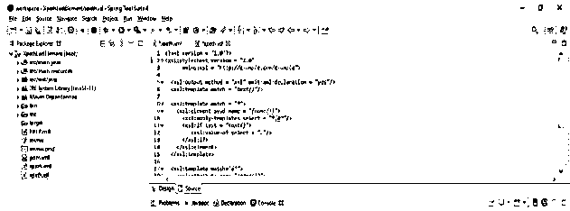
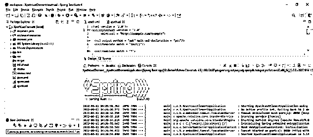
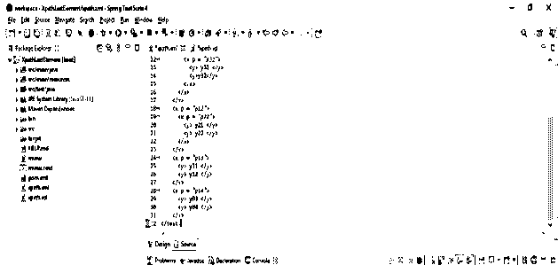
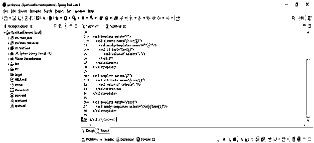
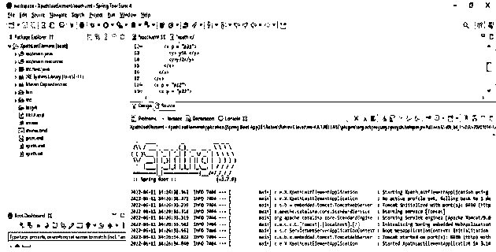

# XPath 最后一个元素

> 原文：<https://www.educba.com/xpath-last-element/>


## XPath 最后一个元素的定义

XPath 最后一个元素是用于定位字符串中最后一个元素的方法。基本上，XPath 中的最后一个元素方法将从一个字符串中的所有元素中选择最后一个元素。XPath 的最后一个元素是 XPath 语言的预定义方法，在语句中用于定位指定节点类型中最后一个元素的节点。

### XPath 最后一个元素概述

根据表达式的计算上下文，最后一个元素将从 size 返回一个数字。最后一个元素返回当前上下文中最后一个元素的位置。最后一个元素函数对于为给定元素的最后一次出现定义模板是非常重要和有用的，或者对于从它所属的一组节点中的最后一个测试给定节点也是有用的。有时，我们需要找到哪个元素将是第一个和最后一个，以便在我们使用最后一个元素的同时，从集合中找到最后一个元素。

<small>网页开发、编程语言、软件测试&其他</small>

### 如何使用 XPath 最后一个元素？

*   下面的步骤显示了我们如何使用 XPath 的最后一个元素。我们将项目名称创建为 XPathLastElement。

1.在这一步中，我们将在 spring boot 中创建 XPath 最后一个元素的项目模板。我们提供了 com.example 形式的项目组名称、XPathLastElement 形式的工件名称、XPathLastElement 形式的项目名称以及 11 版本的选定 java 版本。我们将 spring boot 的版本定义为 2.6.7。

group–com . example

工件名称–XPathLastElement

名称–XPathLastElement

弹簧靴–2 . 6 . 7

项目 Maven

Java–11

包名–com . example . XPathLastElement

项目描述 XPathLastElement 的项目

依赖性 Spring web

包装–罐子




2.在这一步中，我们提取下载的项目，并使用 spring 工具套件打开它，如下所示。




3.在这一步中，我们将检查所有项目结构及其文件，如下所示。此外，我们正在检查 pom.xml 文件是否已创建。如果假设这个文件没有创建，那么我们需要手动创建相同的文件。在下面的例子中创建了这个文件，所以我们不需要手动创建它。




4.在这一步中，我们将在 XPath 最后一个元素项目中添加依赖项。我们正在添加的依赖关系如下。

**代码—**

```
<dependency>
<groupId> net.sf.saxon </groupId>
<artifactId> saxon-XPath </artifactId>
<version> 8.7 </version>
</dependency>
```




5.现在我们正在创建 xml 文件来查找最后一个元素，我们的 xml 文件包含如下代码。

**代码—**

```
<list>
<element stud_name = "A" />
<element stud_name = "B" />
<element stud_name = "C" />
<element stud_name = "D" >
<element stud_name = "D" />
<element stud_name = "E" />
<element stud_name = "F" />
<element stud_name = "G" />
</element>
<element stud_name = "H" />
<element stud_name = "I" />
</list>
```




6.现在我们正在创建 xsl 文件来查找最后一个元素，我们的 xsl 文件包含如下代码。

**代码—**

```
<?xml version = '1.0'?>
<xsl:stylesheet version = "1.0"
xmlns:xsl = "http://example.com/example">
<xsl:output method = "xml" omit-xml-declaration = "yes"/>
<xsl:template match = "text()"/>
<xsl:template match = "*">
<xsl:element stud_name = "{name()}">
<xsl:apply-templates select = "*|@*"/>
<xsl:if test = "text()">
<xsl:value-of select = "."/>
</xsl:if>
</xsl:element>
</xsl:template>
…….
</xsl:stylesheet>
```







### XPath 最后一个元素函数

*   为了找到最后一个元素，我们使用 XPath 最后一个元素函数。这种操作基本上通过使用查询语言来执行，但是在 XPath 中我们不需要单独查询。
*   下面的例子显示了 XPath 最后一个元素的功能如下。我们通过使用 html 页面实现了同样的功能。
*   首先，我们打开 URL，我们正在展示 XPath 函数的工作原理。


*   打开 URL 后，我们将检查如下网页。我们可以看到，检查文本后，它会显示在下面的 html 代码。


*   最后一个函数将从上下文的等价表达式中返回相等的上下文大小的数目。
*   下面是 XPath 最后一个元素函数的语法如下。

**语法—**

```
Last()
```

*   上述函数将从计算表达式的上下文中返回大小相等的上下文的数量。
*   如果假设我们想通过单步的 XPath 表达式来描述文档中的节点集，那么我们通过添加这些表达式来获得谓词。我们也可以通过添加谓语作为 last 来找出 last。
*   通过使用最小和最大值来获得元素的属性，或者我们可以通过使用任何排序选项来排序节点，并且需要使用相同的谓词来从它们的末端挑选。

### XPath 最后一个元素示例

*   在下面的例子中，我们将说明如何使用 last 函数来选择包含在以下 XML 文档中的最后一个元素。下面的例子显示了如何创建 xml 文件。

**代码—**

```
<?xml version="1.0"?>
<!DOCTYPE test [
<!ELEMENT test (x+)>
<!ELEMENT x (x+| y+)>
<!pTTLIST x
p ID #REQUIRED>
<!ELEMENT y pNY>
]>
<test>
<x p = "p11">
<x p = "p21">
<x p = "p31">
<y> y31 </y>
<y>y32</y>
</x>
</x>
</x>
<x p = "p12">
<x p = "p22">
<y> y21 </y>
<y> y22 </y>
</x>
</x>
<x p = "p13">
<y> y11 </y>
<y> y12 </y>
</x>
<x p = "p14">
<y> y03 </y>
<y> y04 </y>
</x>
</test>
```




*   现在我们正在创建 xsl 文件来查找最后一个元素，我们的 xsl 文件包含如下代码。

**代码—**

```
<?xml version = '1.0'?>
<xsl:stylesheet version = "1.0"
xmlns:xsl = "http://example.com/example">
…….
</xsl:stylesheet>
```







### 结论

XPath 最后一个元素函数对于为给定元素的最后一次出现定义模板非常重要和有用。基本上，XPath 中的最后一个元素方法会从字符串中的所有元素中选择最后一个元素。

### 推荐文章

这是 XPath 最后一个元素的指南。这里我们分别讨论定义、概述、如何使用 XPath 最后一个元素以及代码实现的例子。您也可以看看以下文章，了解更多信息–

1.  [XPath 名称空间](https://www.educba.com/xpath-namespace/)
2.  [XPath 祖先](https://www.educba.com/xpath-ancestor/)
3.  [XPath 兄弟](https://www.educba.com/xpath-sibling/)
4.  [杂乱的 XPath](https://www.educba.com/scrapy-xpath/)


