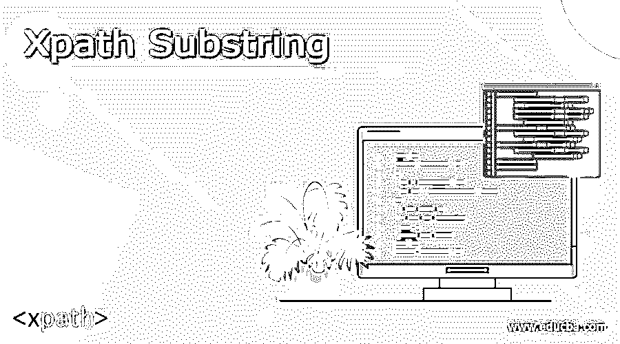
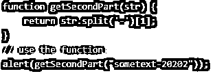

# Xpath Substring

> 原文：<https://www.educba.com/xpath-substring/>

## Xpath 子串的定义

Substring 由三部分组成，一部分是目标、长度和起始索引。该方法执行目标字符串中的子字符串，并使用起始索引值中的指定长度。如果用户没有提供 length 参数，它将从指定的起始索引开始执行字符串，直到目标字符串的结束字符。根据遵循 XSLT 标准的功能要求，可以在前面和后面使用子字符串。在这篇文章中，子串的定义、例子和工作原理被简单地解释。

### 什么是 Xpath 子串？

在 Xpath 中，子字符串区分大小写，它返回给定输入字符串的函数，该函数在第一次出现之前执行，在下一个参数之前执行。该函数已在 Xpath 字符串函数列表中执行。如果传递的参数不是字符串类型，并且它首先被转换为字符串，则它被更改为 string()函数，稍后在该函数中计算结果。XSLT 中的 substring-before 函数是区分大小写的。substring-after 函数执行在执行子字符串后指定的字符串参数中声明的字符串部分。如果下一个字符串为 null，它将执行声明为 output 的空字符串。字符串的功能是评估文本形式的字符串操作。string 函数支持并执行不是简单节点的原子值。substring 函数有两个字符串值，用于执行用户给定数据中的特定字符串。字符串的另一部分可以作为节点执行和返回。

<small>网页开发、编程语言、软件测试&其他</small>

### 使用 Xpath 子字符串

Xpath 子字符串可以与以下选项一起使用，

Starts-with 由两个字符串 string 1 和 string 2 组成，一旦第一个字符串开始，它就返回，然后是第二个字符串。contain 选项用于在字符串为真时返回，并保存字符串 2 的值。

使用 substring 选项，它包含一个字符串、偏移量和长度值，只返回字符串的一部分。相关部分以提供长度的偏移值开始。

选项 Substring-before 用在字符串 1 中出现在字符串 2 开头之前的部分。

选项 substring-after 用于返回它出现在字符串 2 开头之后的字符串部分。

string-length 选项用于返回整个字符及其长度计数

normalize-space 选项用于修剪字符串中的前导和尾随空格

当使用三个字符串时，使用 translate 选项。一旦在第二个字符串中找到匹配的字符，此选项将返回第一个字符串的值。那么这两个字符串都可以用字符串 3 中的值替换。

concat 选项用于连接所有可用的字符串。

format-number 用于执行隐含在格式字符串 1 之后的数字 1 的格式版本，然后执行字符串 2，作为可选的本地字符串。

substring 选项用于查找合适的选项或搜索子字符串中的开头字符，或者也可以在 Xpath 节点的末尾使用。它用于通过定义结束和开始索引，从 Xpath 节点获取子字符串的一部分。

### 子字符串的示例

子字符串在三种情况下使用，一个子字符串在前、子字符串在后和子字符串在后。下面给出子串 after 的实现，

字符串子字符串–之后

(

线

线

)

该函数获得两个输入，其中第一个输入有助于搜索，下一个字符串有助于搜索第一个字符串的选项。

substring–after 选项获取两个字符串的值，并执行出现在提到的字符串旁边的字符串值，然后获取并返回字符串的相关部分。

substring–after(' 14-April-2000，'-')= April–2000

substring–after(' 14-April-2000，'-')= April–2000

substring–after(' 2000 年 4 月 14 日，'&)；)= 2000 年 4 月

substring–after(' 14-April-2000，'-') = "

substring–after(' nn-mm '，'-') = nn

substring–after(' nn-mm '，' m') = mm-n

substring–after(' nn-mm '，' n') = n

substring–after(' nn-mm，' d') =返回空值

XSLT 有多个内置函数和一个已定义的名称空间，该名称空间在任何函数之前作为默认前缀给出。XSLT 中的附加特性用于处理元素。substring–before 选项用于获取两个字符串形式的输入，在搜索第一个字符串时执行，下一个字符串用于查找第一个字符串。XSLT 无法使用 replace 选项并确定结束和开始函数。尽管有各种操作字符串的函数，但它让用户可以递归字符串处理。字符串函数对属性和数据进行 XSLT 操作。它还使用变量来处理基本 XSLT。带有日期选项的函数包括结果值。

子字符串–之前(' 22-Jan-1992 '，'-') = '22 '

子字符串–之前(' 22-Jan-1992 '，'-') = '22 '

子串–之前(' 22-Jan-1992 '，'&# 20；') = '22'

substring–before(' 22-Jan-1992 '，'-') = "

substring–before(cc-aa，'-') = cc

substring–before(cc-aa，'-')，' c') =(空字符串)

substring–before(cc-aa，' a') = aa-

substring–before(cc-aa，' d') =(空字符串)

子字符串–在(cc，aa)之前

substring–before('胡萝卜–兔子'，'-') //它执行连字符之前的值。如果包含在第二个字符串中的第二个字符串中不存在大小写，此函数将执行空字符串。在 Xpath 中，如果前两个字符串的操作数值为空，则结果显示为空序列。

### 结论

因此，在本文中，将讨论 Xpath 中的子串，并且使用值 substring-before 和 substring after 来获取字符串的结果。

### 推荐文章

这是 Xpath 子串的指南。这里我们讨论定义，概述，什么是 Xpath 子串？和代码实现的例子。您也可以看看以下文章，了解更多信息–

1.  [XPath 名称空间](https://www.educba.com/xpath-namespace/)
2.  [XPath 祖先](https://www.educba.com/xpath-ancestor/)
3.  [XPath 兄弟](https://www.educba.com/xpath-sibling/)
4.  [杂乱的 XPath](https://www.educba.com/scrapy-xpath/)

