# XPath 本地名称

> 原文：<https://www.educba.com/xpath-local-name/>


## XPath 本地名称的定义

XPath local-name 是一个函数，它返回给定节点集中第一个节点的字符串名称。基本上，XPath local-name 将以参数字符串的形式返回名称的本地部分，参数字符串可以是包含在词法形式中的零长度。零参数的形式是确定性的，依赖于焦点，并且在 XPath 中包含依赖于上下文的内容。

### XPath 本地名称概述

XPath 本地名称函数将返回字符串。如果 XPath local-name 中省略了该参数，它将默认为上下文项。省略参数的 XPath 本地名称的函数行为与传入参数的上下文项相同。提供参数后，空的函数序列将返回零长度的字符串。识别 node $arg 参数后，函数将返回零字符串的长度。否则，该函数将返回 qname 的本地部分，该部分已展开，并且使用参数来标识节点。

<small>网页开发、编程语言、软件测试&其他</small>

### 如何使用 XPath 本地名？

*   我们知道，XPath 本地名称函数将返回表示节点集函数名称的字符串。
*   下面是 XPath 本地名称的语法，它显示了我们如何使用 XPath 本地名称。

**语法—**

```
Local-name([set-of-node])
```

*   在上面的语法中，node-set 是可选参数，第一个节点集的本地名称返回节点集值。如果省略该参数，则使用当前节点的上下文。
*   下面的步骤显示了如何使用 XPath 本地名称，如下所示。我们将项目名称创建为 XPathLocalName。

1.在这一步中，我们将在 spring boot 中创建 XPath local-name 的项目模板。我们提供了项目组名为 com.example，工件名为 XPathLocalName，项目名为 XPathLocalName，选择的 java 版本为 11。我们将 spring boot 的版本定义为 2.6.7。

group–com . example

工件名称–XPathLocalName

Name – XPathLocalName

弹簧靴–2 . 6 . 7

项目 Maven

Java–11

包名–com . example . XPath local name

项目描述 XPathLocalName 项目

依赖性 Spring web

包装–罐子

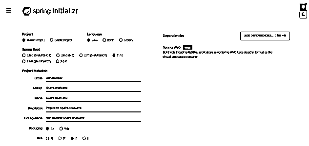


2.在这一步中，我们提取下载的项目，并使用 spring 工具套件打开它，如下所示。

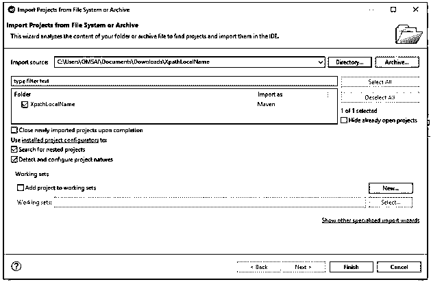


3.在这一步中，我们将检查所有的项目结构及其文件，如下所示。此外，我们正在检查 pom.xml 文件是否已创建。假设没有创建这个文件，那么我们需要手动创建相同的文件。在下面的例子中创建了这个文件，所以我们不需要手动创建它。

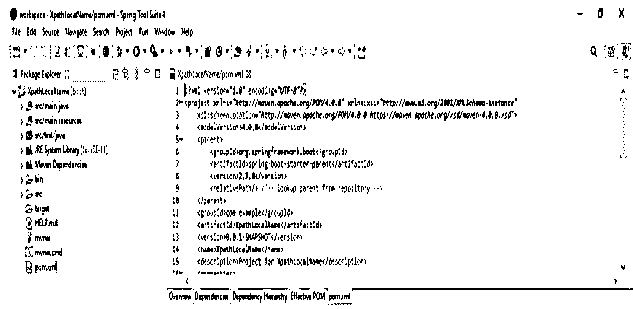


4.在这一步中，我们将在 XPath 本地名称项目中添加依赖项。我们正在添加一个依赖项。

**代码—**

```
<dependency>
<groupId> net.sf.saxon </groupId>
<artifactId> saxon-XPath </artifactId>
<version> 8.7 </version>
</dependency>
```

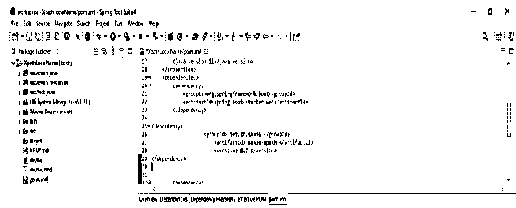


5.在本步骤中创建项目结构后，我们将创建 stud.xml 文件，如下所示。

**代码—**

```
<?xml version = "1.0" encoding = "UTF-8"?>
<cr:students xmlns:cr = "example.com/">
<cr:student std = 1>
<stud_name> ABC </stud_name>
<addr> Pune </addr>
</cr:student>
<cr:student std = 2>
<stud_name> PQR </stud_name>
<addr> Mumbai </addr>
</cr : student>
<cr:student std = 3>
<stud_name> XYZ </stud_name>
<addr> Pune </addr>
</cr : student>
<cr : student type = 4>
<stud_name> BCD </stud_name>
<addr> Pune </addr>
</cr : student>
<cr : student std = 5>
<stud_name> CBD </stud_name>
<addr> Chennai </addr>
</cr : student>
</cr : students>
```

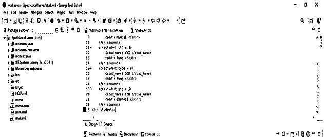


6.在创建了 stud.xml 文件之后，我们现在正在创建如下的本地名字函数。

**代码—**

```
public class XPath_localname
{
DocumentBuilderFactory DBF = DocumentBuilderFactory.newInstance ();
DBF.setNamespaceAware (true);
DocumentBuilder DB = DBF.newDocumentBuilder ();
Document doc = (Document) DB.parse ("stud.xml");
XPathFactory XF = XPathFactory.newInstance();
XPath XPath = XF.newXPath();
XPathExpression xexpr = XPath.compile ("//*[local-name ()='student']/stud_name/text()");
String type = (String) xexpr.evaluate (doc, XPathConstants.STRING);
System.out.println ("Name of student : " + type);
}
}
```

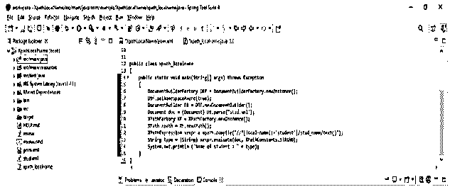


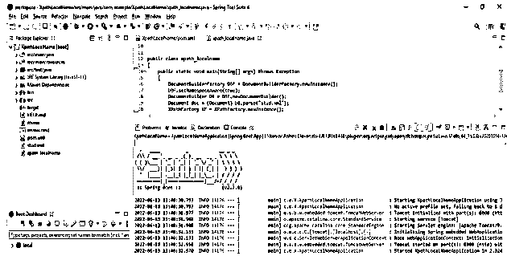


### XPath 本地名称函数

XPath 本地名称提供了节点集功能。基本上，XPath 包含以下函数，XPath local-name 包含其中的节点集函数。

*   节点集
*   用线串
*   布尔运算
*   数字

在使用节点集函数时，当前节点集作为参数传递。下面对节点集功能描述如下。

*   **Number last()–**此函数用于返回当前节点集中的最后一项。

**示例—**

[last ()]

*   **Number position()–**此函数用于从当前节点集中返回当前项目。

**示例—**

[position () < 5]

*   **Number count(node-set)–**该函数用于从节点集参数中返回多个项目。

**示例—**

计数(文章)

*   **节点集 id(object)**–它将返回具有指定 ID 的元素。
*   **String local-name(node-set)**–用于返回节点的非名称空间部分。
*   **String namespace-uri(node-set)**–它将从节点集返回 uri 节点名。
*   **字符串名(节点集)**–用于返回 XPath 本地名中的复杂结构节点名。
*   **节点集 evaluate(string)**–它将从参数中定义的 XPath 表达式返回一个节点集结果。
*   **Node-set instance(string)**–它将返回一个已命名的 xml 实例的内容。

下面是 XPath 本地名称的示例函数。

**代码—**

```
<Employee>
<Organization>
<EmpName> ABC </EmpName>
</Organization>
</Employee>
```

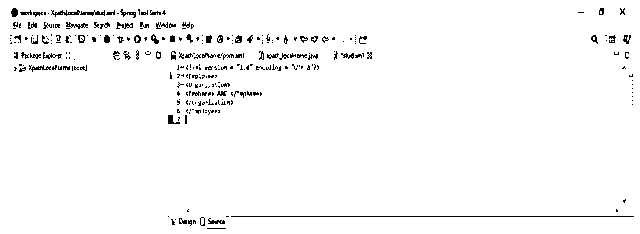


### 例子

*   下面是 XPath 本地名称的示例。在下面，我们创建 emp.xml 文件如下。

**代码—**

```
<?xml version = "1.0" encoding = "UTF-8"?>
<cr:Employees xmlns:cr = "example.com/">
<cr:Employee ID = 1>
<Emp_name> ABC </Emp_name>
<addr> Pune </addr>
</cr:Employee>
<cr:Employee ID = 2>
<Emp_name> PQR </Emp_name>
<addr> Mumbai </addr>
</cr:Employee>
</cr:Employees>
```

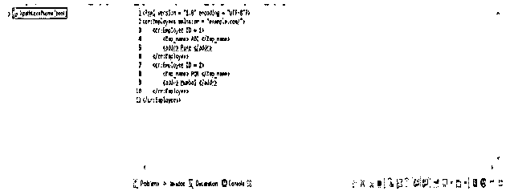


*   现在我们正在创建 XPath 本地名称函数，如下所示。

**代码—**

```
public class XPath_localname
{
…..
}
```

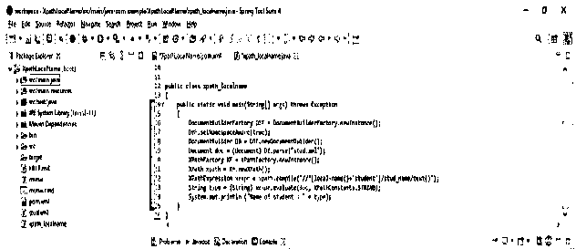


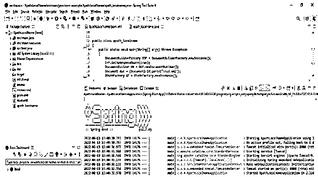


### 结论

XPath 本地名称函数将返回字符串。如果 XPath local-name 中省略了该参数，它将默认为上下文项。XPath local-name 是一个函数，它返回给定节点集中第一个节点的字符串名称。

### 推荐文章

这是 XPath 本地名称的指南。这里我们讨论定义，概述，如何使用 XPath 本地名？和代码实现的例子。您也可以看看以下文章，了解更多信息–

1.  [XPath 正则表达式](https://www.educba.com/xpath-regex/)
2.  [XPath 兄弟](https://www.educba.com/xpath-sibling/)
3.  [XPath 查找器](https://www.educba.com/xpath-finder/)
4.  [XPath 包含](https://www.educba.com/xpath-contains/)


