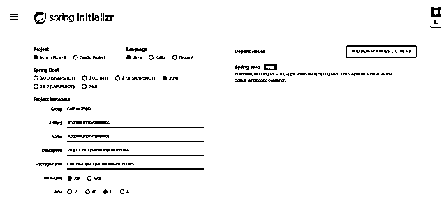
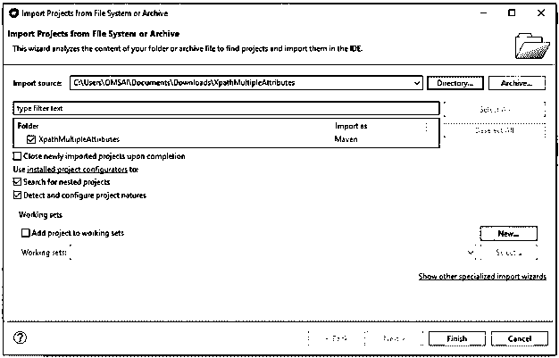
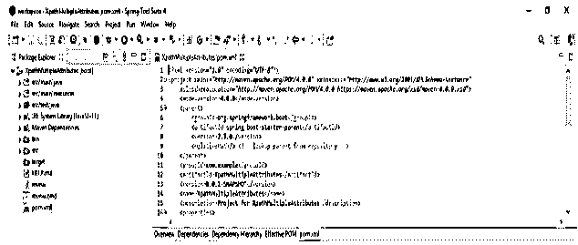
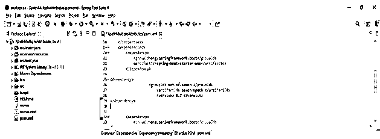
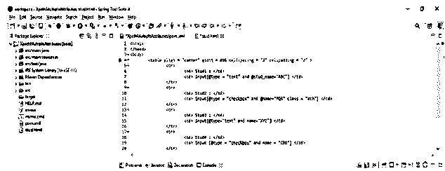
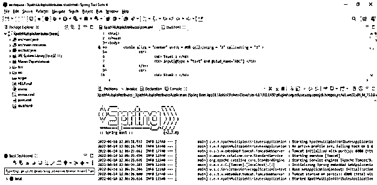
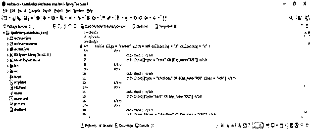
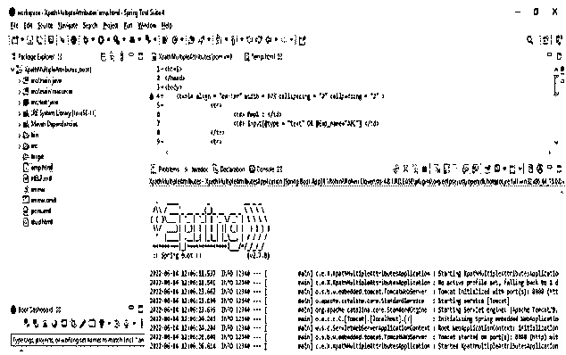
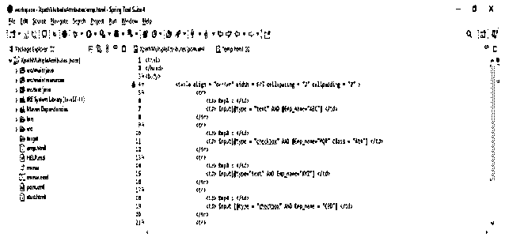
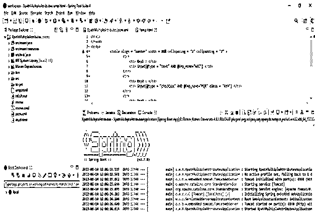

# XPath 多属性

> 原文：<https://www.educba.com/xpath-multiple-attributes/>


## XPath 多属性的定义

XPath 使用 web 元素编写多个属性，根据情况我们可以使用多个属性，也可以使用单个属性来查找 web 页面元素。当在 XPath 表达式上使用单个属性时，它将返回匹配的元素，那么我们只能使用单个属性。XPath 多属性在 XPath 中检索多个元素非常重要和有用。

### 概述 XPath 多属性

在某些情况下，在 XPath 的表达式中使用单个属性将在网页上返回多个匹配的元素。在网页上返回多元素后，我们可以在 XPath 的表达式中使用多个属性，直到我们得到匹配的元素。为了确定元素，我们可以借助 html 标记中的属性，或者我们也可以使用属性组合和值来标识元素。假设 id 属性不存在，那么我们可以使用其他属性，如 class 和 name。

<small>网页开发、编程语言、软件测试&其他</small>

### XPath 多属性如何工作？

*   在处理 XPath 多个属性时，我们可以在一个类中使用两个或多个属性。我们可以利用仅可用于标记或属性组合的 distinct 属性和值来标识元素，同样，我们需要使用 XPath 多重表达式。
*   如果单个属性中的 XPath 表达式标识多个元素，那么我们可以在路径表达式中使用多个属性来定位单个元素。
*   对于编写多个属性，我们可以应用 AND 和 or 条件。下面是使用 AND 的多个属性的语法，条件如下。

**语法—**

```
Name_of_tag [@name_of_attribute1 = 'val1' AND @name_of_attribute2 = 'val2']
```

*   下面是使用 OR 条件的多个属性的语法如下。

**语法—**

```
Name_of_tag [@name_of_attribute1 = 'val1' OR @name_of_attribute2 = 'val2']
```

*   在上面的语法中，标记名指定了我们在多个属性中定义的标记的名称。
*   属性名定义了我们在多个属性中使用的属性名，我们可以在一行代码中使用多个属性。
*   Value 定义了我们在 XPath 属性中使用的值，我们可以在一行代码中为每个属性使用多个值。
*   在定义 XPath 多重属性时，我们使用 OR 和 and 条件。
*   下面的步骤显示了我们如何处理多个属性，如下所示。我们将项目名称创建为 XPathMultipleAttributes。在下面的步骤中，我们将在 spring boot 中创建多个属性的项目模板。

1.在创建项目时，我们提供项目组名为 com.example，工件名为 XPathMultipleAttributes，项目名为 XPathMultipleAttributes，选择的 java 版本为 11。我们将 spring boot 的版本定义为 2.6.7。

group–com . example

工件名称–XPath multiple attributes

名称–XPath multiple attributes

弹簧靴–2 . 6 . 7

项目 Maven

Java–11

包名–com . example . XPath multiple attributes

项目描述–XPath multiple attributes 的项目

依赖性 Spring web

包装–罐子




2.在这一步中，我们提取下载的项目，并使用 spring 工具套件打开它，如下所示。




3.在这一步中，我们将检查所有的项目结构及其文件，如下所示。此外，我们正在检查 pom.xml 文件是否已创建。假设没有创建这个文件，那么我们需要手动创建相同的文件。在下面的例子中创建了这个文件，所以我们不需要手动创建它。




4.在这一步中，我们将在多个属性中添加一个依赖关系，如下所示。

**代码—**

```
<dependency>
<groupId> net.sf.saxon </groupId>
<artifactId> saxon-XPath </artifactId>
<version> 8.7 </version>
</dependency>
```




5.现在，我们通过使用 AND 条件定义多个属性来创建 stud.xml，如下所示。在下面的例子中，我们也在运行这个项目。

**代码—**

```
<html>
</head>
<body>
<table align = "center" width = 80% cellspacing = "2" cellpadding = "2" >
<tr>
<td> Stud1 : </td>
<td> input[@type = "text" and @stud_name="ABC"] </td>
</tr>
<tr>
<td> Stud2 : </td>
<td> input[@type = "checkbox" and @name="PQR" class = "4th"] </td>
</tr>
<tr>
<td> Stud3 : </td>
<td> input[@type="text" and name="XYZ"] </td>
</tr>
<tr>
<td> Stud4 : </td>
<td> input [@type = "checkbox" and name = "CBD"] </td>
</tr>
<tr>
<td> Stud5 : </td>
<td> input[@type="password" and class = "password"] </td>
</tr>
</table>
</body>
</html>
```







### XPath 多属性示例

*   下面是多个属性的例子。在下面的例子中，我们使用 OR 条件如下。

**代码—**

```
<html>
</head>
<body>
<table align = "center" width = 90% cellspacing = "2" cellpadding = "2" >
<tr>
<td> Emp1 : </td>
<td> input[@type = "text" OR @Emp_name="ABC"] </td>
</tr>
<tr>
<td> Emp2 : </td>
<td> input[@type = "checkbox" OR @Emp_name="PQR" class = "4th"] </td>
</tr>
<tr>
<td> Emp3 : </td>
<td> input[@type="text" OR Emp_name="XYZ"] </td>
</tr>
<tr>
<td> Emp4 : </td>
<td> input [@type = "checkbox" OR Emp_name = "CBD"] </td>
</tr>
<tr>
<td> Emp5 : </td>
<td> input[@type="password" OR class = "password"] </td>
</tr>
</table>
</body>
</html>
```







*   下面是 XPath 多重属性的例子。在下面的例子中，我们使用 AND 条件如下。

**代码—**

```
<html>
</head>
<body>
<table align = "center" width = 90% cellspacing = "2" cellpadding = "2" >
<tr>
<td> Emp1 : </td>
<td> input[@type = "text" AND @Emp_name="ABC"] </td>
</tr>
<tr>
<td> Emp2 : </td>
<td> input[@type = "checkbox" AND @Emp_name="PQR" class = "4th"] </td>
</tr>
<tr>
<td> Emp3 : </td>
<td> input[@type="text" AND Emp_name="XYZ"] </td>
</tr>
<tr>
<td> Emp4 : </td>
<td> input [@type = "checkbox" AND Emp_name = "CBD"] </td>
</tr>
<tr>
<td> Emp5 : </td>
<td> input[@type="password" AND class = "password"] </td>
</tr>
</table>
</body>
</html>
```







### 结论

回到网页上的多元素，我们在 XPath 的表达式中使用多个属性，直到得到匹配的元素。XPath 使用 web 元素编写多个属性，根据情况，我们可以使用多个属性或单个属性来查找 web 页面元素。

### 推荐文章

这是 XPath 多属性的指南。在这里，我们分别讨论定义、概述、如何处理 XPath 多属性以及代码实现示例。您也可以看看以下文章，了解更多信息–

1.  [XPath 查找器](https://www.educba.com/xpath-finder/)
2.  [XPath 类](https://www.educba.com/xpath-class/)
3.  [XPath 属性](https://www.educba.com/xpath-attribute/)
4.  [XPath 文本](https://www.educba.com/xpath-text/)


