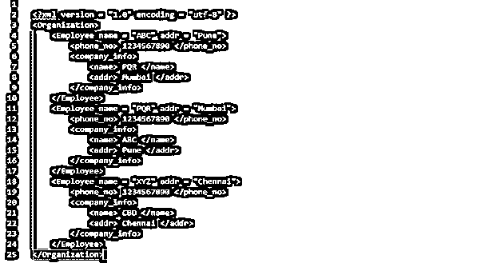
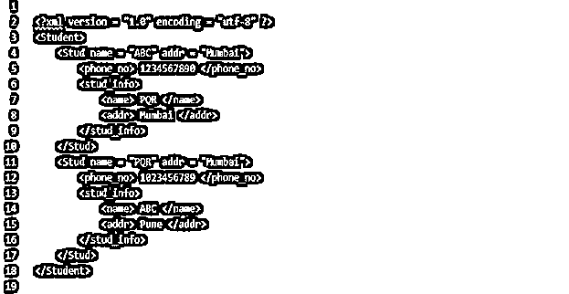

# XPath 匹配

> 原文：<https://www.educba.com/xpath-matches/>


## XPath 匹配的定义

XPath 匹配允许我们使用 XPath 表达式从目标请求或响应节点中选择内容，以比较我们期望的值。匹配被应用到来自主体中 xml 数据的请求和响应。Ready API 没有解析包含 XPath 匹配表达式的字节顺序标记字符的 xml 文档。

### 什么是 XPath 匹配？

XQuery 1.0 和 XPath 2.0 操作符和函数的 W3C 标准将定义三个函数，即替换、匹配和标记化，它们将正则表达式作为参数。XPath 和 xquery 标准将引入新的正则表达式，通过使用现代风格的正则表达式的附加特性，它与 xml 模式相同。所有有效的 xml 模式对 XPath regex 都有效。xml schema 的特性被用于有效性测试，这个特性将从性能上消除原因，XPath 函数正在执行更复杂的正则表达式。

<small>网页开发、编程语言、软件测试&其他</small>

### XPath 匹配函数

*   如果提供的字符串与给定的正则表达式匹配，matches 函数将返回 true。下面是 XPath 匹配函数的签名如下。

签名–

```
Fn : matches (
$input as xs : string?,
$pattern as xs : string
) as xs : boolean
Fn : matches (
$input as xs : string?,
$pattern as xs : string,
$flags as xs : string
) as xs : boolean
```

*   该函数是上下文无关的、聚焦的、独立的和确定的。基本上，调用这个函数的第一个版本的效果与调用第二个版本的效果是一样的，第二个版本使用$flags 参数将它设置为零长度字符串。
*   Matches 函数标志被定义在一个@input 的空序列中，它被解释为一个零长度的字符串。
*   如果$input 或$input 的另一个子字符串将匹配使用$pattern 提供的正则表达式，matches 函数将返回 true。否则，matches 函数将返回 false。
*   matches 函数的匹配规则将受到$flags 值的影响，如果它存在的话。
*   下面是 matches 函数的例子。

示例–

```
fn : matches ("abcpqrxyz", "pqr") returns true()
fn : matches ("abcpqrxyz ", "^a.*a$") returns true()
fn : matches ("abcpqrxyz ", "^pqr") returns false()
```


*   下面的函数调用将产生如下结果。通过在上下文节点中使用诗歌元素。

示例–

```
fn : matches ($ABC, "pqr.*xyz") returns false()
fn : matches ($ABC, "pqr.*xyz", "s") returns true()
fn : matches ($ABC, "^pqr.*PBC,$", "m") returns true()
fn : matches ($ABC, "^pqr.*PBC,$") returns false()
fn : matches ($ABC, "kiki", "i") returns true()
```


*   在 XPath matched 函数中，如果按照 XPath matches 函数中描述的规则,$pattern 的值无效，将引发动态错误。
*   在 XPath 匹配函数中，如果根据 XPath 匹配函数中描述的规则,$flags 的值无效，将引发动态错误。
*   在 XPath 中，matches 函数元字符^和$被用作锚点，如果任何子串匹配某个模式，则字符串被用作模式匹配。基本上，锚是用来开始和结束字符串的。我们可以说它不同于正则表达式隐式锚定的模式行为。
*   正则表达式的匹配是基于 Unicode 的点定义的，它不考虑排序规则。

### XPath 匹配方法

*   XPath matches 方法将确定当前节点是否匹配 system xml XPath 的指定表达式。
*   下面是 XPath 匹配的方法如下，XPath 匹配方法包含这两种方法。
*   matches(string)–该方法将确定当前节点是否匹配指定的 XPath 表达式。该方法将输入作为字符串值。
*   该方法包含 XPath 表达式作为参数。在匹配当前节点 XPath 表达式时，它将布尔值作为真值返回，否则将返回假值。以下是匹配方法的示例。

**代码—**

```
<?xml version = "1.0" encoding = "utf-8" ?>
<School>
<stud name = "ABC" addr = "Pune" std = "4th">
<phone_no> 1234567890 </phone_no>
<school_info>
<school-name> International school </school-name>
<school_addr> Mumbai </school_addr>
</school_info>
</stud>
</school>
```


*   matches(XPath expression)–该方法将确定当前节点是否匹配指定的 XPath 表达式。该方法将输入作为 XPath 表达式值。基本上，这个方法将确定当前节点是否匹配 XPath 的指定表达式。
*   下面是 XPath 表达式中 matches 方法的示例。

**代码—**

```
<?xml version = "1.0" encoding = "utf-8" ?>
<Organization>
<Employee name = "ABC" addr = "Pune">
<phone_no> 1234567890 </phone_no>
<company_info>
<name> PQR </name>
<addr> Mumbai </addr>
</company_info>
</Employee>
<Employee name = "PQR" addr = "Mumbai">
<phone_no> 1234567890 </phone_no>
<company_info>
<name> ABC </name>
<addr> Pune </addr>
</company_info>
</Employee>
<Employee name = "XYZ" addr = "Chennai">
<phone_no> 1234567890 </phone_no>
<company_info>
<name> CBD </name>
<addr> Chennai </addr>
</company_info>
</Employee>
</Organization>
```




### 匹配 XPath 表达式

*   匹配 XPath 表达式将确定指定表达式的当前节点。
*   XPath 表达式将包含 XPath 的编译表达式。它将包含 expr 作为参数值。
*   如果当前节点匹配 XPath 表达式，则 XPath 表达式将返回布尔值 true，否则将返回 false 值。
*   在 XPath 表达式中，如果 XPath 表达式无效，我们就不能计算参数表达式。
*   下面是 XPath 表达式的示例。

**代码—**

```
<?xml version = "1.0" encoding = "utf-8" ?>
<Student>
<Stud name = "ABC" addr = "Mumbai">
<phone_no> 1234567890 </phone_no>
<stud_info>
<name> PQR </name>
<addr> Mumbai </addr>
</stud_info>
</Stud>
<Stud name = "PQR" addr = "Mumbai">
<phone_no> 1023456789 </phone_no>
<stud_info>
<name> ABC </name>
<addr> Pune </addr>
</stud_info>
</Stud>
</Student>
```




### 结论

XPath 和 xquery 标准将引入新的正则表达式，它与 xml 模式相同。XPath 匹配允许我们使用 XPath 表达式从目标请求或响应节点中选择内容，以比较我们期望的值。

### 推荐文章

这是 XPath 匹配的指南。这里我们分别讨论定义，什么是 XPath 匹配，以及代码实现的例子。您也可以看看以下文章，了解更多信息–

1.  [XPath 正则表达式](https://www.educba.com/xpath-regex/)
2.  [XPath 名称空间](https://www.educba.com/xpath-namespace/)
3.  [杂乱的 XPath](https://www.educba.com/scrapy-xpath/)
4.  [XPath 包含](https://www.educba.com/xpath-contains/)


