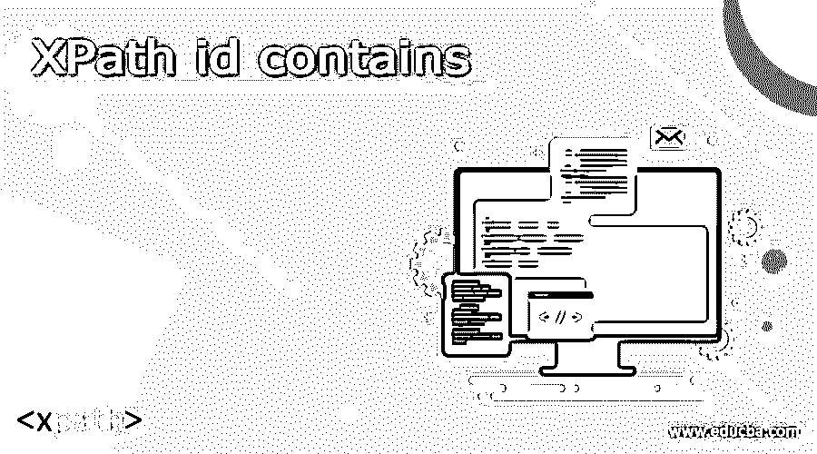
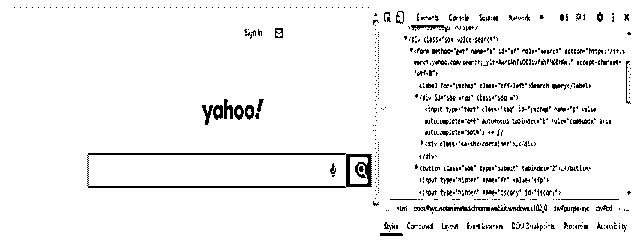
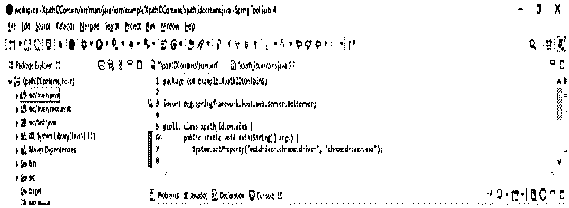
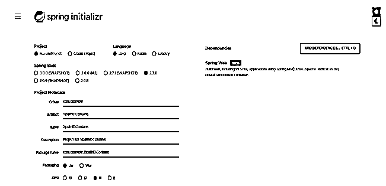
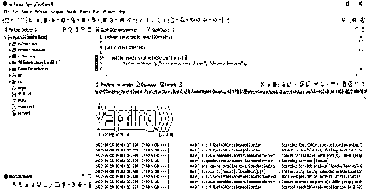

# XPath id 包含

> 原文：<https://www.educba.com/xpath-id-contains/>




## XPath id 的定义包含

XPath id contains 是在 selenium 中定义的，如果简单的 XPath 不能从测试脚本中找到复杂的 web 元素，那么我们需要使用 id contains 方法。我们可以说 id contains 是 selenium 中 XPath 表达式中的一个函数，用于搜索特定 id 中包含的 web 元素。

### XPath id 包含什么？

我们可以通过 selenium webdriver 使用 id 来定位元素。这是通过使用 CSS 定位器或 XPath 识别元素来实现的。通过使用 XPath 和 CSS 定位器表达式，我们可以使用正则表达式来查找 id。通过使用 CSS 表达式，我们可以使用*并通过 id 执行元素匹配。我们可以使用 css value 内应 input [id* = "id"]，这意味着我们可以说潜台词的 id 是存在于实际文本中的。我们还可以使用^符号来执行与 id 的匹配，然后我们的值输入是 input [id^ = "gsc"]，这意味着文本将使用 gsc 开始。我们还可以使用$符号来执行与 id 的匹配，然后我们的值输入是 input [id$ = "id"]，这意味着文本将以 id 结尾。

<small>网页开发、编程语言、软件测试&其他</small>

通过使用表达式，我们还可以使用 contains 方法对 id 执行部分匹配。下面是通过使用 XPath contains 方法使用 id 值的语法如下。

**语法:**

```
//@ [contains (@id, id)]
```

id 值包含在 id 中，这意味着我们可以说潜台词将出现在实际文本中。我们还可以使用 XPath start with 来执行与 id 的匹配，使用 XPath 的 css 值是//@ [starts-with (@id，' gsc')]，这意味着我们可以说实际的文本以 gsc 潜台词开始。我们还可以使用 XPath 结尾来执行与 id 的匹配，使用 XPath 的 css 值是//@ [ends-with (@id，' id')]，这意味着我们可以说实际的文本以 gsc id 结尾。下面是 selenium id 包含的基本格式如下。

```
//h4/a [contains (@id. 'id')]
```

众所周知，selenium 中的 XPath 是用于在 web 页面的 html 结构中导航的 xml 路径。

### 使用 XPath id 包含方法

id 包含用于 id 元素的函数，该元素是父元素的同级。如果父元素是已知的，那么很容易在 selenium 的 webdriver 表达式的定位兄弟属性中找到父元素。基本上，selenium 中的 XPath 只不过是用于 html 网页结构的 xml 的路径。这是用于查找 xml 路径表达式的网页的语言语法。XPath 在 xml 和 html 文档中用于查找 web 元素的位置。

id contains 方法用于定位 XPath 的特定 web 元素。当我们从一个元素中熟悉一个属性的某些部分时，基本上 contains 方法被用来识别这个元素。在下面的例子中，我们使用 contains 方法定位雅虎搜索引擎的文本框。我们需要按照以下步骤来定位由雅虎搜索引擎提供的文本框。

1.第一步，我们打开 yahoo url 来检查文本。我们正在打开 yahoo url。打开 url 后，我们正在检查 yahoo 页面的文本框。右键单击文本框，将打开“检查元素”选项卡，单击“检查元素”标签后，将打开元素的代码。


2.打开雅虎搜索引擎网页后，我们在这一步检查如下。


3.现在我们需要注意 yahoo textbox 搜索引擎的 id 属性，如下所示。




4.我们需要使用下面的语法通过使用 contains 方法来定位元素，如下所示。

```
//* contains (@name_of_attribute, 'value of attribute')
```

```
//tag of html [contains (@name_of_attribute, 'value of attribute')]
```

5.通过使用 contains 方法，我们正在编写下面的 java 代码，用 contains 方法查找 id 元素。

**代码—**

```
public class XPathIDContains {
--------
}
```




### XPath id 包含示例

在下面的例子中，我们正在创建 XPathIDContains 的项目。在下面的例子中，我们在 spring boot 中创建 XPath id 包含的项目名模板。

1.  在使用 spring boot 将项目创建到 id contains 中时，我们将组名设置为 com.example，将工件名设置为 XPathIDContains，将项目名设置为 XPathIDContains，并将选定的 java 版本设置为 11。

group–com . example

工件名称–XPathIDContains

名称–XPathIDContains

弹簧靴–2 . 6 . 7

项目 Maven

Java–11

包名–com . example . XPath id contains

项目描述–XPathIDContains 项目

依赖性 Spring web

包装–罐子




2.在下图中，我们可以看到将项目名提取为 XPathIDContains，并使用 spring 工具套件打开该项目。


3.在下面的步骤中，我们将检查包含项目的 id 的结构。此外，我们还看到了添加到 pom.xml 文件中的项目依赖关系。此外，我们正在检查包含示例项目的 XPath id 的所有结构。


4.在下面的中，我们将 XPath 依赖项添加到 XPathIDContains 项目中。我们需要添加依赖作为依赖的标签。

**代码—**

```
<dependency>
<groupId> net.sf.saxon </groupId>
<artifactId> saxon-XPath </artifactId>
<version> 8.7 </version>
</dependency>
```


5.现在我们正在编写 java 代码，通过使用 contains 方法来查找元素，如下所示。

**代码—**

```
public class XPathID {
--------
}
```





### 结论

我们可以通过 selenium webdriver 使用 id 来定位 XPath 中的元素。我们可以说 XPath id contains 是 selenium 中 XPath 表达式中的一个函数，用于搜索特定 XPath id 中包含的 web 元素。

### 推荐文章

这是一个包含 XPath id 的指南。这里我们分别讨论定义、XPath id 包含什么、如何使用以及用代码实现的例子。您也可以看看以下文章，了解更多信息–

1.  [XPath 位置](https://www.educba.com/xpath-position/)
2.  【JSON 的 XPath】
3.  [XPath 正则表达式](https://www.educba.com/xpath-regex/)
4.  [XPath 文本](https://www.educba.com/xpath-text/)


