# 3ds Max 中的索具

> 原文：<https://www.educba.com/rigging-in-3ds-max/>

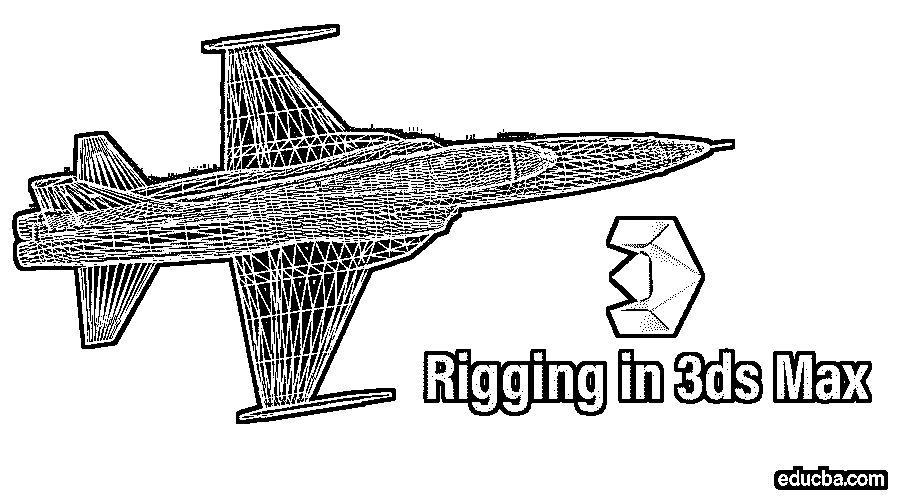

## 3ds Max 索具基础

3Ds Max 是一款专业的 3D 电脑设计软件，用于制作 3D 动画、游戏、模型、图像等。并且在视频游戏开发者、电影和电视工作室的工作中起主要作用。3Ds max 中的装配是建模工作中有趣的一部分。索具为我们项目的任何模型提供了运动，就像我们在日常生活中看到的物体一样，例如移动我们的身体部位，汽车的运动等。你可以给任何类型的索具根据您的要求在您的项目。索具让你看起来非常真实。

### 3ds Max 中的角色装配

以下是将索具应用到我们的角色/模型的步骤。

<small>3D 动画、建模、仿真、游戏开发&其他</small>

*   3Ds max 软件中有四个视口[工作区，分别是顶视口、前视口、左视口，最后一个是透视视口。我们可以随时选择其中任何一个来绘制我们的模型。视口的选择取决于模型的绘制难易程度。](https://www.educba.com/3ds-max-architecture/)

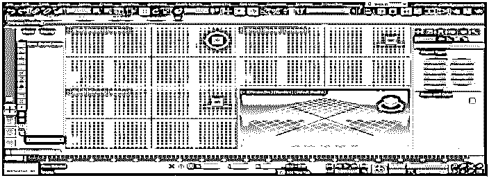

*   我将在透视视口中为本教程绘制一些对象，如框和圆；您可以在任何视口中选取任何对象并绘制它。现在，我将通过按键盘上的 **Alt+W** 按钮在全屏模式下创建一个透视视口。

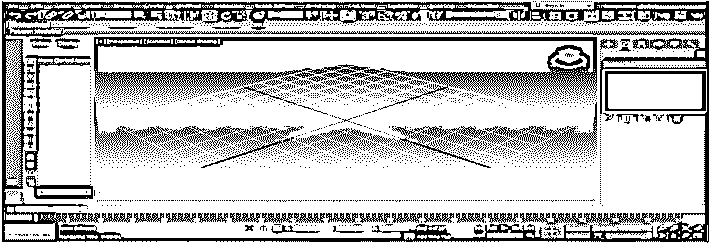

*   现在，我将转到公共面板。

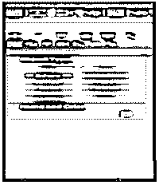

*   点击创建公共面板的标签。

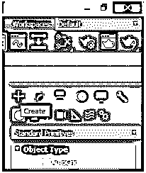

*   单击公共面板的标准基本选项。

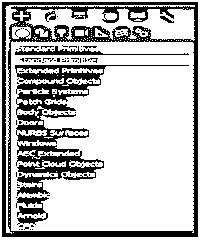

*   单击公共面板的“盒子”选项卡，使用“盒子”命令。

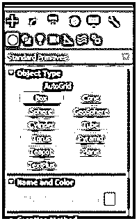

*   我将点击网格上的任何地方；你可以在网格上或网格外点击来绘制你的对象，拖动鼠标指针给出盒子的长度和宽度，单击左键离开，然后向上拖动鼠标指针给出盒子的高度，单击右键或按 Esc 键退出命令。

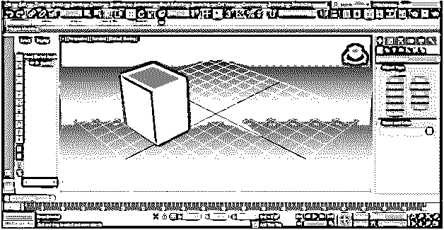

*   现在，我将再次转到公共面板。

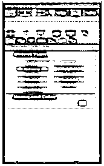

*   单击形状选项卡。

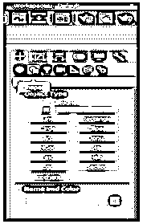

*   以圆形为公共面板。

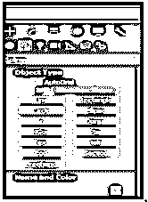

*   点击网格，画圆；我画这个圆是因为它想要；当我旋转这个圆时，我的盒子也以改变(盒子)参数的形式对它的旋转作出反应。

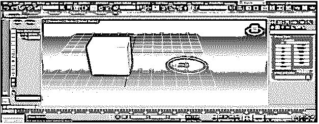

*   我们将设置三个步骤:属性编辑器，线参数，然后反应管理器装配。这里我们将设置属性。属性设置装置，用于将对象彼此连接，以赋予该对象运动；在这里，我们将连接圆和盒子。我们将圆形视为父、盒和子。
*   设置属性时，进入工作区右上角的动画，点击参数编辑器或按键盘上的 **Alt+1** 激活该命令。

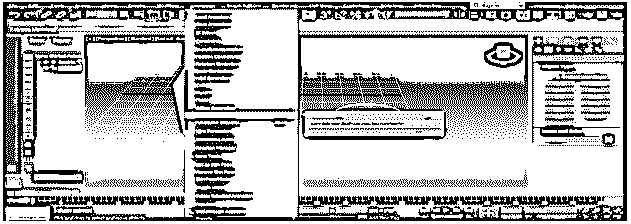

*   将打开一个名为参数编辑器的对话框；我们将在这里设置一些参数。

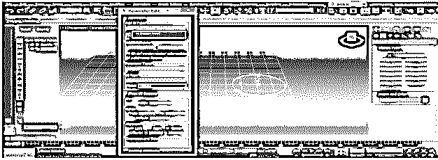

*   为了便于理解，我们将在这里更改属性的名称。

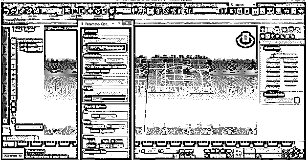

*   现在，在这里设置运动的范围形式；我会把它设置为 45 到 100。单击此对话框的添加选项卡。

*   这里我们可以看到自定义参数被添加到通用面板中。

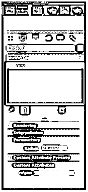

*   这里我们的参数是十进制的；如果你不想要十进制的，就在参数编辑框里。我们在这个框的参数类型标题中看到了浮点选项，浮点意味着数据将是十进制的。

*   我们通过在数据中点击没有小数的整数来改变这个选项。

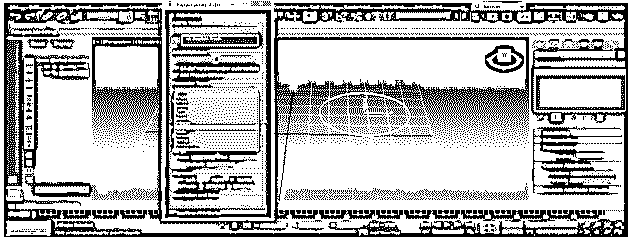

*   我们可以随时编辑或删除这些参数，方法是单击参数编辑器框的编辑/删除选项卡，单击编辑/删除选项卡，选择您要编辑或删除的名称，在此您可以单击不同的选项卡来编辑和删除参数，然后单击应用更改。

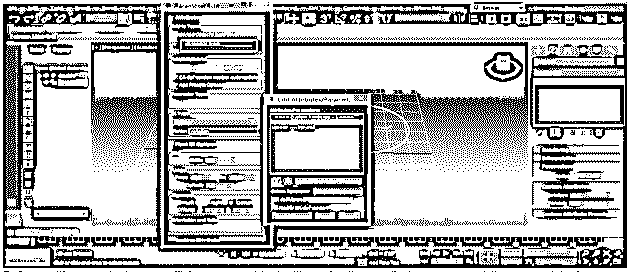

*   在设置我们的索具之前，我们将彼此冻结我们的对象，以便我们可以将它们重置在原始位置上；待冻结的移动对象移动后，选择两个对象，按**Alt+鼠标右键**。单击冻结变换选项。

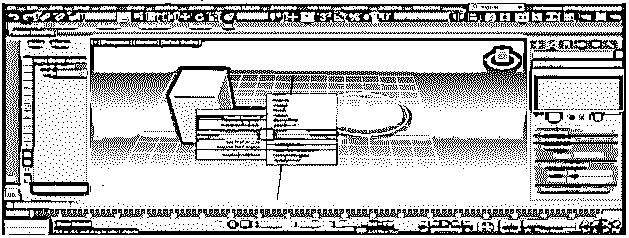

*   要在移动动作后将对象重置在原始位置，请按下**Alt+鼠标右键**。点击转换为零选项。

*   现在我们将在 y 平面上旋转盒子。

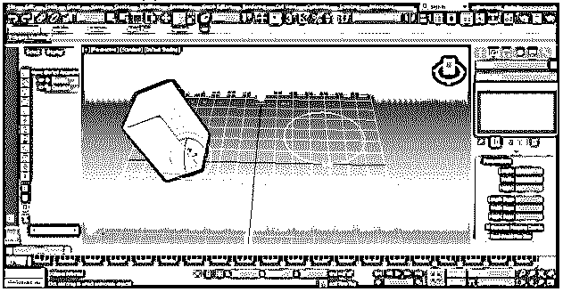

*   要检查它是否是正确的平面，请单击查看并选择局部选项；从这里开始，你可以看到你在哪个平面上，在 X，Y，z 的底部区域。

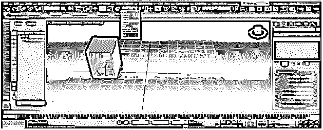

*   现在点击圆形，点击旋转。

*   右键单击任意位置，然后从这里选择“线参数”。

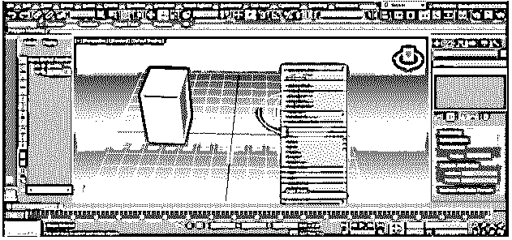

*   将打开两个选项，即变换和对象。我们将在变换中设置我们的装配，单击对象(圆)，单击自定义属性，然后单击框旋转选项。

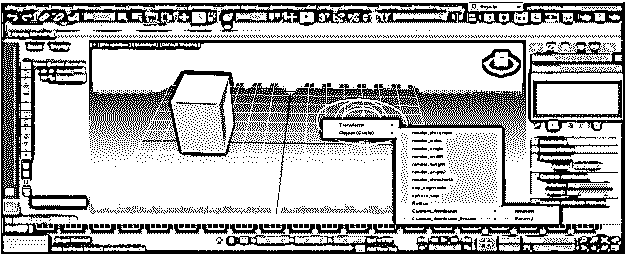

*   将生成一个指针，用于将圆连接到方框。

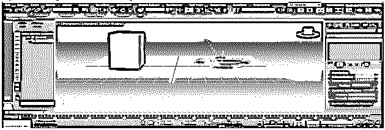

*   连接到框，点击变换，点击旋转，点击零欧拉 XYZ；选择 Y 旋转(您可以根据自己的需要选择要旋转的平面)。

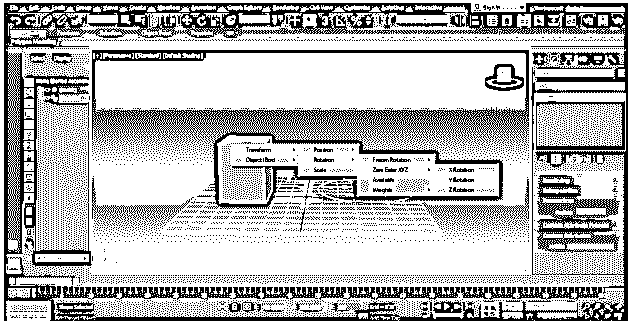

*   “参数连接”对话框将会打开。点击这个箭头按钮连接圆圈和方框，点击连接选项卡连接它们。

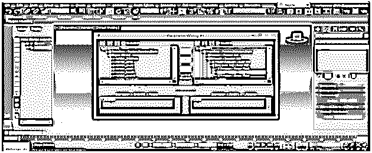

*   现在，当我们在圆的自定义属性选项中更改旋转参数的数据时，我们的框将根据设置的参数旋转。
*   3Ds max 软件中有多种类型的装配方法。从本教程学习索具后，你可以一步一步地学习它们。通过遵循这些步骤，您的基础将清楚了解 3Ds max 软件中对象的装配。

### 结论

有了这个教程，你可以很容易地给你的物体添加任何类型的索具，并使它对观众来说非常逼真。当您了解 3Ds max 中不同类型的装配方法时，您将在您的工作领域中获得加分，并使您的模型比以前更有效。

### 推荐文章

这是 3ds Max 中的装配指南。这里我们讨论 3ds Max 中的角色装配，以及将装配应用到角色/模型的步骤。您也可以看看以下文章，了解更多信息–

1.  [3D 软件设计](https://www.educba.com/3d-software-design/)
2.  [3D Max 模型](https://www.educba.com/3d-max-models/)
3.  [三维图形软件](https://www.educba.com/3d-graphics-software/)
4.  [3ds Max 替代品](https://www.educba.com/3ds-max-alternatives/)

