# 特效模板

> 原文：<https://www.educba.com/after-effects-templates/>

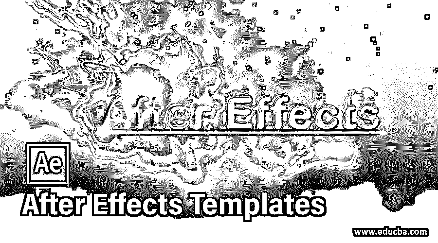

## After Effects 模板简介

如果你正在寻找的动画的主题和主题已经在市场上存在，并且你不想努力从头开始制作带有声音效果的整个设计和动画，那么就使用 After Effects 模板。在这种情况下，模板变得很方便，因为有许多免费的模板以及根据需求适合的付费模板。使用模板的好处是它可以节省时间，还可以暴露参数，如文本、媒体和颜色。那么，让我们看看如何在 Adobe After Effects 2020 中使用模板

### 模板入门

第一步是下载许多网站都提供的模板，如 graphic motion、motion array、motion elements、pond5、rocket stock、video blocks 和 video hive。这只是其中的一部分，还有很多其他的。让我们从定位。aep 文件并双击。您可能会得到一个警告，如图所示，如果您使用的是 after effects 的较新版本，则当前模板将被转换为最新版本，您必须将它存储在不同的位置。但是，原始文件不会被更改。

<small>3D 动画、建模、仿真、游戏开发&其他</small>

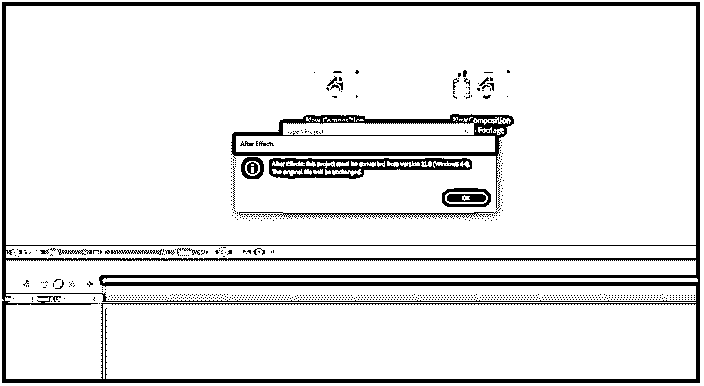

当您打开大多数模板时，它不会像图像和视频那样显示在网站上，很可能会被替换为占位符元素。因此，如果模板看起来不像预览，不要感到惊讶，因为它是根据需求定制的。在项目面板中，您将拥有一个编辑文件夹和最终场景。编辑文件夹将由文本、视频和其他您可以自定义的元素组成。

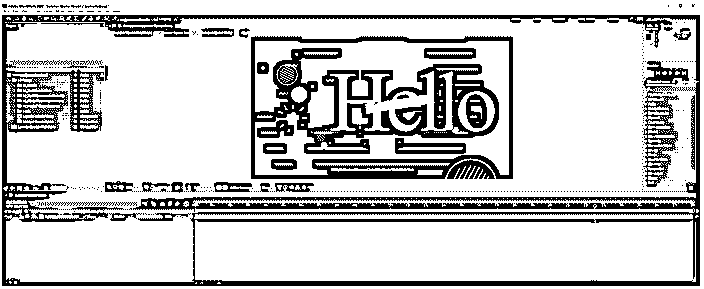

除了后期效果文件之外，模板中还有一些其他文件，如您所见，一个图像文件将提供预览，一个视频文件将显示带有虚拟图像的动画。

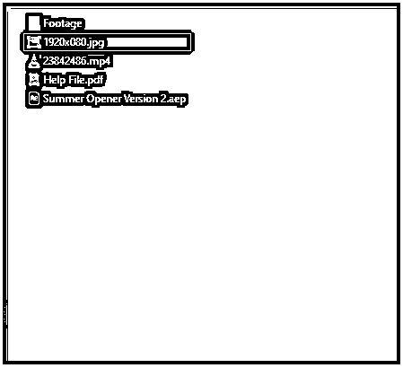

此外，帮助文件描述了如何使用模板，如如何使用文本、图像和视频占位符。动画每秒播放多少帧？在使用模板之前，你需要下载什么插件吗？模板的持续时间是多长？模板创建的分辨率是多少？什么版本的 After Effects 支持该模板？模板中使用了什么字体，因为您可能需要下载这些字体，因为这些字体可能没有安装在计算机上？除此之外，如果有任何专有音乐使用，然后购买和下载的链接也提供。

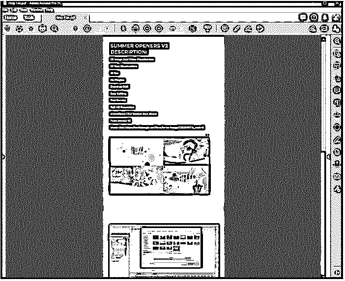

所以，这些是你在下载或购买后效模板之前应该考虑的因素。

### 编辑 After Effects 模板

让我们从编辑模板开始。在编辑之前，让我们准备好我们的图像和视频资产；我们将创建一个名为 MyAssets 的文件夹，并导入该文件夹中的所有图像和视频。

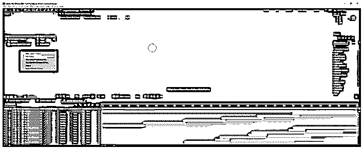

双击项目窗口，导入您想要包含在模板中的图像和视频。

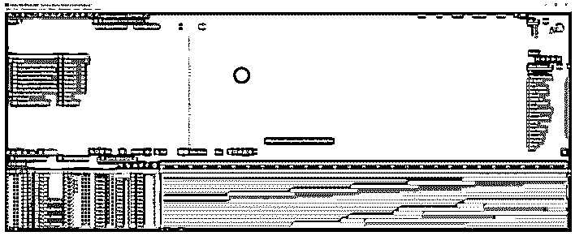

在我们的模板中，我们首先打开了最后一个场景。它由一个开场场景组成。双击揭幕战场景打开揭幕战比赛。我们将对这个合成进行编辑，因为它由最终动画中的所有层组成。

现在连按 13_Text layer，这会打开一个由文本层组成的新伴奏。

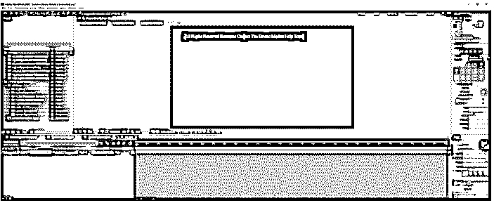

双击文本框内部并进行更改，然后单击选择工具或 Ctrl + enter 获得文本的编辑模式。

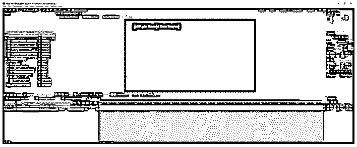

现在回到最终的场景合成来验证这些变化是否被反映出来。

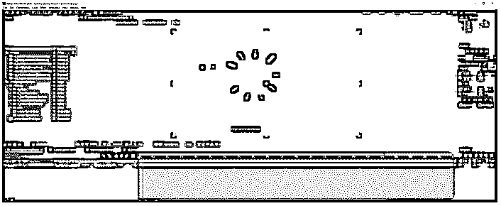

这是通过从时间轴面板中选择元素来更改文本层的一种方法。另一种方法是从“编辑构图”文件夹的“项目”面板中选择图层；您可以选择文本占位符，并在那里进行编辑。

现在让我们编辑一张照片或一段视频；为此，我们必须选择一个照片或视频层；在我们的例子中，让我们选择第 8 个层，“07 _ 照片/视频元素”。双击这一层在这你会发现另一层，所以选择“07 _ 照片/视频占位符”层，你会发现该层是空的，如图所示。

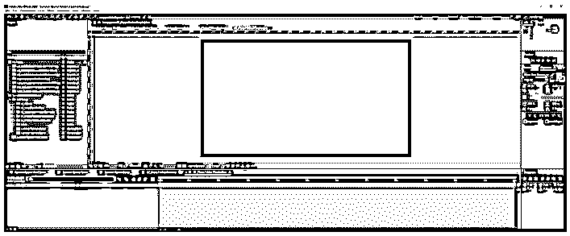

因此，我将从“我的资产”文件夹中拖动一幅图像，如果图像的大小大于合成的大小，则在按住 shift 键的同时拖动图像的一角，以按比例调整大小。

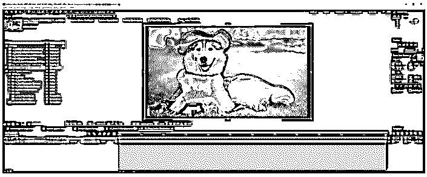

在开场构图中，我们可以看到这一层在 21 秒左右开始，所以当你看最后一个场景时，你会发现这个图像在 21 秒左右。

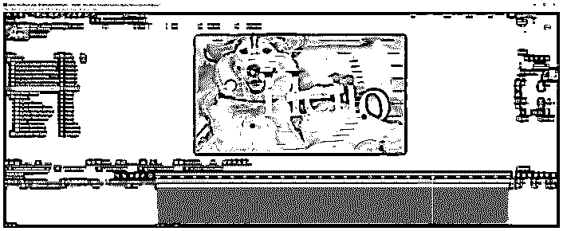

### 使用较低的三分之一模板

这是我们将要编辑的较低的第三个模板，它主要用于覆盖视频以显示主题信息。

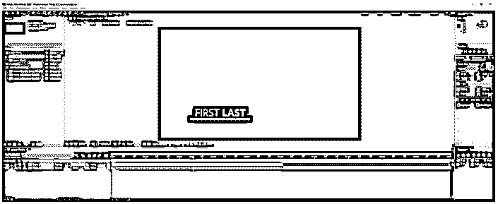

要更改名称，我们编辑标题文本层名称 1

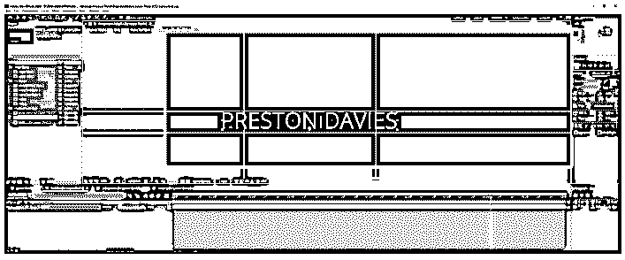

我们必须确保该名称符合指导原则，否则它将从主 comp 中删除，如图所示。

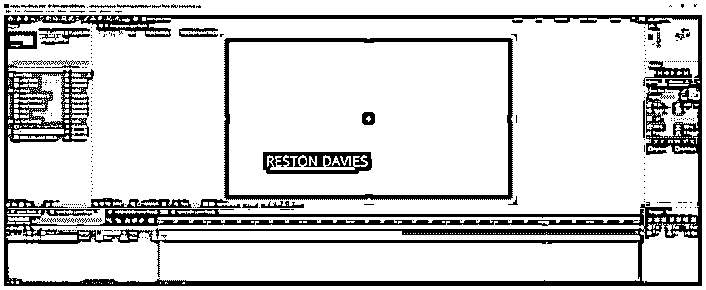

要更改这一点，请转到右侧的“字符”面板，更改字体大小以调整参考线内的文本。

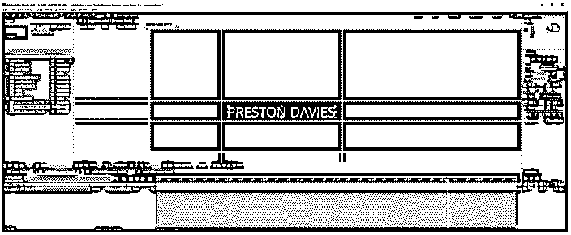

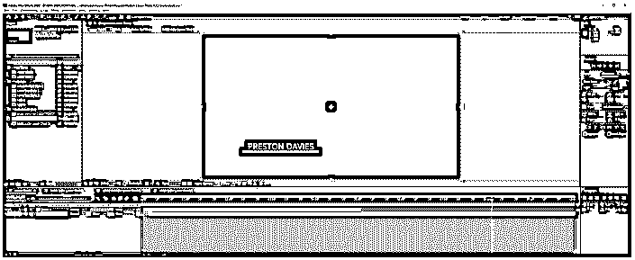

我们选择了 open sans 字体，并将姓氏样式更改为粗体，如图所示。

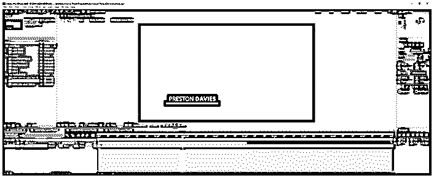

还有另一个模板 Lower Third 2，我们可以为其添加额外的信息。

我们更改了名字和姓氏，并添加了更多说明。

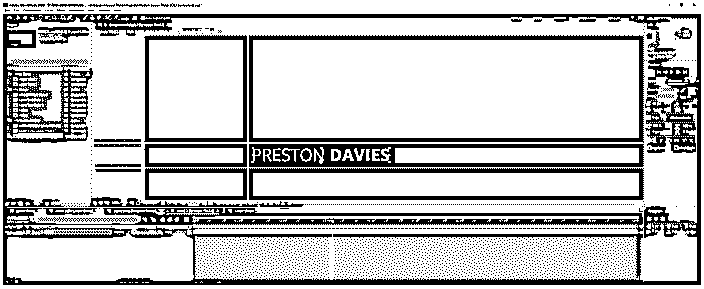

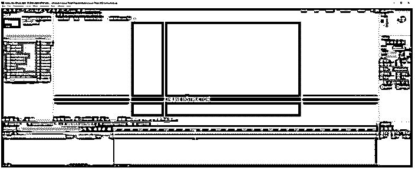

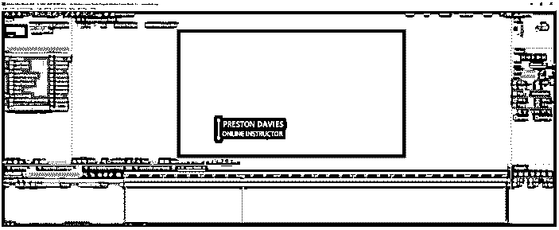

### 出口低三分之一

当导出较低的三分之一时，我们必须确保不包括黑色背景。用于此定位合成并添加到渲染队列。

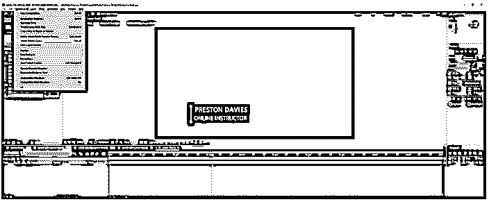

在输出模块中，无损设置将通道从 RGB 更改为 RGB + Alpha，这样可以确保输出是透明的，然后单击渲染。

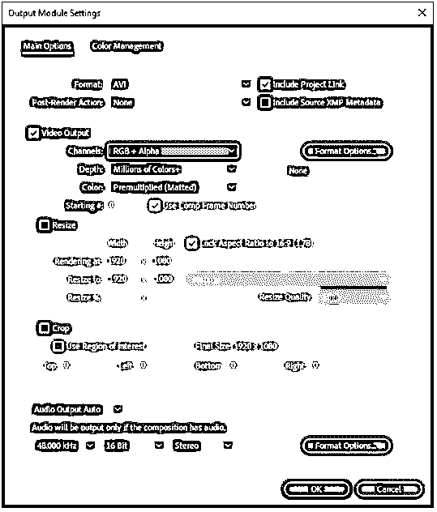

### 结论–后效模板

在本文中，我们学习了如何在 Adobe After Effects 中下载模板，并学习了编辑模板文本和图像的技巧。除此之外，我们还看到了如何编辑和导出低三分之一模板，这对叠加视频中的信息很有用。

### 推荐文章

这是一个指南后的效果模板。在这里，我们讨论如何在 Adobe After Effects 中一步一步地使用模板以及编辑和导出。您也可以看看以下文章，了解更多信息–

1.  [特效渲染后](https://www.educba.com/after-effects-render/)
2.  [后效便携](https://www.educba.com/after-effects-portable/)
3.  [丛后效应](https://www.educba.com/plexus-after-effects/)
4.  [Duik After Effects](https://www.educba.com/duik-after-effects/)

