# After Effects 中的轨道遮罩

> 原文：<https://www.educba.com/track-matte-in-after-effects/>

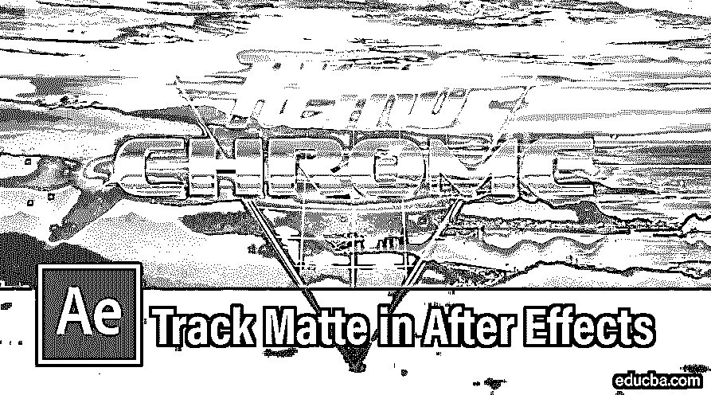

## After Effects 中的轨道遮罩简介

After Effects 中的“轨道遮罩”是一个层，它可以控制其正下方层的不透明度。轨道遮罩层不可见。轨道遮罩会创建孔或空间，通过这些孔或空间可以看到下面的层。但是这个[不就是蒙版工具](https://www.educba.com/mask-in-after-effects/)做的吗？是也不是。读下去就明白了。

### 遮罩和轨道遮罩之间的差异

*   蒙版和轨道遮罩的主要区别在于，蒙版直接应用到包含视频或图像的层上，并且在层变形时变形。这意味着当图层移动、旋转或缩放时，蒙版也会发生这些变化。
*   本质上，轨道遮罩更像是静止的遮罩。轨道遮罩应用于合成，而不是应用于层。物体移入和移出轨道遮罩，而轨道遮罩本身是固定的。
*   当然，通过使用复杂的方法来变换蒙版，可以使蒙版固定不动，以便在层上所做的更改不会影响它。但是很繁琐。轨道遮罩避免了这些步骤。
*   但是，如果您有意选择这样做，轨道遮罩也可以被变换。

### 轨道遮罩位于哪里？

*   轨道遮罩位于时间线窗口中，如图所示。

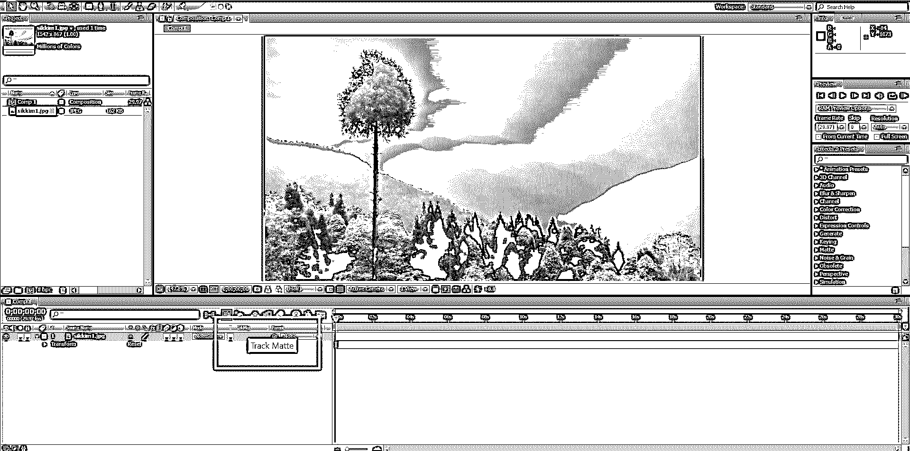

<small>3D 动画、建模、仿真、游戏开发&其他</small>

*   如果此处不可用，您可能需要切换时间线左下角的“传输控制”面板按钮，如图所示。

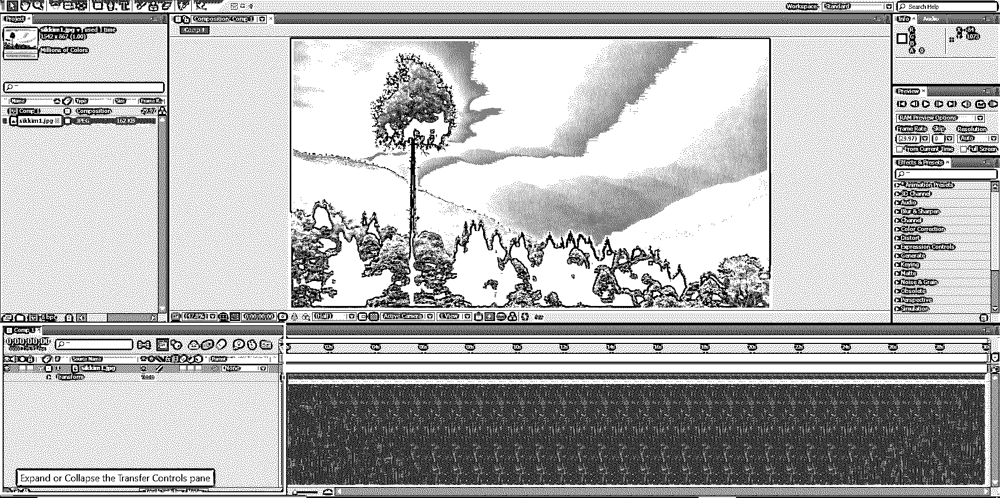

*   轨道遮罩仅适用于底层，即仅当该特定层上有一层时才可用。让我在我的构图中增加 2 层，并解释我的意思。

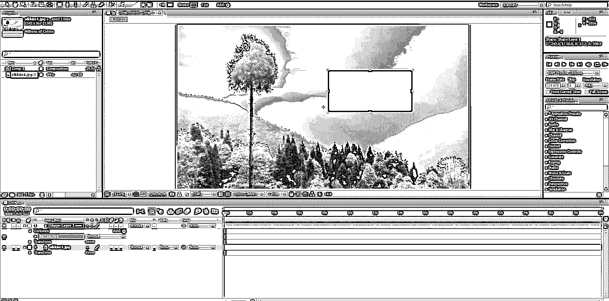

*   这里的**轨道遮罩(TrkMat)** 菜单现已显示。

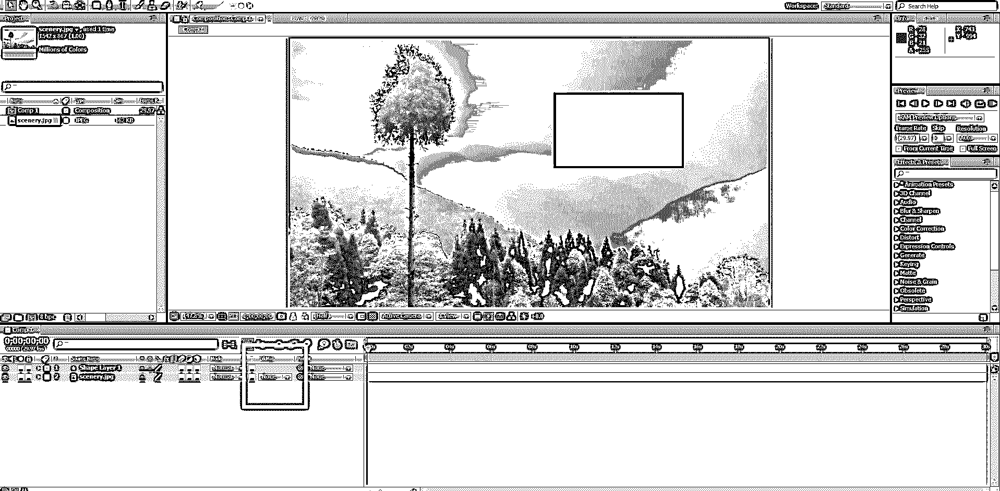

*   当您点击**“无”**右侧的小箭头时，会显示一个包含四个选项的下拉菜单。有两个带 **Alpha** 和两个带**亮度**的选项。

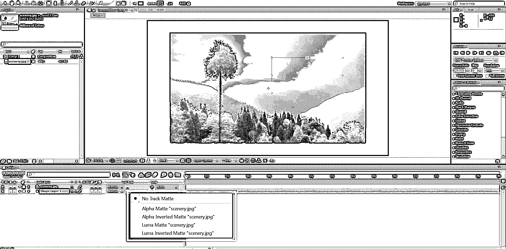

**使用阿尔法遮罩**

*   Alpha 表示像素或不透明度的存在，而 Luma(亮度的缩写)表示亮度信息。我们知道形状层包含一个黑色矩形。如果你点击场景层的 **Alpha 蒙版**，注意会发生什么。

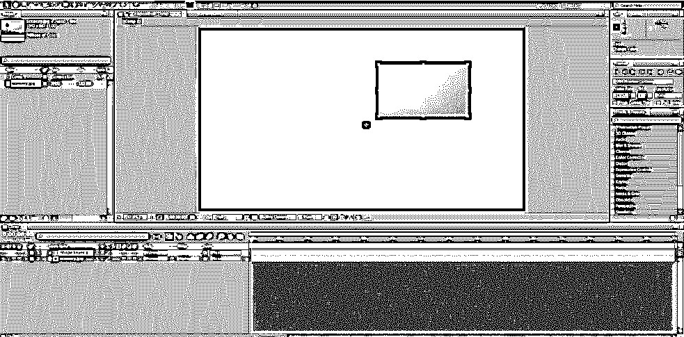

*   只有场景的形状层部分被显示。您可以在形状层周围移动，以显示它下面的层的不同部分。

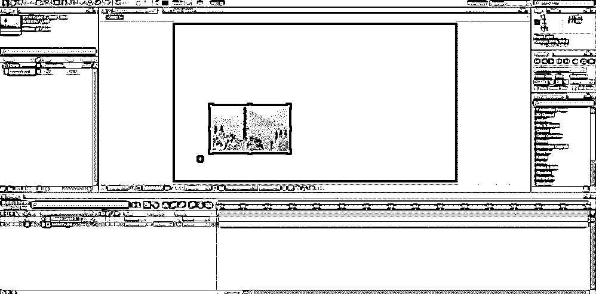

*   即使您将矩形的颜色更改为白色、红色或其他颜色，输出也不会改变。

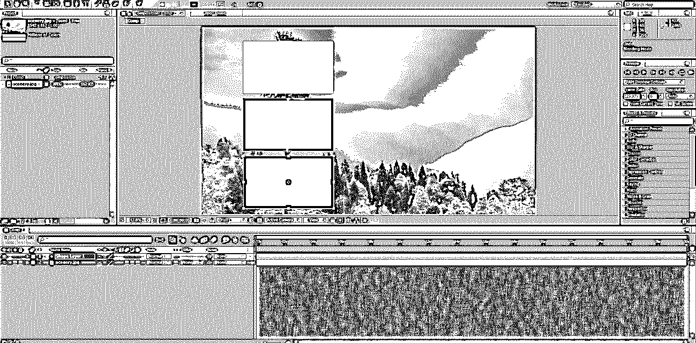

*   你可以看到下图。

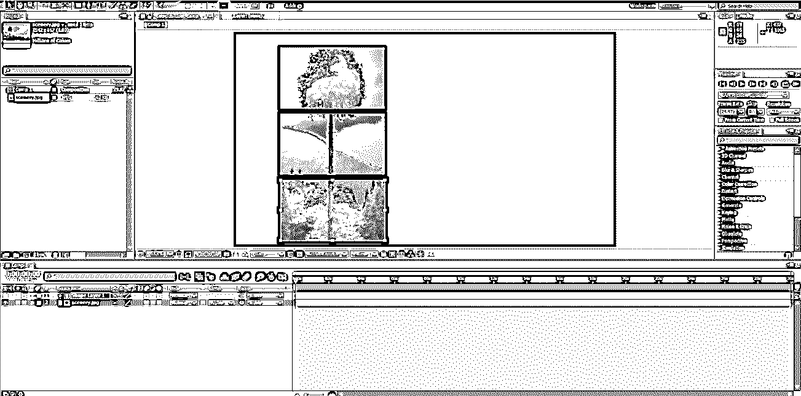

**阿尔法反转遮罩**

从“常用”面板中选择“Alpha 反转遮罩”。

如果您选择使用 Alpha 反转遮罩而不是 Alpha，场景将显示在形状层之外的区域，如下所示。

单击切换透明网格按钮。

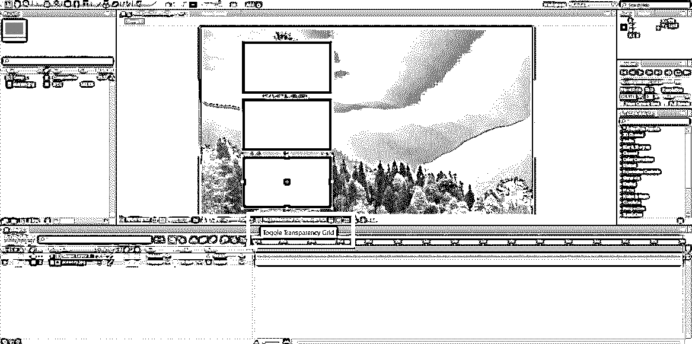

透明的背景清楚地表明，你之前看到的黑洞采用了构图的背景色。如有必要，可通过进入组合设置菜单选项(组合菜单->组合设置)进行更改(快捷键为 Ctrl+K)。

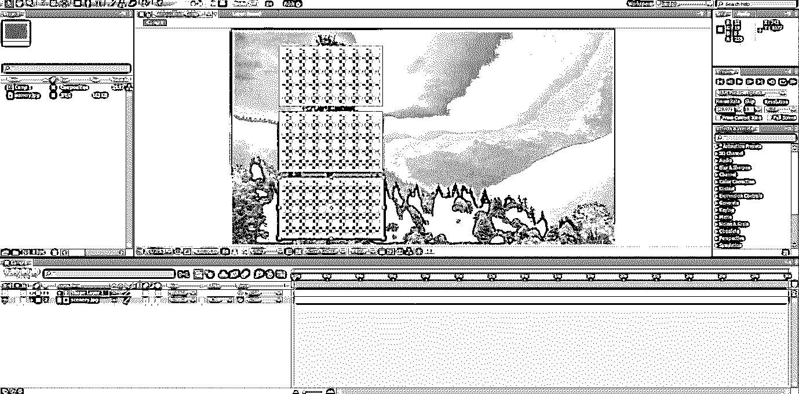

**亮度遮罩**

*   现在让我们在场景上应用亮度遮罩，看看输出。来自形状层的亮度信息已经用于显示场景层。正如你所看到的，不透明度随着形状层中的光照量而变化。

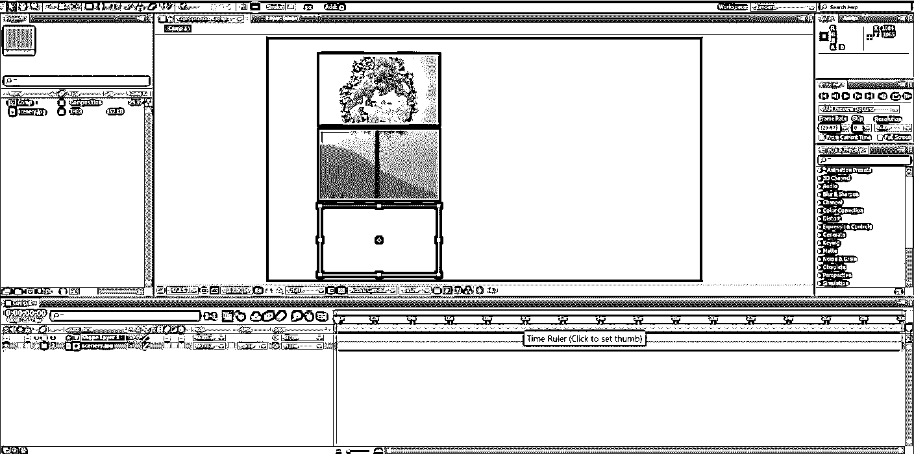

因此，白色以 100%不透明度显示，黑色以 0%不透明度显示，红色以介于两者之间的不透明度显示。

**亮度反转遮罩**

*   亮度反转遮罩给出完全相反的结果，如下所示。

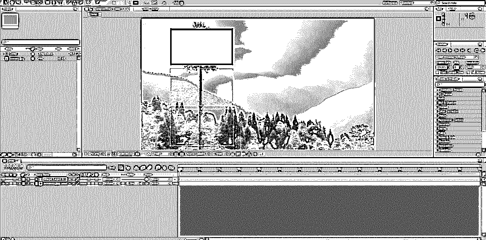

**轨道遮罩的用途**

*   让我们来看看轨道遮罩的一些创造性使用方法。假设您有一个文本，您希望在其中播放图像、动画或视频。

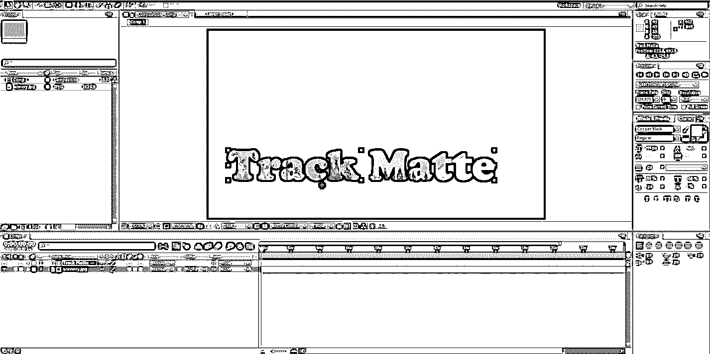

轨道遮罩将非常适合您的图像。

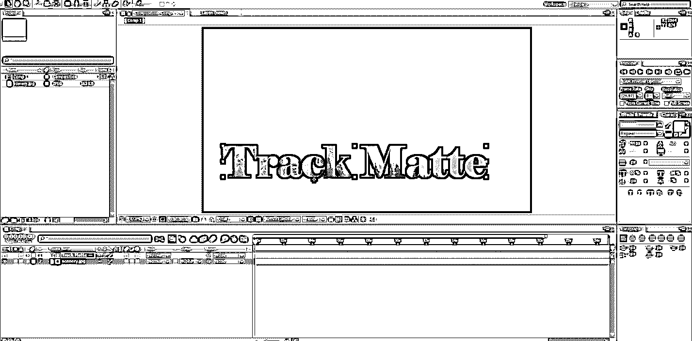

您可以更改图像的字体。

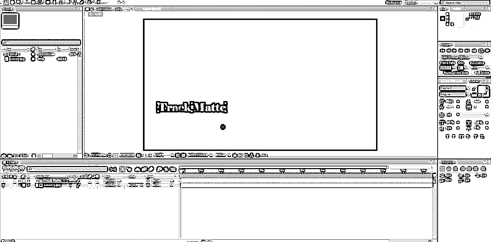

您还可以根据需要更改大小或位置。

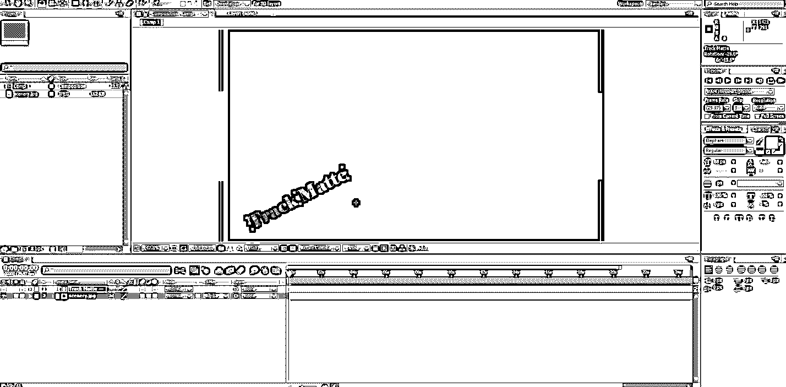

使用亮度遮罩时，您可以调整对比度来显示或隐藏层的某些部分。这在使用纹理时效果特别好。

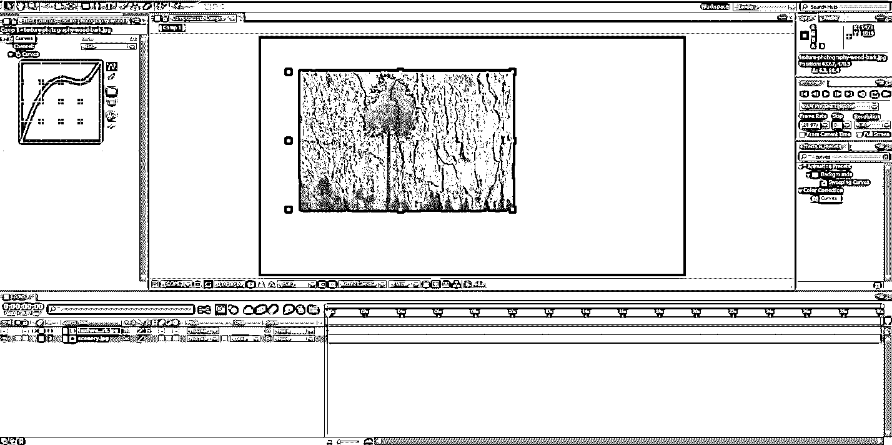

总之，轨道遮罩是 After Effects 中一个有用的特性，它将帮助设计者制作有趣的图形。

### 推荐文章

这是在 After Effects 中跟踪遮罩的指南。在这里，我们讨论遮罩和轨道遮罩之间的差异，以及遮罩的各种功能和在后期效果中的使用。您还可以通过我们的其他相关文章了解更多信息——

1.  [后效中的工具](https://www.educba.com/after-effects-tools/)
2.  [After Effects 中的文本效果](https://www.educba.com/text-effects-in-after-effects/)
3.  [Illustrator 中的效果](https://www.educba.com/effects-in-illustrator/)
4.  [Illustrator 中的混合模式](https://www.educba.com/blending-modes-in-illustrator/)

