# After Effects 中的透明背景

> 原文：<https://www.educba.com/transparent-background-in-after-effects/>

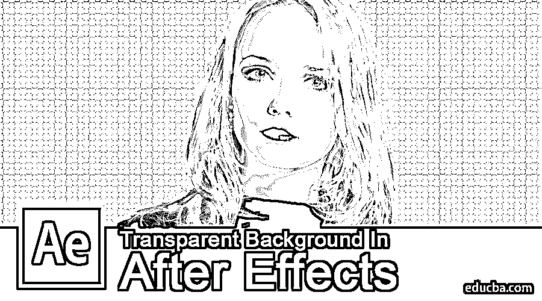

## After Effects 中的透明背景介绍

*   Adobe After Effects 是一个软件程序，用于生成插图、在线内容和视频中使用的特殊效果和运动图形。After Effects 中的透明[背景兼容 Windows 和 Mac OS 系统。After Effects 广泛应用于电视和电影的后期制作、特效生成和动画制作。After Effects 是一款专门设计的软件，主要由艺术家、视频编辑、图形设计人员、数字媒体设计人员、社交媒体、运动图形设计人员、视频制作人员和从事动画工作的人员使用。一个技术和创造性的软件，在它的帮助下，你可以在一个三维空间中设计，制作和风格化二维镜头。](https://www.educba.com/background-in-after-effects/)
*   根据您的角色，软件的功能可能会有所不同。它可以勾画标题，制作二维卡通人物等。尽管执行了所有这些事情，但它与视频编辑程序并不相同。这个软件最好在剪辑完镜头后用来记录效果。After Effects 构成了 Adobe Creative Cloud 的一部分；在任何视频项目中，在某些时候，您需要制作一个简单的视频剪辑或动画图形文本，它将具有透明的背景，从而可以在另一个视频中使用。

### 如何在 After Effects 中创建透明背景？

*   首先，要在你的 After Effects 项目或任何视频上创建一个透明的背景，你需要一个 alpha 通道。alpha 通道可以定义为具有三个标准通道红色、绿色、蓝色的彩色图像，第四个通道是 alpha 通道，它允许您管理透明度或不透明度。
*   颜色(红色、绿色和蓝色通道)的透明度可以由 alpha 通道表示，alpha 通道是一种颜色分量。它用于决定一个像素与另一个像素组合时如何渲染。alpha 通道管理颜色的不透明度或透明度。真实值、整数或百分比可以表示其值。完全透明度为 0.0、0%或 0，而完全不透明度分别为 1.0、100%或 255。
*   当作为源的颜色与另一种颜色(背景)组合时，例如，当一幅图片覆盖到另一幅图片上时，源颜色的 alpha 值被用来决定颜色结果。如果 alpha 值为灰色，则源颜色会覆盖目标颜色；如果透明，则源颜色不可见，允许背景颜色显示出来。如果该值介于两者之间，则出来的颜色具有不同程度的不透明度/透明度，从而产生透明效果。alpha 通道主要用于 alpha 组合和 alpha 合成。

#### 创建透明背景的步骤

**步骤 1:** 启动 Adobe After Effects 并创建一个**新项目**。

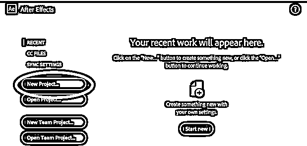

<small>3D 动画、建模、仿真、游戏开发&其他</small>

**第二步:**新项目打开**后效果界面**。

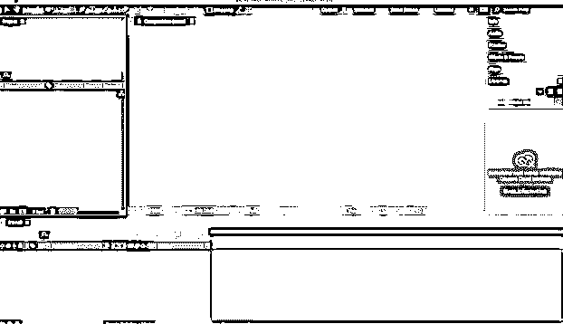

**步骤 3:** 点击顶部菜单栏中的组合，创建一个**新组合**。

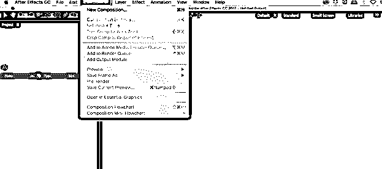

**第四步:**点击新建作文后会弹出一个窗口。在**弹出的**中，保持宽度为 1920 px，高度为 1080 px，这是标准。保持持续时间为 5 秒，背景颜色为黑色。您可以将预设保持为自定义。帧率可以是 29.97 或者 30，保持分辨率为全。

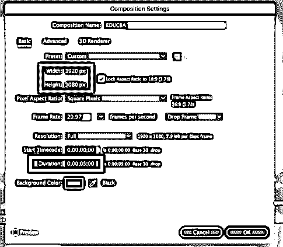

**第五步:****构图界面**。

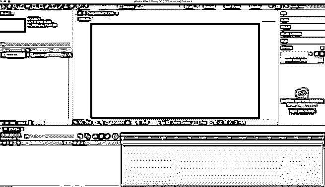

**第六步:**要获得透明网格，你只需点击**切换透明网格，**它出现在活动摄像机下拉菜单旁边，如下所示。

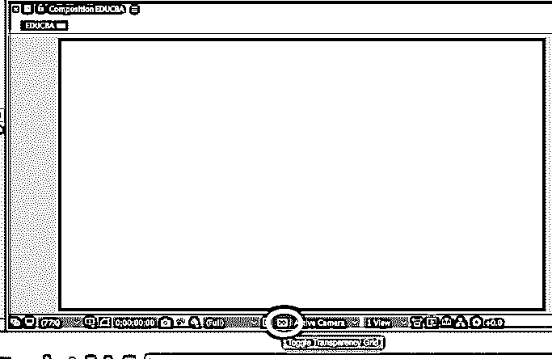

**第七步:**点击一次，就会得到透明网格。如果您单击，您将再次获得纯黑色。这样，你就可以在你的构图上得到**透明网格**。

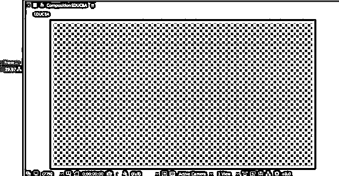

**步骤 8:** 现在，创建一个 T **ext，用选择工具把**放在[的中间。这个视频与文本将在另一个视频中使用，以显示透明背景如何在效果后工作。](https://www.educba.com/selection-tool-in-illustrator/)

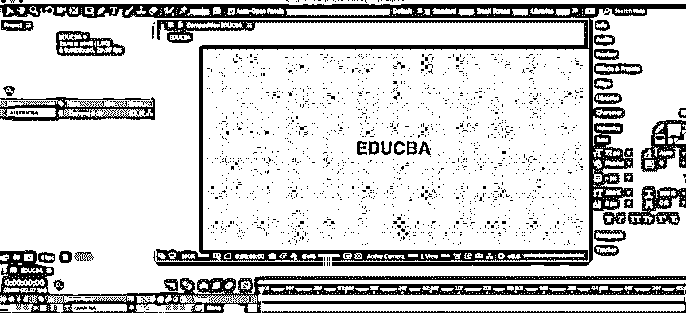

第九步:接下来，我们将**动画文字**。动画文本后，你需要**定位它**，如下图所示。

**步骤 10** :使用**当前时间指示器**上下拖动文本，使其上下移动。

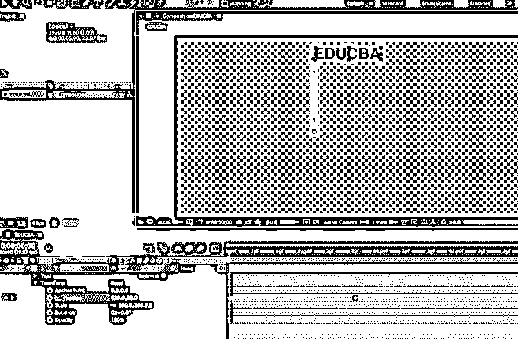

**步骤 11:** 该视频中的文字动画完成。

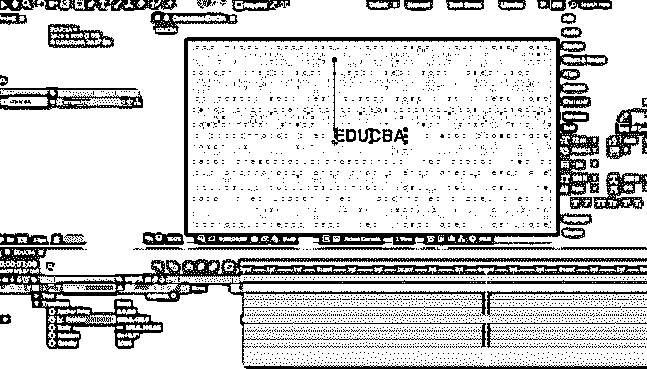

第 12 步:下一步是将你的合成添加到渲染队列窗口。确保在项目窗口中打开或选择该合成。点击合成和**添加到渲染队列。**

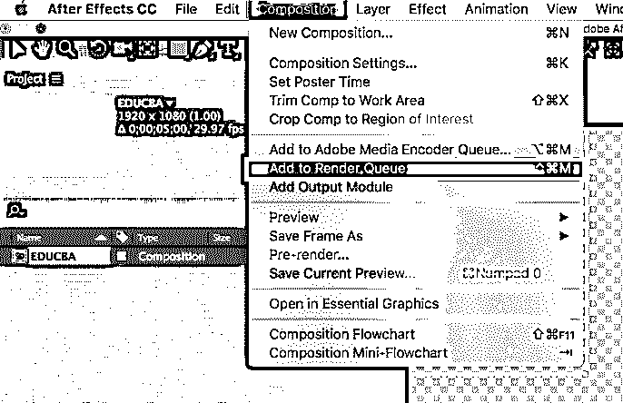

**第十三步:** **渲染队列标签**会打开。

**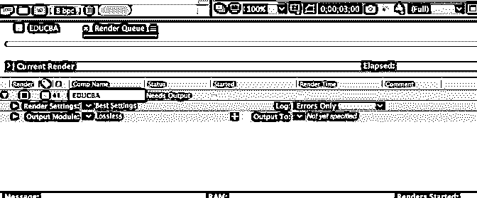

** 

**步骤 14:** 在**最好的**设置**中设置渲染队列。**

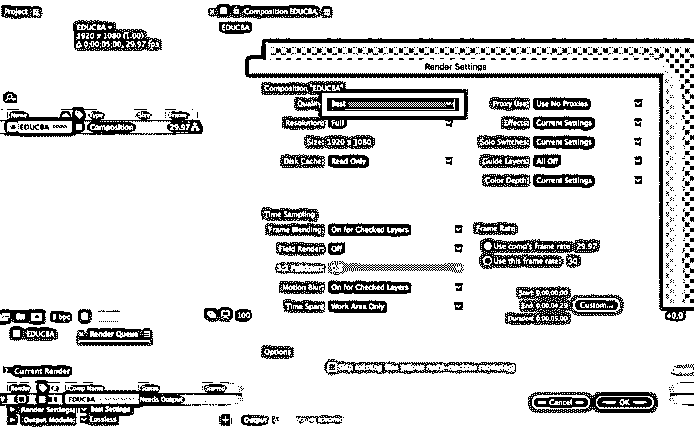

**步骤 15:** 选择渲染设置为最佳设置，分辨率为全分辨率，磁盘缓存为只读。在输出中，模块确保它是无损的。点击无损打开设置。你会看到一个弹出窗口。你可以选择任何你想要的格式。在视频输出部分选择通道为 **RGB + Alpha** 。

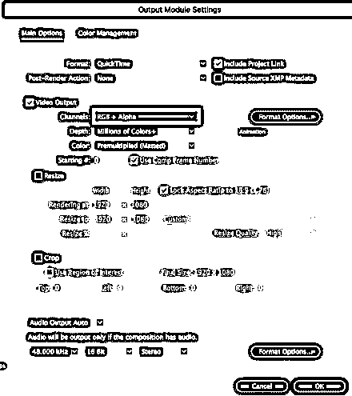

**第 16 步:**现在反弹你的视频，**保存**在桌面上，点击渲染按钮。

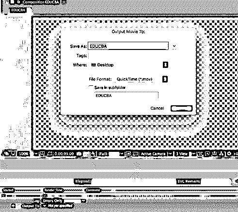

带有透明背景和文本的视频已经准备好了。

**步骤 17:** 现在将任意视频拖动到**项目仪表盘**中，如下图所示。

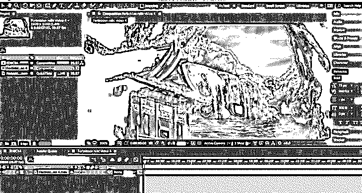

**步骤 18:** 拖动视频后，导入我们之前保存的带有文本的视频文件，然后拖放到该视频中。

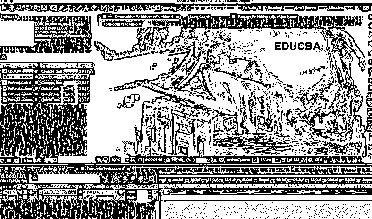

**第 19 步:**一旦你这样做了，你会看到这段视频中带有透明背景的文字，当你移动**当前时间指示器，**你也可以看到我们对文字做的动画。

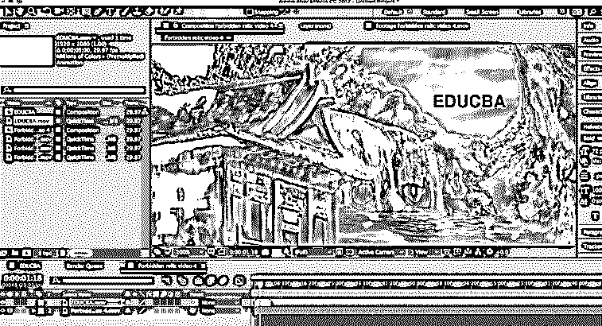

### 结论

通过上述步骤，可以在 Adobe After Effects 中呈现背景透明的视频。对于动画和视频，可以导入和导出的文件有动画 GIF (GIF)、3GPP (3GP、3G2、AMC)、开放媒体框架(OMF)、DV、Windows 视频(AVI)和 QuickTime (MOV)。

只能导入的视频文件有 Adobe Flash Video (FLV，F4V)，Adobe Flash Player (SWF)，Media eXchange Format (MXF)，AVCHD (M2TS)，MPEG-1 (MPG，MPE，MPA，MPV，MOD)，MPEG-4 (MP4，M4V)，MPEG-2 (MPG，M2P，M2V，M2A，M2T)，XDCAM HD/XDCAM EX(MXF，MP4)，Windows Media (WMV，WMA)。虽然 After Effects 可以在每通道 16 位和 32 位中工作，但相当多的动画和视频文件编解码器和格式仅支持每通道 8 位。

### 推荐文章

这是一个透明背景的指南。这里我们讨论了创建透明背景的概述和步骤。您也可以浏览我们的其他相关文章，了解更多信息——

1.  [什么是后效](https://www.educba.com/what-is-after-effects/)
2.  [After Effects 中的文本效果](https://www.educba.com/text-effects-in-after-effects/)
3.  [后效快捷键](https://www.educba.com/after-effects-shortcuts/)
4.  [透明效果](https://www.educba.com/transparent-in-illustrator/)

