# 后效合成

> 原文：<https://www.educba.com/composition-in-after-effects/>

## 后效中的构图介绍

在这篇文章中，我们将学习后效中的构图。构图只不过是一个窗口，我们可以在这里保存我们的层、文件和序列，这就是所谓的构图，它就像一个文件和层的容器；无论我们需要开始什么，我们都需要创作；首先，我们也可以称它为一个独立的时间轴，包含我们的图像、电影和文本文件。

合成是后期效果项目的基础，因为不需要创建合成，我们可以导入文件和层，这是一个基本的东西，但非常重要的选项，在一些编辑软件中，我们称之为序列，在后期效果中，我们可以称之为合成，这些合成就像单独的迷你项目。

<small>3D 动画、建模、仿真、游戏开发&其他</small>

### 如何创作一篇作文？

让我们按照下面的步骤在 after effects 中创建新的构图。

**第一步:**在这里，我们可以看到带有一些文件的项目。

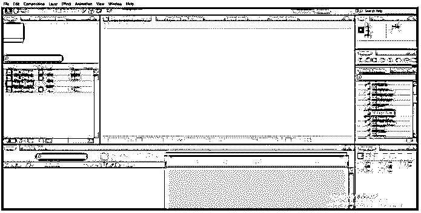

我们可以查看这些文件，但是我们可以对这些文件执行任何操作，而无需创建合成。我们可以在顶部找到组合选项 none。

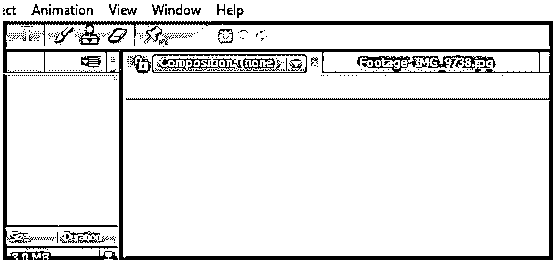

第二步:我们需要创建一个新的组合。

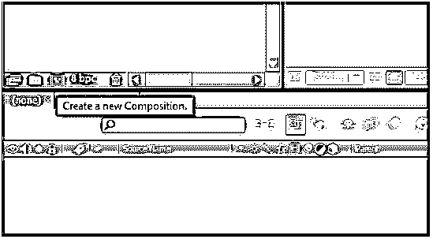

在项目窗口的底部，我们可以找到一个图标；它是 after effects 中的合成图标；通过点击图标，我们可以打开新的作文。

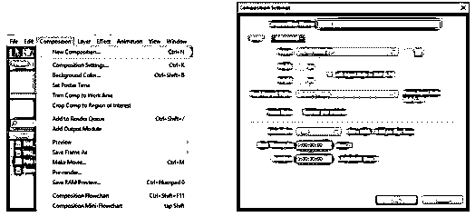

我们有另一个选项来打开一个新的组合，即转到组合，并选择第一个选项；我们可以使用 **Ctrl+N** 进行新的合成。

**第三步:**一旦我们打开一个新的构图，就会得到一个这样的窗口，询问合成设置；在此窗口中，我们可以找到许多选项，让我们来详细了解一下。

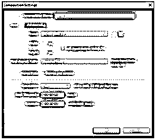

**第四步:**首先我们可以默认找到作文名；它将作为 Com 1；给组合命名是非常重要的，因为我们可能在一个项目中有多个组合，所以我们不会在组合上混淆。

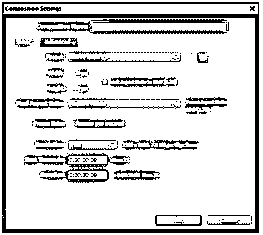

**第五步:**接下来，我们进行基础设置；预设设置是设置中重要的一项；当我们点击预设，我们可以得到一个下拉菜单。

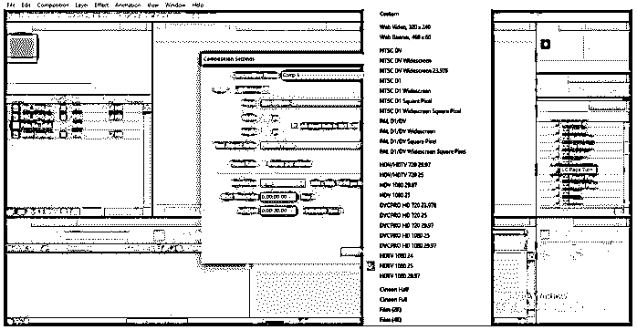

在下拉菜单中，我们可以找到很多视频预设；这些预置指示我们输出的质量，根据我们的要求，我们需要选择预置。

**第六步:**选择预置后，我们可以在预置下面找到大小选项。

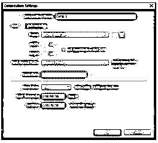

以下是宽度和高度选项；一旦我们选择了预设，高度和宽度将改变默认；如果我们想要更改，我们可以根据需要手动更改，如果我们需要更改宽度和高度，我们也可以锁定纵横比。我们可以取消锁定选项，我们可以更改高度和宽度。如果我们这样做，纵横比会发生变化，因此最好遵循默认设置。

第七步:然后我们有一个叫做像素纵横比的选项，这里有一些默认选项，我们可以从中选择；事实上，当我们自动选择预设时，每个选项都会改变，如果我们有任何要求，我们可以再次。

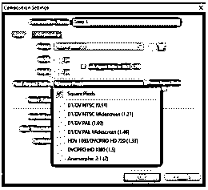

**第八步:**下一个选项是每秒帧率；我们也可以改变帧速率。下一个选项非常重要，即分辨率。

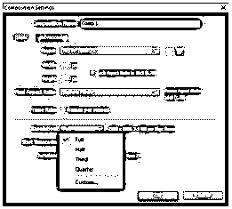

当我们选择时，我们会得到一个下拉菜单；我们有四种分辨率选项，如全分辨率、半分辨率、三分之一分辨率、四分之一分辨率；无论我们选择什么样的分辨率，输出都是一样的。我总是建议采用高分辨率以获得更好的输出。

**第九步:**下一个选项是时间码，默认为时长；我们也可以选择改变。

**第十步:**一旦我们完成了合成设置，我们可以点击 OK，然后我们可以在项目中找到合成选项。

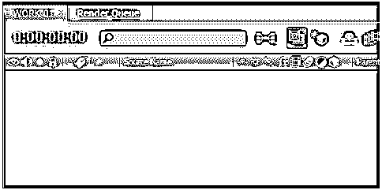

我已经给作文取名为作品 01；现在我们可以在时间轴中找到构图；现在我想你可能明白为什么我们需要给作文取名字了。

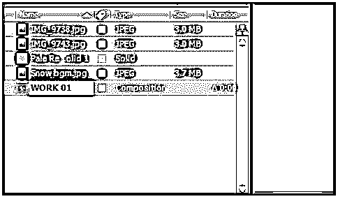

在这里我们可以找到在项目中创建的构图；现在，我们可以理解，作文不过是一个序列；在文件列表中，我们可以用该图标识别合成文件。

**步骤 11:** 一旦我们创建了组合，那么只有我们可以将文件导入到时间线并执行动作；我们可以直接将文件拖到时间轴上，我们导入到时间轴上的每个文件都会创建一个单独的层；无论我们导入什么文件，每个文件都有它们的层，这样我们就可以播放剪辑或者执行动作来创建动画或者编辑剪辑。

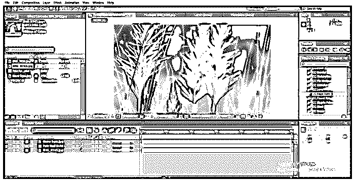

现在我们可以理解作文的重要性了；我们可以在一个项目中创建多个组合。

**步骤 12:** 当我们的构图有大小变化时，我们可以用缩放选项来调整，但如果我们需要构图大小与输出文件相同，只需将文件拖到项目窗口下方的构图图标上。

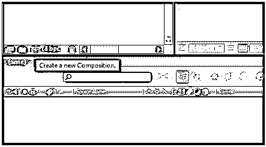

当我们这样做的时候，合成是在与文件的原始大小相同的文件名中创建的；现在，我们可以在项目中找到两个合成窗口。

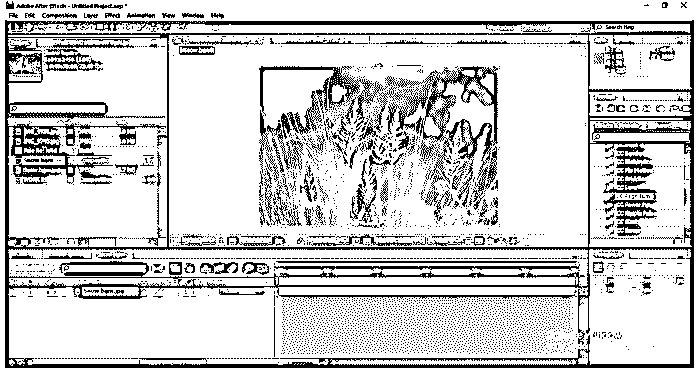

通过这种方法，我们可以避免缩放和位置调整编辑过程，我们可以意识到失去质量，但输出比例会发生变化。

**步骤 13:** 如果我们不幸关闭了时间轴中的合成，我们可以从项目菜单中重新打开合成。

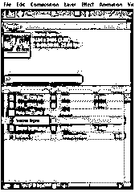

**第 14 步:**一旦我们完成了工作，我们可以将每个作品导出到单独的视频文件中。

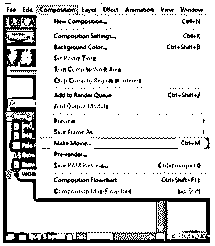

选择合成文件并转到合成菜单，然后选择制作电影选项；我们可以使用 **Ctrl+M** 作为这个选项的快捷方式。

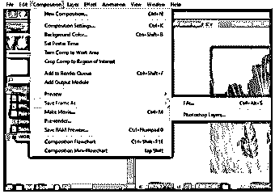

我们还可以从我们的合成中导出一帧，这意味着我们可以从我们的时间轴中导出一个快照；它可以是当前帧。

**步骤 15:** 如果我们在一个中创建了许多组合，我们可以通过嵌套选项将我们的组合放置在另一个中。

### 推荐文章

这是《余波》中的构图指南。在这里，我们讨论介绍，它的重要性，以及如何创建一个组成部分。您也可以浏览我们的其他相关文章，了解更多信息——

1.  [后效中的毛刺效应](https://www.educba.com/glitch-effect-in-after-effects/)
2.  [在后效中遮蔽图层](https://www.educba.com/masking-layers-in-after-effects/)
3.  [After Effects 中的文本效果](https://www.educba.com/text-effects-in-after-effects/)
4.  [后特效版本](https://www.educba.com/after-effects-versions/)

