# 后期效果中的排版

> 原文：<https://www.educba.com/typography-in-after-effects/>

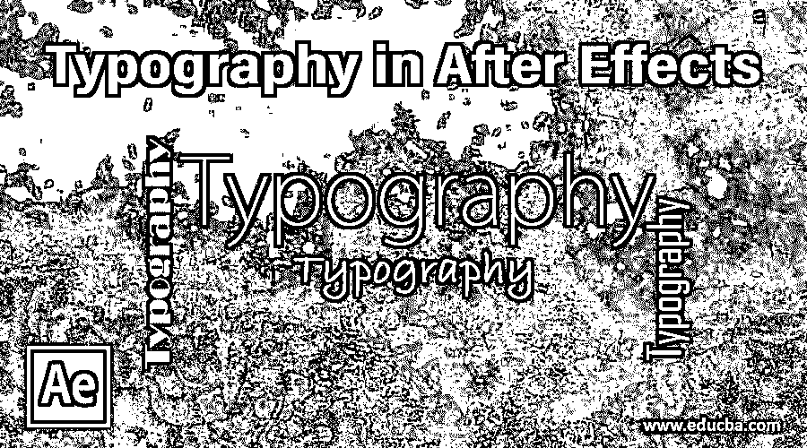

## After Effects 中的排版介绍

印刷术可以用来以不同的方式制作任何文本的动画。您可以将排版理解为以不同类型的方式排列文本(或文本组合)及其字母的技术，以使文本的外观不同于正常的书写方法，这有助于图形专业人员正确传达这些文本排列的目的。

### 如何在 After Effect 中创建排版？

在开始我们的文章之前，让我们看一下这个软件的用户界面，以便更好地理解这个软件的所有方面，并且当我使用任何单词来表示特定部分时，我们的理解不会出现混乱。

<small>3D 动画、建模、仿真、游戏开发&其他</small>

**第一步:**这是他的软件的用户界面。我们在工作区的顶部有一个菜单栏，用于管理该软件的面板，在左上角，我们有一个项目面板，您可以在其中看到您在工作中使用的一些组成，在右上角，您可以找到效果&预设选项，对齐选项，播放头和其他术语，在中心我们有一个工作屏幕，您可以在上面创建任何动画，在该软件的底部，我们有时间线部分，其重要功能是为我们的项目制作动画。

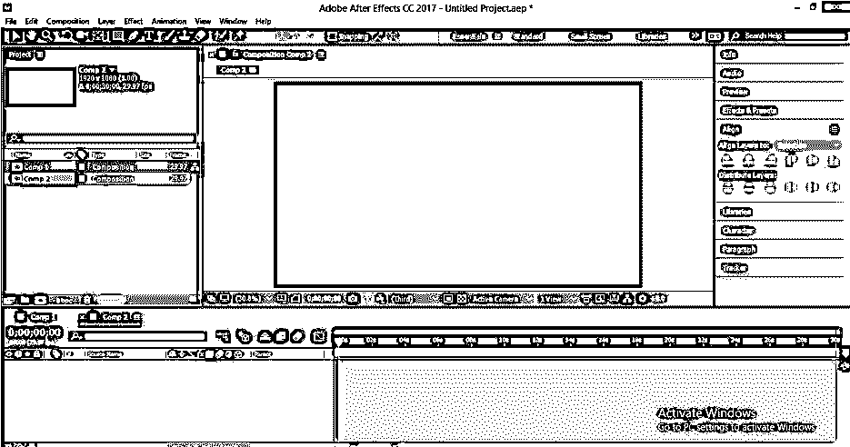

**第二步:**首先，为我们的工作取‘新构图’。要进行新合成，请在项目面板的此区域中启用右键单击。从下拉列表中选择“新组合”选项。

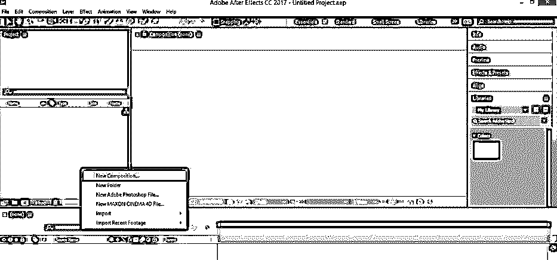

**步骤 3:** “构图设置”框将打开，显示“新构图”。根据你的要求设置这个组合的参数，并为你将来的使用命名。我会从这个盒子里拿黑色作为背景色。你可以选择任何适合你的排版工作的颜色。现在，按下此对话框的“确定”按钮以应用设置。

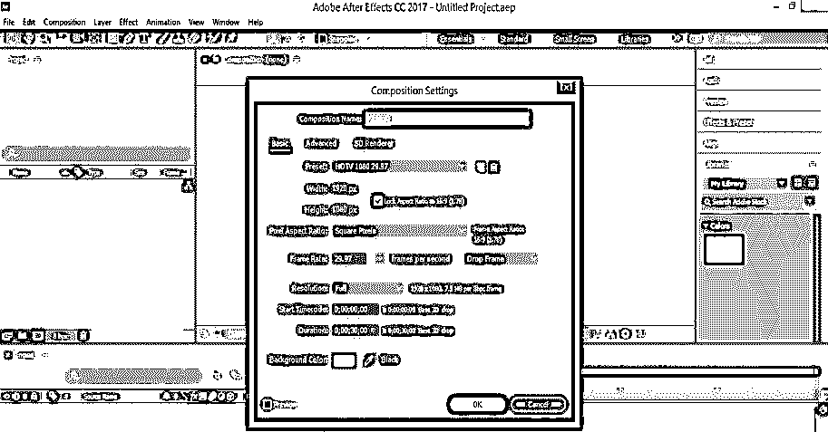

**第四步:**现在，右键点击时间线部分区域，在合成区域创建一个文本层。将会打开一个下拉列表。转到该列表的“新建”选项，并从新的下拉列表中选择文本选项。

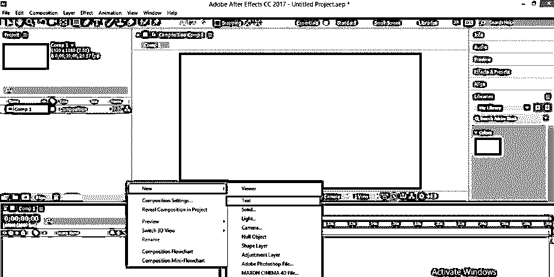

**第五步:**现在，在构图屏幕上生成一个文本层。

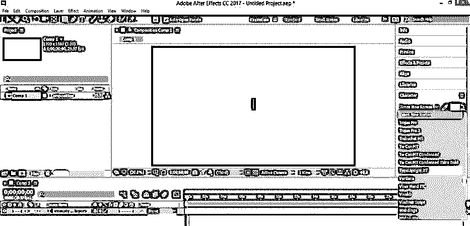

**第六步:**从工作屏幕右侧的文本层的属性栏中，根据您的需要选择文本的字体、大小和其他参数。我要泰晤士报新罗马字体的粗斜体。你可以从网上选择或下载任何时髦的字体样式。

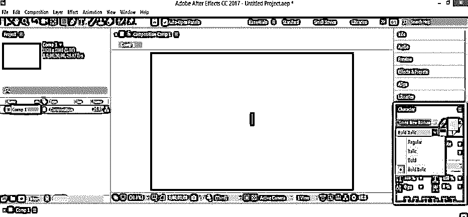

**步骤 7:** 现在点击文本的颜色框，选择文本的颜色。当你在文本层的属性部分点击一个小的正方形颜色框并从这里选择你想要的颜色时，一个文本颜色框将会打开。我将选择白色作为我的文字颜色。

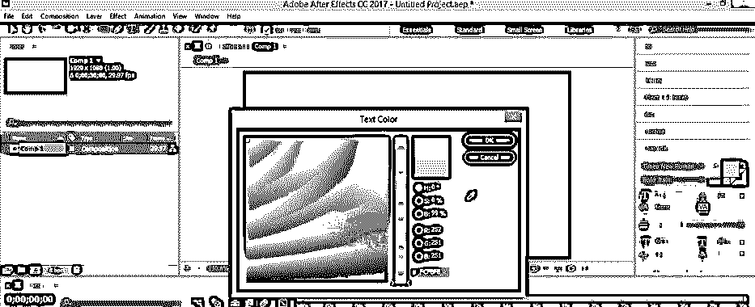

第八步:现在，当我在这里输入的时候，输入一个单词。

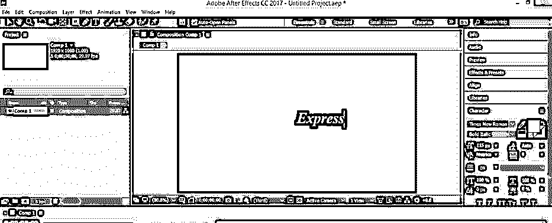

第九步:现在在这个构图中添加一个新的文字层。再次添加一个新的文本层，右击层截面区域。转到下拉列表的“新建”选项，并从新的下拉列表中选择文本。

步骤 10: 我们添加了一个新的文本层，因为我们将在不同的层中输入每个文本，这样我们就可以分别制作它们的属性动画，以获得高度专业的印刷动画。

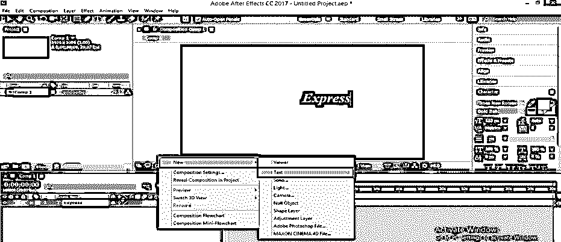

**步骤 11:** 在这个文本层中键入文本的下一个单词。根据文本中单词的数量，反复添加新的文本层。现在，像我一样，在不同的文字图层上输入所有的文字。

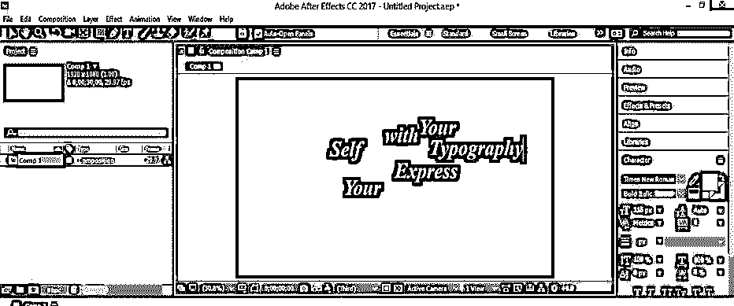

**第 12 步:**现在使用这个软件的移动和对齐工具，按照排印风格排列所有文本。我会这样安排我的文章。确保你做的安排会传达那句话的恰当含义。

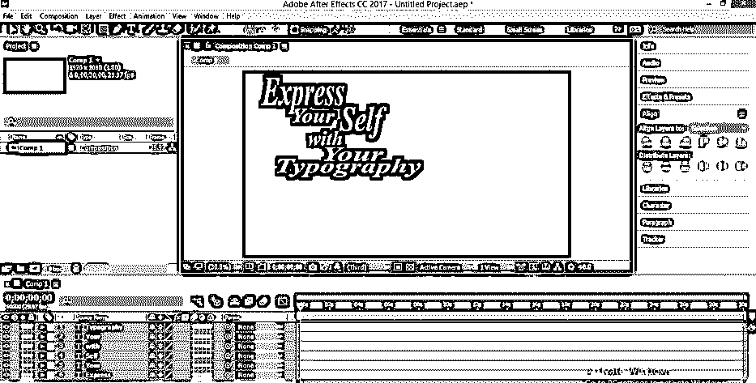

**步骤 13:** 现在进入时间轴部分，将第一层(表现层)时间轴的关键帧头设置为 2 秒。

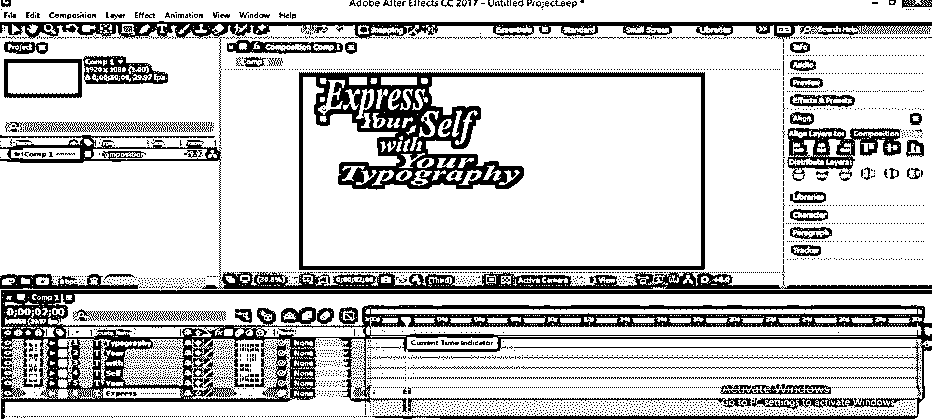

**第 14 步:**按'['将其时间轴设置在关键帧的 2 秒。

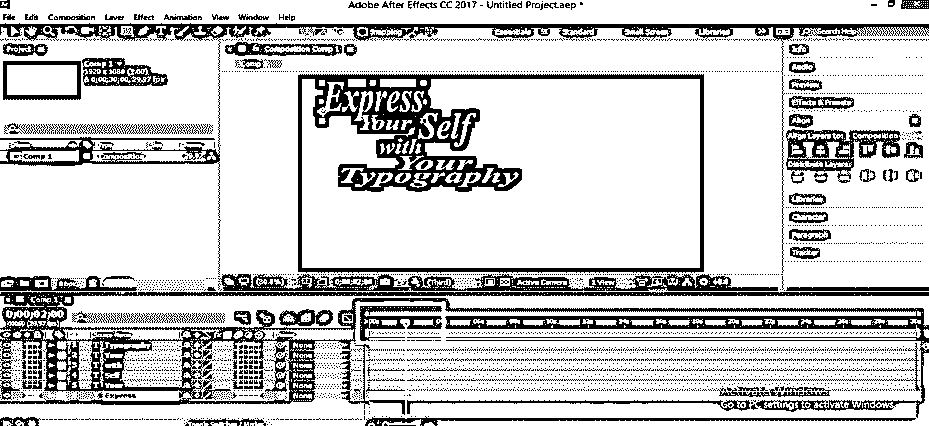

**第 15 步:**我们将每个文本层的时间轴设置为 2 秒关键帧的差异。要设置它们，选择该层，将关键帧头放在每一步的 2 秒差处，然后按下“[”。

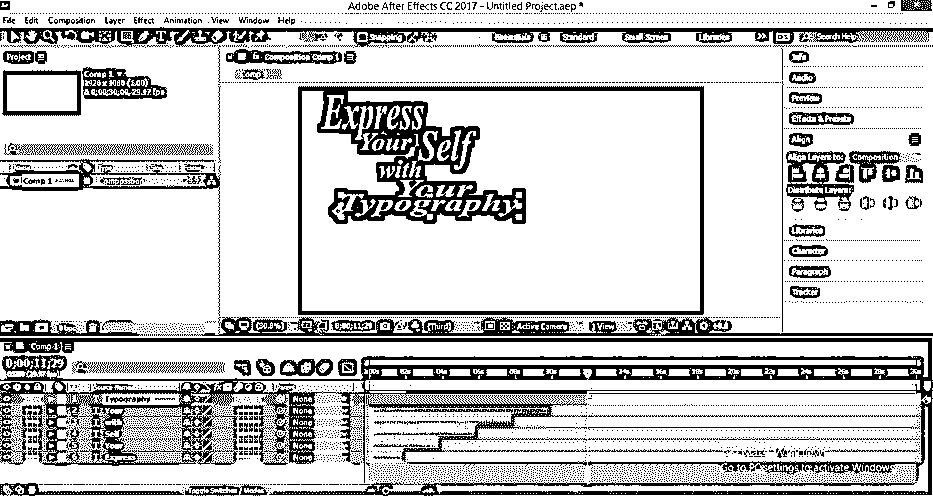

**第十六步:**现在按播放头看动画。您可以根据自己的需要调整每个文本层的时间轴，以便在排版中获得想要的效果。

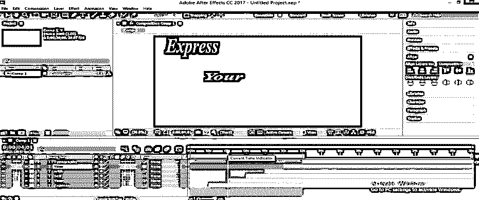

**步骤 17:** 现在来到图层部分，选择 Express 图层。现在点击这一层的动画选项。将会打开一个下拉列表。从这里选择旋转选项。

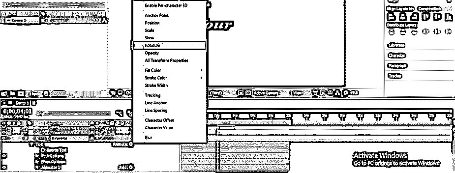

**步骤 18:** 现在，通过点击这些属性的时钟图标，在该层的偏移和旋转属性中设置一个关键帧。将旋转角度设置为-40 度，将偏移值设置为 0%。

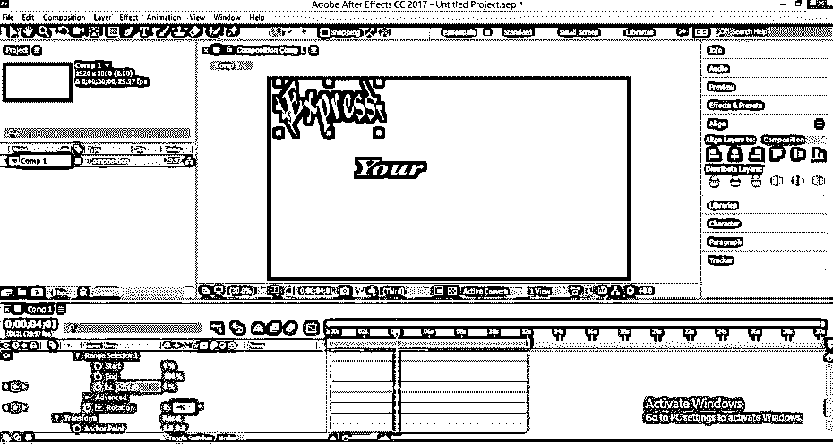

**步骤 19:** 现在，将关键帧播放头放在下一段文字的时间轴之前。将偏移值设置为 100%，旋转角度为 0 度。

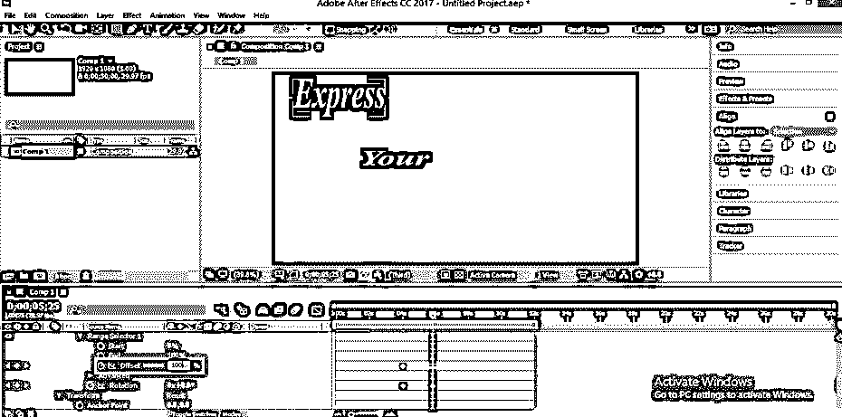

**步骤 20:** 现在选择两个属性的键，按 F9 使它们成为 Easy Ease 键。

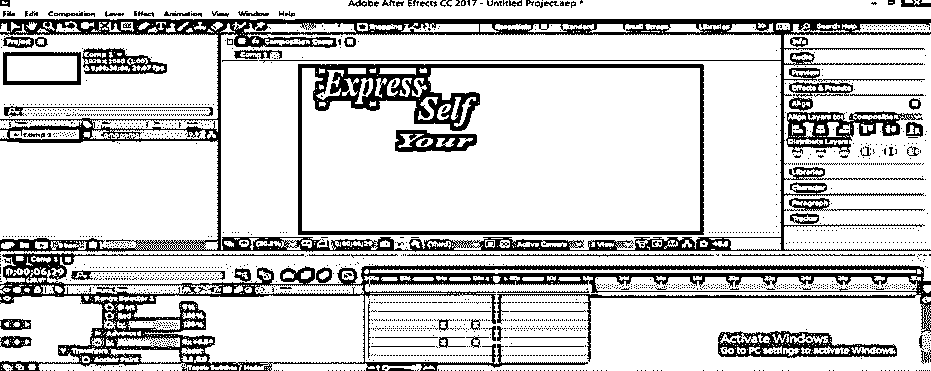

**步骤 21:** 现在，当你播放这个文字层的生成动画时，会是这个样子。

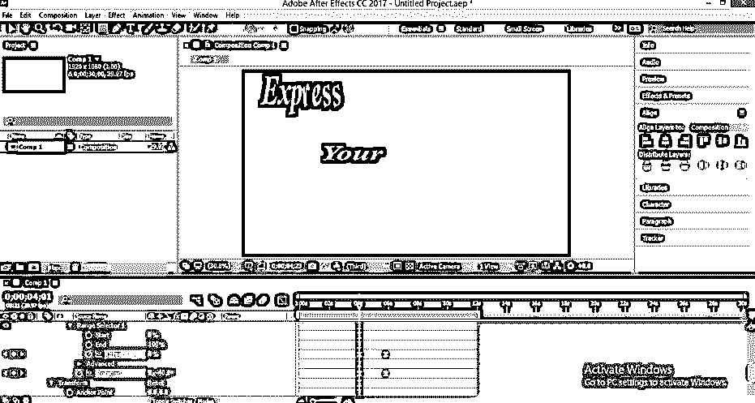

*   通过这种方式，您可以设置该层更多属性的动画。动画后，这一层的属性，移动到下一层的文字组合，并根据您的选择动画。

### 结论

现在，看完这篇文章，你就能理解‘什么是排版？’以及“如何在 adobe After Effect 中以不同类型的呈现方式制作动画？”目前，排版涵盖了图形设计的大部分领域，你可以通过分析它的不同方面来掌握它。

### 推荐文章

这是一个印刷效果指南。在这里，我们讨论一个简单的例子，并以循序渐进的方式学习动画技术。您也可以浏览我们的其他相关文章，了解更多信息——

1.  [2D 特效动画后](https://www.educba.com/2d-after-effects-animation/)
2.  [后效中的毛刺效应](https://www.educba.com/glitch-effect-in-after-effects/)
3.  [在后效中遮蔽图层](https://www.educba.com/masking-layers-in-after-effects/)
4.  [后效软件](https://www.educba.com/after-effects-software/)

