# After Effects 中的运动图形

> 原文：<https://www.educba.com/motion-graphics-in-after-effects/>

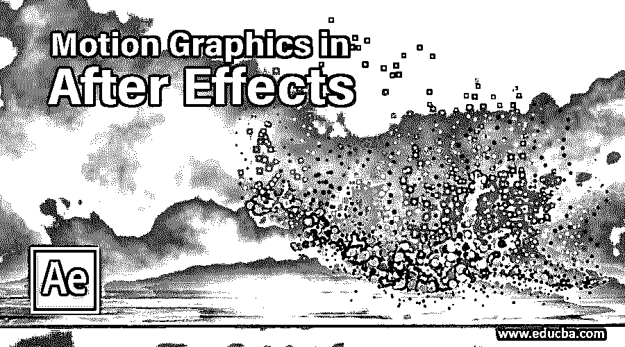

## 运动图形介绍

运动图形是一种复杂而独特的艺术形式，需要大量的奉献和技巧来掌握。After effect 中的运动图形是指图形设计的一部分，其中我们借助于该软件的一些功能，为任何对象的不同属性制作动画，以使该对象的属性产生运动。在本文中，我们将讨论运动图形及其重要参数，这有助于在 Adobe After Effect 软件中为任何项目创建任何运动图形。我们将通过一个例子来理解 After Effect 中的运动图形。

### 如何在 After Effect 中创建运动图形？

在这里，我们将采取这个软件的二维形状来理解运动图形。一旦你有了一个简单的二维图形运动的想法，你可以很容易地制作任何图像，标志，或任何特定项目工作的文本的运动图形。所以让我们以一种非常简单和容易的方式开始我们的学习。

<small>3D 动画、建模、仿真、游戏开发&其他</small>

首先，让我们看一下这个软件的用户界面，这样当我们使用任何特定的术语来描述这个软件的任何特定部分时，你可以很容易地理解。

**步骤 1:** 这是 After Effect 软件的用户界面。在工作屏幕中，我们在工作区的顶部有菜单栏，用于对该软件进行不同的调整；就在菜单栏下面，我们有一些工具，如二维形状工具，钢笔工具，画笔工具等。;在工作区的左侧，我们有显示当前项目的项目部分，在右侧项目部分的对面，我们有一些其他的设置参数，如对齐，效果&预设，预览等。;在工作区的底部，有一个为对象的属性制作动画的时间线。

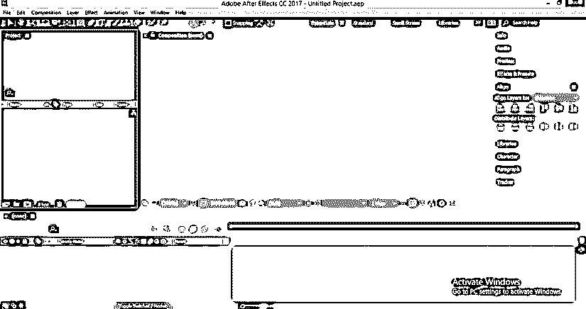

**第二步:**现在做‘新作文’。要制作新的构图，请转到该软件菜单栏的构图菜单。将打开一个下拉列表；点击该软件的“新合成”选项。

第三步:或者你可以到项目部分的底部，点击“创建新作品”图标。

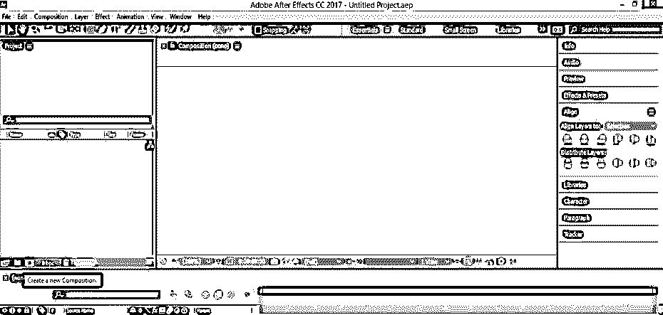

**第四步:**构图设置框打开。根据您的需要进行构图设置，然后单击此框中的“确定”按钮。

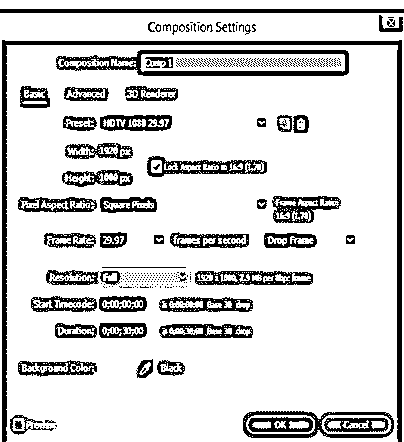

**第五步:**现在到工作区顶部的工具面板，从这里拿星形工具。

**第六步:**现在，在构图区域的任意位置，借助星星工具，用你想要的形状画一颗星星。

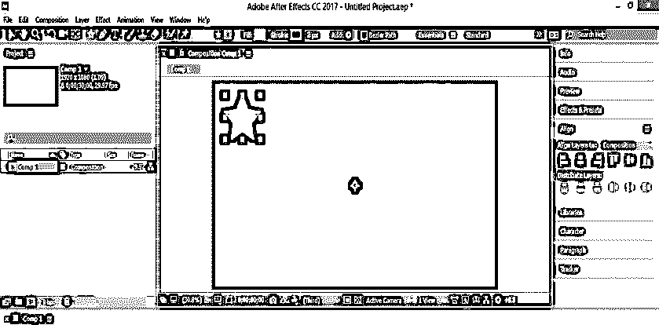

**第七步:**现在，从这个软件的工具面板里拿出椭圆工具。

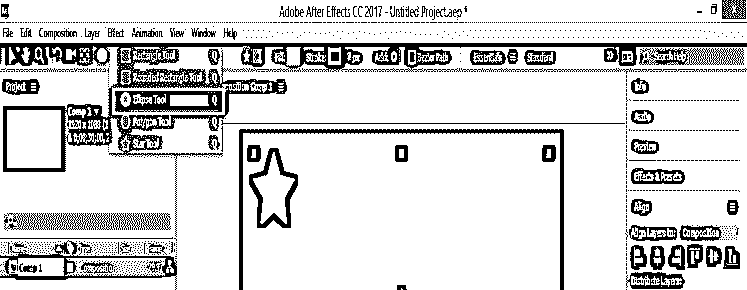

**第八步:**现在在这个位置借助椭圆工具画一个圆。

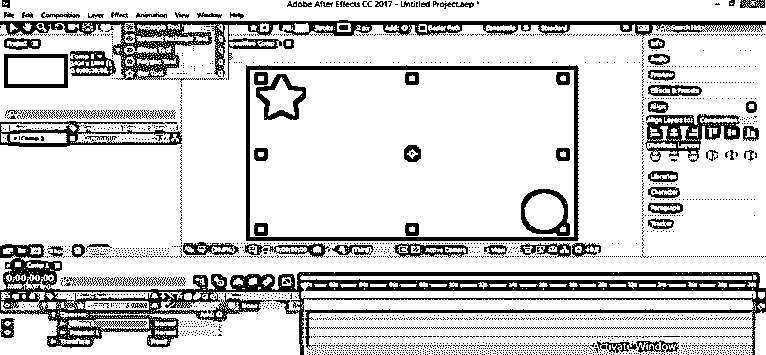

**第九步:**现在，我将改变这个圆的颜色。要更改颜色，请单击位于工作区顶部的该形状的“填充”框。

第十步:从“形状填充颜色”框中选择你想要的颜色。

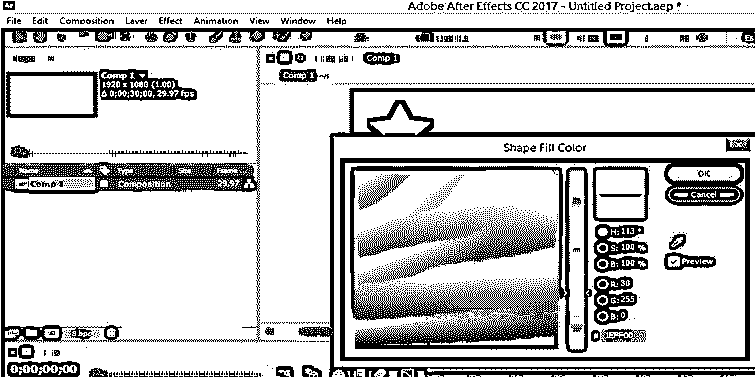

**步骤 11:** 现在选择星星形状，根据你改变它的颜色。要更改颜色，请单击该形状的填充选项，并从该框中选择所需的颜色。

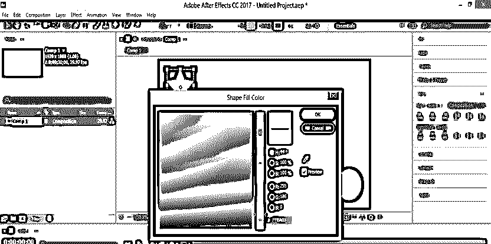

**步骤 12:** 现在进入图层部分，点击选择 Polystar1 图层。当你点击 Polystar1 层的小箭头按钮时，下拉属性列表将会打开。

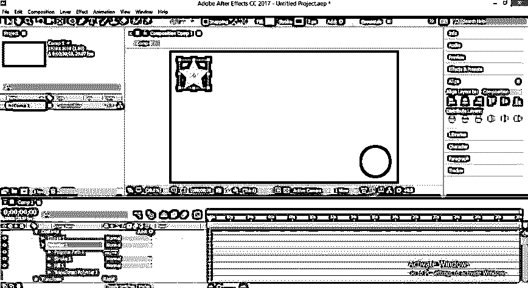

**步骤 13:** 现在点击 Polystar Path 1 属性的小箭头按钮。polystar 路径的属性将被打开。出于动画的目的，我们将制作一些动画。

**第十四步:**现在点击位置属性的小时钟图标。关键帧部分将添加一个键。

**步骤 15:** 现在大约 2 秒取关键帧头。在“框架”部分中，单击“钥匙”图标以在此时添加新的钥匙，该图标位于“位置”属性的左上角。

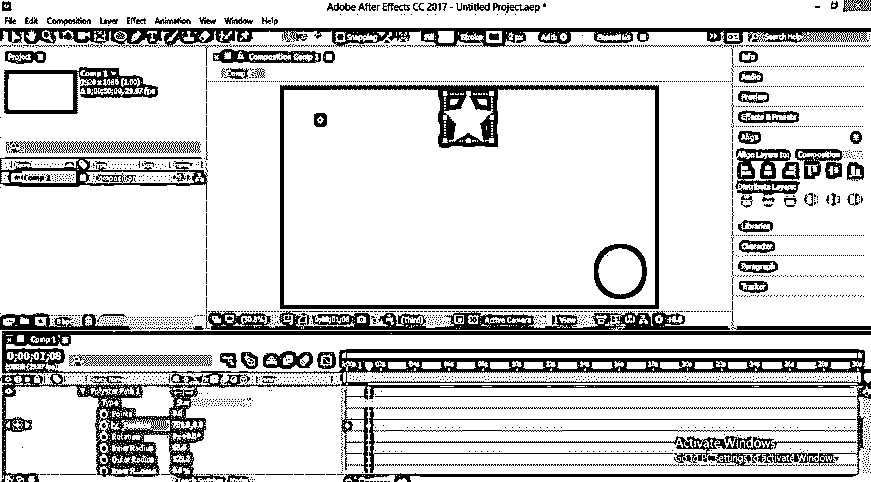

**步骤 16:** 现在通过改变 position 属性的值将多边形移动到中心位置。

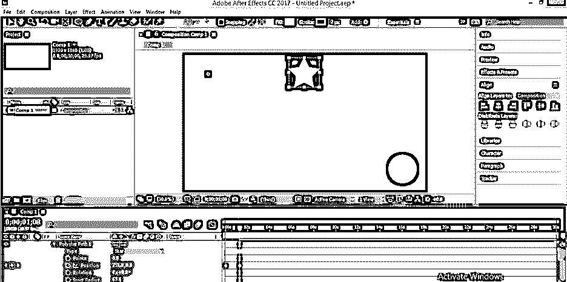

**步骤 17:** 现在，将关键帧头放在起始位置，为了制作下一个属性的动画，我们将点击内半径属性的小时钟图标，并保持内半径不变。

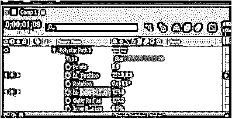

**第 18 步:**现在，放置关键帧头，就像我们在位置属性中做的一样。现在，单击内半径属性的键以添加新键，并增加内半径值。

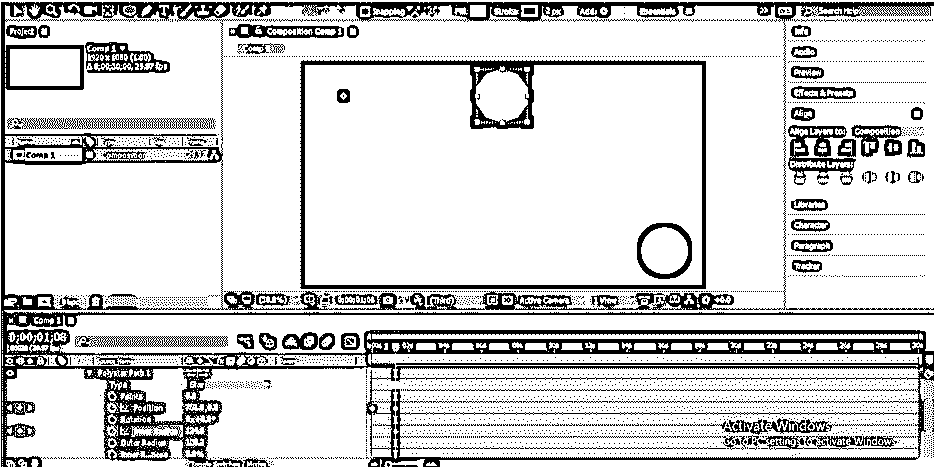

**步骤 19:** 现在点击 Fill 属性的小箭头图标查看填充选项列表，点击 Fill 的 Color 属性的时钟图标添加键。现在点击颜色框，从框中选择你想要的颜色。

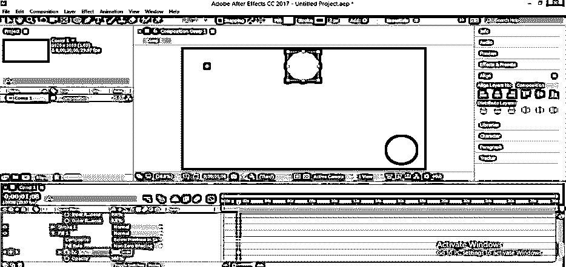

**步骤 20:** 现在，将关键帧头放在起点，点击椭圆图层的小箭头图标。

**步骤 21:** 现在，不要改变圆圈的位置。

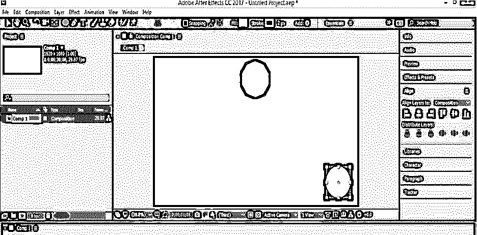

**步骤 22:** 现在，在我们之前放置的同时放置关键帧头，改变这个圆的位置值。我将把-700，-700 作为 x y 方向的值，这样它将覆盖其他形状。

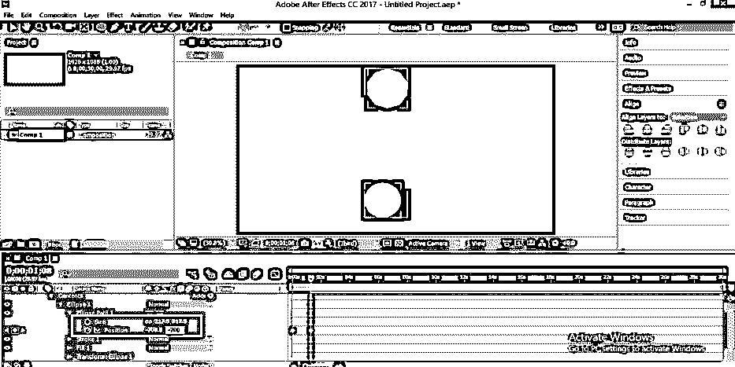

**步骤 23:** 现在，我在这个位置改变这个圆的颜色。对于一个变化，颜色打开这个形状的填充选项，然后点击填充选项的颜色框。一个颜色框将会打开，让你从这里选择你想要的颜色。我将从这里选择黑色。

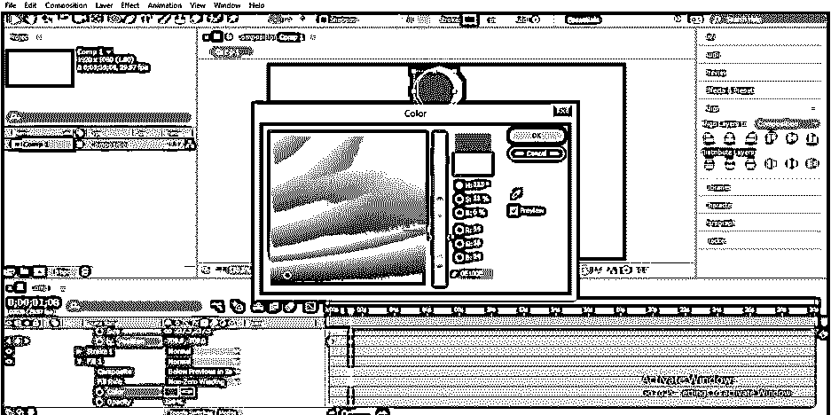

第 24 步:也给这个属性添加一个键。

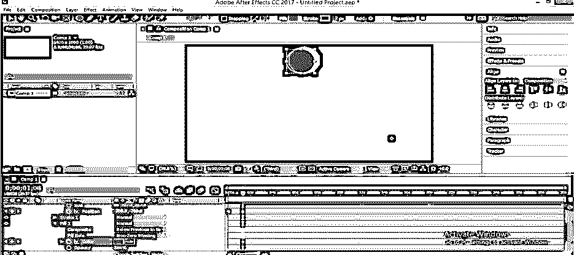

第 25 步:现在，我将使用与前面步骤相同的方法制作这个形状的动画。我将通过减小尺寸选项的值来减小这个形状的尺寸。

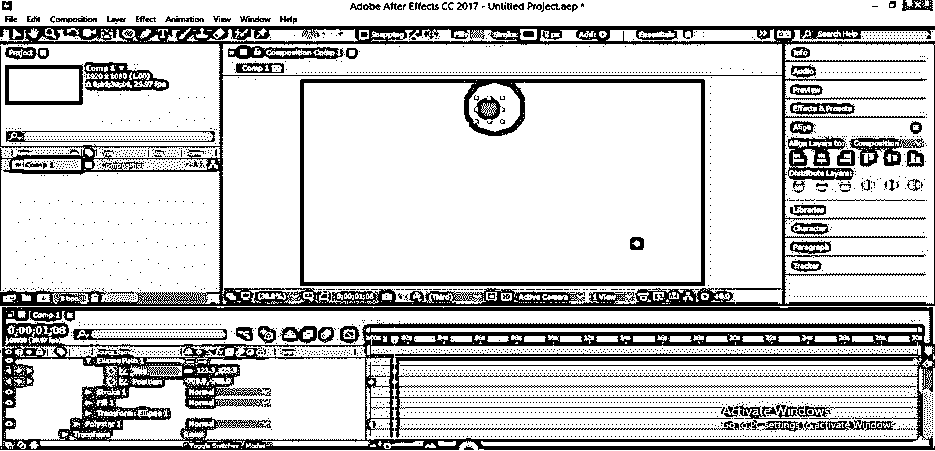

**步骤 26:** 现在调整两个形状的位置，让它们可以像这样互相覆盖。

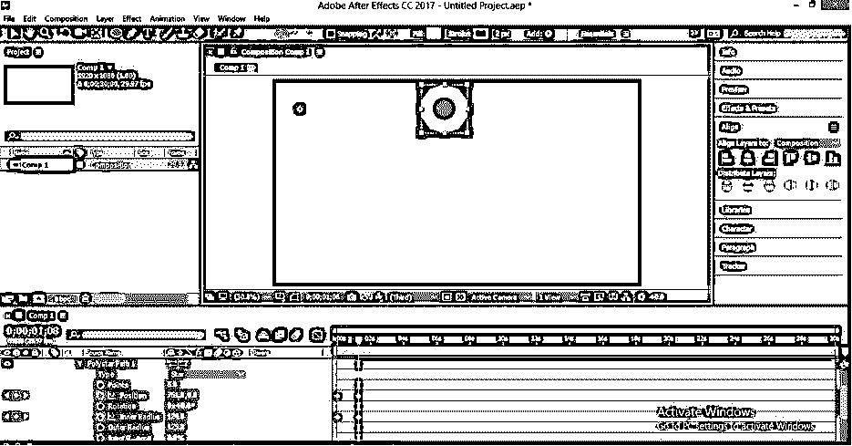

**步骤 27:** 现在，当你播放动画时，它会是这样的。

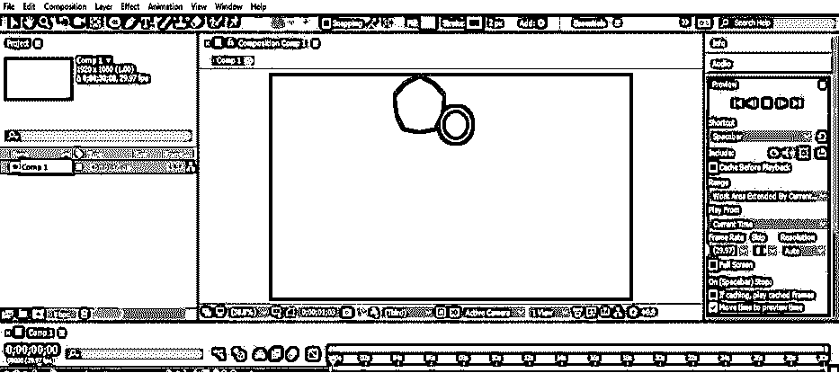

*   这样就可以在 Adobe After Effect 软件中制作任意对象的运动图形。

### 结论

通过本文中的运动图形示例，您可以轻松理解“什么是运动图形”和“如何在 Adobe After Effect 软件中制作任何对象的运动图形？你可以通过练习不同类型的主题来获得运动图形方面的专业知识。

### 推荐文章

这是一个动画效果的指南。在这里，我们讨论的介绍，以及如何创建运动图形在 After Effects 在一步一步的方式。您也可以浏览我们的其他相关文章，了解更多信息——

1.  [后效中的标志动画](https://www.educba.com/logo-animation-in-after-effects/)
2.  [后效背景](https://www.educba.com/background-in-after-effects/)
3.  [输出后效](https://www.educba.com/export-in-after-effects/)
4.  [后效便携式指南](https://www.educba.com/after-effects-portable/)

