# 在效果后摆动

> 原文：<https://www.educba.com/wiggle-in-after-effects/>

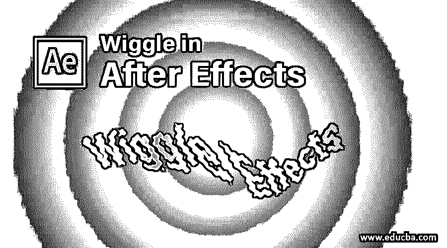

## 后效中的摆动简介

After Effect 是 Adobe Systems 提供的 Creative Cloud 应用程序包中的一个重要软件，用于编辑音频和视频图形；在 Adobe After Effect 中，我们可以通过使用该软件的不同类型的效果功能来处理任何图形。Wiggle 就是其中之一；您可以将 Wiggle 理解为一种效果，它有助于在任何对象的运动中应用振动，以便在特定项目中为不同类型的目的制作任何运动图形。在本文中，我们将通过一个例子来理解 adobe After Effect 软件中的 Wiggle，并分析如何处理它的参数以获得最佳效果。

### 如何在 After Effect 中使用 Wiggle？

让我们先了解一下 After Effect 软件的工作屏幕上提供的该软件的不同部分。在了解了这些部分之后，我们可以很容易地理解贯穿本文的该软件的不同术语。

<small>3D 动画、建模、仿真、游戏开发&其他</small>

**步骤 1:** 在 After Effect 的用户界面中，我们有四个主要部分，一个是项目面板，位于名为“项目”的工作界面的左侧:它显示了当前项目中的一些活动组件，第二个是时间线面板，位于该软件的底端:它显示了一些层，您可以在这里调整动画的参数。 第三个是参数部分，在工作屏幕的右侧:它有不同的参数，如效果&预设，对齐，音频，和一些其他的:这些参数帮助你在任何对象的动画，最后一个是组成区域，作为你在这个软件中工作的可视化界面。 我们在这个软件中有两个功能区，可以在工作过程中进行其他调整:菜单栏和工具面板。

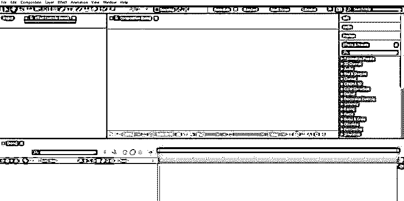

现在让我们来学习一篇新的作文。对于新合成，请转到菜单栏，它位于工作屏幕的顶部，然后单击此功能区的合成菜单。将打开一个下拉列表；从该列表中选择“新组合”选项。

**步骤 3:** 现在将打开一个“构图设置”对话框。根据您的要求设置新组合的参数，并按下该对话框的确定按钮。

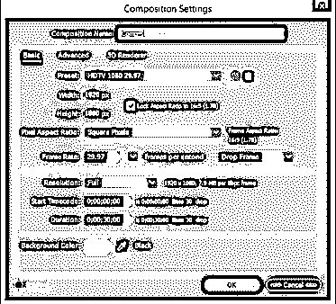

**步骤 4:** 现在转到菜单栏正下方的工具面板，从这里点击“矩形工具”。

**第五步:**借助矩形工具画出你想要的形状和颜色的矩形。

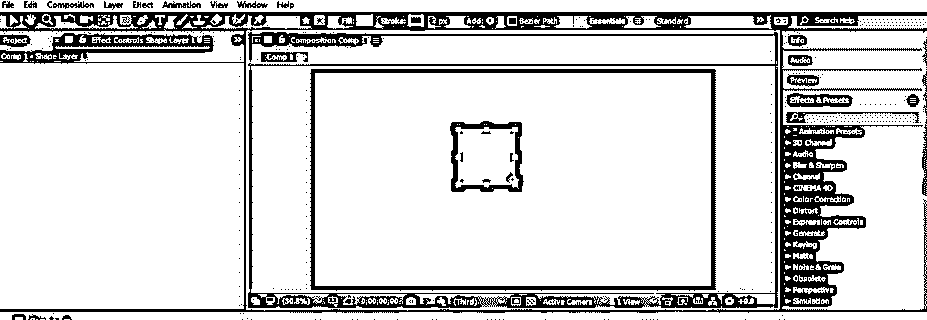

**步骤 6:** 现在转到时间轴面板的图层部分，点击这个形状图层的 Transform 属性的小箭头图标。转换的子属性列表将会打开。单击该层的位置子属性的小时钟图标。将在该形状的动画位置的关键帧区域添加一个关键点。

**第 7 步:**现在，将关键帧头放在 4 秒，然后点击该子属性左端的小关键图标，在关键帧上添加一个新的关键点。现在将形状移动到这个位置。

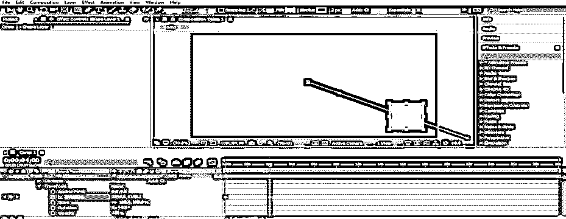

**第八步:**现在，在运动模糊上点击运动模糊的图标，使这个形状可以平滑的速度移动。

**第九步:**现在，当你按下键盘的空格键播放动画时，它会这样移动。

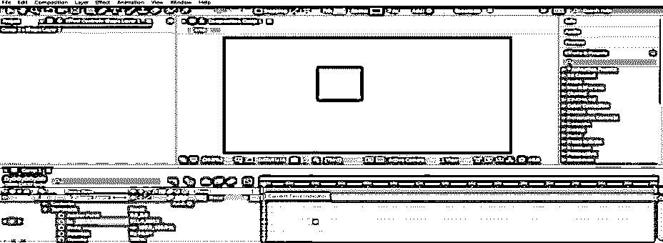

**第十步:**现在，对于摇摆器选项，进入菜单栏的窗口菜单，点击下拉列表的摇摆器选项。

**第十一步:**这是一个摇摆器属性框。在这个盒子里，我们有两个主要参数，频率和震级。

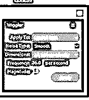

**步骤 12:** 现在在关键帧部分选择位置属性的两个键，然后当你选择键时，摆动器框的其他选项将被激活。

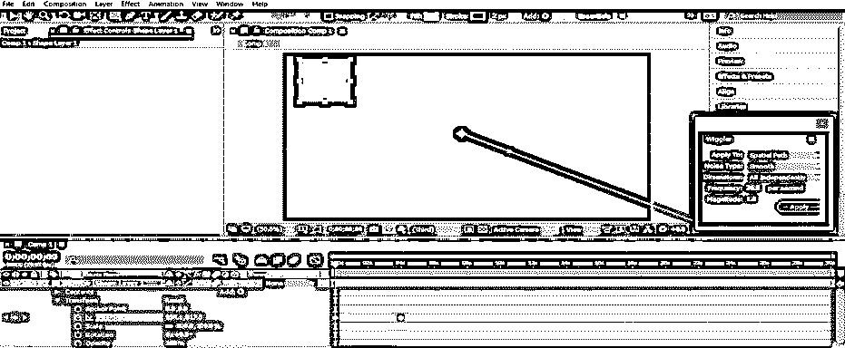

**步骤 13:** 现在，更改频率和幅度参数的值。频率表示一个物体移动或振动的次数，幅度表示它将移动多少像素。因此，根据您的需要更改该值，然后单击此框中的“应用”按钮来应用设置。

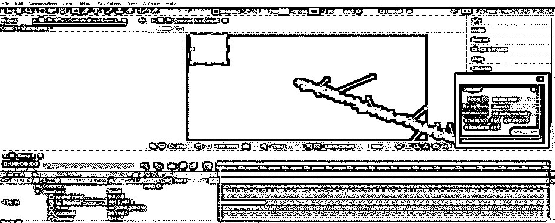

**第十四步:**现在，当你播放动画时，它会从一个位置移动到另一个位置，并带有震动效果。

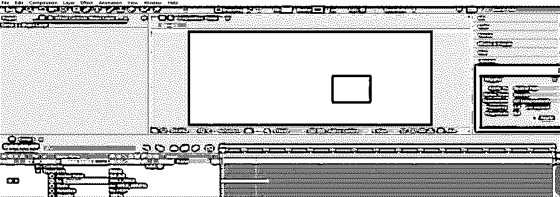

**第 15 步:**你可以从这个框的尺寸选项中，根据你的要求，分别在 X 方向或 Y 方向上制作形状动画。

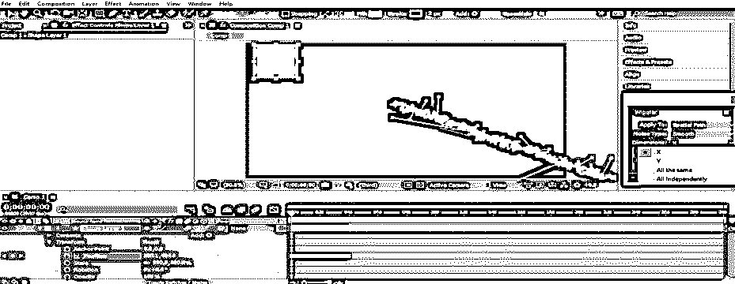

**步骤 16:** 您可以在任何对象的任何属性中应用 Wiggle，而无需从 Wiggler 框中应用它。要对任何属性应用 wiggle 表达式，只需按住键盘上的 Alt 键并单击该属性的小时钟图标。单击该属性后，将在该属性前面的关键帧部分打开一个用于编写 wiggle 表达式的框。

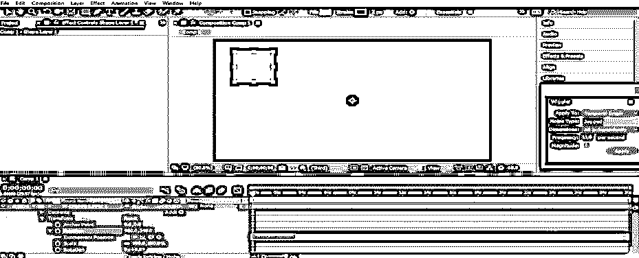

**步骤 17:** 现在以这种格式键入 wiggle 的表达式:键入 wiggle(频率的值，幅度的值)。我将键入值 wiggle (5，100)，这意味着它以 100 像素移动 5 次。

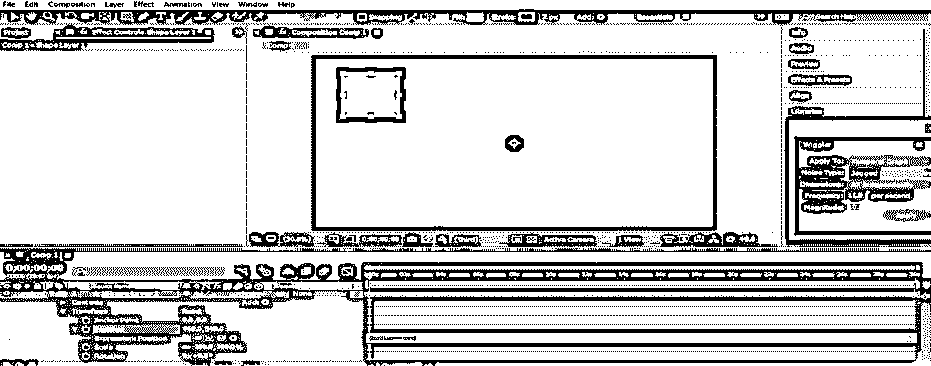

**第 18 步:**现在，当你播放动画的时候，它会这样动画，不添加任何用于动画的键。

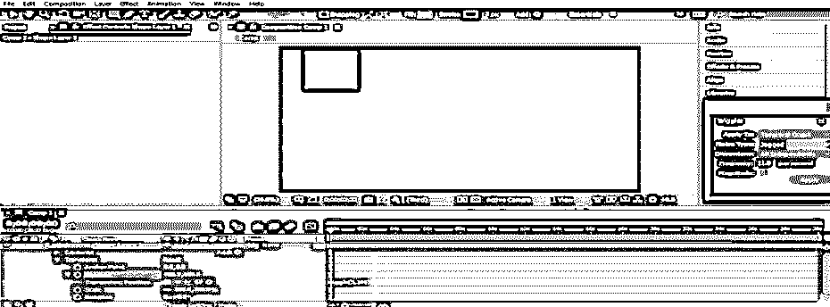

**第十九步:**你可以根据自己设置 wiggle 的值。现在，如果您想从该属性中删除 wiggle 表达式，只需按住键盘上的 Alt 键并再次单击同一属性的小时钟图标。

第 20 步:我们可以在多个属性上使用 wiggle 表达式，为任何项目制作最佳动画。

**步骤 21:** 要在多个属性上应用 wiggle，请按照我们对前一个属性所做的相同步骤，逐个设置两个属性的 wiggle 值。我将为这个形状的缩放和旋转属性设置 wiggle 的值，如下所示。

**步骤 22:** 现在，当你播放动画时，它会是这样的。

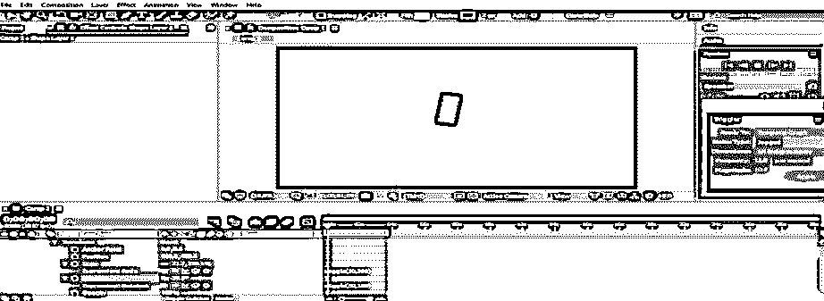

**步骤 23:** 你可以随时改变这个形状的颜色。

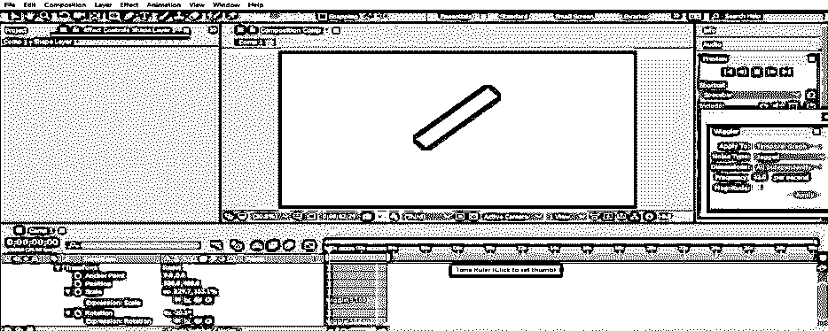

### 结论

现在，在这篇文章之后，你可以理解 wiggle 在 After Effect 中的作用，并且可以很容易地处理 Wiggle 的参数，以便在你的项目工作中获得这个表达式的最佳结果。在对该表达式的不同参数进行练习后，您可以使用 wiggle 选项制作有效的动画，这将为您的图形技能加分。

### 推荐文章

这是一个在效果后摆动的指南。在这里，我们讨论的介绍，以及如何使用一步一步的方式后效果摆动。您也可以浏览我们的其他相关文章，了解更多信息——

1.  [特效后的滑块控制](https://www.educba.com/slider-control-after-effects/)
2.  [在后效中遮蔽图层](https://www.educba.com/masking-layers-in-after-effects/)
3.  [特效后文本](https://www.educba.com/text-in-after-effects/)
4.  [后效中的慢动作](https://www.educba.com/slow-motion-in-after-effects/)
5.  [后效便携|重要性](https://www.educba.com/after-effects-portable/)

