# 特效后的陷码

> 原文：<https://www.educba.com/trapcode-in-after-effects/>

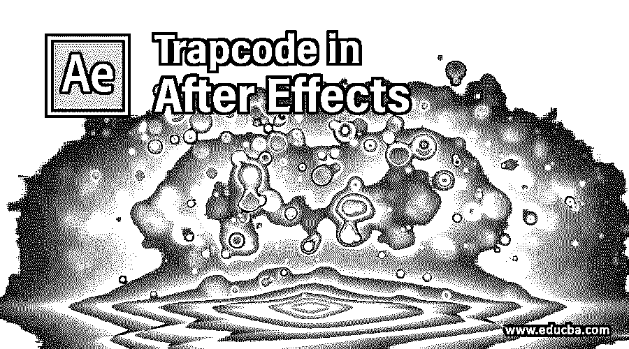

## After Effects 中陷码的介绍

After Effect 是视频编辑软件，我们可以根据自己的要求制作一些动画和编辑视频；在这个软件中，我们有不同的功能来帮助编辑工作。Trapcode 也是其中之一；您可以将它理解为一种效果，通过它您可以在特定路径上应用粒子运动，并可以为您的项目制作专业的动画。在本文中，我们将了解 After Effects 软件的 Trapcode，并学习如何处理特定动画的 Trapcode 参数。

### 如何在 After Effect 中使用 Trapcode？

我们将以一种非常简单的方式理解 Trapcode，但在开始之前，让我们浏览一下该软件工作屏幕的重要部分，以便在本文中更好地理解该软件。

<small>3D 动画、建模、仿真、游戏开发&其他</small>

**第一步:**在工作屏幕的顶部，我们有一个菜单栏和工具栏，让我们在这个软件中的工作变得简单；在这些功能区下面，有三个部分，即工作屏幕左端的项目面板，中间是显示我们当前合成的合成窗口，右端是用于在该软件中制作任何合成的参数部分，工作屏幕底部是用于在合成层中进行更改的层部分，右端是用于处理任何合成的任何特定动画的参数的时间线部分。

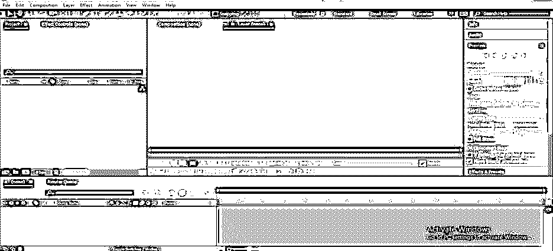

**步骤 2:** 现在进入工作屏幕顶部菜单栏的构图菜单，进行新的构图。

**步骤 3:** 另一个选项是右击项目面板部分的任意位置，并从下拉列表中选择“新建合成”选项。

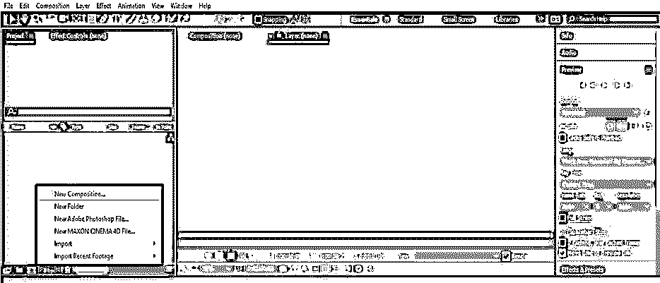

**第四步:**你可以点击项目面板的这个图标，它被命名为“创建一个新的组合”来创建一个新的组合。

**第五步:**新的构图设置框将打开。根据您的需要在此进行设置，然后按下该对话框的“确定”按钮。

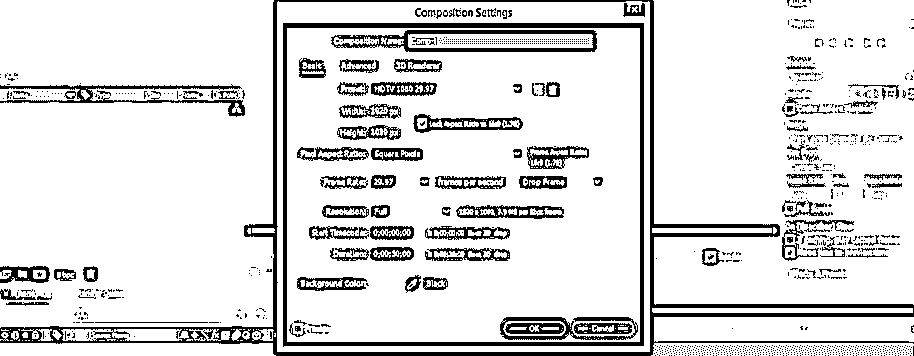

**第六步:**现在转到这个软件的图层部分，它在工作屏幕的底部，右击这个部分的任何地方。将打开一个下拉列表，转到“新建”选项，并从新的下拉列表中选择“实体”选项。

**第七步:**将打开一个实体设置对话框。将此实体层命名为“特殊”,并按下此对话框的“确定”按钮以应用设置。

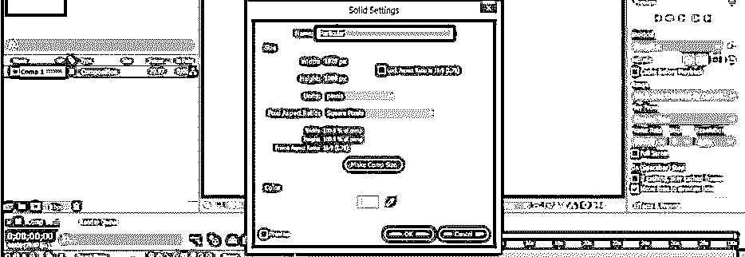

**第八步:**现在进入菜单栏的效果菜单。将打开一个下拉列表，转到该列表的 RG Trapcode 选项，并单击新下拉列表的“特定”选项。

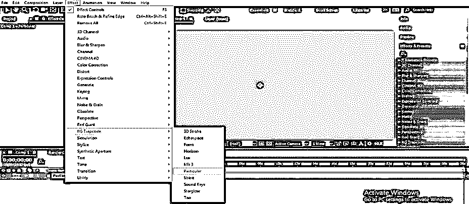

**第九步:** Trapcode 特定参数列表将在效果控制面板中打开，该面板位于该软件的项目面板旁边，作曲窗口的左侧。

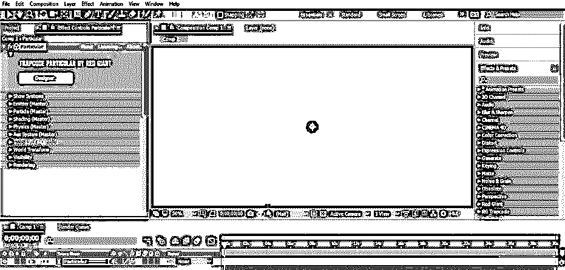

**步骤 10:** 我们在本节中有一个不同类型的参数，我们可以在练习后理解它。这里我将讨论其中的一些。有一个发射器选项，它是 After Effects 软件 Trapcode 特定功能中最重要的参数。

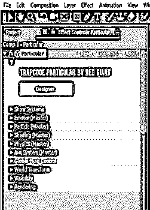

**第十一步:**让我们来看看。点击发射器选项的小箭头图标，将打开发射器的参数列表。

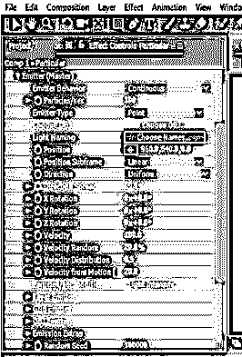

**步骤 12:** 从关键帧播放可以看到粒子的散射。

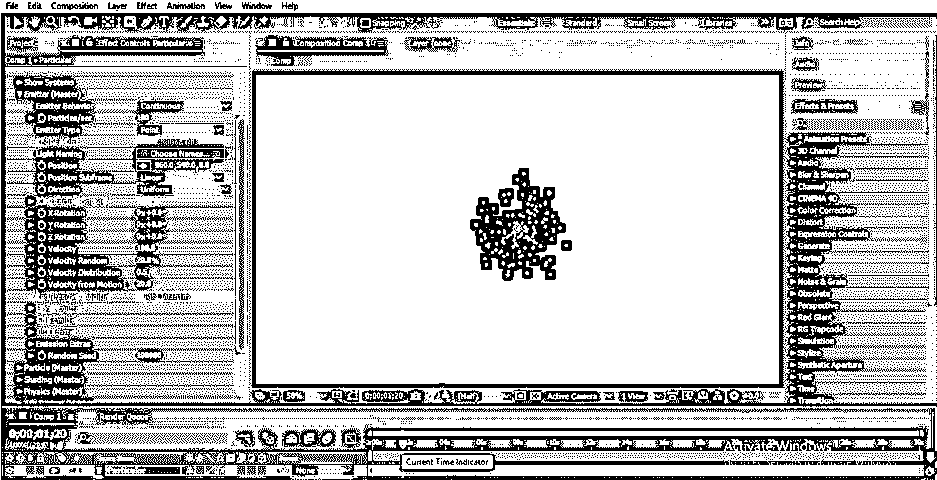

**第十三步:**第一个选项是发射器行为。有两个主要选项是“连续的”；它会像这样持续发射粒子。

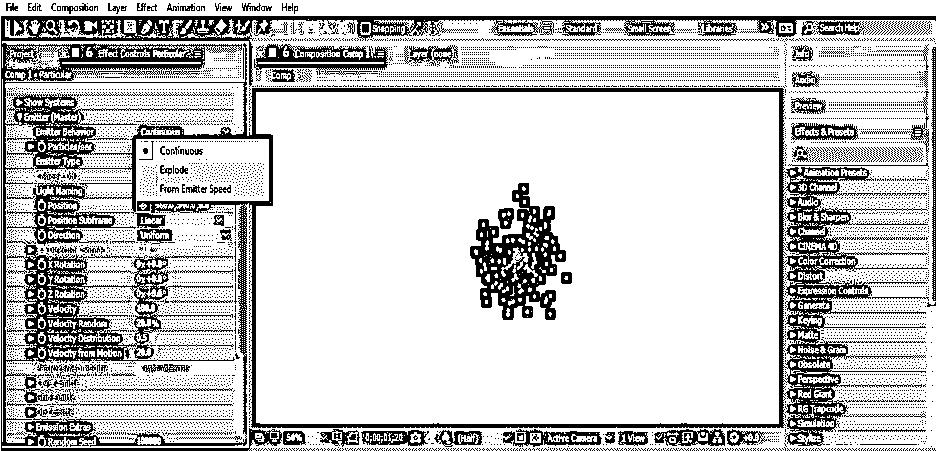

第 14 步:第二步是爆炸，它会发出这样的粒子。

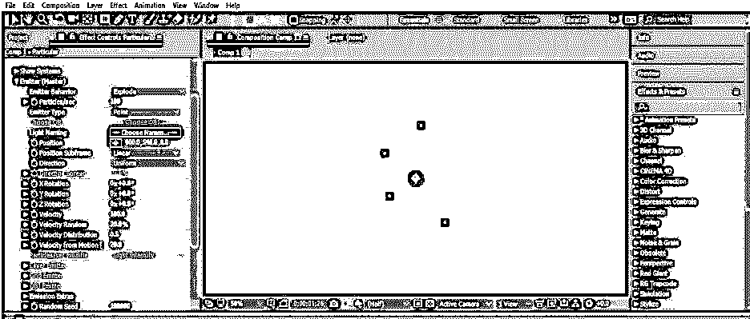

**第 15 步:**你可以调整每秒发射的粒子数。当您增加该选项的值时，粒子数将增加，如果您减少，粒子数将减少。

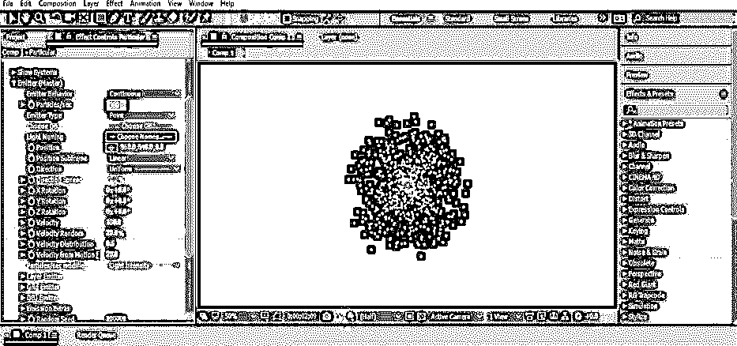

**步骤 16:** 粒子散射的类型将取决于该选项，即发射器类型。你可以从这份名单中选择任何人。我将向你们解释其中的一个，作为 Trapcode 细节的例子。

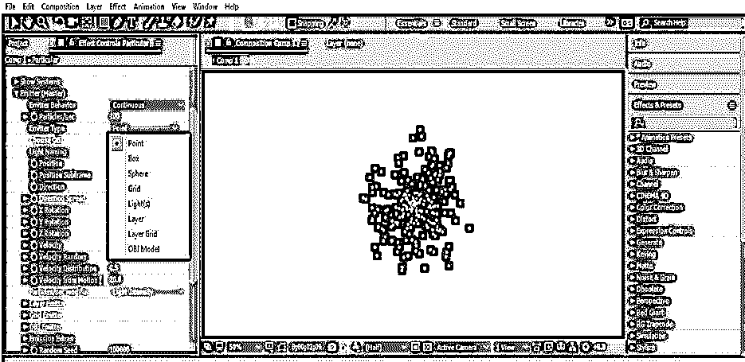

**第十七步:**那么让我们用一个例子来理解 Trapcode。右键单击层部分。将打开一个下拉列表，转到“新建”选项，并从新的下拉列表中选择“灯光”选项。

**步骤 18:** 灯光设置对话框打开。将该层命名为“发射器”,以使用光发射器，并按下该对话框的“确定”按钮。

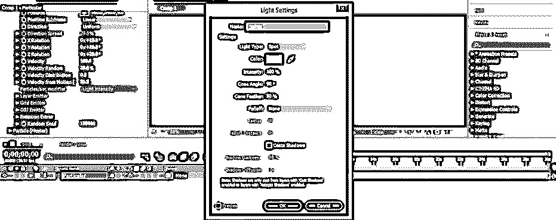

**第 19 步:**构图画面上会生成 Light ranger。您可以通过从该列表中选择大小百分比来调整大小。

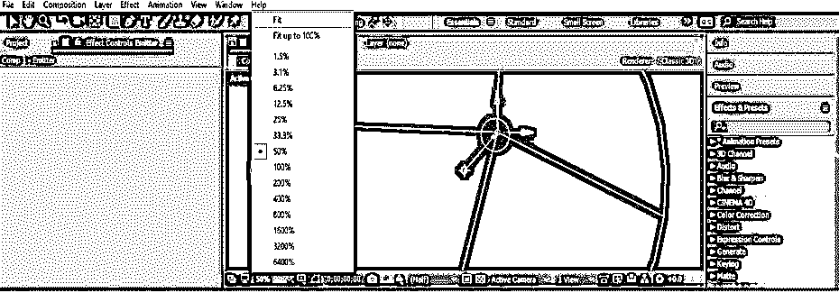

**步骤 20:** 现在，从 Trapcode 特殊选项的参数中选择发射器类型中的“光”选项。

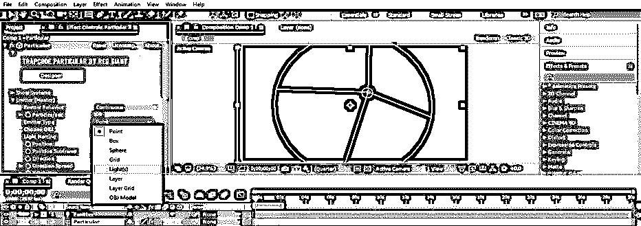

步骤 21: 现在，将播放头放在时间线部分的前几帧，这样我们就可以看到粒子了。

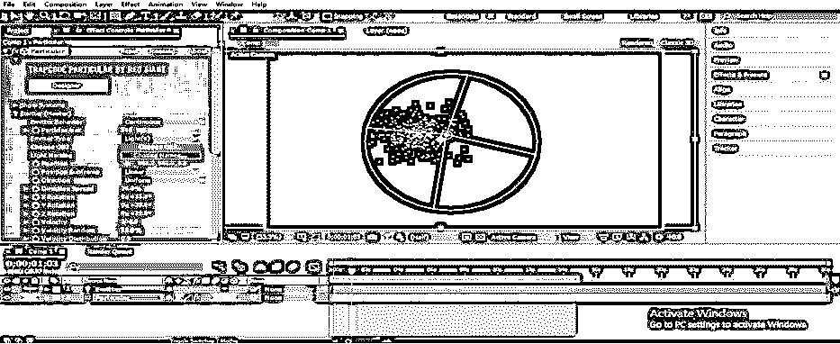

**步骤 22:** 现在点击该软件图层部分的发射器图层，并按下键盘上的 P 按钮，显示发射器的位置属性。我们将动画发射器的位置。

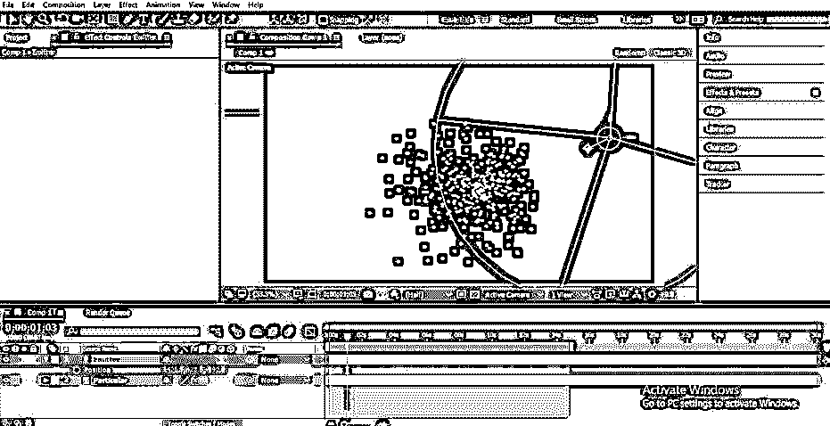

**第 23 步:**现在，将关键帧的播放头放在起点，然后通过借助 X 和 Y 方向的移动箭头移动光标，将光标放在该选项上。现在添加一个关键点在这个发射器的位置属性上。

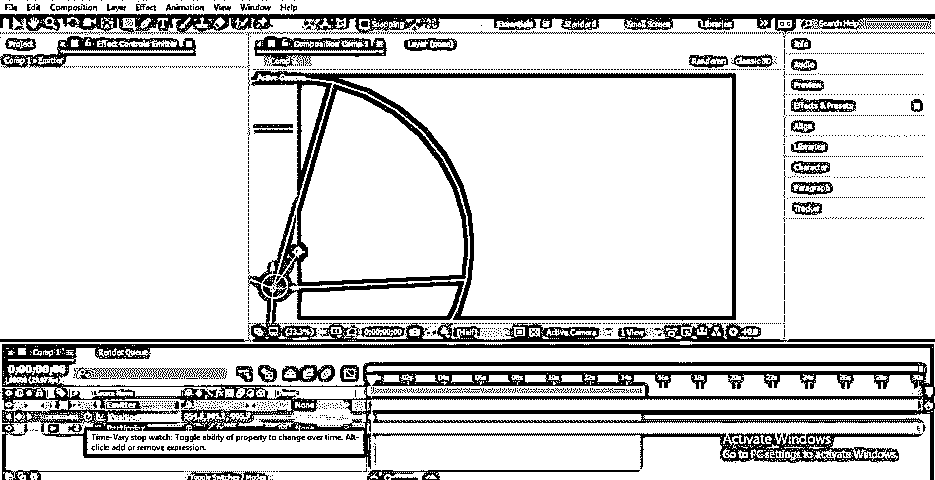

**步骤 24:** 现在，将关键帧头部放在关键帧时间线部分向前几帧，然后将 light ranger 放在这个选项。

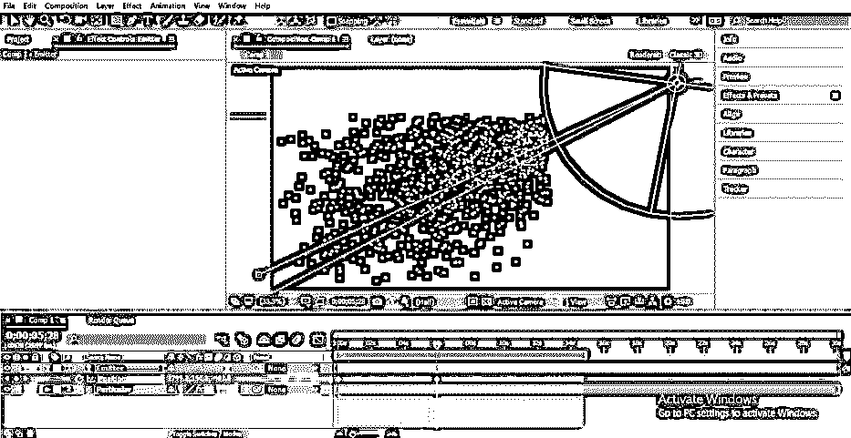

**第 25 步:**现在按键盘空格键播放动画，也可以从这个软件的参数部分的预览选项卡播放。你的动画会是这样的。

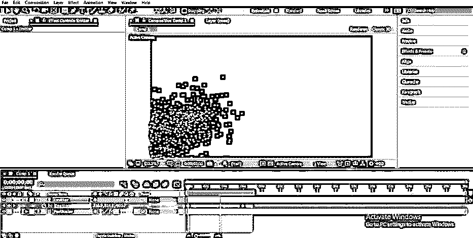

这样，您可以使用 After Effect 中的 Trapcode 在项目工作中获得粒子散射效果。

### 结论

现在，在这篇文章之后，你可以理解“After Effects 软件中的 Trapcode 是什么”,也可以处理它的不同类型的参数以获得不同类型的结果。练习 After Effects 软件的这一功能后，您可以理解该软件中所有类型的 Trapcode 发射器。

### 推荐文章

这是一个在特效中陷码的指南。在这里，我们讨论介绍以及如何一步一步地创建 Trapcode。您也可以看看以下文章，了解更多信息–

1.  [2D 特效动画后](https://www.educba.com/2d-after-effects-animation/)
2.  [Adobe After Effects 插件](https://www.educba.com/adobe-after-effects-plugins/)
3.  [Adobe After Effects 插件](https://www.educba.com/adobe-after-effects-plugins/)
4.  [后效中的旋转观测](https://www.educba.com/rotoscoping-in-after-effects/)
5.  [后效时间线指南](https://www.educba.com/after-effects-timeline/)

