# 丛后效应

> 原文：<https://www.educba.com/plexus-after-effects/>

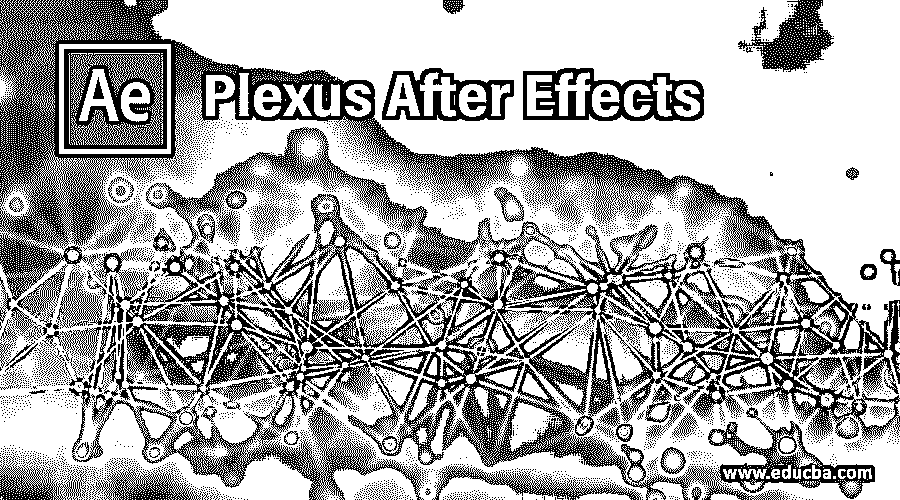

## 效果后丛简介

After Effects 是图形专业人员用于不同类型的编辑工作的视频编辑软件之一；在这个软件中，我们可以使用不同类型的插件来提高它的工作性能。Plexus 是 After Effects 软件的重要插件之一。您可以将丛插件理解为一个不同类型参数的包，通过它您可以为您的项目工作制作高度专业的动画。在本文中，我将向您介绍丛插件，并通过一个例子告诉您如何处理它的参数。

### 如何在 After Effects 软件中使用丛？

**步骤 1:** 在这里，我们将通过一个例子用非常简单的步骤来讨论丛，但是为了更好地理解整篇文章，让我们快速浏览一下这个软件的工作屏幕。该软件的工作屏幕分为几个部分，以方便用户使用。顶部两个功能区是菜单栏和工具栏；在工作屏幕的中间，三个主要面板是左侧的项目面板、中间的合成窗口和右侧的参数面板，在该软件的下端有两个面板，分别是左端的图层面板和右端的时间轴面板。

<small>3D 动画、建模、仿真、游戏开发&其他</small>

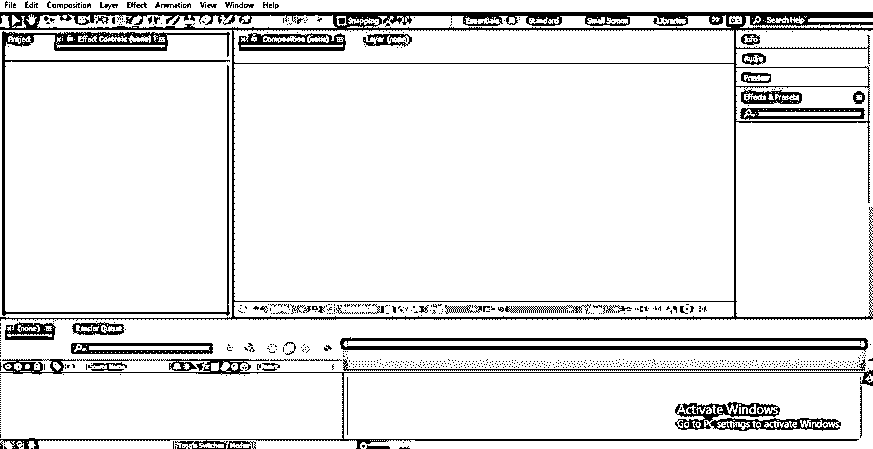

让我们现在有一个新的作文来开始我们的学习。对于新的组成，您可以通过三个选项:首先，进入工作屏幕顶部的菜单栏并单击文件菜单，然后单击下拉列表中的'新建'选项。

**第三步:**第二个选项是点击项目面板的“创建新组合”选项卡，创建一个新组合。

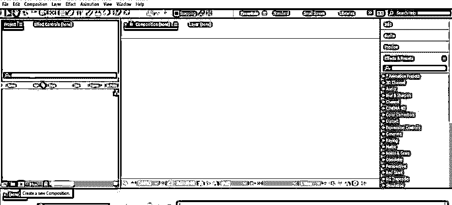

**第四步:**第三步是借助鼠标右键在项目面板部分的任意位置进行右键点击，新建一个构图。

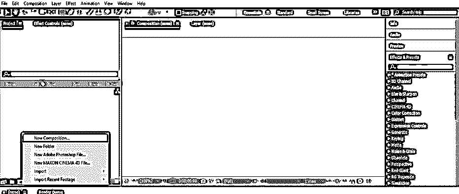

**第五步:**打开构图设置对话框。根据您的需要在此进行设置，然后按下该对话框的“确定”按钮。

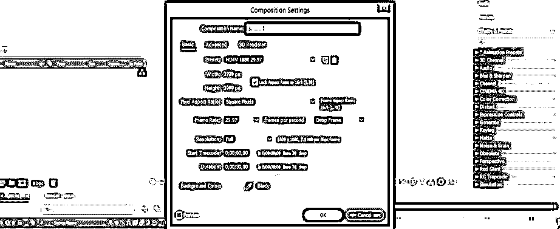

**第六步:**现在转到工作屏幕底端该软件的图层部分，借助鼠标右键在该部分的任意位置点击右键。将打开一个下拉列表，转到该下拉列表的“新建”选项，并从新建下拉列表中选择实体选项，以创建实体层。

**第七步:**会打开一个实体设置框。根据您的需要命名，点击“制作排版尺寸”选项，然后点击对话框中的“确定”按钮。

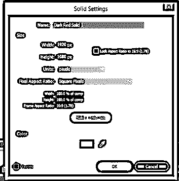

现在，如果你的 After Effects 软件上没有 Plexus 插件，从网上下载并安装到你的电脑上。然后转到效果&预设选项卡，该选项卡位于参数面板中工作屏幕的右侧，并在效果&预设选项卡的搜索框中搜索丛。

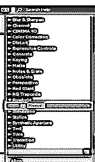

第九步:现在，从那里选择丛选项，放在图层部分的实体层上。一旦你把它放在固体层上，丛的参数将在效果控制面板中打开，它在合成窗口左侧的项目面板旁边。

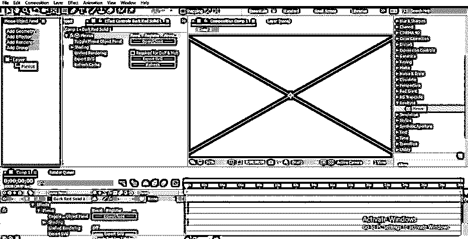

**第十步:**现在我们用一个例子来了解一下丛的参数。像这样调整丛的参数面板。现在点击“添加几何图形”选项，并点击下拉列表中的图元选项。

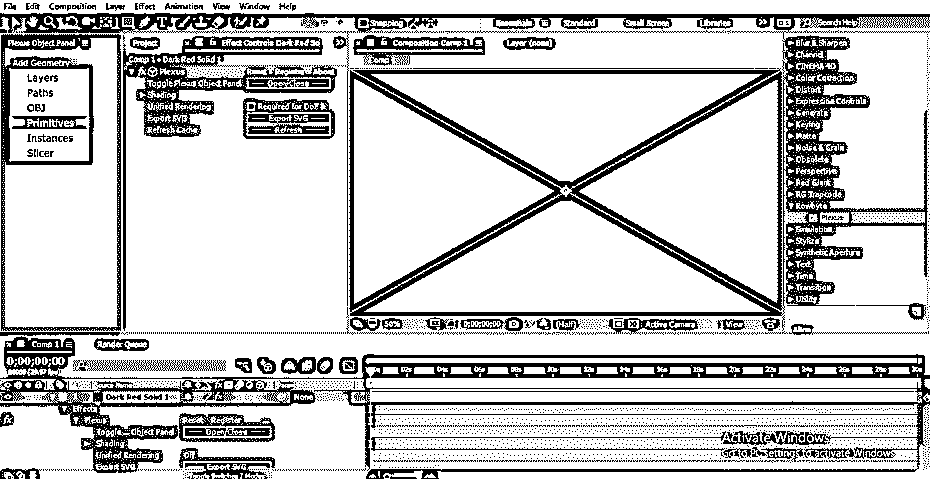

**步骤 11:** 现在点击“添加效果器”选项，并从该选项的下拉列表中选择“噪声”选项。

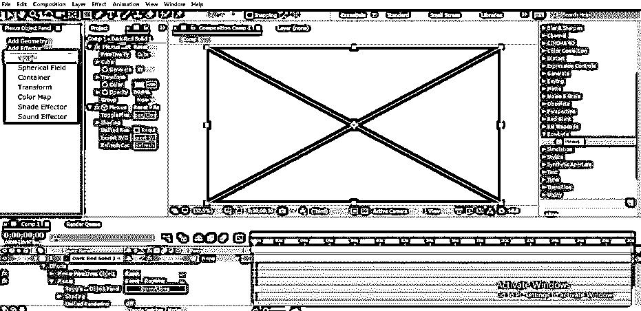

步骤 12: 现在点击“添加渲染”选项，从下拉列表中选择线条。

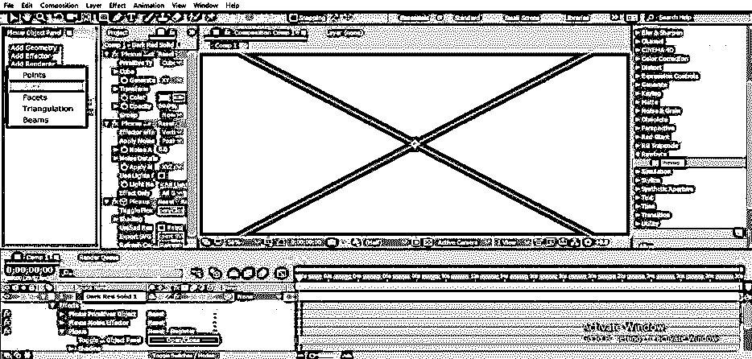

**步骤 13:** 这是用丛插件制作动画的三个主要参数。一旦你选择了这些选项，那么线条结构的组合将是这样的。

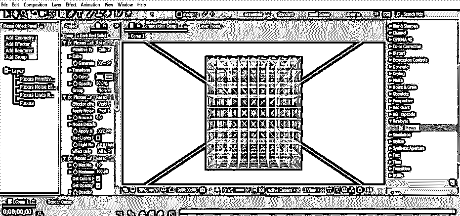

现在，让我们操作这些选项来得到我们想要的线条结构。现在转到效果控制面板，点击丛图元选项的小箭头图标。一列图元的数据将被打开，增加立方体宽度的值来增加立方体的大小。

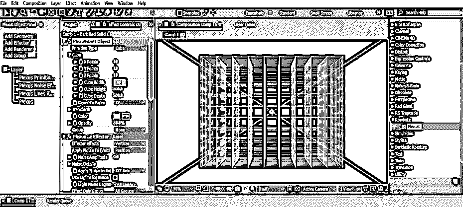

步骤 15: 现在将立方体高度的值增加到 1000，以获得线状结构。

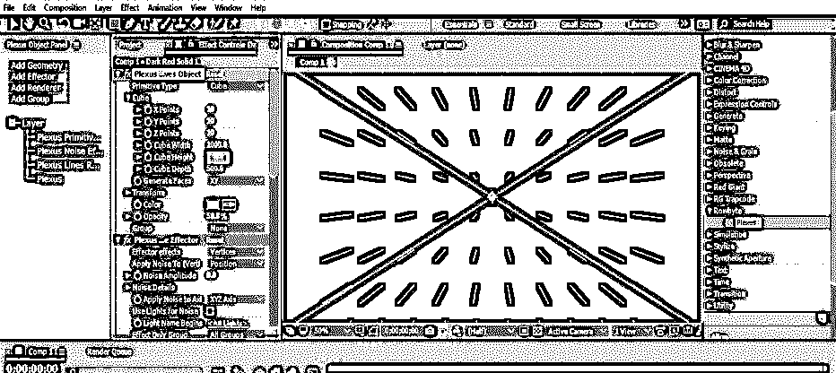

**步骤 16:** 现在，来到丛效应器选项，点击该选项的小箭头图标。效应器的数据列表将被打开，增加噪声振幅的值以获得这种类型的变化内联结构。

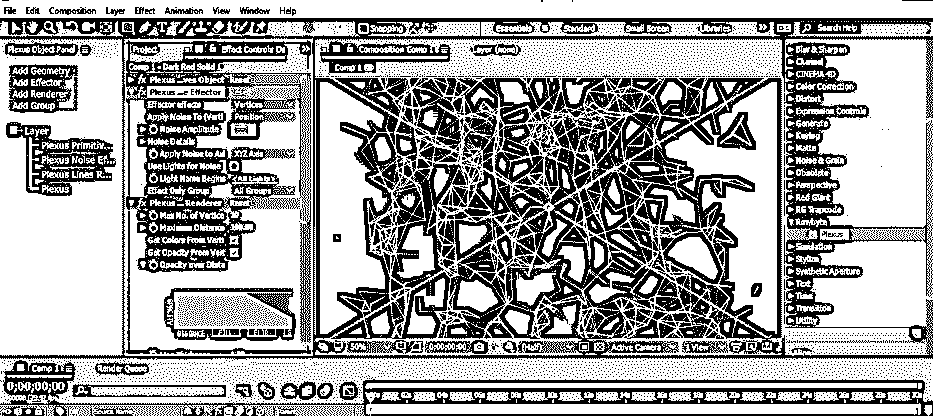

**步骤 17:** 现在，让我们动画这个噪声属性的值。点击噪音振幅上的小时钟图标添加键。

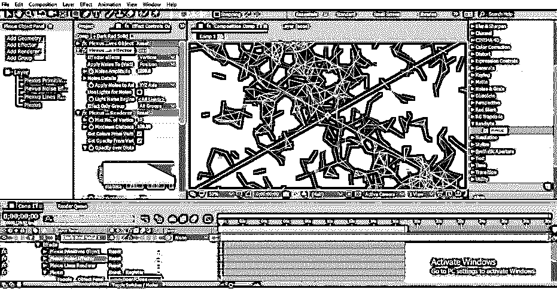

**步骤 18:** 现在将关键帧播放头放在关键帧部分的前面几帧，并将噪声振幅值增加到 1500。在关键帧部分的这个点再次添加一个新的关键点。

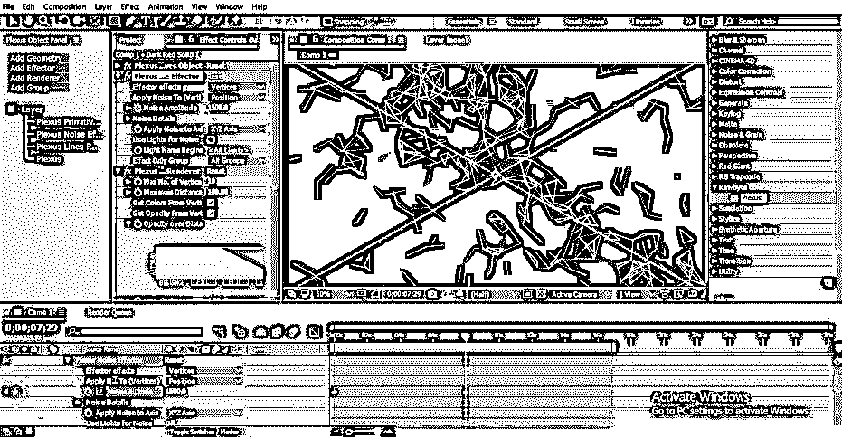

**步骤 19:** 现在，来到丛渲染器选项，点击这个选项的小箭头图标。该选项的数据列表将被打开。在此增加线条粗细值。

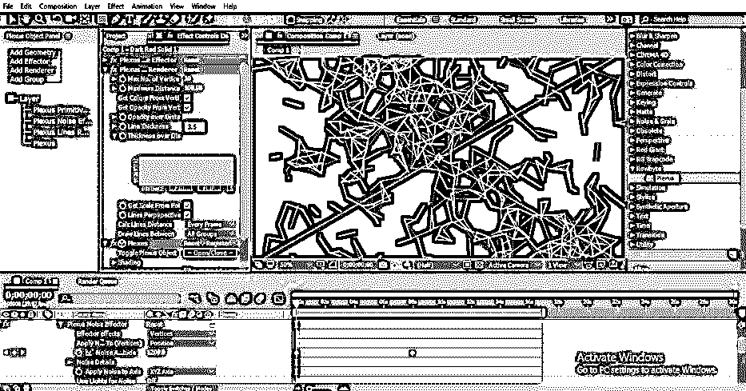

步骤 20: 现在，取消选中“从顶点获取颜色”选项，点击“线条颜色”选项的颜色框。

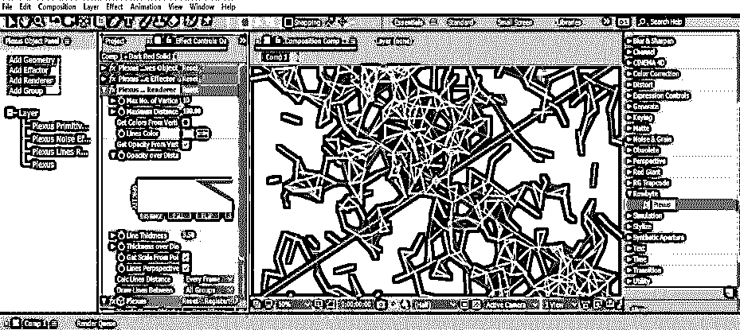

**步骤 21:** 从颜色面板对话框中选择你想要的颜色作为结构线条的颜色，按下该对话框的 Ok 按钮，然后在关键帧部分的该选项中添加一个键。

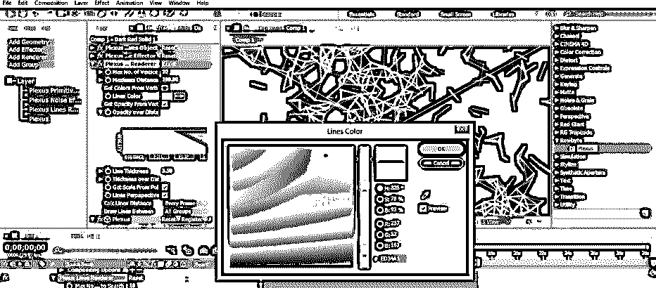

**第 22 步:**现在，将关键帧播放头放在某一帧前面，根据你的需要改变线条的颜色，然后在关键帧部分添加一个新的键。

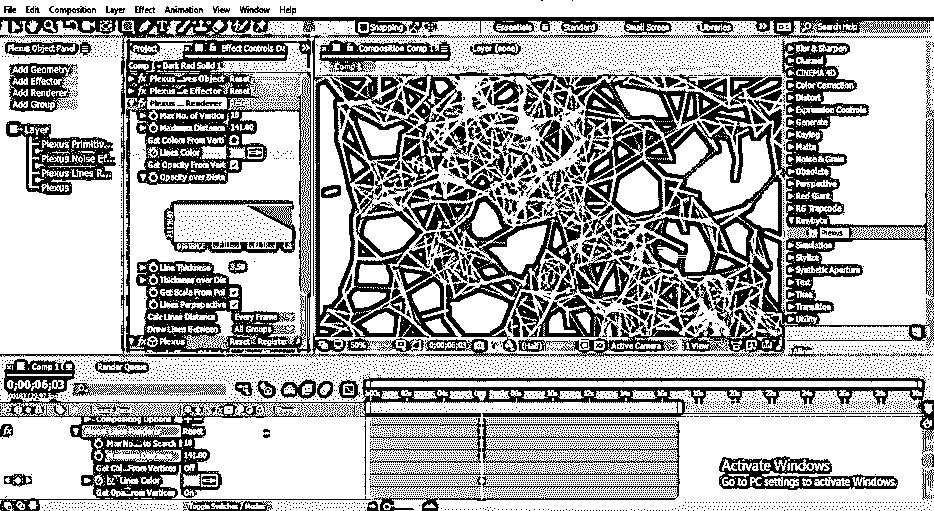

**步骤 23:** 现在，在这一点上，将线条的粗细减少到 1。

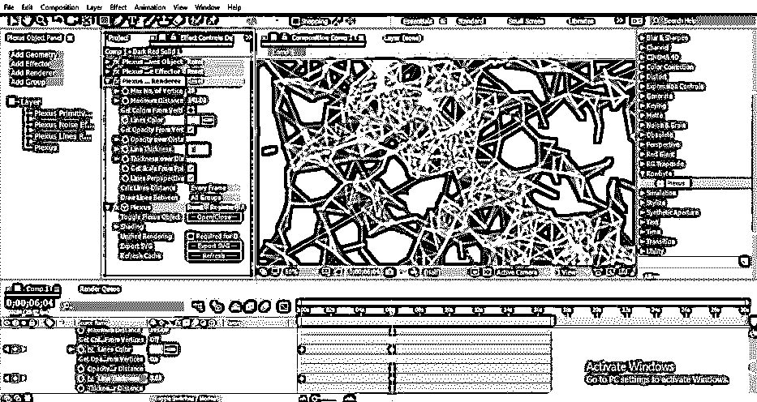

**步骤 24:** 现在，当你按下键盘的空格键来播放你的动画时，你的动画会是这样的。您也可以转到参数部分的预览选项卡来播放动画。

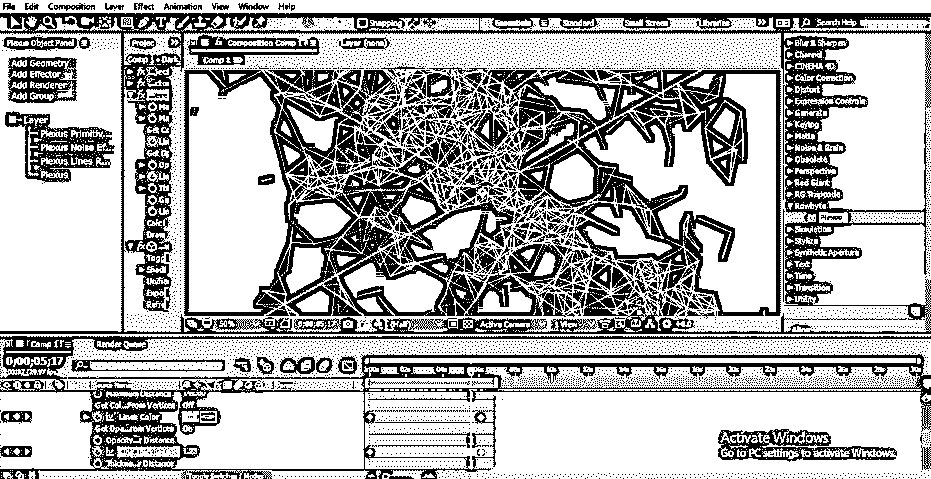

这样，你就可以在 After Effects 软件中使用 Plexus plugin 为任何项目作品制作专业的动画。

### 结论

在这篇文章之后，你可以理解 After Effects 软件中的 Plexus 插件，并且可以使用它为任何视频片段或图形设计制作有效的动画。您可以通过更改丛的参数设置来制作不同类型的动画效果。

### 推荐文章

这是一个丛后效果的指南。在这里，我们讨论一个介绍，如何一步一步地使用丛后效果。您也可以浏览我们的其他相关文章，了解更多信息——

1.  [特效后按键灯](https://www.educba.com/keylight-in-after-effects/)
2.  [特效后摆动](https://www.educba.com/wiggle-in-after-effects/)
3.  [后效中的运动图形](https://www.educba.com/motion-graphics-in-after-effects/)
4.  [后期效果中的排版](https://www.educba.com/typography-in-after-effects/)

