# 效果后的 GIF

> 原文：<https://www.educba.com/after-effects-gif/>

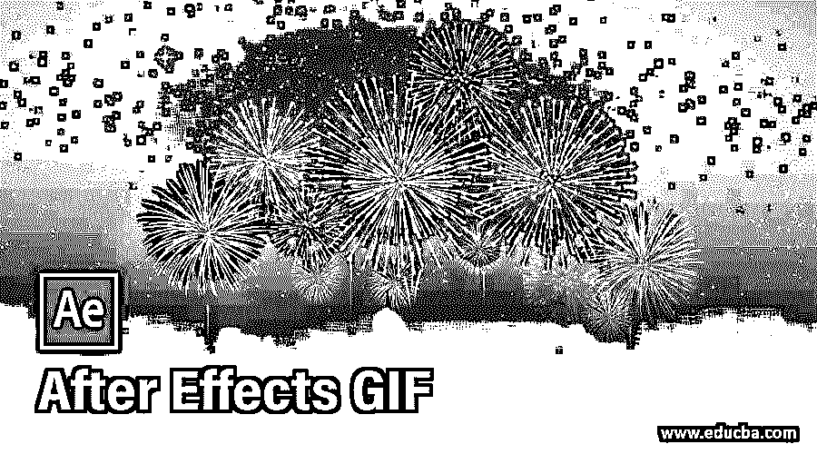

## 后效 GIF 简介

Adobe After Effects 是一款动画和视频编辑软件，在本文中，我们将学习如何从动画作品中创建 gif。在本文中，我们将探讨如何导出 GIF 或从导出的视频创建 GIF 的不同方法，以及如何为 web 优化 GIF。

### 创建后效 GIF 的步骤

下面是下面提到的步骤:

<small>3D 动画、建模、仿真、游戏开发&其他</small>

#### 第一步

界面顶部是菜单栏，如文件、编辑等。每个都有它的子菜单。在左侧，有一个由项目文件和效果控制面板组成的项目面板，显示应用于特定层的效果。然后是显示动画或视频预览的合成面板。在右上角，我们有各种布局预设，将根据工作类型进行排列。我们甚至可以创建自己的自定义布局。右边是用于编辑视频的各个部分。在底部，有层和时间轴面板，用于添加媒体和添加动画关键帧。

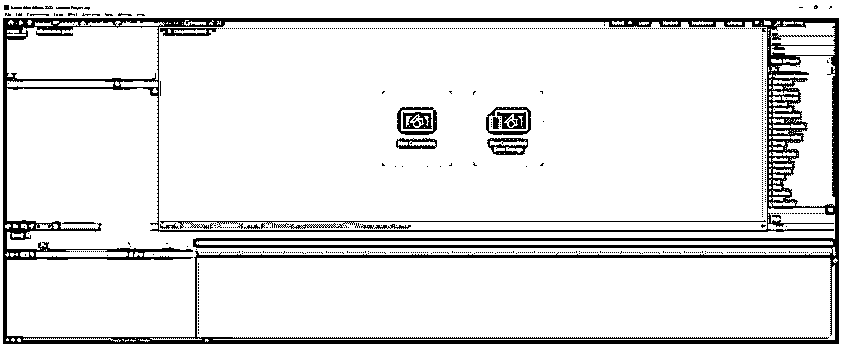

#### 第二步

我们将从一个完成的动画开始，它是一个简单的饼图，根据用途显示各种设备类型。我们还确保了我们的工作空间在 5 秒左右，因为 GIF 通常是一种短时间格式，除了网站上的文本之外，它通常会循环。

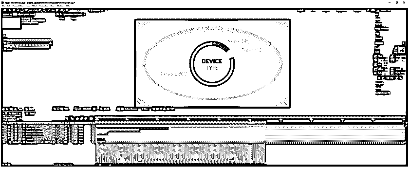

#### 第三步

首先，我们将导出此合成，我们将使用 Adobe Media Encoder 或按 Ctrl + Alt + M。您也可以在 After effects 中渲染，但它会阻止您当前的工作，直到合成渲染。

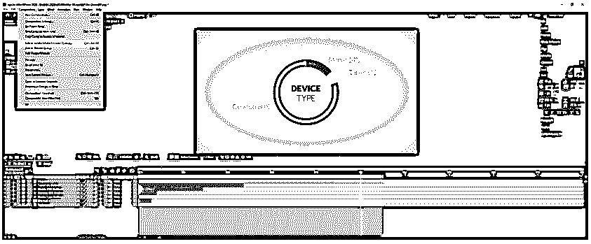

#### 第四步

因此，后效文件被添加到队列中。Adobe media encoder 与其他 Adobe 产品兼容，如 premier pro。如果添加了这些文件，它们也会在这里列出。

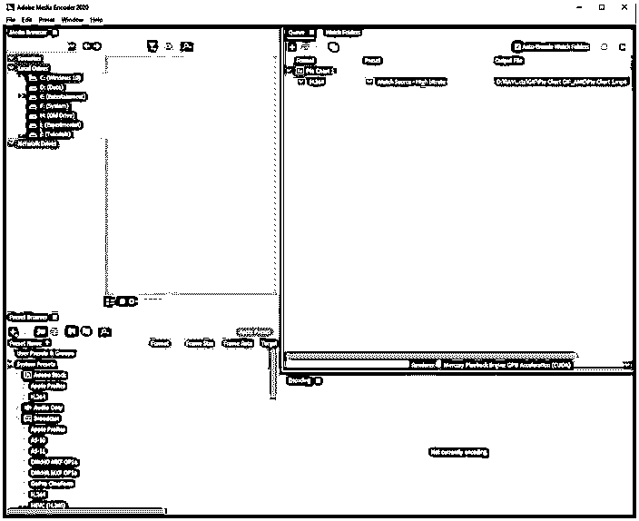

#### 第五步

让我们先从 gif 的新方法开始，而不是传统的导出到 H.264 然后在 photoshop 中转换成 GIF 的方法。在格式下拉列表中选择 GIF。您还可以更改输出文件的位置。

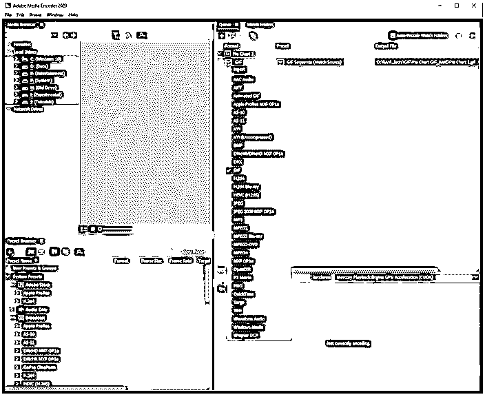

#### 第六步

点击 GIF，你会看到导出设置，包括源文件和输出，以及需要调整的设置。源范围是工作区，而不是整个合成。我们可以操纵底部的进出标记进行自定义选择。在右侧，可以操作各种选项卡，但现在，保持原样并单击 OK。

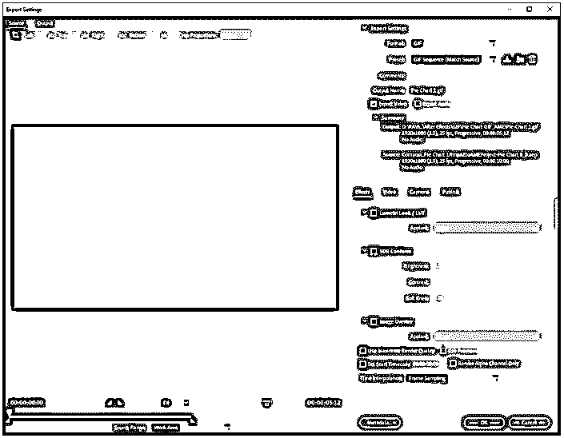

#### 第七步

现在按绿色播放按钮开始渲染队列。在编码窗口中，您可以获得渲染的状态。还会显示经过的时间和剩余时间。

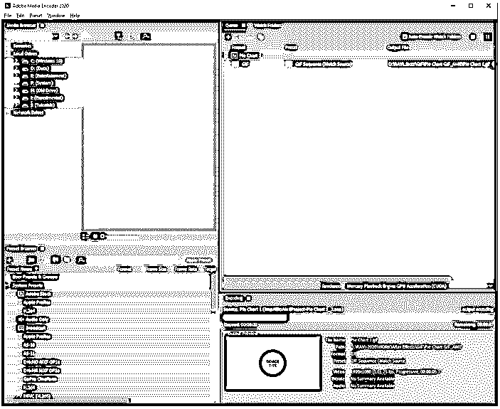

#### 第八步

渲染完成后，状态将为“完成”,右侧将出现一个绿色勾号，表示文件已生成。所以我们得到了 gif 格式的 25 fps 的图像序列。

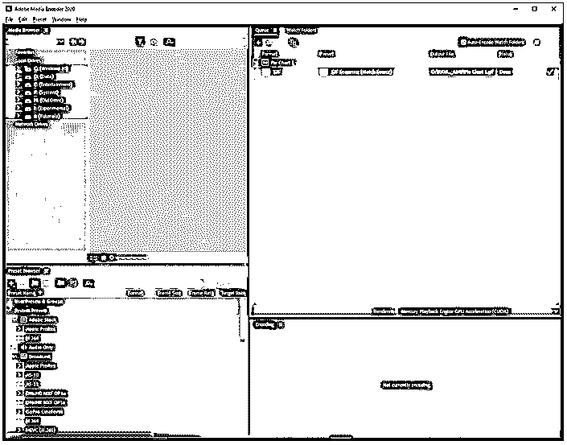

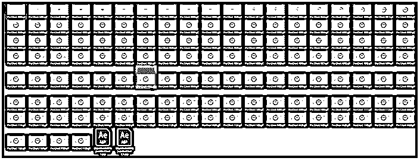

#### 第九步

现在让我们看看如何使用 photoshop 生成 GIF 文件。同样，将伴奏添加到媒体编码器渲染队列，并选择 H.264 作为预设。

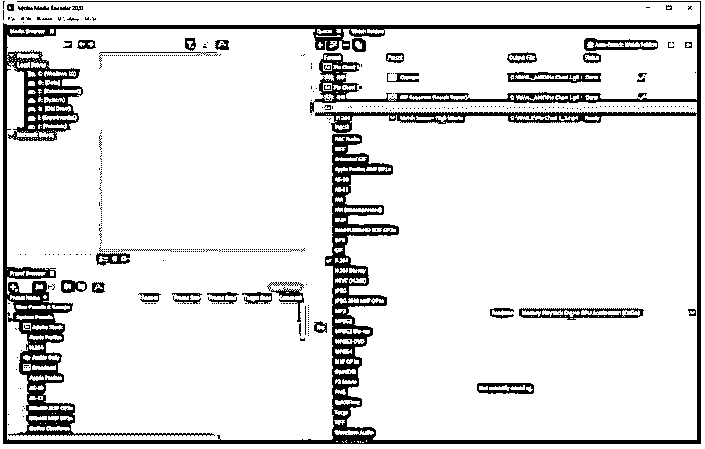

#### 步骤 10

通过开始渲染导出该文件，将导出一个 mp4 文件。称之为全彩版。

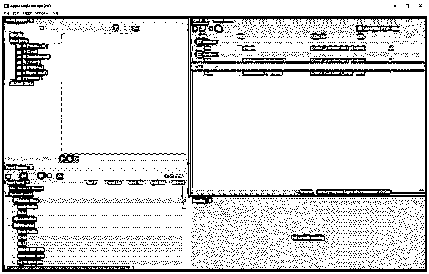

#### 步骤 11

现在，我们将关闭晕影层和运动模糊，并再次导出视频到 H.264。这将减少渲染时间以及文件大小也将减少。

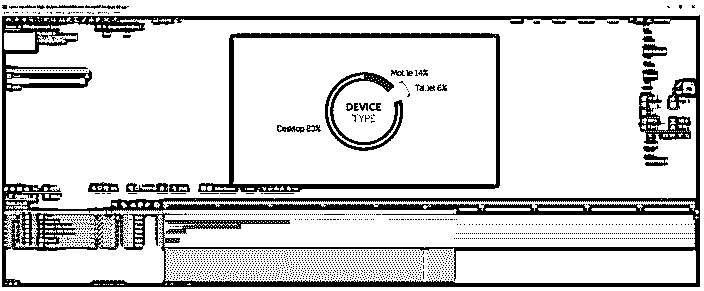

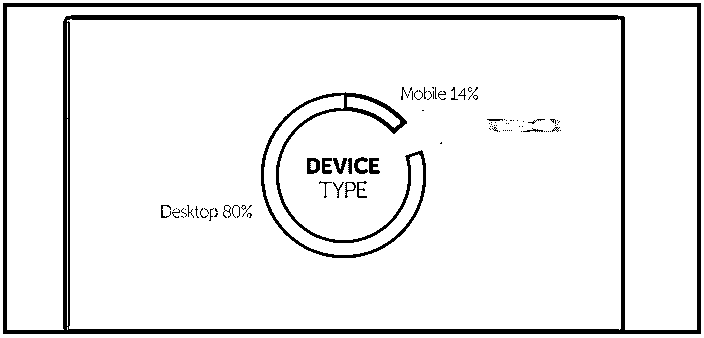

#### 第 12 步

渲染这个文件，并给它另一个名字。称之为简单的彩色版本。

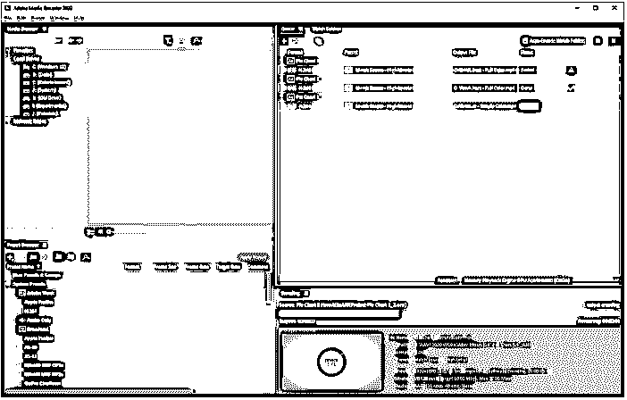

#### 步骤 13

在 photoshop 中打开带有渐晕图层和运动模糊的全彩版视频文件。

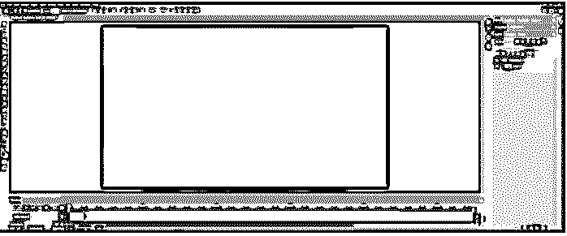

#### 第 14 步

转到文件->导出->保存为 Web(传统)或按 Alt + Shift + Ctrl + S

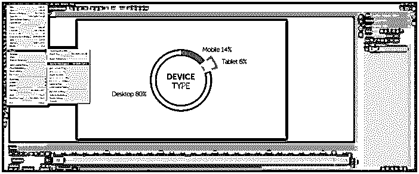

#### 第 15 步

将会打开一个对话框，如果我们不确定要选择哪个选项，我们可以从中选择一个预设。我们选择 GIF 128 抖动，然后改变颜色为 256，使预设成为未命名。

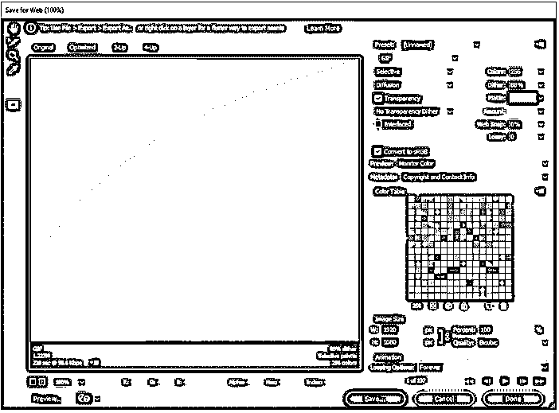

#### 步骤 16

现在打开简单的彩色版本，同样导出保存为网页。设置将与前一个文件相同。然后保存文件。

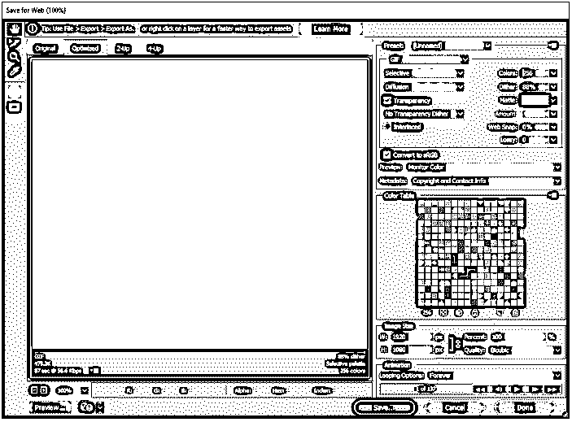

#### 第 17 步

我们来比较一下文件大小，没有特效的那个比较小。在网络世界里，永远记住一件事，越小越好。

#### 步骤 18

我们可以通过做一些调整来做进一步的优化，为此，我们将看看简单的彩色视频。因此，为了网络，我们将降低分辨率，因为 gif 在高分辨率下无法查看，而且对于社交媒体来说它们是方形的，因此有必要改变大小。我们已经改变了颜色为 128 和高度为 500 像素，宽度是自动调整的链接，以保持原来的比例。如果需要，您可以按百分比调整大小。在预览的左下角，你可以看到估计的文件大小和下载文件需要多少时间。完成调整后，保存文件。

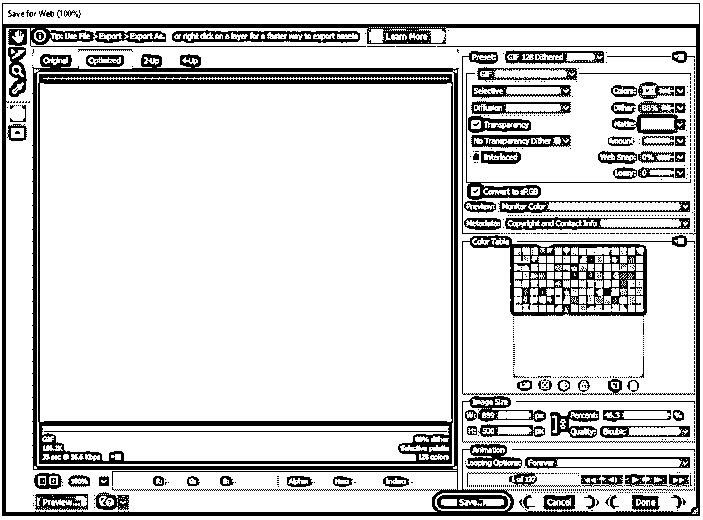

#### 步骤 19

同样，我们可以比较简单颜色版本和更优化的 128 色版本的大小，文件大小减少了一半以上。

#### 第 20 步

GIF 对于短格式的网络来说非常好，但是如果有现场视频镜头，即使只有几秒钟，文件大小也会很大，比如超过 15 mb，这对于移动浏览来说是不理想的。

#### 步骤 21

GIF 导出的另一个选择是使用 gifGUN 之类的脚本或使用 GIFRocket for MAC 之类的应用程序。还有像 giphy.com 和许多其他网站会输出 GIF，但 photoshop 提供了最广泛的选择。

### 结论

在这篇文章中，我们不仅学习了如何使用 after effects 导出 GIF，还学习了使用 photoshop 获得最佳效果的技巧，这将使它们在 web 上的加载速度快如闪电，尤其是在移动浏览上。

### 推荐文章

这是一个指南后的效果 GIF。在这里，我们讨论了创建一个 After Effects GIF 的适当步骤，以及如何为 web 优化 GIF。您也可以看看以下文章，了解更多信息–

1.  [后效时间线](https://www.educba.com/after-effects-timeline/)
2.  [Logo 展示后效果](https://www.educba.com/logo-reveal-after-effects/)
3.  [后效中的旋转观测](https://www.educba.com/rotoscoping-in-after-effects/)
4.  [特效后摆动](https://www.educba.com/wiggle-in-after-effects/)

