# 在效果后剪切剪辑

> 原文：<https://www.educba.com/cut-clips-in-after-effects/>

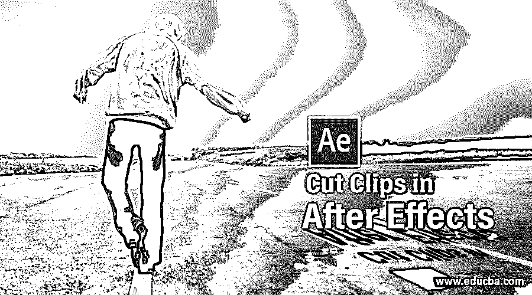

## 在 After Effects 中剪切剪辑的介绍

Adobe After Effects 是一款动画和视频编辑软件，在本文中，我们将学习如何剪切剪辑。为此，我们将首先了解如何使用时间线区域，然后我们将查看多种方法来剪切剪辑以及一些方便的快捷方式，以创建一个简单的工作流程。

### 在 After Effects 中剪切剪辑的步骤

下面是下面提到的步骤。

<small>3D 动画、建模、仿真、游戏开发&其他</small>

#### 第一步

在开始更好地理解之前，让我们先熟悉一下界面。顶部是菜单栏，如文件、编辑等。每个都有自己的子菜单。接下来，就在它下面，我们有工具面板和它们的属性。在左侧，有一个由项目文件和效果控制面板组成的项目面板，显示应用于特定层的效果。然后是显示动画或视频预览的合成面板。在右上角，我们有各种布局预设，将根据工作类型进行排列。我们甚至可以创建自己的自定义布局。右边是用于编辑视频的各个部分。在底部，有层和时间轴面板，用于添加媒体和添加动画关键帧。

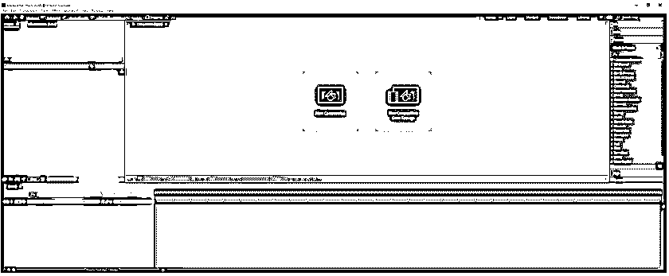

#### 第二步

让我们首先导入一个视频文件。您可以在项目面板中双击或按 Ctrl + I 或转到文件->导入->文件…

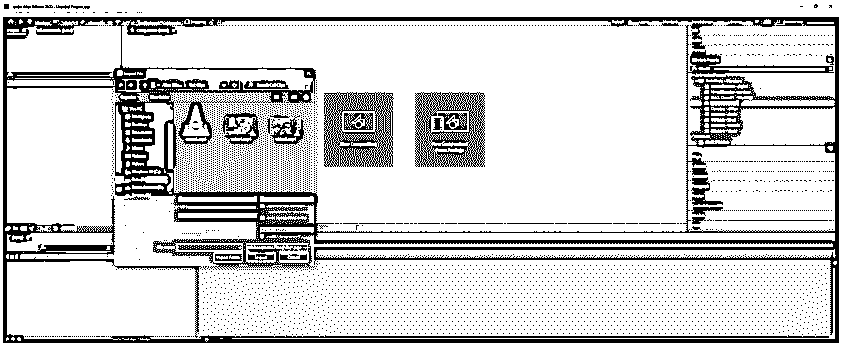

#### 第三步

现在，要从视频创建构图，请右键单击并选择“从选区新建构图”或将视频拖动到“图层”面板中。

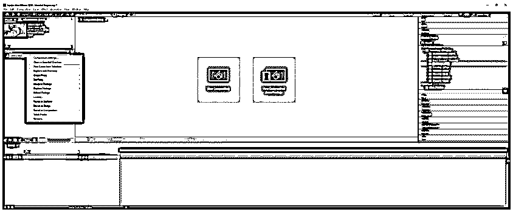

#### 第四步

有多种方法来剪切视频让我们开始将当前时间指示器放在 2 秒钟的标记上，首先我们想在 2 秒钟时开始我们的视频，我们将鼠标指针指向视频剪辑的开始，它由层顶部的凹口指示。如果鼠标指针变为双向水平箭头，则意味着我们可以剪辑视频。因此，单击并拖动直到当前时间指示器。

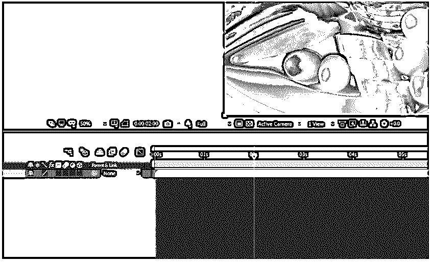

#### 第五步

为了使这变得容易，而不是目测当前时间指示器的位置，您可以在拖动时按住 shift，这将使剪辑开始与当前时间指示器对齐。

#### 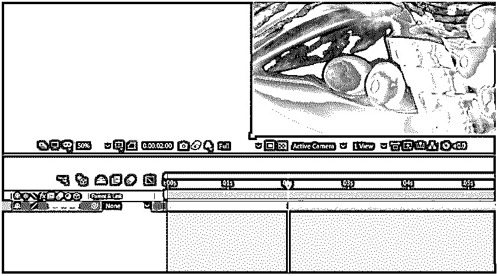

#### 第六步

以类似的方式，我们可以通过拖动手柄直到 11 秒来从结尾剪辑视频。请注意，现在切口不会出现在层的开始和结束处，这表明该层已被剪切。

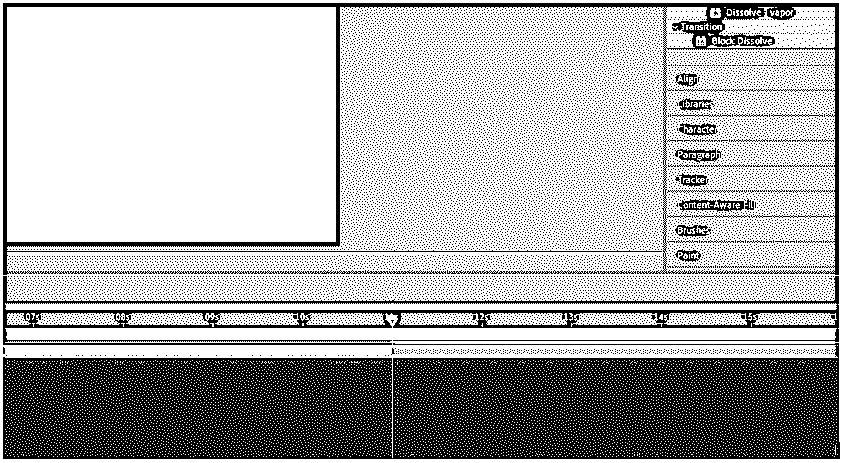

#### 第七步

让我们多次撤销这些步骤，直到获得原始视频。为此，您可以按 Ctrl + Z，或者如果您已经采取了这么多步骤，那么您可以进入历史记录，这将大量撤消许多步骤。

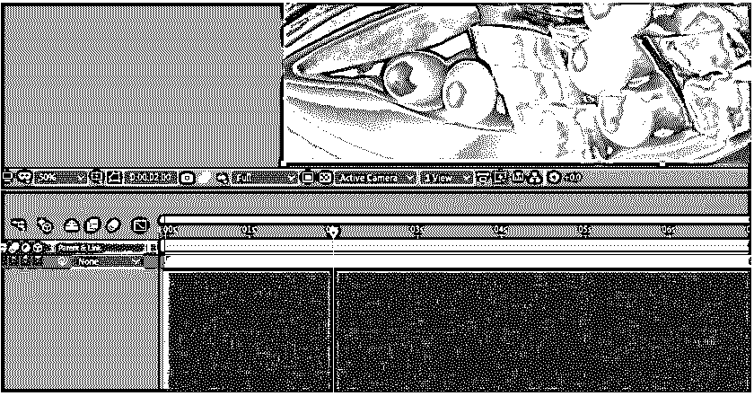

#### 第八步

同样，我们将做同样的事情，但这次我们将使用快捷方式，这将使工作流程更快。要从 2 秒标记开始剪辑，我们按 Alt + [这将使剪辑开始与当前时间指示器对齐。

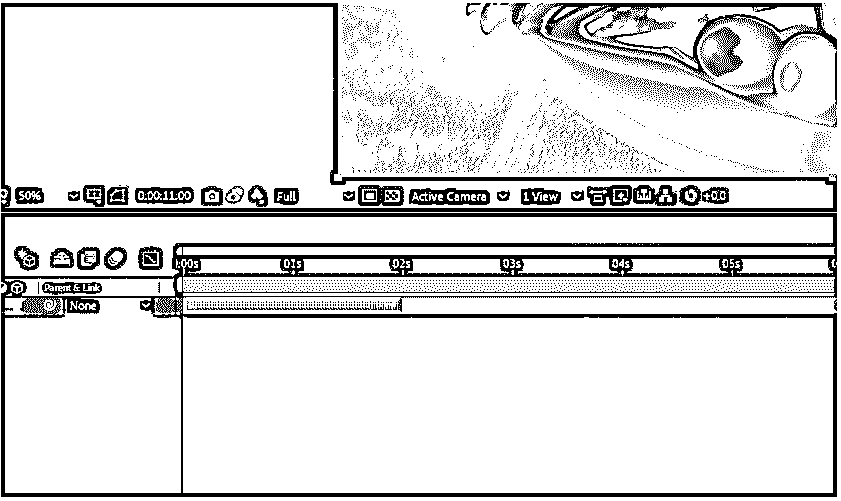

#### 第九步

要在 11 秒标记处结束剪辑，我们按 Alt + ]键，这将使剪辑结束与当前时间指示器对齐。

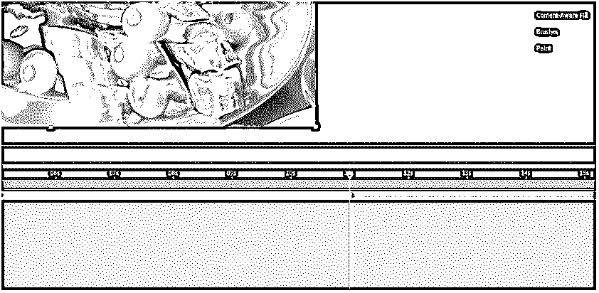

#### 步骤 10

这是关于剪辑结束，现在如果我们想删除剪辑中间的部分，假设我们想删除 5 到 6 秒之间的部分，为此有 2 个方法让我们从第一个开始，将当前时间指示器带到 5 秒标记。

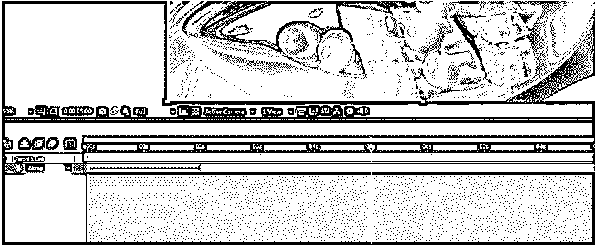

#### 步骤 11

现在复制当前层按 Ctrl + D 或去编辑->复制

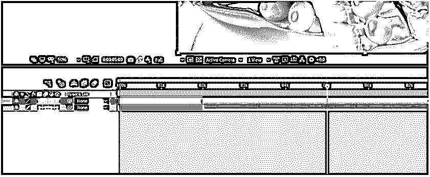

#### 第 12 步

因为我们现在知道了快捷方式，我们可以利用它，所以在底层按 Alt + ]来剪切剪辑的右边部分，并确保当前时间指示器在 5 秒标记上。然后选择顶层。移动图层的一个方便的技巧是按 Ctrl + ]向上移动图层，按 Ctrl + [向下移动图层。

#### 步骤 13

然后按 Alt + [删除剪辑左侧的部分，并确保当前时间指示器位于 6 秒标记处。

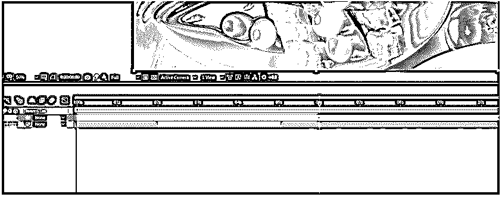

#### 第 14 步

把顶层放到底层，当你玩的时候，你可以注意到一个突然的过渡，我们可以通过从调整层添加一个过渡来改变它。

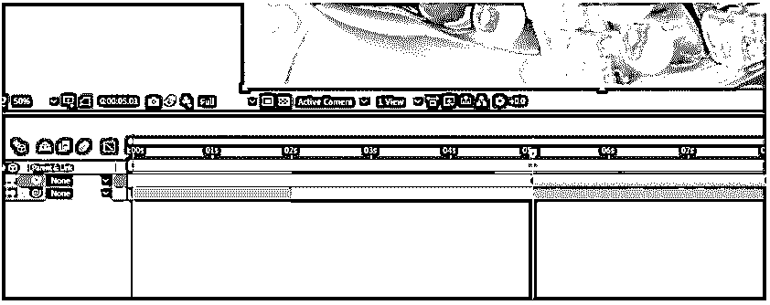

#### 第 15 步

右键单击图层面板添加调整图层。

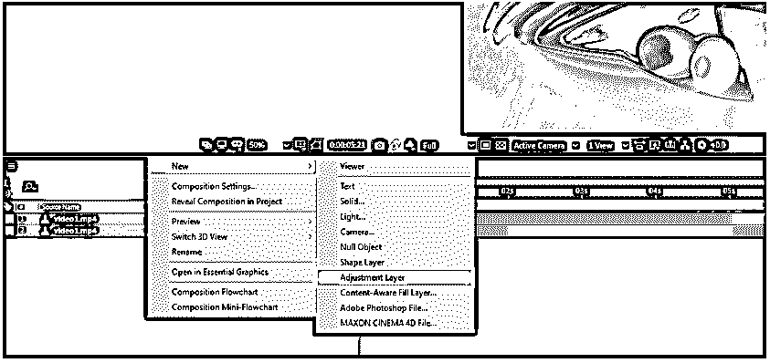

#### 步骤 16

在调整图层上拖移块溶解过渡。

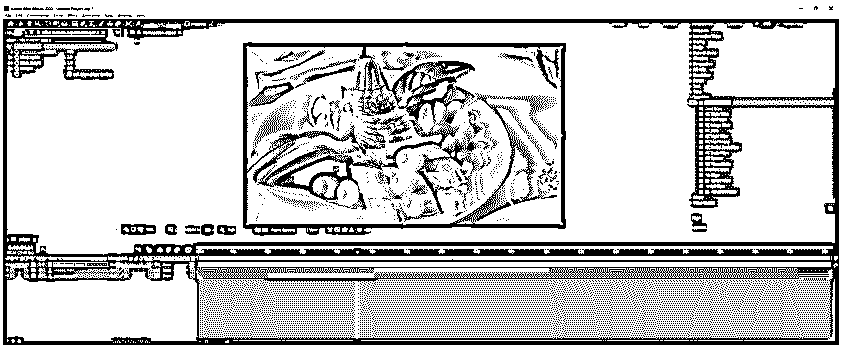

#### 第 17 步

将时间指示器设置在 4 到 5 秒之间，并向块融合添加一个关键帧以完成过渡，同时设置不透明度关键帧，并通过按 t 键将其设置为 0。

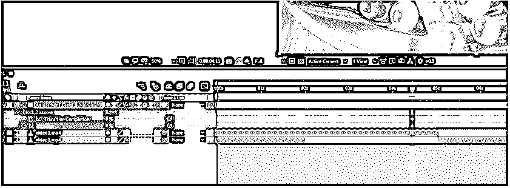

#### 步骤 18

按 U 键查看带有关键帧的属性。在 5 秒时，将过渡完成设置为 100，不透明度设置为 100。

#### 

#### 步骤 19

将当前时间指示器设置在 5 到 6 秒之间，并将过渡完成和不透明度设置为 0。

#### 第 20 步

拖动选择所有关键帧，并按 F9 键，这将增加一些缓解。

#### 步骤 21

另一种剪切剪辑的方法是分割图层，假设我们不希望底层的剪辑从 4 秒到 5 秒，那么我们可以将当前时间指示器放在 4 秒标记处，然后我们可以进入编辑->分割图层或按 Ctrl + Shift + D。

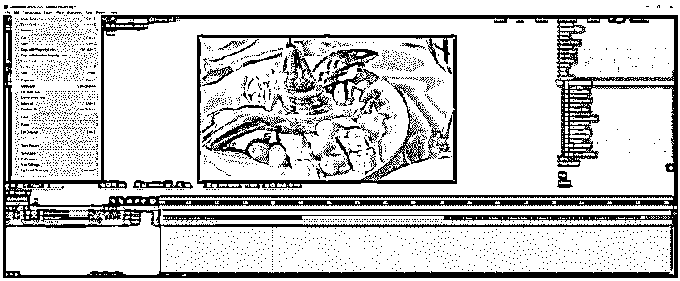

#### 第 22 步

我们得到一个新的层，从 4 到 5 秒，我们可以删除。

#### 步骤 23

然后拖动底部图层，使其与顶部视频图层对齐，这也将保留过渡。

### 结论

在这篇文章中，我们不仅学习了如何以多种方式剪切后期效果中的剪辑，还学习了如何通过使用调整层来隐藏一些奇怪的剪切来进行过渡。除此之外，我们还学习了一些快捷方式来创建更好的工作流程。

### 推荐文章

这是一个剪辑后效果的指南。在这里，我们讨论如何通过以下步骤以多种方式剪切剪辑。您也可以看看以下文章，了解更多信息–

1.  [后效时间线](https://www.educba.com/after-effects-timeline/)
2.  [后效中的陷码](https://www.educba.com/trapcode-in-after-effects/)
3.  [特效渲染后](https://www.educba.com/after-effects-render/)
4.  [特效后按键灯](https://www.educba.com/keylight-in-after-effects/)

