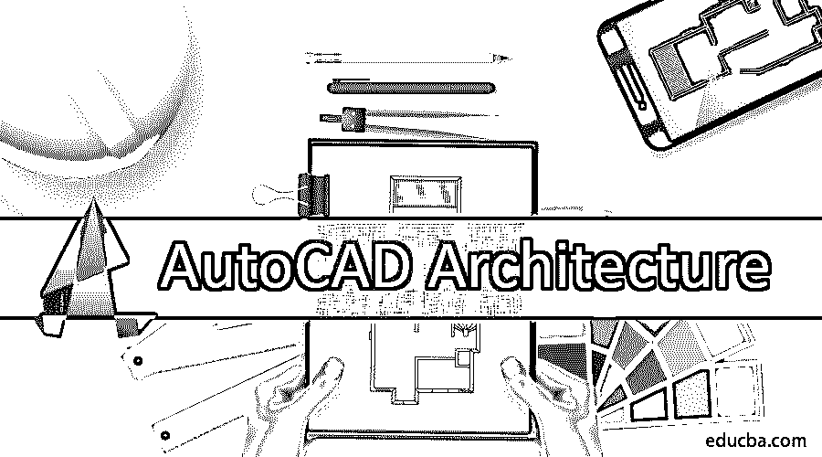
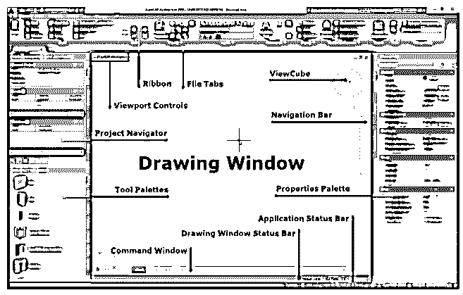
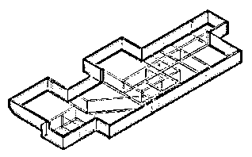

# AutoCAD 建筑

> 原文：<https://www.educba.com/autocad-architecture/>

## 什么是 AutoCAD 建筑？

AutoCAD architecture 是 AutoCAD 的一种高级形式，它添加了一些与建筑相关的特殊功能，使土木工程师和室内设计师更具创造性和用户友好性。AutoCAD architecture 也被称为超级省时工具。我们可以设计和修改 3D 墙壁、地板、建筑物的每一个单独的内容，而不是通常的线条、曲线和圆圈。有了 AutoCAD 的这些智能功能，人们可以感受到面前的模拟现实世界的图像，赋予他们的想象力以生命。

### AutoCAD 体系结构

这里添加了一些与架构相关的特殊功能，如下所述:

<small>3D 动画、建模、仿真、游戏开发&其他</small>

#### 1.组织您的工作空间

*   根据你的视觉，你可以选择白色或黑色的背景。
*   单击命令行旁边的自定义图标。
*   选择选项，然后移至显示选项卡。
*   单击绘图窗口颜色面板。
*   在第一个选项卡中保持上下文活动，在第二个选项卡中更改界面元素。
*   选择统一的背景颜色。
*   然后应用并关闭。

绘图空间中最常用的图标:

视图立方体:用于从标准视图切换到等轴测视图。它在界面上是可拖动或可点击的。

#### 2.平面图

*   使用 QNEW 或选择+选项卡开始绘图。
*   在主功能区菜单中，启动内容浏览器。
*   选择-创建一个编目工具，然后浏览它并选择设计。
*   然后打开它并单击确定。
*   现在，目录列在内容浏览器中。
*   从内容选项板添加工具。
*   启动内容浏览器，选择设计工具选项板。
*   在这种情况下，点击一个新的调色板，并将其重命名为墙壁。
*   现在，在内容浏览器上左键单击“设计工具目录-英制”以打开。

*   在这些类别中，选择墙。
*   然后搜索 stud-4 并点击 Go。
*   现在选择普通墙类型立柱-4 刚性-1.5 空气-1 砖-4。然后点击鼠标左键，调整到适合屏幕。
*   现在，设计的墙已添加到“墙”工具选项板中。
*   让三面墙搜索 CMU 8 号。
*   然后定位 CMU-8 螺柱-4 刚性-1.5 空气-1 砖块-4。
*   作为建筑主要部分的地板已经准备好了。因为有了楼层测量的帮助，只有它才能描绘出房间大小、家具、布线系统等。

#### 3.将 2D 转换为三维平面图的步骤

*   点击 QNEW 或+菜单。
*   键入单位，然后选择英寸。
*   将类型设置为“建筑”。
*   大约设置为“”精度。
*   单击确定。
*   在插入选项中，选择附加。
*   在练习中找到 autocad_file_drawing 文件。将文件类型另存为。图纸
*   然后点击确定。
*   使用 view cube 按钮切换到 3D 视图。
*   通过单击主功能区中的“设计工具”选项，激活上一练习中的 2D 墙。
*   单击鼠标右键，然后选择“Stud-4 Rigid-1.5 Air-1 Brick-4”上的“导入”选项。
*   要将墙样式载入文件，请单击鼠标右键并导入墙样式。
*   激活“组件”选项卡，并添加构造所需的组件工具。
*   确保平面图和墙面图正确对齐。要连接墙，请使用“圆角”选项。

因此，根据您设计的测量值，墙和楼板被设计并使用修剪、圆角和延伸选项进行适当的更改。

#### 4.添加门

*   右键单击命令提示符并选择选项，然后激活配置文件选项卡。
*   然后选择门的位置。
*   打开设计工具选项板，选择双折双门，然后右键单击属性。将开口百分比设置为 50。
*   对于入口门，重复上一步，并在“设计工具”选项板的“门”选项卡上选择“铰链–单扇门–外门”。将摆动角度设置为 30 度。

通过点击左边的选项，会出现一个箭头指向标准尺寸字段。比如，如果是 25%的开口，就会呈现 45 度角；如果是 50%，那么就是 90 度角。开口百分比的值取决于弧线摆动。

#### 5.添加拱形开口

*   开口可以是任何尺寸和高度。
*   在门楣上找到套管开启工具。
*   右键单击并将其复制粘贴到“门”选项卡上。
*   右键单击并突出显示复制的工具，然后选择属性。
*   将名称和描述更改为拱形开门。
*   现在选择拱形开门，并将“偏移”或“中心”属性设置为 6。"
*   现在使用 3D 动态观察视图工具。
*   在查看功能区中，单击灰色阴影、材质和纹理类型以及阴影。
*   现在选择洞口并按 Enter 键。
*   点击“工作”选项卡查看模型。

#### 6.要添加窗口

*   将视图样式设置为 2D 线框，并切换到俯视图。
*   选择工具栏上的窗口选项卡，然后选择图片窗口。
*   选择要偏移/居中的位置。将自动偏移设置为 6”

#### 7.添加屋顶

*   在屋顶形状中绘制一条闭合的 2D 多段线，并将其放置在该位置。
*   打开工具选项板并选择“屋顶”选项。
*   在屋顶工具上单击鼠标右键，然后选择“将工具属性应用于线条和墙”。
*   在“属性”选项板上设置屋顶的参数。

#### 8.添加楼梯

*   选择顶部以在视图控制选项上设置平面视图。
*   在“主页”选项卡中，选择“构建”面板，然后单击楼梯工具。
*   在“属性”选项板中，根据需要浏览并选择类型。
*   提及飞行起点和终点。
*   选择要在三维视图中查看的等轴测视图。

### 结论

*   要绘制墙，而组成墙所需的材质在错误的一侧，则反转墙的方向。选择墙，右键单击并选择反向菜单。
*   要沿墙移动门，请使用“门”重新定位到“沿墙”。使用 OSNAP。
*   除了这些基本图纸，AutoCAD 还帮助设计所有单个实体，如烟囱建筑或多层建筑的设计，为入口层和出口层创造空间，创建多个剖面和立面，以及建造车库。
*   AutoCAD 是一个节省时间和预算的工具，可以在巨额投资之前创建一个微型模型。

### 推荐文章

这是一个 AutoCAD 建筑指南。在这里，我们将讨论如何利用添加到 Autocad architecture 中的一些特殊功能，通过各种计划来组织您的工作空间。您也可以阅读以下文章，了解更多信息——

1.  [安装 AutoCAD](https://www.educba.com/install-autocad/)
2.  [AutoCAD 的用途](https://www.educba.com/uses-of-autocad/)
3.  [AutoCAD 命令](https://www.educba.com/autocad-commands/)
4.  [AutoCAD 中的样条](https://www.educba.com/spline-in-autocad/)

