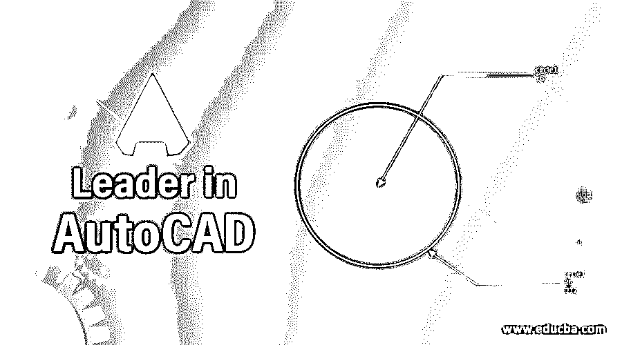
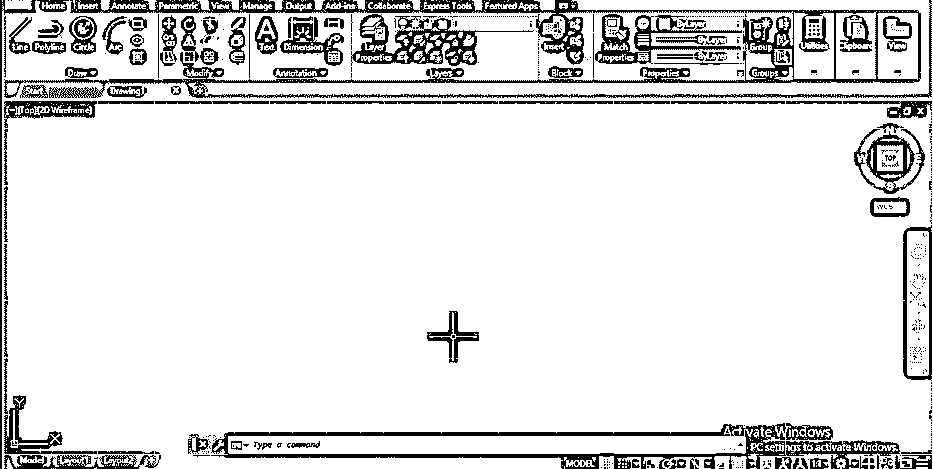
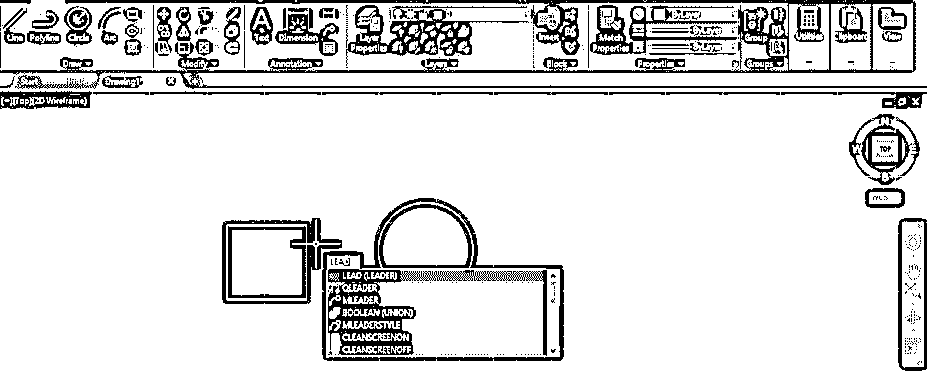
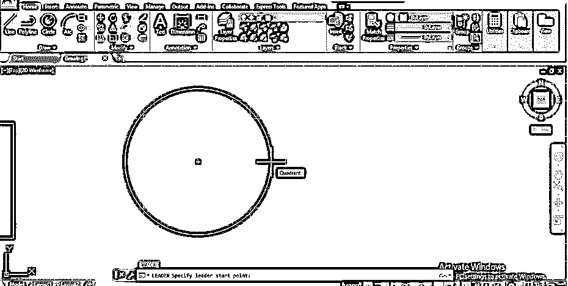
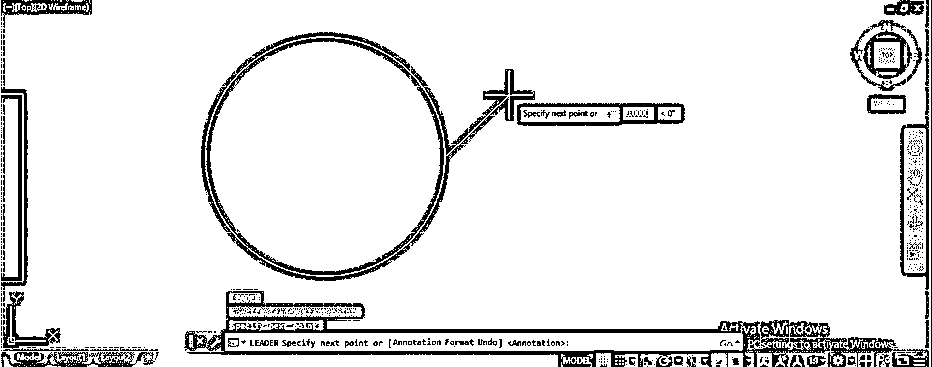
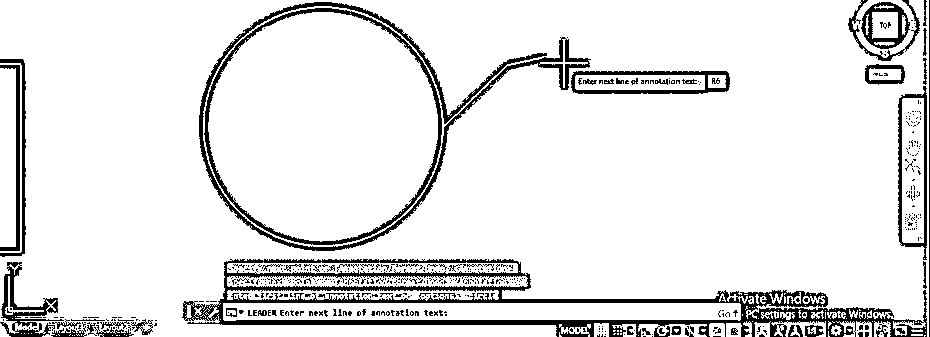
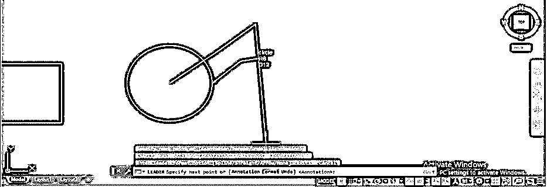
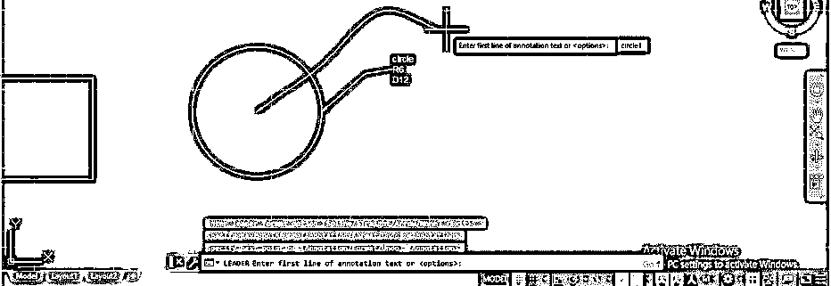
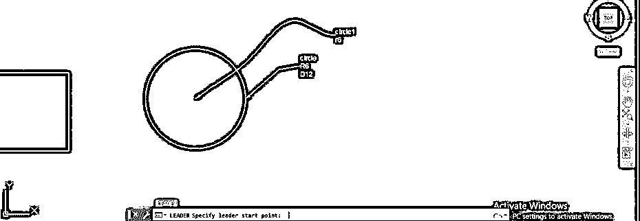
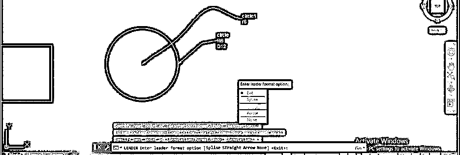

# AutoCAD 领域的领导者

> 原文：<https://www.educba.com/leader-in-autocad/>

## AutoCAD 中的 Leader 介绍

AutoCAD 是 Autodesk 公司开发的二维和三维计算机辅助设计软件。我们有不同类型的命令和功能，使我们的工作变得容易。在本文中，我们将讨论一个 2d 命令，它是 leader 命令。您可以将指引线理解为一个命令，通过该命令，您可以使用指引线命令的箭头和线，用其名称和尺寸或任何其他标记来指示特定对象。在本文中，我们将讨论该命令的所有重要特性，并分析其重要参数，以便更好地理解领导者命令。所以让我们开始讨论这个话题。

### 如何在 AutoCAD 中使用 Leader 命令？

我们可以通过几个简单的步骤在 auto cad 中使用该命令，并在我们的绘图工作中从中受益，但在开始学习之前，让我们看一下该软件的工作屏幕，这样在本文中学习该主题时就不会出现问题。

<small>3D 动画、建模、仿真、游戏开发&其他</small>

**步骤 1:** 在工作屏幕的顶部有一个功能区，其中有许多选项卡，用于处理该软件的不同命令，如主页选项卡、注释选项卡、查看选项卡、插入选项卡和其他一些重要的选项卡，在它下面，我们有一个工作窗口，可以在其中看到我们当前的绘图工作。 该工作窗口也有一个导航立方体，用于更改我们的绘图视图，例如，您可以在正视图、顶视图、右视图或一些等轴视图中更改您的视图，在该工作窗口下，我们有一些带有工作区切换器选项的导航选项卡，帮助我们进行绘图工作。

**步骤 2:** 现在让我们使用本软件主页标签的绘图菜单中的矩形和圆形命令来制作 2d 图形，以便在图形上使用引线命令。我将向您展示圆上的引线命令，您也可以将它应用到矩形上来指示它的规格。现在按下键盘上的 LEA 按钮，然后按下键盘上的 enter 按钮，执行该软件的 leader 命令。

**第三步:**现在一旦你输入了 leader 命令就会激活。现在它会要求你给出第一个点，意思是给出你想用这个引导命令指示的那个形状的点。我将点击这个圆的象限点。您可以单击该圆内的任何位置或该圆的圆周，以指示它们的任何特定数据。

**步骤 4:** 现在，它将要求您指定第二个引线点，这意味着选择您想要键入您所选对象或对象所选点的规范的点。你可以根据自己的需要反复点击引线的弯曲线。

**步骤 5:** 现在，当你指定一个点，你想在该点写入一个所选对象的规范时，进入该命令的参数框，该参数框位于工作屏幕的底部，点击该命令的注释选项，用于写入所选对象的一些规范，或者你可以使用该命令注释选项的快捷键。对于注释选项，按下键盘上的 A 按钮，然后按下键盘上的 enter 按钮，进入该选项的下一步。

**步骤 6:** 为所选对象输入所需的文本或数据。例如，我将键入 Circle 来命名它，并在下一步从键盘上输入 enter。

第 7 步:然后它会再次询问你想在下一行输入什么，所以我会在下一行输入 R6 作为半径值，给出这个圆的半径，然后按键盘上的 enter 键。在此步骤中，您可以键入所选对象的任何其他规格。键入所需文本后，您可以按下键盘上的 enter 键，在新的一行中反复键入文本。

**步骤 8:** 现在，我将输入 D12 作为直径值，给出下一行中这个圆的直径，然后按键盘上的 enter 键。

**第九步:**一旦你根据你的图纸要求输入了你所选择的对象的所有要求的规格，然后按两次回车键，它将像这样提到你给定的数据。

**步骤 10:** 现在让我们来理解这个命令的下一个选项。再次通过按下该命令的快捷键获取引线，然后通过点击所需的点给出第一个点，并转到该命令的参数框，然后点击该命令的格式选项，或者您可以使用格式选项的快捷键，按下键盘的 F 按钮，然后按下键盘的 enter 按钮，查看该选项的后续步骤。

**步骤 11:** 点击格式选项后，格式的不同子选项将在如下列表中打开。现在点击列表中的样条线选项。

**步骤 12:** 现在，引线的直线将转换成样条格式，你可以用它作为在你的图形中指定任何对象的引线。现在，它将要求您指定下一个点，因此通过单击一个点在绘图区域中选择您想要的点。

**第 13 步:**现在点击输入数据或文本的注释，并根据您的要求在行号中输入您想要的文本。

**第 14 步:**然后像我们在 leader 命令的前面步骤中所做的那样，进行双重输入以应用您给定的数据。

**第 15 步:**你可以选择这个 leader 命令格式选项的其他子选项，用它制作不同类型的 leader。

这样，您可以使用 auto cad 中的“引线”命令在绘图中指定具有不同规格的不同对象。

### 结论 AutoCAD 领域的领导者

现在，看完本文后，你可以理解什么是 auto cad 中的引线命令，你可以处理它的重要特性和参数，以便在你的绘图工作中获得最佳结果。你可以通过练习该软件的这种命令来提高你的绘图技能，这对你的绘图工作一定有帮助。

### 推荐文章

这是 AutoCAD 中的一个 Leader 指南。在这里，我们讨论了一个介绍以及如何在 AutoCAD 中一步一步地使用 Leader。您也可以浏览我们的其他相关文章，了解更多信息——

1.  [AutoCAD 功能键](https://www.educba.com/autocad-function-keys/)
2.  [AutoCAD 圆角](https://www.educba.com/autocad-fillet/)
3.  [在 AutoCAD 中插入图像](https://www.educba.com/insert-image-in-autocad/.)
4.  [AutoCAD 中的样条](https://www.educba.com/spline-in-autocad/)

