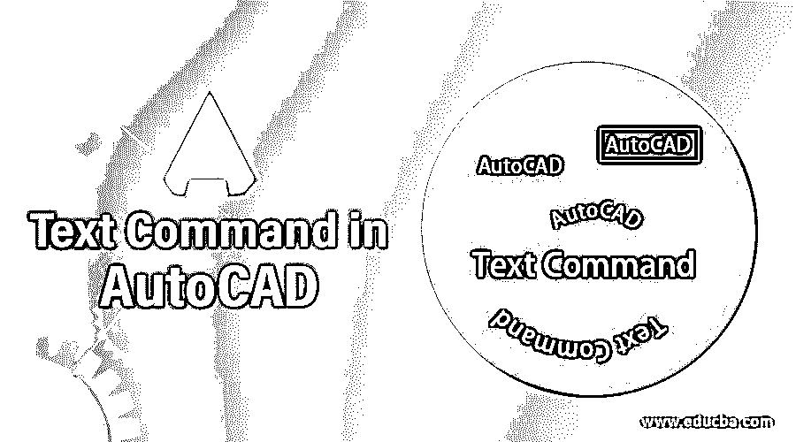
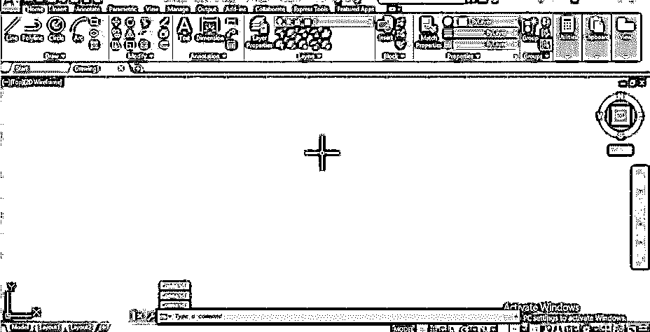
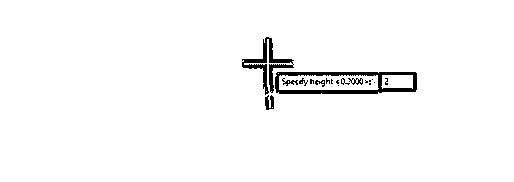

# AutoCAD 中的文本命令

> 原文：<https://www.educba.com/text-command-in-autocad/>

## AutoCAD 中的文本命令介绍

Auto cad 是 Autodesk 开发的二维和三维计算机辅助设计软件。我们使用 auto cad 制作不同类型的工程图纸和模型。在我们绘图过程中，为了更好地理解，我们必须提及绘图上的一些重要数据，因此文本命令是帮助我们在绘图上键入文本和数据的命令之一，它还允许我们在其中进行一些格式化，以便我们可以轻松地阐明我们的绘图。本文将讨论文本命令，并分析它的不同参数，以便在我们的工作中获得最佳结果。让我们开始讨论吧。

### 如何在 AutoCAD 中使用文本命令？

通过一些简单的步骤，我们可以在 auto cad 中使用文本命令，并使用它在绘图中提及我们的重要数据。但是在开始之前，让我们看一下这个软件的工作屏幕。

<small>3D 动画、建模、仿真、游戏开发&其他</small>

**步骤 1:** 在工作屏幕的顶部有一个不同选项卡的功能区，如主页选项卡、视图选项卡、注释选项卡和一些用于处理该软件中不同命令的参数的选项卡，在此下方有一个工作窗口，我们可以在其上看到我们的工作，在此窗口下方有一些导航命令，用于在我们的项目工作期间处理我们的绘图参数。

**第二步:**你可以从这个软件的 Home 标签的 Annotation 菜单中有一个文本命令。auto cad 中有两种类型的文本命令。一个是多行文本，另一个是单行文本。您可以根据需要使用任何一个文本命令。

第三步:或者你可以输入 MT，然后按下键盘上的回车键来输入多行文本命令。

**第四步:**对于单行文本，可以按 DT，然后按键盘的 enter 键。

**第五步:**现在，我们先来理解单行文本。对于单行文本命令 press，DT 然后按键盘的 enter 按钮。现在，它将要求您指定文本的起点，这意味着在您的绘图上从您想要开始书写文本的地方取点。您可以在图纸的特定点上单击，也可以给出任何特定值。

**第六步:**现在，它会要求你输入你的文字的高度值。您可以在垂直方向上的任何一点单击作为高度，也可以输入到的高度值。

步骤 7: 现在，它将要求您输入角度值，这意味着如果您想要水平键入文本，则输入角度值为 0，或者如果您想要以任何倾斜度键入文本，则输入角度值，如 30 度、60 度，随您便。

**第八步:**我将 0 度作为文字旋转的角度。现在在这里输入你想要的文本。键入文本后，您无法设置其格式。

**步骤 9:** 如果您想用不同的样式、颜色、大小或其他参数来格式化该文本，那么您可以在从该软件的主页选项卡的注释菜单中键入单行文本命令之前设置这些参数。

**步骤 10:** 现在，让我们来理解多行文本命令。对于多行文本，请转到“主页”选项卡的“批注”菜单或按 MT，然后按键盘上的 enter 键。现在，它会要求您指定要在其中键入文本的框的第一个角。可以输入框角的值，或在图纸上要键入文本的特定点上单击。

**步骤 11:** 现在，它会要求你指定这个框的对角，所以输入对角的值或在你的图纸上你想要的点上点击。

第 12 步:现在，您可以在这个框中键入您的文本。当您单击对角点时，将在命令部分自动打开一个名为文本编辑器的文本编辑选项卡。

**步骤 13:** 框的高度将取决于文本的高度，在从该命令的参数框的高度选项中键入文本之前，您可以设置该高度。要设置高度，按下 H 按钮，然后按下键盘的 enter 按钮，然后给出高度值并再次按下 enter。

第 14 步:你可以在输入后改变文本的高度。要更改文本的高度，请选择您想要的文本，然后转到文本编辑器的样式选项卡，然后通过输入高度值来更改文本的高度。

第十五步:你也可以改变你的文字的字体样式。要更改字体，请选择您想要的文本，然后单击此选项的下拉箭头，从这里选择您想要的字体样式。

第十六步:你还可以改变文字的颜色。要更改颜色，请选择您想要的文本，然后单击此选项的下拉箭头，并通过单击从颜色框中选择您想要的颜色。

**第十七步:**你还可以增加或减少文字的字符间距。要增加距离，请选择您的文本，然后增加此选项的值以增加文本字符之间的距离或减小其值。

第 18 步:如果你不想在你的文本上设置任何格式，你可以从这个选项中删除它。要删除任何字符格式，请选择您的文本，然后单击此选项删除字符格式，您的格式将从您的文本中删除。

第 19 步:您可以根据自己的需要对齐文本，例如，您可以通过选择此列表中的任何选项，将文本对齐到顶部、左侧、中间或任何其他对齐方式。只需选择你想要的文本，然后点击任何一个选项。

### 推荐文章

这是 AutoCAD 中的文本命令指南。在这里，我们讨论了介绍以及如何使用 AutoCAD 的文本命令来制作不同格式的文本。您也可以浏览我们的其他相关文章，了解更多信息——

1.  [在 AutoCAD 中插入图像](https://www.educba.com/insert-image-in-autocad/)
2.  [AutoCAD 圆角](https://www.educba.com/autocad-fillet/)
3.  [在 AutoCAD 中扫掠](https://www.educba.com/sweep-in-autocad/)
4.  [AutoCAD 中的放样](https://www.educba.com/loft-in-autocad/)

