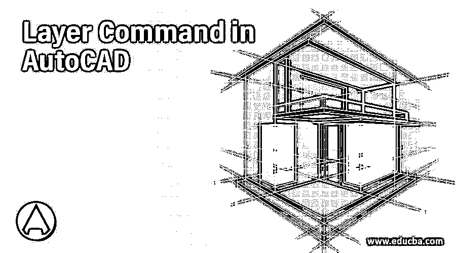
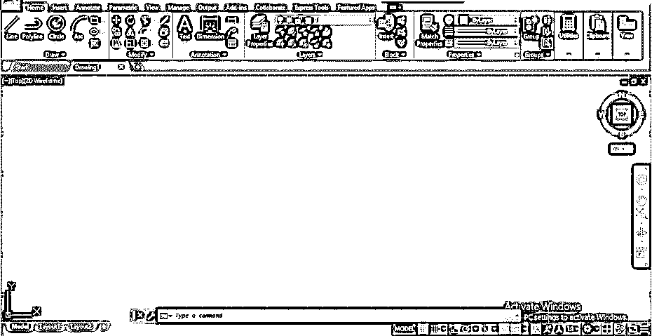
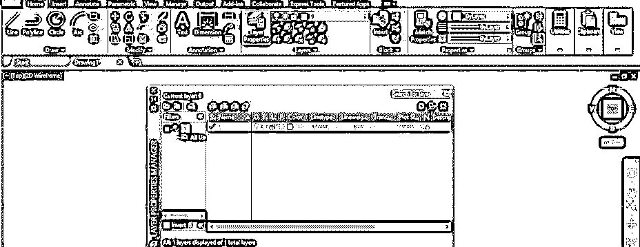
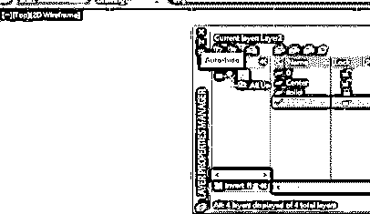
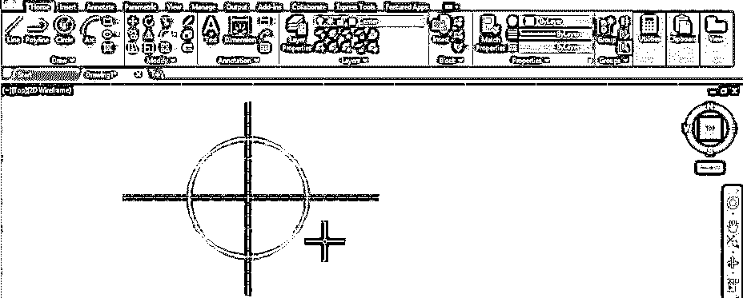
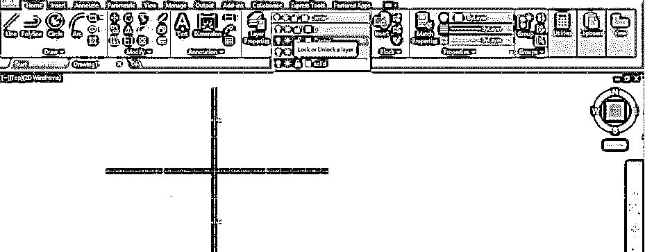
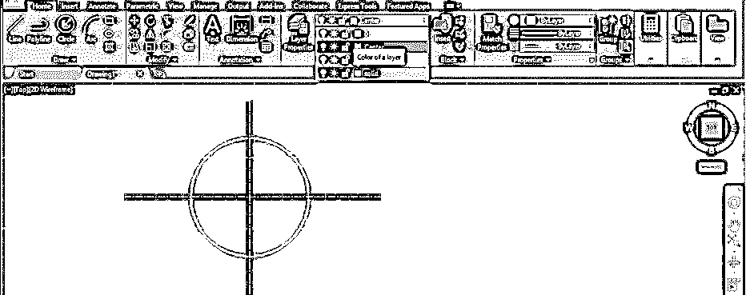

# AutoCAD 中的图层命令

> 原文：<https://www.educba.com/layer-command-in-autocad/>

## AutoCAD 中图层命令介绍

AutoCAD 是一种计算机辅助设计软件，它使用不同类型的 2d 和 3d 命令来简化工作。我们在这个软件中也有一些不同的功能，帮助我们在绘图工作中制作细节。图层命令是一种功能，通过它可以突出显示绘图工作中的细节。因此，在本文中将讨论层命令及其重要的功能，以了解其不同的参数。所以让我们开始讨论这个话题。

### 如何在 AutoCAD 中使用 Layer 命令？

我们在图层命令中有不同的功能和参数，通过它们我们可以在绘图中添加细节。我们将通过一个例子逐一讨论层命令的所有主要特性。但是在学习这个命令之前，让我们看一下这个软件的工作屏幕，以便更好地理解这个主题。

<small>3D 动画、建模、仿真、游戏开发&其他</small>

**步骤 1:** 在工作屏幕的顶部，有一些功能区，这些功能区有许多选项卡，如主页选项卡、插入选项卡、查看选项卡、快捷工具和其他一些用于处理该软件的不同命令的选项卡；在这下面，我们有一个工作窗口，我们可以在其中看到我们当前的工作，在这个窗口下面，我们有一些导航命令，帮助我们在其中绘图。

**步骤 2:** 这是主页选项卡的图层菜单，我们可以根据自己的要求设置图层的参数。

**第三步:**现在点击这个软件首页标签图层菜单的图层属性选项。

**第四步:**点击此选项后，会打开一个设置图层参数的对话框，名为图层属性管理器。

**第五步:**现在，让我们了解一下这个对话框的所有选项，用于理解图层命令。通过点击这个按钮，你可以在这个对话框中添加一个新层。

**第六步:**点击该按钮后，一个新层将被添加到该对话框的表格部分。

**第七步:**点击你所选图层颜色栏的单元格，你可以改变图层的颜色。

第八步:一旦你点击这个单元格，一个颜色选择框就会打开。从这里选择您想要的颜色，然后按此对话框的“确定”按钮。例如，我将选择黄色作为我选择的图层颜色。

**步骤 9:** 现在，您可以选择线条类型，例如您可以选择中心线、连续线和其他一些工程图线条，以指定该线条的用途，要设置线条类型，请单击此表格的线条类型列的单元格。

**第十步:**现在会打开一个对话框选择线型。如果您在之前的工作中选择了不同的线型，您将在此列表中看到您选择的线型。如果您可以看到不同的线型，您必须根据您的绘图要求加载它们。因此，点击此对话框的“加载”按钮，加载新的线型。

**步骤 11:** 现在，在这里搜索你想要的线型。我将选择这条中心线作为我所选图层的线型，然后按下此对话框的确定按钮。

**第 12 步:**现在，您选择的类型将加载到此处您已加载的线型列表中。现在点击你想要的线型来选择它，然后点击对话框中的确定按钮，使你选择的线型成为你图层的线型。

**步骤 13:** 现在，如果你想改变你选择的线条的粗细，点击你选择的层的单元格，这个层表的 Linewieght 列。

**步骤 14:** 点击该单元格后，会打开一个选择线条粗细的对话框。现在，您可以从列表中选择所需的线条粗细。比如我会从列表中选择 0.30 mm。

**步骤 15:** 您可以从该表的透明度栏中设置您所选图层线条的透明度。

**步骤 16:** 点击所选图层透明度栏的单元格，会打开一个对话框。输入从 0 到 90 %的线条透明度值。

现在，让我们按照之前的步骤添加一些不同属性的层。

**步骤 18:** 如果您想从该表中删除任何一层，则选择该层，然后点击该删除按钮将其删除。

**步骤 19:** 你可以从这个表格中选择任何一个图层作为你工作的默认图层。要将任何图层设置为默认图层，请选择您想要设置为默认的图层，然后单击此按钮，您选择的图层将被设置为您工作中的默认图层。

**步骤 20:** 您可以通过该对话框的自动隐藏按钮隐藏该对话框，并根据您的需要在绘图工作中快速反复使用该图层表。

**步骤 21:** 你也可以从这个选项使用你创建的图层。只需点击下拉箭头按钮查看层列表。

步骤 22: 现在，让我们使用你的图层表的不同图层来绘图。我将选择一个固体层，然后像这样画一个圆；然后，我将改变我的图层样式为中心图层，从图层列表中选择中心图层，并绘制这条中心线。通过这种方式，您可以使用不同的图层和图层样式进行绘图。

第 23 步:点击这个灯泡图标，你可以隐藏你选中的图层。

第 24 步:如果你不想改变你的图层，你可以点击这个太阳图标来冻结它。

**第 25 步:**如果您不想在工作过程中打扰您选择的图层，您可以通过点击此锁定图标锁定它。

第 26 步:你可以在你工作的任何时候通过点击你选中图层的这个小颜色框来改变你图层的颜色。

### 结论

现在，看完本文后，您可以了解什么是 AutoCAD 中的图层命令，以及如何处理该命令的重要参数，以便在绘图工作中添加细节。通过反复练习，您可以更好地使用这个命令。

### 推荐文章

这是 AutoCAD 中的图层命令指南。在这里，我们将一步步地介绍如何在 AutoCAD 中使用 Layer 命令。您也可以浏览我们的其他相关文章，了解更多信息——

1.  [AutoCAD 单位](https://www.educba.com/autocad-units/)
2.  [AutoCAD 3D Rotate](https://www.educba.com/autocad-3d-rotate/)
3.  【autocad 家具
4.  [Hatch AutoCAD](https://www.educba.com/hatch-autocad/)

