# Viewport AutoCAD

> 原文： [https://www.educba.com/viewport-autocad/](https://www.educba.com/viewport-autocad/)

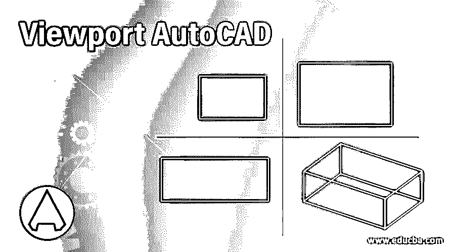

## 视口 AutoCAD 简介

Auto Cad 是 Autodesk 开发的二维和三维计算机辅助工程设计软件。在 AutoCAD 中，我们在其工作屏幕中有不同的部分来正确管理其工作。视口是 Auto Cad 的重要组成部分之一。您可以将 Viewport 理解为一个显示窗口，在该窗口中，您可以在该软件中绘制任何图形时看到您的工作。在本文中，我们将讨论 auto cad 视口的不同组成部分，并学习如何设置视口窗口屏幕以一次查看多个视口。所以让我们开始讨论这个话题。

### 如何在 AutoCAD 中设置视口？

我们将逐一讨论所有重要的功能，但在开始我们的讨论之前，让我们看看这个软件的工作屏幕，以更好地理解视口。

<small>3D 动画、建模、仿真、游戏开发&其他</small>

**步骤 1:** 在工作屏幕的顶部有一个功能区，其中有许多选项卡，如主页选项卡、插入选项卡、查看选项卡、注释选项卡等，用于管理该软件中的不同命令，在该功能区下方有一个工作窗口，您可以将其理解为视口，在该工作窗口下方有一些导航命令，用于在该软件中制作项目时处理我们的工作。

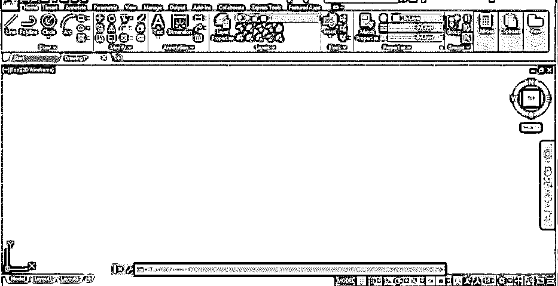

**步骤 2:** 转到该软件顶部功能区的视图选项卡。你可以在这个栏中找到不同的视窗组件。在该软件的视窗屏幕中，我们在该软件的左下角有一个 UCS 图标，它向您显示在该软件中绘制任何图形的 x，y，z 平面方向。

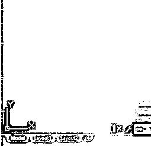

**步骤 3:** 在“视图”选项卡的“视口工具”菜单的“UCS 图标”选项中，通过点击图标来启用该图标。

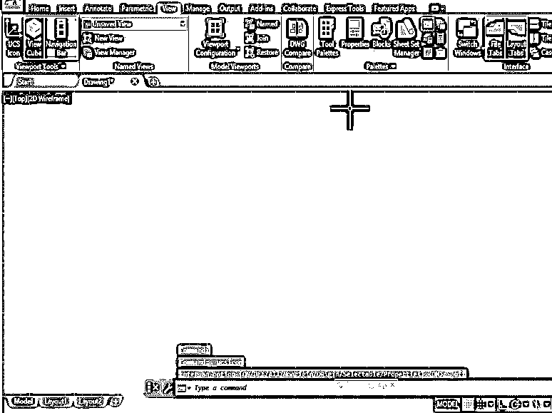

**步骤 4:** 该视口的下一个组件是位于视口屏幕右上角的视图立方体。这个视图立方体帮助我们改变我们的绘图视图，例如你可以通过点击这个立方体改变你的视图为前视图、右视图、左视图或任何其他视图。

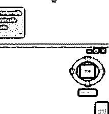

**第五步:**你可以通过点击这个软件的视图选项卡的视口工具菜单的图标来启用这个视图立方体。

第 6 步:我们在视窗屏幕上又多了一个组件::在视窗的右侧导航。你可以根据自己的需要选择地点。

**第七步:**您也可以通过点击本软件“视图”选项卡的“视窗工具”菜单的导航选项图标，将其从视窗屏幕中隐藏。

**步骤 8:** 在视窗屏幕上设置不同的组件后，您可以进入该软件的视图选项卡的命名视图菜单的视图管理器选项，为您的视窗指定一个特定的名称以备将来使用。

**步骤 9:** 点击此选项后，将会打开一个视图管理器对话框。您可以从该对话框的视图列表选项中选择所需的视口。

**步骤 10:** 现在点击 his 软件的视图选项卡的模型视口菜单的视口配置选项的下拉箭头。将会打开一个下拉列表。在此列表中，我们有不同类型的视口样式，用于在视口屏幕上一次查看多个视口。您可以选择其中的任何一个来简化您在该软件中的工作，例如，您可以在视窗屏幕上一次为两个垂直视窗选择两个垂直选项，或者在屏幕上一次为三个视窗选择三个视窗选项的任何样式。

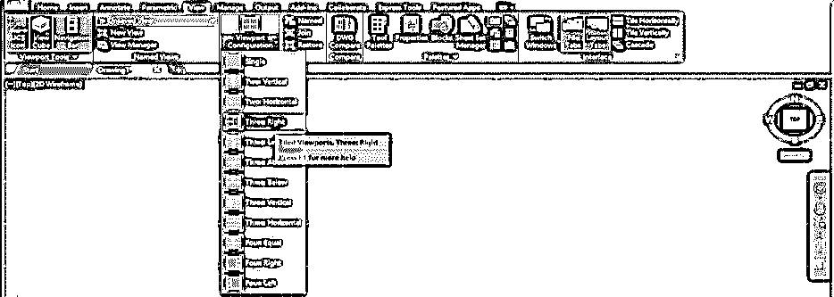

**第十一步:**我们来举例了解一下。我将从这个列表中选择“四个相等”的选项。用鼠标键点击这个选项。你可以根据你的情况来拿。

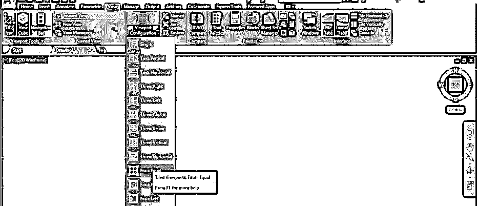

**步骤 12:** 现在，你的视窗屏幕会变成这样的四个视窗。这里，我们在工作屏幕上同时有四个视窗。

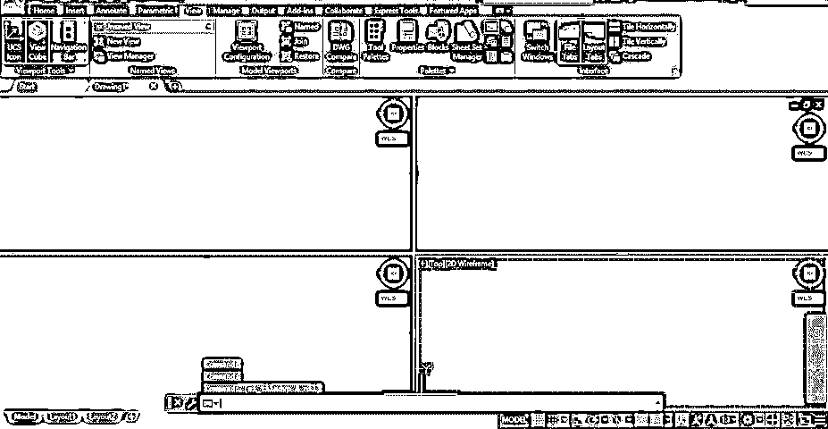

步骤 13: 你可以看到只有一个视口中有一个网格，这样你就可以在每个视口上添加一个网格。要在特定视窗上添加网格，请通过单击选择该视窗，然后通过单击该软件底部的导航命令栏来启用网格选项。

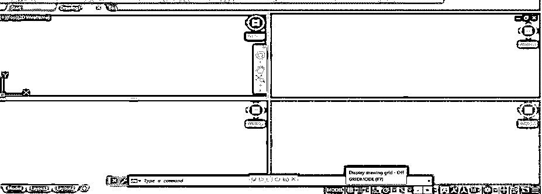

**步骤 14:** 现在，从每个视口的视图控制选项中，根据您的需要改变不同视口的视图，以便在您工作时具有适应性。

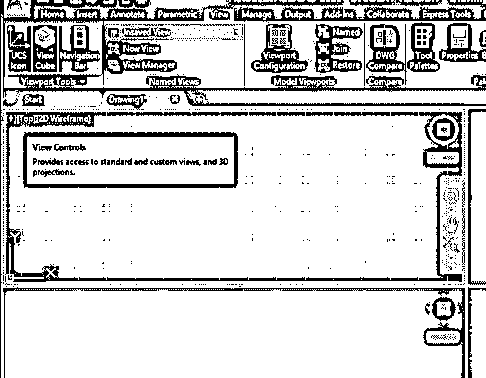

**第 15 步:**我将改变每个视口的视图，依次为顶视图、左视图、前视图和东南视图。可以根据你来设置。

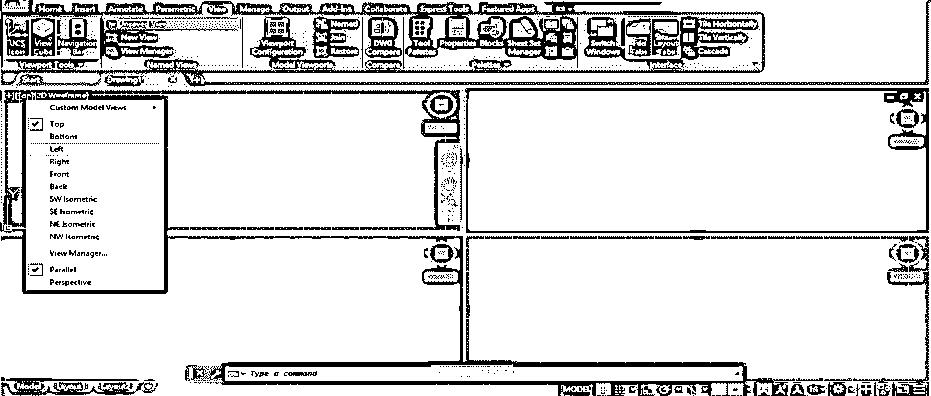

现在，让我们画一些东西来帮助我们更好地理解。将此软件的屏幕更改为 3d 基础，以便从工作区切换器选项中获得 3d 命令栏，该选项位于此软件底端的右侧。

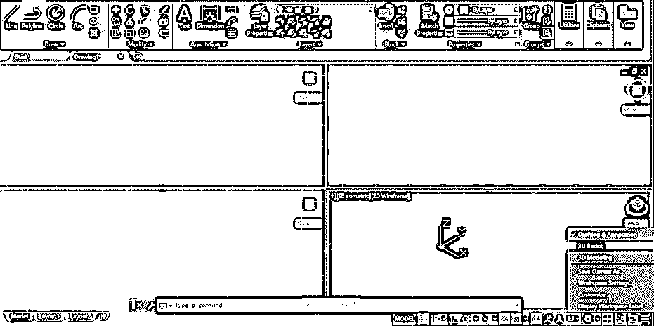

**第 17 步:**现在点击这个软件主页标签的创建菜单中的盒子命令。

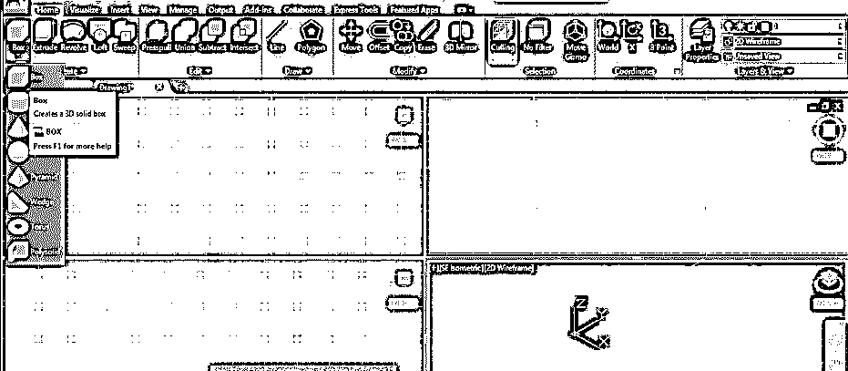

**第 18 步:**现在去任意一个视口，画出来。我将转到东南等轴测视口，并绘制成这样。您可以看到，当您在一个视口中绘制它时，此框的不同视图将根据您选择的视图样式显示在另一个视口中。

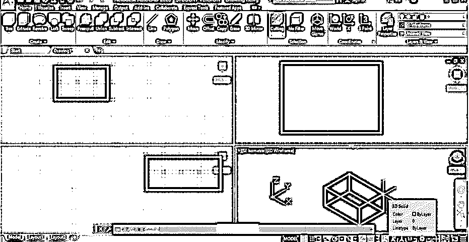

通过这种方式，您可以使用 auto cad 中的视口设置来简化在该软件中的工作并处理其参数。

### 结论

现在，阅读完本文后，您可以了解什么是 Autocad 中的视口，以及如何在视口屏幕上一次设置多个视口，以便在该软件中轻松工作。您可以使用视口设置来制作一个良好的视口屏幕，这对您的项目工作很有帮助。

### 推荐文章

这是一个关于视口 AutoCAD 的指南。这里我们讨论在 AutoCAD 中设置视口的介绍和步骤。您也可以浏览我们的其他相关文章，了解更多信息——

1.  [AutoCAD 中的布局](https://www.educba.com/layout-in-autocad/)
2.  [AutoCAD 中的工具栏](https://www.educba.com/toolbars-in-autocad/)
3.  [AutoCAD 功能键](https://www.educba.com/autocad-function-keys/)
4.  [在 AutoCAD 中插入图像](https://www.educba.com/insert-image-in-autocad/)

